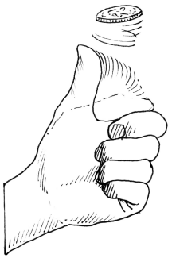

## Functional Programming in Haskell by Examples


The purpose of this tutorial is to illustrate functional programming concepts in Haskell language by providing reusable and useful pieces of codes, examples, case study and applications.

Notes: 

* The codes with '>' symbol were run in the interactive haskell Shell ghci
and the line bellow without the symbol > are the output.

This page can be accessed from: https://github.com/caiorss/Functional-Programming

<!-- # HASKELL BY EXAMPLE / PRACTICAL FUNCTIONAL PROGRAMMING -->

<!-- START doctoc generated TOC please keep comment here to allow auto update -->
<!-- DON'T EDIT THIS SECTION, INSTEAD RE-RUN doctoc TO UPDATE -->
**Table of Contents**  *generated with [DocToc](https://github.com/thlorenz/doctoc)*

  - [Toolset](#toolset)
  - [GHCI Reference](#ghci-reference)
- [Concepts](#concepts)
    - [Functional Programming](#functional-programming)
    - [Functional Programming Design Patterns](#functional-programming-design-patterns)
    - [Haskell Features](#haskell-features)
    - [Concepts](#concepts-1)
      - [Pure Functions](#pure-functions)
      - [Lazy Evaluation](#lazy-evaluation)
- [Basic Syntax](#basic-syntax)
  - [Operators](#operators)
    - [Logic Operators](#logic-operators)
    - [Powers](#powers)
    - [Application Operator - $](#application-operator---$)
    - [Misc. Operators](#misc-operators)
    - [Pipelining Operator](#pipelining-operator)
  - [Defining Values and Types](#defining-values-and-types)
  - [Type System](#type-system)
    - [Basic Classes](#basic-classes)
    - [Basic Types](#basic-types)
    - [Numeric Types Conversion](#numeric-types-conversion)
  - [Lists](#lists)
    - [Creating Lists](#creating-lists)
    - [List Operations](#list-operations)
    - [Chekings Lists](#chekings-lists)
- [Functions](#functions)
  - [Creating functions](#creating-functions)
  - [Anonymous Functions or Lambda Functions](#anonymous-functions-or-lambda-functions)
  - [Infix Operators Functions](#infix-operators-functions)
  - [Currying](#currying)
  - [Recursion](#recursion)
  - [Standard Functions](#standard-functions)
  - [Higher Order Functions](#higher-order-functions)
    - [Map](#map)
    - [Filter](#filter)
    - [Higher-order predicates](#higher-order-predicates)
    - [Fold](#fold)
    - [Scanl](#scanl)
    - [Curry and Uncurrying](#curry-and-uncurrying)
    - [Flip](#flip)
    - [Iterate](#iterate)
    - [Other Useful higher-order functions](#other-useful-higher-order-functions)
    - [The $ apply operator.](#the-$-apply-operator)
  - [Useful notations for functions](#useful-notations-for-functions)
- [Pattern Matching](#pattern-matching)
- [List Comprehension](#list-comprehension)
  - [Simple List Comprehension](#simple-list-comprehension)
  - [Comprehensions with multiple generators](#comprehensions-with-multiple-generators)
  - [Function Inside List Comprehension](#function-inside-list-comprehension)
  - [Comprehension with Guards](#comprehension-with-guards)
- [Abstract Data Type](#abstract-data-type)
- [Functors, Monads, Applicatives and Monoids](#functors-monads-applicatives-and-monoids)
  - [Functors](#functors)
  - [Monads](#monads)
    - [Overview](#overview)
    - [Bind Operator](#bind-operator)
    - [Monad Laws](#monad-laws)
    - [Selected Monad Implementations](#selected-monad-implementations)
    - [Return - Type constructor](#return---type-constructor)
    - [Haskell Monads](#haskell-monads)
    - [Monad function composition](#monad-function-composition)
    - [Sources](#sources)
    - [Maybe Monad](#maybe-monad)
  - [List Monad](#list-monad)
  - [IO and IO Monad](#io-and-io-monad)
    - [Main action](#main-action)
    - [Read and Show](#read-and-show)
    - [Operator >> (then)](#operator--then)
    - [Basic I/O Operations](#basic-io-operations)
    - [Do Notation](#do-notation)
      - [Basic Do Notation](#basic-do-notation)
      - [Do Notation and Let keyword](#do-notation-and-let-keyword)
      - [Do Notation returning a value](#do-notation-returning-a-value)
      - [Combining functions and I/O actions](#combining-functions-and-io-actions)
      - [Executing a list of actions](#executing-a-list-of-actions)
      - [Control Structures](#control-structures)
        - [For Loops](#for-loops)
      - [mapM and mapM_](#mapm-and-mapm_)
    - [IO Examples](#io-examples)
    - [Sources](#sources-1)
- [Applications](#applications)
  - [Mathematics](#mathematics)
  - [Numerical Methods](#numerical-methods)
    - [Polynomial](#polynomial)
    - [Numerical Derivate](#numerical-derivate)
    - [Equation Solving](#equation-solving)
    - [Differential Equations](#differential-equations)
  - [Statistics and Time Series](#statistics-and-time-series)
    - [Some Statistical Functions](#some-statistical-functions)
    - [Monte Carlo Simulation Coin Toss](#monte-carlo-simulation-coin-toss)
  - [Vectors](#vectors)
  - [Tax Brackets](#tax-brackets)
  - [Small DSL Domain Specific Language](#small-dsl-domain-specific-language)
- [Libraries](#libraries)
  - [System Programming in Haskell](#system-programming-in-haskell)
  - [Data.Time](#datatime)
    - [System](#system)
    - [Get current year / month / day in Haskell](#get-current-year--month--day-in-haskell)
    - [Get Current Time](#get-current-time)
    - [Documentation By Examples - GHCI shell](#documentation-by-examples---ghci-shell)
      - [Date Time Manipulation](#date-time-manipulation)
      - [Difference between two dates](#difference-between-two-dates)
      - [Day in a Week/Month/Year or Week Number](#day-in-a-weekmonthyear-or-week-number)
      - [Parsing Dates and Times from Strings](#parsing-dates-and-times-from-strings)
      - [Printing a Date](#printing-a-date)
- [Documentation and Learning Materials](#documentation-and-learning-materials)
  - [Code Search Engine](#code-search-engine)
    - [Libraries Documentation](#libraries-documentation)
    - [Prelude](#prelude)
    - [Type Classe](#type-classe)
    - [Online Books](#online-books)
    - [Papers and Articles](#papers-and-articles)
    - [Community](#community)
    - [References by Subject](#references-by-subject)
    - [Video Lectures](#video-lectures)

<!-- END doctoc generated TOC please keep comment here to allow auto update -->


### Toolset

|                                    |                                                      |
|------------------------------------|------------------------------------------------------|
| ghc - the Glasgow Haskell Compiler | Transforms Haskell Source code .hs into native code. |
| ghci                               | Haskell Interactive Shell/ Interpreter               |
| runghc                             | Haskell Non Interactive Interpreter                  | 
| haddock                            | Documentation tool for annotated Haskell source code |
| cabal                              | GHC Haskell Cabal package manager                    |

### GHCI Reference

GHCI Interactive Shell

| Command                     |  Description                                |
|-----------------------------|---------------------------------------------|
| :help                       |  Show help                                  |
| :load [haskell-source.hs] |    Load Haskell Source Code                   |
| :reload                     |  Reload Code after it was edited            |
| :type [symbol]             |  Show the Type of a Symbol                  |
| :browser                    |  Gives the type signature of all functions  |
| :set +s                     |  Multiline Code                             |
| :{ [code here ] :}        |    Multiline Code                             |
| :set prompt ">"             |  Change the prompt to ">"                   |


## Concepts

#### Functional Programming

Functional Programming is all about programming with functions.

**Functional Programming Features**

* Pure Functions / Referencail Transparency / No side effect
* Function Composition
* Lambda Functions/ Anonymous Functions
* High Order Functions
* Currying/ Partial Function Application
* Clousure - Returning functions from functions

* Data Imutability
* Pattern Matching
* Lists are the fundamental data Structure

Non Essential Features:

* Static Typing
* Type Inferencing
* Algebraic Data Types

#### Functional Programming Design Patterns

* Curry/ Partial function application  - Creating new functions by holding a parameter constant
* Closure - Return functions from functions
* Function composition
* Composable functions
* High Order Functions
* MapReduce Algorithms - Split computation in multiple computers cores.
* Lazy Evaluation ( aka Delayed evaluation)
* Pattern Matching


#### Haskell Features

* Pure Functional programming language
* Strong Static Typed Language 
* Type Inference (The haskell compiler deduce the types for you). 
* Lazy Evaluation ( Dealayed evaluation) by default
* Data Imutability/ Haskell has no variables
    * Values can be bound to a name and can only be assigned once.
    * Values can never change.
* Haskell has not for-loop, while statements.
* Algebraic Data types
* Pattern Matching
* Tail Recursions
* Compiles to native code.


#### Concepts

##### Pure Functions

Pure functions:

* Are functions without side effects, like mathematical functions. 
* For the same input the functions always returns the same output.
* Pure functions doens't rely on global variable and doesn't have internal states.
* Pure functions are deterministic
* The result of any function call is fully determined by its arguments. 

Why Pure Functions:

* Composability, one fuction can be connected to another.
* Can run in parallel, multi threading, multi core and GPU.
* Better debugging and testing.
* Predictability

**Example of pure functions**

```python
def min(x, y):
    if x < y:
        return x
    else:
        return y
```


**Example of impure function**

* Impure functions doesn't have always the same output for the same
* Impure functions does IO or has Hidden State, Global Variables

```python
exponent = 2

def powers(L):
    for i in range(len(L)):
        L[i] = L[i]**exponent
    return L
```
The function min is pure. It always produces the same result given 
the same inputs and it doesn’t affect any external variable.

The function powers is impure because it not always gives the same output
for the same input, it depends on the global variable exponent:

```python

>>> exponent = 2
>>> 
>>> def powers(L):
...     for i in range(len(L)):
...         L[i] = L[i]**exponent
...     return L
... 
>>> powers([1, 2, 3])
[1, 4, 9]
>>> exponent = 4 
>>> powers([1, 2, 3])  # (Impure since it doesn't give the same result )
[1, 16, 81]
>>> 
```

Another example, puryfing an impure Language:

```python

>>> lst = [1, 2, 3, 4]  # An pure function doesn't modify its arguments.
>>>                     # therefore lst.reverse is impure
>>> x = lst.reverse()
>>> x
>>> lst
[4, 3, 2, 1]

>>> lst.reverse()
>>> lst
[1, 2, 3, 4]
```

Reverse list function purified:

```python

>>> lst = [1, 2, 3, 4]
>>>
>>> def reverse(lst):
...     ls = lst.copy()
...     ls.reverse()
...     return ls
... 
>>> 
>>> reverse(lst)
[4, 3, 2, 1]
>>> lst
[1, 2, 3, 4]
>>> reverse(lst)
[4, 3, 2, 1]
>>> lst
[1, 2, 3, 4]

```


##### Lazy Evaluation

“Lazy evaluation” means that data structures are computed incrementally, as they are needed (so the trees never exist in memory all at once) parts that are never needed are never computed. Haskell uses lazy evaluation by default.

Example in Haskell: 

```haskell
λ> let lazylist = [2..1000000000]
λ> 
λ> let f x = x^6 
λ> 
λ> take 5 lazylist 
[2,3,4,5,6]
λ>
λ>
λ> {- Only the terms needed are computed. -}
λ> take 5 ( map f lazylist )
[64,729,4096,15625,46656]
λ> 
```

Example in Python:

* Python uses eager eavaluation by default. In order to get lazy evaluation in python the programmer must use iterators or generators. The example below uses generator.

```python

def lazy_list():
    """ Infinite list """
    x = 0 
    while True:
        x += 2
        yield x


>>> gen = lazy_list()
>>> next(gen)
2
>>> next(gen)
4
>>> next(gen)
6
>>> next(gen)
8
>>> next(gen)
10
>>> 

def take(n, iterable):
    return [next(iterable) for i in range(n)]

def mapi(func, iterable):   
    while True:
        yield func(next(iterable))
        
f = lambda x: x**5

>>> take(5, lazy_list())
[2, 4, 6, 8, 10]
>>> take(10, lazy_list())
[2, 4, 6, 8, 10, 12, 14, 16, 18, 20]
>>> 

>>> take(5, mapi(f, lazy_list()))
[32, 1024, 7776, 32768, 100000]
>>> 
>>> take(6, mapi(f, lazy_list()))
[32, 1024, 7776, 32768, 100000, 248832]
>>> 

```


## Basic Syntax

### Operators


#### Logic Operators

```
  True || False ⇒ True  
  True && False ⇒ False 
  True == False ⇒ False 
  True /= False ⇒ True  (/=) is the operator for different 
```

#### Powers

```
x^n     for n an integral (understand Int or Integer)
x**y    for y any kind of number (Float for example)
x^n     pour n un entier (comprenez Int ou Integer)
x**y    pour y tout type de nombre (Float par exemple)
```


#### Application Operator - $

Tje application operator '$' makes code more readable and cleaner since substitutes parenthesis.
It is also useful in higher-order situations, such as map ($ 0) xs, or zipWith ($) fs xs. 

```haskell
> f $ g $ h x = f (g (h x))
```

#### Misc. Operators

```haskell
>>=     bind
>>      then
*>      then
->      to                a -> b: a to b
<-      bind (drawn from) (as it desugars to >>=)
<$>     (f)map
<$      map-replace by    0 <$ f: "f map-replace by 0"
<*>     ap(ply)           (as it is the same as Control.Monad.ap)
$                         (none, just as " " [whitespace])
.       pipe to           a . b: "b pipe-to a"
!!      index
!       index / strict    a ! b: "a index b", foo !x: foo strict x
<|>     or / alternative  expr <|> term: "expr or term"
++      concat / plus / append
[]      empty list
:       cons
::      of type / as      f x :: Int: f x of type Int
\       lambda
@       as                go ll@(l:ls): go ll as l cons ls
~       lazy              go ~(a,b): go lazy pair a, b

_       Whatever          Used in Pattern Matching
```


#### Pipelining Operator 

Haskell doesn't have a native Pipe operator like F# (F-Sharp) does, however
it can be defined by the user.

```haskell

> let (|>) x f = f x
> 
> let (|>>) x f = map f x

> let (?>>) x f = filter f x


> take 3 (reverse (filter even [1..10]))
[10,8,6]

> [1..10] |> filter even |> reverse |> take 3
[10,8,6]
> 


> [1..10] |>> (^2) |>> (/10) |>> (+100)
[100.1,100.4,100.9,101.6,102.5,103.6,104.9,106.4,108.1,110.0]

> 
> [1..10] ?>> even
[2,4,6,8,10]
> 
> [1..10] ?>> even |>> (+1)
[3,5,7,9,11]
> 
> 


```


### Defining Values and Types

```haskell

> let b = 100 :: Float
> let a  = 100 :: Int
> let c = 100 :: Double
> 
> b
100.0
> :t b 
b :: Float
> :t a 
a :: Int
> :t c
c :: Double
> 
> let x = 100.2323
> :t x
x :: Double
> 
> let y = [1..10]
> y
[1,2,3,4,5,6,7,8,9,10]
> 
> let z = [1, 2, 4, 5, 6] :: [Float]
> :t z
z :: [Float]

> let k = [1.2, 1.3, 1.4, 1.5 ]
> k
[1.2,1.3,1.4,1.5]
> 
> :t k
k :: [Double]
```

### Type System

* A type is a collection of related values.

* Typeclasses are sets of types.

* A class is a collection of types that support certain operations, 
called the methods of the class.

* Each expressions must have a valid type, which is calculated before to evaluating the 
expression by the Haskell compiler, it is called type inference;

* Haskell programs are type safe, since type errors can never occur during run time;

* Type inference detects a very large class of programming errors, and is one of the most 
powerful and useful features of Haskell.


Reference: [Graham Hutton - University of Nottingham](http://www.agu.gov.br/page/download/index/id/11184731)

#### Basic Classes

|        |                  |
|--------|------------------|
| Eq     |  Equality Types  |
| Ord    |  Ordered Types   |
| Show   |  Showables Types |
| Read   |  Readable Types  |
| Num    |  Numeric Types   |
| Enum   |  Enum Types      |

Example Methods:

```haskell
(==) :: (Eq a)   => a -> a -> Bool

(<)  :: (Ord a)  => a -> a -> Bool

show :: (Show a) => a -> String

read :: (Read a) => String -> a

(*)  :: (Num a)  => a -> a -> a
```


```
Value -->  Type --> Typeclass
```

Standard Typeclasses:

* Show: Representable as String
* Enum: Enumerable in a list
* Num:  Usable as a number
* Ord:  Used for thing with total order

#### Basic Types

|            |                   |              |
|------------|-------------------|--------------|
| Char       |  'a' / 'b' / 'c'  |  Char Type   |
| [Char]     |  "String"         |  String      |
| Bool       |   True / False    |  Boolean     |
| Int        |   1, 2, 3, 4      |  Integers in a finite range.  -2^29 to (2^29 - 1) |          
| Integer    |   1, 2, 3, 4      |  Arbitrary Precision Integer |
| Float      | 1.0, 2.0, 3.0     |  32 bits float point |
| Double     | 1.0, 2.0, 3.0     |  64 bits float point |
| (Int, Char)|  (1, 'a')         | Tuples, unlike lists elements can have different types. |
| [a]        | [1, 2, 3, 4]      | List has the type [Int], [Char], [Double] |


**Selected Numeric Types**


| Type |  Description |
|------|--------------|
| Double |  Double-precision floating point. A common choice for floating-point data. |
| Float |  Single-precision floating point. Often used when interfacing with C. |
| Int |  Fixed-precision signed integer; minimum range [-2^29..2^29-1]. Commonly used. |
| Int8 |  8-bit signed integer |
| Int16 |  16-bit signed integer |
| Int32 |  32-bit signed integer |
| Int64 |  64-bit signed integer |
| Integer |  Arbitrary-precision signed integer; range limited only by machine resources. Commonly used. |
| Rational |  Arbitrary-precision rational numbers. Stored as a ratio of two Integers. |
| Word |  Fixed-precision unsigned integer; storage size same as Int |
| Word8 |  8-bit unsigned integer |
| Word16 |  16-bit unsigned integer |
| Word32 |  32-bit unsigned integer |
| Word64 |  64-bit unsigned integer |

References: 

* http://shuklan.com/haskell/lec03.html#/0/1
* http://shuklan.com/haskell/lec05.html
* http://book.realworldhaskell.org/read/using-typeclasses.html

| Class      |   Class Intance
|------------|------------------------------|
| Num        | Int, Integer, Nat, Float, Double, Complex  |
| Real       | Int, Integer, Nat. Float, Double, Complex  |
| Fractional | Float, Double, Rational, Complex  |
| Integral   | Int, Nat, Integer, Natural      |
| RealFrac   | Float, Double, Rational, Complex |
| Floating   | Float, Double, Complex    |
| RealFloat  | Float, Double, Complex |


#### Numeric Types Conversion

```
fromInteger             :: (Num a) => Integer -> a
fromRational            :: (Fractional a) => Rational -> a
toInteger               :: (Integral a) => a -> Integer
toRational              :: (RealFrac a) => a -> Rational
fromIntegral            :: (Integral a, Num b) => a -> b
fromRealFrac            :: (RealFrac a, Fractional b) => a -> b

fromIntegral            =  fromInteger . toInteger
fromRealFrac            =  fromRational . toRational
```

https://www.haskell.org/tutorial/numbers.html


### Lists

#### Creating Lists

```haskell

> [-4, 10, 20, 30.40]

> let x = [-23, 40, 60, 89, 100]
> x
[-23,40,60,89,100]


> [0..10]
[0,1,2,3,4,5,6,7,8,9,10]
> 
> [-4..10]
[-4,-3,-2,-1,0,1,2,3,4,5,6,7,8,9,10]
> 

```

#### List Operations

Picking the nth element of a list.

```haskell

> [1, 2, 3, 4, 5, 6] !! 2
3
> [1, 2, 3, 4, 5, 6] !! 3
4
> [1, 2, 3, 4, 5, 6] !! 0
1
```

```haskell
> let lst  = [-4..10]
> lst
[-4,-3,-2,-1,0,1,2,3,4,5,6,7,8,9,10]
```
First Element
```haskell
> head [1, 2, 3, 4, 5]
1
```

Last Element
```haskell
> last [1, 2, 3, 4, 5]
5
```

Maximum element
```haskell
> maximum lst
10
```

Minimum element
```haskell
> minimum lst
-4
```

Reversing a list
```haskell

> reverse [1, 2, 3, 4, 5]
[5,4,3,2,1]
```

Sum of all elements
```haskell
> sum lst
45
```

Product of all elements
```haskell
> product lst
0
```

Adding an element to the beggining of the list

```haskell
> 20 : lst
[20,-4,-3,-2,-1,0,1,2,3,4,5,6,7,8,9,10]
```

Adding an element to end of the list

```haskell

> lst ++ [20]
[-4,-3,-2,-1,0,1,2,3,4,5,6,7,8,9,10,20]
> 
```

Extract the elements after the head of a list, which must be non-empty. 
* tail :: [a] -> [a]    Source

```haskell
> tail [1, 2, 3, 4, 5]
[2,3,4,5]

```

Return all the elements of a list except the last one. The list must be non-empty.
* init :: [a] -> [a]    Source
```haskell
> init [1, 2, 3, 4, 5]
[1,2,3,4]
> 
```

Make a new list containing just the first N elements from an existing list. 
* take n xs
```haskell
> take 5 lst
[-4,-3,-2,-1,0]
```


Delete the first N elements from a list. 
* drop n xs

```haskell

> lst
[-4,-3,-2,-1,0,1,2,3,4,5,6,7,8,9,10]
> 
> drop 5 lst
[1,2,3,4,5,6,7,8,9,10]

```

Split a list into two smaller lists (at the Nth position). 

* splitAt n xs

```haskell

-- (Returns a tuple of two lists.) 

> splitAt 5 lst
([-4,-3,-2,-1,0],[1,2,3,4,5,6,7,8,9,10])
> 

```

TakeWhile, applied to a predicate p and a list xs, returns the longest 
prefix (possibly empty) of xs of elements that satisfy p:
* takeWhile :: (a -> Bool) -> [a] -> [a]

```haskell

> takeWhile (< 3) [1,2,3,4,1,2,3,4]
[1,2]
> takeWhile (< 9) [1,2,3]
[1,2,3]
>  takeWhile (< 0) [1,2,3]
[]

```

DropWhile p xs returns the suffix remaining after takeWhile p xs: 

* dropWhile :: (a -> Bool) -> [a] -> [a]    Source

```haskell

> takeWhile (< 3) [1,2,3,4,1,2,3,4]
[1,2]
> takeWhile (< 9) [1,2,3]
[1,2,3]
>  takeWhile (< 0) [1,2,3]
[]
> dropWhile (< 3) [1,2,3,4,5,1,2,3] 
[3,4,5,1,2,3]
>  dropWhile (< 9) [1,2,3]
[]
> dropWhile (< 0) [1,2,3] 
[1,2,3]
> 

```


#### Chekings Lists

Check if a list is empty. 
* null xs

```haskell

> null []
True
> null [1, 2, 3, 4, 5]
False

```

Find out whether any list element passes a given test. 
* any my_test xs

```haskell

> any (>3) [1, 2, 3, 4, 5]
True
> any (>10) [1, 2, 3, 4, 5]
False
> 
> any (==3) [1, 2, 3, 4, 5]
True
> 
> any (==10) [1, 2, 3, 4, 5]
False
> 
```

Check whether all list elements pass a given test. 
* all my_test xs

```haskell

> all (>3) [1, 2, 3, 4, 5]
False
> all (<10) [1, 2, 3, 4, 5]
True
> all (<10) [1, 2, 3, 4, 5, 20]
False
> 
```

Check if elements belongs to the list.

* elem :: Eq a => a -> [a] -> Bool

```haskell

> elem 1  [1,2,3] 
True
> elem 4 [1,2,3] 
False
>
```


## Functions

### Creating functions

In the GHCI Shell

```haskell

> let f x y = sqrt ( x^2 + y^2 )
> 
> f 80 60
100.0
> f 50 30
58.309518948453004
> 

> :t f
f :: Floating a => a -> a -> a

```

In a Haskell source file, *.hs

```haskell
f x y = sqrt ( x^2 + y^2 )
```

### Anonymous Functions or Lambda Functions


```haskell

> (\x -> x^2 - 2.5*x) 10
75.0

> let f = \x -> x^2 - 2.5*x

> map f [1, 2, 3, 4, 5]
[-1.5,-1.0,1.5,6.0,12.5]

> map (\x -> x^2 - 2.5*x) [1, 2, 3, 4, 5]
[-1.5,-1.0,1.5,6.0,12.5]

>  let f = (\x y -> x + y)
>  
>  f 20 30
50
>  let f20 = f 20
>  f20 10
30
>  x/y + x*y) 10 20
200.5
>  x/y + x*y) (10, 20)
200.5
>  


```

### Infix Operators Functions


| Shorthand  |  Equivalence   |
|------------|----------------|
| (+4)       |  \x -> x 4     |
| (*3)       |  \x -> x*3     |
| (/2)       |  \x -> x/2     |
| ((-)5)     |  \x -> 5 - x   |
| (^2)       |  \x -> x^2     |
| (2^)       |  \x -> 2^x     |
| (+)        |  \x, y -> x+ y |
| (-)        |  \x, y -> x-y  |
| (/)        |  \x, y -> x/y  |
| (^)        |  \x, y -> x^y  |

```haskell

> (+) 10 30.33
40.33

> (-) 100 30
70

> (/) 100 10
10.0

> (*) 40 30
1200

> (^) 2 6
64


> :t (+)
(+) :: Num a => a -> a -> a
> 
> :t (-)
(-) :: Num a => a -> a -> a
> 
> :t (/)
(/) :: Fractional a => a -> a -> a
> 
> :t (*)
(*) :: Num a => a -> a -> a
> 
> :t (^)
(^) :: (Integral b, Num a) => a -> b -> a
```

### Currying


Example 1:

```haskell

> let add a b = a + b
> let add10 = add 10
> 
> add 20 30
50
> add (-10) 30
20
> add10 20
30
> add10 30
40
> map add10 [-10, 20, 30, 40]
[0,30,40,50]
> 
```

Example 2: Derivate functions

### Recursion

Reverse A list

```haskell

reverse2 :: [a] -> [a]
reverse2 []     = []
reverse2 (x:xs) = reverse2 xs ++ [x]

*Main> reverse2 [1, 2, 3, 4, 5]
[5,4,3,2,1]
```

Product of a List

```haskell

prod :: [Int] -> Int
prod [] = 1
prod (x:xs) = x * prod xs


*Main> prod [1, 2, 3, 4, 5]
120
*Main> 
*Main> :t prod
prod :: [Int] -> Int
```
Factorial

```haskell

fact 0 = 1
fact n = n*fact(n-1)

> map fact [1..10]
[1,2,6,24,120,720,5040,40320,362880,3628800]
```

Fibbonacci Function

```haskell
fib 0 = 1
fib 1 = 1
fib n | n>= 2
    = fib(n-1) + fib(n-2)
```


### Standard Functions

**id Identity Function**

```haskell
λ> :t id
id :: a -> a

λ> 
λ> id 100
100
λ> id "Hello World"
"Hello World"
λ> 
```

**Constant Function**

```haskell
λ> :t const
const :: a -> b -> a
λ> 

λ> let f1 = const 10
λ> f1 20
10
λ> f1 0
10
λ> map f1 [1, 2, 3]
[10,10,10]

``` 


### Higher Order Functions

Higher Order functions are functios that takes functions as 
arguments.

Why Higher Order Function?

* Common programming idioms, such as applying a function twice, can naturally be encapsulated as 
general purpose higher-order functions (Hutton);

* Special purpose languages can be defined within Haskell using higher-order functions, such as 
for list processing, interaction, or parsing (Hutton);

* Algebraic properties of higher-order functions can be used to reason about programs. (Hutton)


Reference:

* [Graham Hutton - University of Nottingham](http://www.agu.gov.br/page/download/index/id/11184731)

#### Map

map :: (a -> b) -> [a] -> [b]

The map functional takes a function as its first argument, then applies it to every element of a list. 
[Programming in Haskell 3rd CCSC Northwest Conference • Fall 2001](http://www.willamette.edu/~fruehr/haskell/lectures/tutorial4.html#@sli@31)

```haskell

> map (^2) [1..10]
[1,4,9,16,25,36,49,64,81,100]

> map (`div` 3) [1..20]
[0,0,1,1,1,2,2,2,3,3,3,4,4,4,5,5,5,6,6,6]

{- Map With Anonymous Functions -}
>  map (\x -> x*x - 10*x) [1..10]
[-9,-16,-21,-24,-25,-24,-21,-16,-9,0]


> map reverse ["hey", "there", "world"]
["yeh","ereht","dlrow"]

> reverse ["hey", "there", "world"]
["world","there","hey"]

```

**Example Estimating PI**

Pi number can be aproximated by Gregory series. 

http://shuklan.com/haskell/lec06.html#/0/6


```
                n
              _____         k+1
              \         (-1)
            4  \      ___________
               /        2k - 1
              /____
                 1
```

```haskell

>  let f x = 4*(-1)^(x+1)/(2*k - 1) where k = fromIntegral x
>  let piGuess n = sum $ map f [1..n]
>  
>  map piGuess [1, 10, 20, 30, 50, 100]
[4.0,3.0418396189294032,3.09162380666784,3.108268566698947,3.121594652591011,3.1315929035585537]
>
>  {- Approximation Error -}
>  
>  map (pi -) $ map piGuess [1, 10, 20, 30, 50, 100]
[-0.8584073464102069,9.975303466038987e-2,4.996884692195325e-2,3.332408689084598e-2,1.999800099878213e-2,9.99975003123943e-3]


```

#### Filter

filter :: (a -> Bool) -> [a] -> [a]

Returns elements of a list that satisfy a predicate.
Predicate is boolean function which returns True or False.

```haskell

> filter even [1..10]
[2,4,6,8,10]
> 
> filter (>6) [1..20]
[7,8,9,10,11,12,13,14,15,16,17,18,19,20]
> 

```

**Example With custom types**

Credits: http://shuklan.com/haskell/lec06.html#/0/10

```haskell

> data Gender = Male | Female deriving(Show, Eq, Read)
> 
> let people = [(Male, "Tesla"), (Male, "Alber"), (Female, "Zoe"), (Male, "Tom"), (Female, "Olga"), (Female, "Mia"), (Male, "Abdulah")]

> filter (\(a, b) -> a==Female) people
[(Female,"Zoe"),(Female,"Olga"),(Female,"Mia")]
> 
> filter (\(a, b) -> a==Male) people
[(Male,"Tesla"),(Male,"Alber"),(Male,"Tom"),(Male,"Abdulah")]
> 
```


#### Higher-order predicates

Predicates (boolean-valued functions) can be extended to lists via the higher-order predicates any and all. 
[Programming in Haskell 3rd CCSC Northwest Conference • Fall 2001](http://www.willamette.edu/~fruehr/haskell/lectures/tutorial4.html#@sli@31)]

```haskell

> map even [1..5]
[False,True,False,True,False]

> all even (map (2*) [1..5])
True

> any odd [ x^2 | x<-[1..5] ]
True
```

#### Fold

The fold functions foldl and foldr combine elements of a list based on a binary function and an initial value. In some programming languages fold is known as reduce. The fold in some programming languages Python is called reduce.

"The higher-order library function foldr (“fold right”) encapsulates this simple pattern of recursion, with the function  and the value v as arguments" (Graham Hutton)

**Why Is Foldr Useful?** (Graham Hutton)

* Some recursive functions on lists, such as sum, are simpler to define using foldr;

* Properties of functions defined using foldr can be proved using algebraic properties of foldr, such as fusion and the banana split rule;

* Advanced program optimisations can be simpler if foldr is used in place of explicit recursion.

**Right Fold**

```
foldr f z [x]

    f is a function of two arguments:
    z is is the initial value of the accumulator
    [x] Is a list of values

foldr (+)  10  [1, 2, 3, 4]  =>  (+ 1 (+ 2 (+ 3 (+ 4 10)))) => 20

 
         \ f            (f 1 (f 2 (f 3 (f 4 10)))) => (+ 1 (+ 2 (+ 3 (+ 4 10))))
        / \
       1   \
           /\ f         (f 2 (f 3 (f 4 10)))
          /  \
         2    \
              /\ f      (f 3 (f 4 10))
             /  \
            3    \
                 /\ f   (f 4 10)
                /  \
               /    \
               4     \
                      z = 10
        
```

Foldr Definition:

```
foldr :: (a -> b -> b) -> b -> [a] -> b
foldr []     = v
foldr (x:xs) = x (+) foldr xs
```    

**Left Fold**

```
foldl :: (a -> b -> a) -> a -> [b] -> a

foldl (+)  10  [1, 2, 3, 4]  =>  (+ 4 (+3 (+ 2 (+ 1 10)))) => 20

          \
          /\ f             (f 4 (f 3 (f 2 (f 1 10))))
         /  \
        /    \
       4      \ f          (f 3 (f 2 (f 1 10)))
             / \ 
            /   \
           3     \ f       (f 2 (f 1 10))
                 /\   
                /  \
               2    \ f    (f 1 10)
                   / \
                  /   \
                 1     \
                        z = 10
```


Common Haskell Functions can be defined using fold

```
sum     = foldr (+) 0
product = foldr (*) 1
and     = foldr (&&) True
```


Examples:

```haskell

-- Summation from 1 to 10
> foldr (+) 0 [1..10]
55

{- Product from 1 to 10 -}
> foldr (*) 1 [1..10]
3628800
> 

{- Maximum Number in a list -}

> foldr (\x y -> if x >= y then x else y ) 0 [ -10, 100, 1000, 20, 34.23, 10]
1000.0
> 

```


Reference:
* [Graham Hutton - University of Nottingham](http://www.agu.gov.br/page/download/index/id/11184731)

#### Scanl

Shows the intermediate values of a fold.

```haskell

{- Cumulative Sum -}
> scanl (+) 0 [1..5]
[0,1,3,6,10,15]

{- Cumulative Product -}

> scanl (*) 1 [1..5]
[1,1,2,6,24,120]

```

#### Curry and Uncurrying


**Curry**

Converts a function ((a, b) -> c) that has a single argument: a tuple of two values (a, b) to a new function that has a two arguments a and b and returns c. For short: curry converts an uncurried function to a curried function.

```
curry :: ((a, b) -> c) -> a -> b -> c 
```


**Uncurry**

Converts a function (a -> b -> c) that accepts a sequence of arguments a, b and returns c to a function that accepts a tuple of two arguments (a, b) and returns c. For short: it converts a curried function to a function on pairs.

This function and its variants are useful to map a function of multiple arguments over a list of arguments.

```
uncurry :: (a -> b -> c) -> (a, b) -> c
```   

**Example: Uncurrying a function**

```haskell
λ> let f x y = 10*x - y
λ>
λ> :t f
f :: Num a => a -> a -> a
λ> 
λ> 
λ> f 2 4
```

The problemn is: how to map f over a list of pairs of a tuple of values??

```haskell
λ> map f [(1, 2), (4, 5), (9, 10)]

<interactive>:122:5:
    No instance for (Num (t0, t1)) arising from a use of `f'
    Possible fix: add an instance declaration for (Num (t0, t1))
    In the first argument of `map', namely `f'
```

Solution: Uncurry the function f: 

```haskell

λ> let f' = uncurry f
λ>
λ> :t f'
f' :: (Integer, Integer) -> Integer
λ>
λ> 
λ> map f' [(1, 2), (4, 5), (9, 10)]
[8,35,80]
λ> 
λ> map (uncurry f) [(1, 2), (4, 5), (9, 10)]
[8,35,80]
λ> 
```

**Example: Currying a function**

```haskell
λ> let g (x, y) = 10*x - y
λ> 
λ> :t g
g :: Num a => (a, a) -> a
λ> 
λ> g (2, 4)
16
λ> 
λ> g 2 4
<interactive>:138:1:
    No instance for (Num (a0 -> t0)) arising from a use of `g'
    Possible fix: add an instance declaration for (Num (a0 -> t0))
    In the expression: g 2 4
    In an equation for `it': it = g 2 4
    ...
λ> 
λ> let g' = curry g
λ> :t g'
g' :: Integer -> Integer -> Integer
λ> 
λ> g' 2 4
16
λ> 
λ> (curry g) 2 4
16
λ> 
```

**Other Examples**

Map a function of 3 arguments and a function of 4 arguments of over a list of tuples:

```haskell

λ> let uncurry3 f (a, b, c) = f a b c
λ> let uncurry4 f (a, b, c, d) = f a b c d
λ> 
λ> :t uncurry3
uncurry3 :: (t1 -> t2 -> t3 -> t) -> (t1, t2, t3) -> t
λ> 
λ> :t uncurry4
uncurry4 :: (t1 -> t2 -> t3 -> t4 -> t) -> (t1, t2, t3, t4) -> t
λ> 
λ> 
λ> let f a b c = 10*a -2*(a+c) + 5*c
λ> 
λ> 
λ> map (uncurry3 f) [(2, 3, 5), (4, 9, 2), (3, 7, 9)]
[31,38,51]
λ> 
λ> 

λ> 
λ> let f x y z w = 2*x + 4*y + 10*z + w
λ> 
λ> map (uncurry4 f) [(2, 3, 5, 3), (4, 9, 2, 8), (3, 7, 9, 1)]
[69,72,125]
λ> 
```

#### Flip 

Converts a function of two arguments a, b to a new one with argument in inverse order of the old one.

```
flip :: (a -> b -> c) -> b -> a -> c
```

Example: 

```
λ> let f a b = 10*a + b
λ> 
λ> :t f
f :: Num a => a -> a -> a

λ> 
λ> f 5 6
56
λ>
λ> f 6 5
65
λ> 
λ> 
λ> (flip f) 5 6
65
λ> 
```

#### Iterate

This function is useful for recursive algorithms like, root finding, numerical serie approximation, differential equation solving and finite differences.


```
iterate f x = x : iterate f (f x)
```

It creates an infinite list of iterates.

```haskell
[x, f x, f (f x), f (f (f x)), ...]
```

Example: [source](http://www2.mae.ufl.edu/haftka/numerical/Lectures/Chapter6.1-2.pdf)

Find the square root of a number by Fixed-point iteration

```
Xi+1 = g(Xi)
```

The magnitude of the derivate of g must be smaller than 1 to the method work.

```haskell
{-
sqrt(a) --> f(x) = x^2 - a = 0 
x  = 1/2*(a/x+x)
x  = g(x) --> g(x) = 1/2*(a/x+x)
-}

> let f a x = 0.5*(a/x + x)

> let g = f 2 -- a = 2

> g 2
1.5
> g 1.5
1.4166666666666665
> g 1.41666
1.4142156747561165
> g 1.14142156
1.4468112805021982

{- OR -}

> let gen = iterate g 2
>
> take 5 gen
[2.0,1.5,1.4166666666666665,1.4142156862745097,1.4142135623746899]

{-- 
Finally the root algorithm  using the power of lazy evaluation
with the iterate function

--}

> let f a x = 0.5*(a/x + x)
> let root a =  last $ take 10 $ iterate (f a) a 
> 
> root 2
1.414213562373095
> root 2 - sqrt 2
-2.220446049250313e-16
> 
> root 10
3.162277660168379
> sqrt 10
3.1622776601683795
>
> root 10 - sqrt 10
-4.440892098500626e-16
> 
> 

```


#### Other Useful higher-order functions

The standard Prelude defines scores of useful functions, many of which enjoy great generality due to the abstractional capabilities of polymorphic 
types and higher-order functions [[Programming in Haskell 3rd CCSC Northwest Conference • Fall 2001](http://www.willamette.edu/~fruehr/haskell/lectures/tutorial4.html#@sli@31)]


```haskell
> zipWith (*) [1..10] [1..10]
[1,4,9,16,25,36,49,64,81,100]

> :t replicate
replicate :: Int -> a -> [a]

> zipWith replicate [1..6] ['a'..'z']
["a","bb","ccc","dddd","eeeee","ffffff"]

> takeWhile (<100) [ 2^n | n<-[1..] ]
[2,4,8,16,32,64]

> :t takeWhile
takeWhile :: (a -> Bool) -> [a] -> [a]
```

#### The $ apply operator.

```haskell
f $ x = f x

λ> :t ($)
($) :: (a -> b) -> a -> b
```

Example: This operator is useful to apply an argument to a list of functions.

```haskell
λ> ($ 10) (*3)
30
λ> 
λ> let f x = x*8 - 4
λ> 
λ> ($ 10) f
76
λ> 

λ> map ($ 3) [(*3), (+4), (^3)]
[9,7,27]
λ> 

```

OR

```haskell
λ> let callWith x f = f x
λ> 
λ> map (callWith 3)  [(*3), (+4), (^3)]
[9,7,27]
λ> 

```

### Useful notations for functions 

Credits: http://yannesposito.com/Scratch/en/blog/Haskell-the-Hard-Way/

```
x :: Int            ⇔ x is of type Int
x :: a              ⇔ x can be of any type
x :: Num a => a     ⇔ x can be any type a
                      such that a belongs to Num type class 
f :: a -> b         ⇔ f is a function from a to b
f :: a -> b -> c    ⇔ f is a function from a to (b→c)
f :: (a -> b) -> c  ⇔ f is a function from (a→b) to c
```


## Pattern Matching

Tuple Constructor

```haskell

> let norm3D (x, y, z) = sqrt(x^2 + y^2 + z^2)
> 
> norm3D (33, 11, 3)
34.91418050019218
> 
> norm3D (33, 1, 3)
33.15116890850155
> 
```

```haskell

addVectors :: (Num a) => (a, a) -> (a, a) -> (a, a)
addVectors a b = (fst a + fst b, snd a + snd b)

> addVectors (8, 9)(-10, 12)
(-2,21)
> 
> addv1 = addVectors (1, 3)
> 
> let addv1 = addVectors (1, 3)
> 
> map addv1 [(12, 23), (45, 23), (6, 14)]
[(13,26),(46,26),(7,17)]
```

```haskell

add3Dvectors (x1, y1, z1) (x2, y2, z2) = (x1+x2, y1+y2, z1+z
first  (x, _, _) = x
second (_, y, _) = y
third  (_, _, z) = z

> first (1, 2, 3)
1
> second  (1, 2, 3)
2
> third (1, 2, 3)
3   
> add3Dvectors (23, 12, 233) (10, 100, 30)
(33,112,263)
```

**Guarded Equations**

Absolute Value

```haskell
abs n | n >=0 = n
      | otherwise = -n
```

Signum/Sign Function

```haskell

-- Without Pattern Matching
sign n = if n < 0 then - 1 else if n == 0 then 0 else 1


sign x | x >  0 =  1
       | x == 0 =  0 
       | x <  0 = -1

----------- OR -----


sign n | n <  0    = -1
       | n == 0    = 0
       | otherwise = 1


--------------------

> let sign x | x > 0 = 1 | x == 0 = 0 | x < 0 = -1


> map sign [-4..4]
[-1,-1,-1,-1,0,1,1,1,1]

```

```haskell
f x y | y > z  = x^^2 - 10.5
      | y == z = x+10*y
      | y < z  = x/z + y
      where z = x^2 - 5*y

```

```haskell

units angle sym | sym == "deg" = angle*pi/180.0
                | sym == "rad" = angle

> :{
| let units angle sym | sym == "deg" = angle*pi/180.0
|                 | sym == "rad" = angle
| 
| :}
> 
> units 180 "deg"
3.141592653589793
> 
> units pi "rad"
3.141592653589793
> 
> units 90 "deg" == pi/2
True
> 
> sin(units 90 "deg")
1.0
> sin(units 1.57 "rad")
0.9999996829318346
> 
```

```haskell

password :: (Eq a, Num a) => a -> [Char]
password 3423 = "OK - Safe opened"
password x    = "Error: Wrong Password pal"

> password 10
"Error: Wrong Password pal"
> password 11
"Error: Wrong Password pal"
> password 3423
"OK - Safe opened"
> s
```

```haskell
sayMe :: (Integral a) => a -> [Char]
sayMe 1 = "One!"  
sayMe 2 = "Two!"  
sayMe 3 = "Three!"  
sayMe 4 = "Four!"  
sayMe 5 = "Five!"  
sayMe x = "Not between 1 and 5" 

> map sayMe [1..8]
["One!","Two!","Three!","Four!","Five!","Not between 1 and 5", "Not between 1 and 5","Not between 1 and 5"]


```

## List Comprehension

### Simple List Comprehension

```haskell 
> [x^2 | x <- [1..10]]
[1,4,9,16,25,36,49,64,81,100]

>  [ odd x | x <- [1..9]] 
[True,False,True,False,True,False,True,False,True]

```

### Comprehensions with multiple generators

Comprehensions with multiple generators, separated by commas.
The generators are x <- [1, 2, 4] and y <- [4,5].

```haskell
> [(x, y) | x <- [1, 2, 4], y <- [4,5]]
[(1,4),(1,5),(2,4),(2,5),(4,4),(4,5)]

> [(x-y, x+y) | x <- [1, 2, 4], y <- [4,5]]
[(-3,5),(-4,6),(-2,6),(-3,7),(0,8),(-1,9)]

> [(x/y, x*y) | x <- [1, 2, 4], y <- [4,5]]
[(0.25,4.0),(0.2,5.0),(0.5,8.0),(0.4,10.0),(1.0,16.0),(0.8,20.0)]
```

### Function Inside List Comprehension

```haskell

> let f x y = sqrt(x^2 + y^2)

> [ f x y | x <- [1, 2, 4], y <- [4,5]]
[4.123105625617661,5.0990195135927845,4.47213595499958,5.385164807134504,5.656854249492381,6.4031242374328485]

```

### Comprehension with Guards

Guards or filter is a boolean expression that removes elements that would 
otherwise have been included in the list comprehension. They restricts the values 
produced by earlier generators.

Even number sequence

```haskell

> [x | x <- [1..10], even x]
[2,4,6,8,10]

>  [x | x <- [1,5,12,3,23,11,7,2], x>10] 
[12,23,11]

> [(x,y) | x <- [1,3,5], y <- [2,4,6], x<y]
[(1,2),(1,4),(1,6),(3,4),(3,6),(5,6)]


```

Odd Number sequence

```haskell

> [x | x <- [1..10], odd x]
[1,3,5,7,9]
```


Number factors and Prime Numbers

```haskell

> let factors n = [ x | x <- [1..n], mod n x == 0]
> 
> factors 15
[1,3,5,15]
> 
> factors 10
[1,2,5,10]
> 
> factors 100
[1,2,4,5,10,20,25,50,100]
> 
> factors 17
[1,17]
> factors 19
[1,19]

> let prime n = factors n == [1, n]
> 
> prime 17
True
> prime 19
True
> prime 20
False
> 

{- Get all prime numbers until number n -}

> let primes_n n = [ x | x <- [1..n], prime x]
> 
> primes_n 10
[2,3,5,7]
> primes_n 100
[2,3,5,7,11,13,17,19,23,29,31,37,41,43,47,53,59,61,67,71,73,79,83,89,97]
> 

```


## Abstract Data Type

**Example: Days of Week**

Enumerated sets is type which can only have a limited number of values. 


```haskell

data Weekday = Monday
             | Tuesday
             | Wednesday
             | Thursday
             | Friday
             | Saturday
             | Sunday
  deriving (Eq, Ord, Enum)

fromDay :: Weekday -> Int
fromDay = fromEnum

toDay :: Int -> Weekday
toDay = toEnum   

> map (Monday<) [ Tuesday, Friday, Sunday]
[True,True,True]

> map (Thursday<) [Monday, Tuesday, Friday, Sunday]
[False,False,True,True]

> 
> Monday == Tuesday
False
> Tuesday == Tuesday
True
>  

> 
> fromDay Saturday 
5

> 1 + fromDay Monday 
1
> 1 + fromDay Saturday 
6
> Saturday 
Saturday
> 
> toDay 0
Monday
> toDay 6
Sunday
> 
> 


```

**Example: Colors**

```haskell

data Color
    = Red
    | Orange
    | Yellow
    | Green
    | Blue
    | Purple
    | White
    | Black
    | CustomColor Int Int Int -- R G B components
    deriving (Eq)

colorToRGB Red    = (255,0,0)
colorToRGB Orange = (255,128,0)
colorToRGB Yellow = (255,255,0)
colorToRGB Green  = (0,255,0)
colorToRGB Blue   = (0,0,255)
colorToRGB Purple = (255,0,255)
colorToRGB White = (255,255,255)
colorToRGB Black = (0,0,0)
colorToRGB (CustomColor r g b) = (r,g,b)   -- this one is new
 
    
> 
> Red == White
False
> 
> Red == Red
True
> 

> let b = CustomColor 120 240 100
> colorToRGB b
(120,240,100)

> map colorToRGB [ Blue, White, Yellow ]
[(0,0,255),(255,255,255),(255,255,0)]
> 


```

**Example: Shapes**

```haskell

data Shape = Circle  Float 
            | Rect   Float Float 

square   :: Float -> Shape
square n =  Rect n n 

area            :: Shape -> Float
area (Circle r)  = pi * r^2
area (Rect x y)  = x  * y

*Main> area $  Rect 20 30
600.0
*Main> area $ Circle 20
1256.6371
*Main> area $ square 20
400.0
*Main> 


```

**Example: Students GPA**

```haskell

data Student = USU String Float 
             deriving (Show)

get_gpa :: Student -> Float
get_gpa (USU _ grade) = grade

get_name :: Student -> String
get_name (USU name _ ) = name

class_gpa :: [Student] -> Float
class_gpa myclass = (sum c) / fromIntegral  (length c)
                  where 
                  c = map get_gpa myclass


*Main> let myke = USU "Mike" 4.0
*Main> 
*Main> get_name myke
"Mike"
*Main> get_gpa myke
4.0
*Main> 

*Main> let myclass = [USU "Mike" 3.7, USU "Steve" 3.9, USU "Fred" 2.9, USU "Joe" 1.5]
*Main> 

*Main> class_gpa myclass 
3.0
*Main

```

**Example: Typeclass with record Syntax**

```haskell

data Person = Person { firstName :: String, 
                       lastName :: String, 
                       age :: Int 
                     }
                     deriving (Eq, Show, Read)


people = [ Person { firstName = "Ayn",  lastName = "Rand",  age =50},
           Person { firstName = "John", lastName = "Galt",  age =28},
           Person { firstName = "Adam", lastName = "Smith", age =70}]


{- Get someone from the people database -}
getPerson n = people !! n

{- Show Person -}
showPerson :: Person -> String
showPerson person  = "Name: " ++ show(firstName person) ++ " - Last Name: " ++ show(lastName person) ++ " - Age " ++ show(age person) 

λ > people
[Person {firstName = "Ayn", lastName = "Rand", age = 50},Person {firstName = "John", lastName = "Galt", age = 28},Person {firstName = "Adam", lastName = "Smith", age = 70}]
λ > 

λ > map firstName people
["Ayn","John","Adam"]
λ > 

λ > map (\el ->  fst el ++ " " ++  snd el) $ zip (map firstName people) (map lastName people)
λ >  ["Ayn Rand","John Galt","Adam Smith"]


λ > people !! 1
Person {firstName = "John", lastName = "Galt", age = 28}
λ > people !! 2
Person {firstName = "Adam", lastName = "Smith", age = 70}
λ > 

λ > "person 0 is " ++ show (people !! 0)
"person 0 is Person {firstName = \"Ayn\", lastName = \"Rand\", age = 50}"
λ > 
λ > "person 1 is " ++ show (people !! 1)
"person 1 is Person {firstName = \"John\", lastName = \"Galt\", age = 28}"
λ >


λ > let person = read "Person {firstName =\"Elmo\", lastName =\"NA\", age = 0}" :: Person
λ > person
Person {firstName = "Elmo", lastName = "NA", age = 0}
λ > 
λ > firstName person 
"Elmo"
λ > last
last      lastName
λ > lastName person 
"NA"
λ > age person
0
λ > 

λ > let tesla = Person { firstName = "Nikola", lastName = "Tesla", age =30}
λ > tesla
Person {firstName = "Nikola", lastName = "Tesla", age = 30}
λ > 

λ > showPerson tesla
"Name: \"Nikola\" - Last Name: \"Tesla\" - Age 30"
λ > 

```

Reference: 
    * http://learnyouahaskell.com/making-our-own-types-and-typeclasses


## Functors, Monads, Applicatives and Monoids

The concepts of functors, monads and applicatives comes from [category theory](http://en.wikipedia.org/wiki/Category_theory).

### Functors

Functors is a prelude class for types which the function fmap is defined. The function fmap is a generalization of map function.

```haskell
class  Functor f  where
    fmap        :: (a -> b) -> f a -> f b
```

* f is a parametrized data type
* (a -> b ) Is a polymorphic function that takes a as parameter and returns b
* f a : a is a parameter, f wraps a
* f b : b is a parameter wrapped by f

A functor must satisfy the following operations (aka funtor laws):

```haskell

-- id is the identity function:
id :: a -> a
id x = x

fmap (f . g) = fmap f . fmap g  -- Composition law
fmap id = id                    -- Identity law
```

The following functors defined in Haskell standard library prelude.hs. The function fmap is defined for each of the functor types.

**List**

```haskell
instance Functor [] where
    fmap = map
```

**Maybe**

```haskell

data Maybe x = Nothing | Just x

instance  Functor Maybe  where
    fmap f Nothing    =  Nothing
    fmap f (Just x)   =  Just (f x)
```

**Either**

```haskell

data Either c d = Left c | Right d

instance Functor (Either a) where
    fmap f (Left a) = Left a
    fmap f (Right b) = Right (f b)
```

**IO**

```haskell
instance  Functor IO where
   fmap f x           =  x >>= (return . f)
```

Examples:

The most well known functor is the list functor:

```haskell
λ> let f x  = 10*x -2
λ> fmap f [1, 2, 3, 10]
[8,18,28,98]
λ> 
λ> fmap f (fmap f [1, 2, 3, 10])
[78,178,278,978]
λ> 
```

The Maybe type is a functor which the return value is non deterministic that returns a value if the computation is sucessful or return a null value Nothing if the computation fails. It is useful to avoid boilerplate successives null checkings and avoid null checking error.

```haskell
λ> 
λ> let add10 x = x + 10
λ> 
λ> 
λ> fmap add10 Nothing
Nothing
λ> 
λ> 
λ> 
λ> fmap add10 $ fmap add10 Nothing
Nothing
λ> 
λ> 
λ> fmap add10 (Just 10)
Just 20
λ> 
λ> 
λ> fmap add10 $ fmap add10 (Just 10)
Just 30
λ> 
λ> 
```

**Functor Laws Testing**


```haskell

-- fmap id == id

λ> fmap id [1, 2, 3] == id [1, 2, 3]
True
λ> 
λ> 
λ> let testLaw_id functor = fmap id functor == id functor
λ> testLaw_id [1, 2, 3]
True
λ> testLaw_id []
True
λ> 

-- Testing for Maybe functor
λ> testLaw_id Nothing
True
λ> testLaw_id (Just 10)
True
λ> 
λ> 

-- Composition Testing
-- fmap (f . g) = fmap f . fmap g  -- Composition law
λ> let f x = x + 1
λ> let g x = 2*x
λ> 

λ> 
λ> fmap (f . g)  [1, 2, 3]
[3,5,7]
λ> 
λ> 
λ> :t (fmap f)
(fmap f) :: (Functor f, Num b) => f b -> f b
λ> 
λ> 
λ> fmap (f . g)  [1, 2, 3] ==  ((fmap f) . (fmap g)) [1, 2, 3]
True
λ> 

λ> 
λ> let test_fcomp f g functor = fmap (f . g) functor ==  ((fmap f) . (fmap g)) functor
λ> 
λ> test_fcomp f g (Just 10)
True
λ> 
λ> test_fcomp f g Nothing
True
λ> 
λ>
```


To list all instances of the Functor class:

```haskell
λ> 
λ> :i Functor
class Functor f where
  fmap :: (a -> b) -> f a -> f b
  (<$) :: a -> f b -> f a
    -- Defined in `GHC.Base'
instance Functor (Either a) -- Defined in `Data.Either'
instance Functor Maybe -- Defined in `Data.Maybe'
instance Functor ZipList -- Defined in `Control.Applicative'
instance Monad m => Functor (WrappedMonad m)
  -- Defined in `Control.Applicative'
instance Functor (Const m) -- Defined in `Control.Applicative'
instance Functor [] -- Defined in `GHC.Base'
instance Functor IO -- Defined in `GHC.Base'
instance Functor ((->) r) -- Defined in `GHC.Base'
instance Functor ((,) a) -- Defined in `GHC.Base'

```

References:

* [The Functor Design Pattern](http://www.haskellforall.com/2012/09/the-functor-design-pattern.html)
* http://en.wikibooks.org/wiki/Haskell/Applicative_Functors
* http://comonad.com/reader/2008/deriving-strength-from-laziness/

### Monads

#### Overview

Monads in Haskell are used to perform IO, State, Pararelism, Exception Handling, parallellism, continuations and coroutines.

Most common applications of monads include:

* Representing failure and avoiding null checking using Maybe or Either monad 
* Nondeterminism using List monad to represent carrying multiple values
* State using State monad
* Read-only environment using Reader monad
* I/O using IO monad

A monad is defined by three things:

* a type constructor m that wraps a, parameter a;
* a return  operation: takes a value from a plain type and puts it into a monadic container using the constructor, creating a monadic value. The return operator must not be confused with the "return" from a function in a imperative language. This operator is also known as unit, lift, pure and point. It is a polymorphic constructor.
* a bind operator (>>=). It takes as its arguments a monadic value and a function from a plain type to a monadic value, and returns a new monadic value.

* A monadic function is a function which returns a Monad (a -> m b)

* Return/unit:     return :: Monad m => a -> m a
* Bind:            (>>=)  :: (Monad m) => m a -> (a -> m b) -> m b

A type class is an interface which is a set of functions and type signatures. Each type derived from a type class must implement the functions described with the same type signatures and same name as described in the interface/type class. It is similar to a Java interface.

In Haskell, the Monad type class is used to implement monads. It is provided by the Control.Monad module which is included in the Prelude. The class has the following methods:


```haskell

class Monad m where
    return :: a -> m a      -- Constructor (aka unit, lift) 
                            --Not a keyword, but a unfortunate and misleading name.
    (>>=)  :: m a -> (a -> m b) -> m b   -- Bind operator
    (>>)   :: m a -> m b -> m b
    fail   :: String -> m a
        
```

**Some Haskell Monads**

* IO Monads         - Used for output IO
* Maybe and Either  - Error handling and avoinding null checking
* List Monad        - One of the most widely known monands
* Writer Monad
* Reader Monad
* State Monad


#### Bind Operator

In a imperative language the bind operatior could be described as below:
```
-- Operator (>>=)

func: Is a monadic function ->
    func :: a -> m b
        
    In Haskell:
        m a >>= func     == m b
    
    In a Imperative Language        
        bind (m a, func) == m b        

    In a Object Orientated language:
        (m a).bind( func) == m b
```

#### Monad Laws

All monads must satisfy the monadic laws:

In Haskell, all instances of the Monad type class (and thus all implementations of (>>=) and return) must obey the following three laws below:

Left identity:
```
Haskell
    m >>= return =  m       

Imperative Language Equivalent
    bind (m a, unit) == m a -- unit instead of return

Object Orientated Equivalent
    (m a).bind(unit) == m a
```

Left unit
```
Haskell
    return x >>= f  ==  f x 

Imperative Language Equivalent
    bind(unit x, f) ==  f x -- f x  == m a

Object Orientated Equivalent
    (unit x).bind(f) == f x
```

Associativity
```
Haskell
    (m >>= f) >>= g  =  m >>= (\x -> f x >>= g)  

Imperative Language Equivalent
    bind(bind(m a, f), g) == bind(m a, (\x -> bind(f x, g)))

Object Orientated Equivalent
    (m a).bind(f).bind(g) == (m a).bind(\x -> (f x).bind(g))
```

Nice Version.

```haskell
1. return >=> f       ==    f
2. f >=> return       ==    f
3. (f >=> g) >=> h    ==    f >=> (g >=> h)
```

Credits: http://mvanier.livejournal.com/4586.html

#### Selected Monad Implementations

**List Monad**

```haskell
instance  Monad []  where
    m >>= k          = concat (map k m)
    return x         = [x]
    fail s           = []
```

**Maybe Monad**

```haskell
data Maybe a = Nothing | Just a

instance Monad Maybe where
  Just a  >>= f = f a
  Nothing >>= _ = Nothing
  return a      = Just a
```

```haskell
(>>=) :: Maybe a -> (a -> Maybe b) -> Maybe b
return :: a -> Maybe a
```

**IO Monad**

```haskell
(>>=) :: IO a -> (a -> IO b) -> IO b
return :: a -> IO b
```


#### Return - Type constructor

Return is polymorphic type constructor. This name return is misleading, it has nothing to do with the return from a function in a imperative language.

Examples:

```haskell

λ> :t return
return :: Monad m => a -> m a
λ> 

λ> return 223.23 :: (Maybe Double)
Just 223.23
λ> 
λ> 
λ> return Nothing
Nothing
λ> 

λ> return "el toro" :: (Either String  String)
Right "el toro"
λ> 
λ> 

λ> 
λ> return "Nichola Tesla" :: (IO String)
"Nichola Tesla"
λ> 
λ> 
```

#### Haskell Monads


From: https://wiki.haskell.org/All_About_Monads#What_is_a_monad.3F


Under this interpretation, the functions behave as follows:

* fmap applies a given function to every element in a container
* return packages an element into a container,
* join takes a container of containers and flattens it into a single container.

```haskell

    fmap   :: (a -> b) -> M a -> M b  -- functor
    return :: a -> M a
    join   :: M (M a) -> M a
    
```

#### Monad function composition

```
(>=>) :: Monad m => (a -> m b) -> (b -> m c) -> a -> m c
```

[Under Construction]

```

return :: Monad m => a -> m a

{- Bind Operator -}
(>>=) :: (Monad m) => m a -> (a -> m b) -> m b

sequence  :: Monad m => [m a] -> m [a] 
sequence_ :: Monad m => [m a] -> m () 
mapM      :: Monad m => (a -> m b) -> [a] -> m [b]
mapM_     :: Monad m => (a -> m b) -> [a] -> m ()


{- monad composition operator -}
(>=>) :: Monad m => (a -> m b) -> (b -> m c) -> a -> m c
f >=> g = \x -> f x >>= g


data  Maybe a     =  Nothing | Just a  deriving (Eq, Ord, Read, Show)
data  Either a b  =  Left a | Right b  deriving (Eq, Ord, Read, Show)
data  Ordering    =  LT | EQ | GT deriving
                                  (Eq, Ord, Bounded, Enum, Read, Show)

```

#### Sources

* <http://mvanier.livejournal.com/4586.html>
* <https://jonaswesterlund.se/monads.html>    
* <http://learnyouahaskell.com/for-a-few-monads-more>
* <http://learnyouahaskell.com/a-fistful-of-monads>    
* <http://en.wikipedia.org/wiki/Monad_(functional_programming)>    
* <https://wiki.haskell.org/All_About_Monads#What_is_a_monad.3F>
* <http://dev.stephendiehl.com/hask/#monad-transformers>
* <http://blog.jakubarnold.cz/2014/07/20/mutable-state-in-haskell.html>
* <https://ro-che.info/articles/2012-01-02-composing-monads>
* <http://www.stephanboyer.com/post/9/monads-part-1-a-design-pattern>
* <http://the-27th-comrade.appspot.com/blog/ahJzfnRoZS0yN3RoLWNvbXJhZGVyDAsSBUVudHJ5GOFdDA>
* <http://comonad.com/reader/2008/deriving-strength-from-laziness/>
* <https://www.haskell.org/tutorial/monads.html>


#### Maybe Monad

Using the Maybe type is possible to indicate that a function might or not return value. It is also useful to avoid many boilerplates null checkings.

```
data Maybe x = Nothing | Just x

f :: a -> Maybe b
return x  = Just x
Nothing >>= f = Nothing
Just x >>= f = f x


g :: a -> b
fmap g (Just x) = Just( g x)
fmap g  Nothing = Nothing

{- fmap is the same as liftM -}
liftM g (Just x) = Just( g x)
liftM g  Nothing = Nothing
```

Lift Functions

```haskell
liftM  :: Monad m => (a1 -> r) -> m a1 -> m r
liftM2 :: Monad m => (a1 -> a2 -> r) -> m a1 -> m a2 -> m r
liftM3 :: Monad m => (a1 -> a2 -> a3 -> r) -> m a1 -> m a2 -> m a3 -> m r
liftM4 :: Monad m => (a1 -> a2 -> a3 -> a4 -> r) -> m a1 -> m a2 -> m a3 -> m a4 -> m r
```

Example:

```haskell
λ> liftM (+4) (Just 10)
Just 14 
λ>
λ> liftM (+4) Nothing
Nothing
λ> 
λ> 

λ> liftM2 (+) (Just 10) (Just 5)
Just 15
λ> 
λ> 
λ> liftM2 (+) (Just 10) Nothing
Nothing
λ> 

λ> liftM2 (+) Nothing Nothing
Nothing
λ> 
```

**Error Handling and avoinding Null Checking**

Examples without Maybe:

```haskell

λ :set prompt "λ > " 
λ > 
λ > 
λ >  head [1, 2, 3, 4]
1
λ > head []
*** Exception: Prelude.head: empty list
 

λ > tail [1, 2, 3, 4]
[2,3,4]
λ > 
λ > tail []
*** Exception: Prelude.tail: empty list

λ > div 10 2
5
λ > div 10 0
*** Exception: divide by zero
λ > 
```

Examples with Maybe monad:

```haskell

fromJust (Just x) = x

safeHead :: [a] -> Maybe a
safeHead [] = Nothing
safeHead (x:_) = Just x

safeTail :: [a] -> Maybe [a]
safeTail [] = Nothing
safeTail (_:xs) = Just xs

safeLast :: [a] -> Maybe a
safeLast [] = Nothing
safeLast (y:[]) = Just y
safeLast (_:xs) = safeLast xs

safeInit :: [a] -> Maybe [a]
safeInit [] = Nothing
safeInit (x:[]) = Just []
safeInit (x:xs) = Just (x : fromJust(safeInit xs))

safediv y x | x == 0    = Nothing
            | otherwise = Just(y/x)

λ > fromJust (Just 10)
10

λ > safeHead [1..5]
Just 1
λ > safeHead []
Nothing
λ > 

λ > safeTail  [1..5]
Just [2,3,4,5]
λ > safeTail  []
Nothing
λ > 

λ > let div10by = safediv 10
λ > let div100by = safediv 100


λ > safediv 10 2
Just 5.0
λ > safediv 10 0
Nothing
λ > 
λ > 

λ > div10by 2
Just 5.0

λ > div100by 20
Just 5.0
λ > div100by 0
Nothing
λ > 

λ > map div10by [-2..2]
[Just (-5.0),Just (-10.0),Nothing,Just 10.0,Just 5.0]
λ > 
```

Composition With May be with the >>= (Monad bind operator)

```haskell


λ > div100by (div10by 2)

<interactive>:102:11:
    Couldn't match expected type `Double'
                with actual type `Maybe Double'
    In the return type of a call of `div10by'
    In the first argument of `div100by', namely `(div10by 2)'
    In the expression: div100by (div10by 2)
λ > 

λ > div10by 2 >>= div100by
Just 20.0

λ > div10by 2 >>= div10by >>= div100by 
Just 50.0
λ > 

λ > div10by 2 >>= safediv 0 >>= div100by 
Nothing
λ > 

λ > div10by 0 >>= safediv 1000 >>= div100by 
Nothing
λ > 
```

Reference:  

* http://www.fatvat.co.uk/2009/10/dealing-with-partial-functions.html 
* http://en.wikibooks.org/wiki/Haskell/Understanding_monads
* https://www21.in.tum.de/teaching/perlen/WS1415/unterlagen/Monads_in_Haskell.pdf


### List Monad

```haskell
instance Monad [] where
    --return :: a -> [a]
    return x = [x] -- make a list containing the one element given
 
    --(>>=) :: [a] -> (a -> [b]) -> [b]
    xs >>= f = concat (map f xs) 
        -- collect up all the results of f (which are lists)
        -- and combine them into a new list
```

Examples Unsing the bind operator for lists:

```haskell
λ> [10,20,30] >>= \x -> [2*x, x+5] 
[20,15,40,25,60,35]
λ> 

λ> [10,20,30] >>= \x -> [(2*x, x+5)] 
[(20,15),(40,25),(60,35)]
λ> 
```

Do Notation for lists

The list comprehension is a syntax sugar for do-notation to list monad.

File: listMonad.hs 
```haskell
listOfTuples :: [(Int,Char)]  
listOfTuples = do  
    n <- [1,2]  
    ch <- ['a','b']  
    return (n,ch) 
```    

Ghci shell
```
λ> :l listMonad.hs 
[1 of 1] Compiling Main             ( listMonad.hs, interpreted )
Ok, modules loaded: Main.
λ> 

λ> listOfTuples 
[(1,'a'),(1,'b'),(2,'a'),(2,'b')]

λ> [ (n,ch) | n <- [1,2], ch <- ['a','b'] ]  
[(1,'a'),(1,'b'),(2,'a'),(2,'b')]
λ> 

λ> do { x <- [10, 20, 30] ; [x, x+1] }
[10,11,20,21,30,31]

λ> do { x <- [10, 20, 30] ; [(x, x+1)] }
[(10,11),(20,21),(30,31)]
λ> 

λ> do { x <- [10, 20, 30] ; y <- [1, 2, 3] ; return (x*y) }
[10,20,30,20,40,60,30,60,90]
λ> 

λ> sequence [[1,2],[3,4]]
[[1,3],[1,4],[2,3],[2,4]]
λ> 
λ> 
```

Operator: (,)
```
λ> (,) 3 4
(3,4)
λ> 

λ> map ((,)2) [1, 2, 3, 4]
[(2,1),(2,2),(2,3),(2,4)]
```

**fmap, map and liftM**

For a list, fmap is equivalent to map

```haskell
λ> fmap ((,)3) [1, 2, 3, 4]
[(3,1),(3,2),(3,3),(3,4)]
λ> 
λ> fmap (+3) [1, 2, 3, 4]
[4,5,6,7]
λ> 

λ> liftM ((,)3) [1, 2, 3, 4]
[(3,1),(3,2),(3,3),(3,4)]
λ> 

λ> liftM (+3) [1, 2, 3, 4]
[4,5,6,7]
λ> 
```

**liftM and Cartesian Product**

```haskell

λ> liftM2 (,) [1, 2, 3] [4, 5, 6, 7]
[(1,4),(1,5),(1,6),(1,7),(2,4),(2,5),(2,6),(2,7),(3,4),(3,5),(3,6),(3,7)]
λ> 
λ> 
λ> liftM2 (,) ['a', 'b', 'c'] [1, 2]
[('a',1),('a',2),('b',1),('b',2),('c',1),('c',2)]
λ> 
λ> 

λ> liftM2 (*) [1, 2, 3] [4, 5, 6, 7]
[4,5,6,7,8,10,12,14,12,15,18,21]
λ> 

λ> liftM2 (+) [1, 2, 3] [4, 5, 6, 7]
[5,6,7,8,6,7,8,9,7,8,9,10]
λ> 

λ> liftM3 (,,) [1, 2, 3] ['a', 'b', 'c', 'd'] ['x', 'y', 'z']
[(1,'a','x'),(1,'a','y'),(1,'a','z'),(1,'b','x'),(1,'b','y'),(1,'b','z'),(1,'c','x'),(1,'c','y'),(1,'c','z'),(1,'d','x'),(1,'d','y'),(1,'d','z'),(2,'a','x'),(2,'a','y'),(2,'a','z'),(2,'b','x'),(2,'b','y'),(2,'b','z'),(2,'c','x'),(2,'c','y'),(2,'c','z'),(2,'d','x'),(2,'d','y'),(2,'d','z'),(3,'a','x'),(3,'a','y'),(3,'a','z'),(3,'b','x'),(3,'b','y'),(3,'b','z'),(3,'c','x'),(3,'c','y'),(3,'c','z'),(3,'d','x'),(3,'d','y'),(3,'d','z')]

```


http://learnyouahaskell.com/a-fistful-of-monads

### IO and IO Monad

Haskell separates pure functions from computations where side effects must be considered by encoding those side effects as values of a particular type. Specifically, a value of type (IO a) is an action, which if executed would produce a value of type a.  [[1](https://wiki.haskell.org/Introduction_to_IO)]

Actions are either atomic, as defined in system primitives, or are a sequential composition of other actions. The I/O monad contains primitives which build composite actions, a process similar to joining statements in sequential order using `;' in other languages. Thus the monad serves as the glue which binds together the actions in a program. [[2](https://www.haskell.org/tutorial/io.html)]

Haskell uses the data type IO (IO monad) for actions.

* > let n = v   Binds n to value v
* > n <- a      Executes action a and binds the anme n to the result
* > a           Executes action a
* do  notation  is syntactic sugar for (>>=) operations. 


**Intput Functions**

Stdin - Standard Input
```haskell
getChar             :: IO Char
getLine             :: IO String
getContents         :: IO String
interact            :: (String -> String) -> IO ()
readIO              :: Read a => String -> IO a
readLine            :: Read a => IO a
```


**Output Functions**

Stdout - Standard Output
```haskell
print               :: Show a => a -> IO ()
putStrLn            :: String -> IO ()
putStr              :: String -> IO ()
```

**Files**
```
type FilePath = String

writeFile     ::  FilePath -> String            -> IO ()
appendFile    ::  FilePath -> String            -> IO ()
readFile      ::  FilePath                      -> IO String
```

#### Main action

The only IO action which can really be said to run in a compiled Haskell program is main. 

HelloWorld.hs
```
main :: IO ()
main = putStrLn "Hello, World!"
```

Compile HelloWorld.hs
```
$ ghc HelloWorld.hs 
[1 of 1] Compiling Main             ( HelloWorld.hs, HelloWorld.o )
Linking HelloWorld ...

$ file HelloWorld
HelloWorld: ELF 32-bit LSB  executable, Intel 80386, version 1 (SYSV), dynamically linked (uses shared libs), for GNU/Linux 2.6.24, BuildID[sha1]=9cd178d3dd88290e7fcfaf93c9aba9b2308a0e87, not stripped

```

Running HelloWorld.hs executable.
```
$ ./HelloWorld 
Hello, World!

$ runhaskell HelloWorld.hs
Hello, World!
```

#### Read and Show

```
show   :: (Show a) => a -> String
read   :: (Read a) => String -> a

{- lines 
    split string into substring at new line character \n \r
-}
lines :: String -> [String]
```

Example:

```haskell

λ > show(12.12 + 23.445)
"35.565"
λ > 

λ > read "1.245" :: Double
1.245
λ > 
λ > let x = read "1.245" :: Double
λ > :t x
x :: Double
λ > 
λ > read "[1, 2, 3, 4, 5]" :: [Int]
[1,2,3,4,5]
λ > 

```

#### Operator >> (then)

The “then” combinator (>>) does sequencing when there is no value to pass:

```haskell
(>>)    ::  IO a -> IO b -> IO b
m >> n  =   m >>= (\_ -> n)
```

Example:

```haskell
λ> let echoDup = getChar >>= \c -> putChar c >> putChar c
λ> echoDup 
eeeλ> 
λ> 
λ> echoDup 
oooλ> 
λ> 

```

It is equivalent in a do-notation to:

```
echoDup = do
    c <- getChar
    putChar c
    putChar c
```


#### Basic I/O Operations

Every IO action returns a value. The returned value is tagged with IO type.

Examples:

```haskell
getChar :: IO Char -- Performs an action that returns a character

{- 
    To capture a value returned by an action, the operator <- must be used
-}
λ> c <- getChar 
hλ> 
λ> c
'h'
λ> :t c
c :: Char
λ> 
```

IO Actions that returns nothing uses the unit type (). The return type is IO (), it is equivalent to C language void.

Example:

```haskell
λ> :t putChar
putChar :: Char -> IO ()

λ> putChar 'X'
Xλ> 
λ> 
```

The operator >> concatenates IO actions, it is equivalent to (;) semicolon operator in imperative languages.

```haskell
λ> :t (>>)
(>>) :: Monad m => m a -> m b -> m b
```

```haskell
λ> putChar 'X' >>  putChar '\n'
X
λ> 
```

Equivalent code in a imperative language, Python.

```python
>>> print ('\n') ; print ('x')


x

```


#### Do Notation

The statements in the do-notation are executed in a sequential order. It is syntactic sugar for the bind (>>=) operator. The values of local statements are defined using let and result of an action uses the (<-) operator. The “do” notation adds syntactic sugar to make monadic code easier to read.

The do notation 

```
anActon = do {v1 <- e1; e2} 
```

is a syntax sugar notation for the expression:

```
anActon = e1 >>= \v1 -> e2
```

Plain Syntax

```haskell
getTwoChars :: IO (Char,Char)
getTwoChars = getChar   >>= \c1 ->
              getChar   >>= \c2 ->
              return (c1,c2)
```

Do Notation

```haskell
getTwoCharsDo :: IO(Char,Char)
getTwoCharsDo = do { c1 <- getChar ;
                     c2 <- getChar ;
                     return (c1,c2) }
```

Or:

```haskell
getTwoCharsDo :: IO(Char,Char)
getTwoCharsDo = do 
    c1 <- getChar 
    c2 <- getChar 
    return (c1,c2)
```


##### Basic Do Notation

File: do_notation1.hs
```haskell
do1test = do
    c <- getChar 
    putChar 'x'
    putChar c
    putChar '\n'
```

In the shell ghci
```haskell
λ> :l do_notation1.hs 
[1 of 1] Compiling Main             ( do_notation1.hs, interpreted )
Ok, modules loaded: Main.
λ> 

λ> :t do1test 
do1test :: IO ()
λ> 

λ> do1test -- User types character 'a'
axa
λ> do1test -- User types character 'x'
txt
λ> do1test -- User types character 'p'
pxp
λ> 
```

##### Do Notation and Let keyword

File: do_notation2.hs

```haskell
make_string :: Char -> String
make_string achar = "\nThe character is : " ++ [achar]

do2test = do
    let mychar = 'U'
    c <- getChar     
    putStrLn (make_string c)
    putChar mychar
    putChar '\n'
    
do3test = do   
    c <- getChar     
    let phrase = make_string c
    putStrLn phrase   
    putChar '\n'
```

In the shell ghci
```haskell
λ> :l do_notation2.hs 
[1 of 1] Compiling Main             ( do_notation1.hs, interpreted )
Ok, modules loaded: Main.
λ> 

λ> :t make_string 
make_string :: Char -> String
λ>

λ> :t do2test 
do2test :: IO ()

λ> make_string 'q'
"\nThe character is : q"
λ> make_string 'a'
"\nThe character is : a"
λ> 

λ> do2test 
a
The character is : a
U

λ> do2test 
p
The character is : p
U

λ> do3test 
a
The character is : a

λ> do3test 
b
The character is : b
```

##### Do Notation returning a value


File: do_return.hs
```haskell
doReturn = do
    c <- getChar
    let test = c == 'y'
    return test
```

In ghci shell
```haskell
λ> :t doReturn 
doReturn :: IO Bool
λ> 

λ> doReturn 
aFalse
λ> doReturn 
bFalse
λ> doReturn 
cFalse
λ> doReturn 
yTrue
λ> 

λ> x <- doReturn 
rλ> 
λ> x
False
λ> 
λ> x <- doReturn 
mλ> 
λ> x
False
λ> x <- doReturn 
yλ> 
λ> x
True
λ> 
```


##### Combining functions and I/O actions

```haskell
λ> import Data.Char (toUpper)
λ> 

λ> :t shout
shout :: [Char] -> [Char]
λ> 

{- Fmap is Equivalent to liftM , those functions
apply a function to the value wraped in the monad and returns a new monad of 
same type with the return value wraped

-}

λ> :t liftM
liftM :: Monad m => (a1 -> r) -> m a1 -> m r
λ> :t fmap
fmap :: Functor f => (a -> b) -> f a -> f b
λ> 


λ> shout "hola estados unidos"
"HOLA ESTADOS UNIDOS"

λ> liftM shout getLine
Hello world
"HELLO WORLD"


λ> fmap shout getLine
heloo
"HELOO"
λ> 

λ> let upperLine = putStrLn "Enter a line" >> liftM shout getLine

λ> upperLine 
Enter a line
hola estados Unidos
"HOLA ESTADOS UNIDOS"
λ> 

λ> upperLine 
Enter a line
air lift
"AIR LIFT"
λ> 
```

##### Executing a list of actions

The list myTodoList doesn't execute any action, it holds them. To join those actions the function sequence_ must be used.


```haskell
λ> 
λ> let myTodoList = [putChar '1', putChar '2', putChar '3', putChar '4']

λ> :t myTodoList 
myTodoList :: [IO ()]
λ> 

λ> :t sequence_
sequence_ :: Monad m => [m a] -> m ()
λ>
λ> sequence_ myTodoList 
1234λ> 
λ> 

λ> 
λ> let newAction = sequence_ myTodoList 
λ> :t newAction 
newAction :: IO ()
λ> 
λ> newAction 
1234λ> 
λ> 
λ> 
```

The function sequence_ is defined as:

```haskell
sequence_        :: [IO ()] -> IO ()
sequence_ []     =  return ()
sequence_ (a:as) =  do a
                       sequence as                                            
```

Or defined as:

```haskell
sequence_        :: [IO ()] -> IO ()
sequence_        =  foldr (>>) (return ())
```

The sequence_ function can be used to construct putStr from putChar:

```
putStr                  :: String -> IO ()
putStr s                =  sequence_ (map putChar s)
```

##### Control Structures 

###### For Loops

```haskell
λ> :t forM_
forM_ :: Monad m => [a] -> (a -> m b) -> m ()

λ> :t forM
forM :: Monad m => [a] -> (a -> m b) -> m [b]
λ> 
```

Example:

```haskell
λ> :t (putStrLn . show)
(putStrLn . show) :: Show a => a -> IO (

λ> (putStrLn . show) 10
10
λ> (putStrLn . show) 200
200
λ>

λ> forM_ [1..10] (putStrLn . show)
1
2
3
4
5
6
7
8
9
10
```

##### mapM and mapM_

Map a monadic function, a function that returns a monad, to a list. It is similar to forM and formM_.

```haskell
λ> :t mapM
mapM :: Monad m => (a -> m b) -> [a] -> m [b]
λ> 
λ> :t mapM_
mapM_ :: Monad m => (a -> m b) -> [a] -> m ()
λ> 
λ> 
```

Example:

```haskell

λ> :t (putStrLn . show)
(putStrLn . show) :: Show a => a -> IO (

λ> mapM_ (putStrLn . show) [1..10]
1
2
3
4
5
6
7
8
9
10
```

#### IO Examples

**Example 1**

```haskell
λ> let echo = getChar >>= putChar 
λ> echo 
aaλ> 
λ> echo 
ccλ> 
λ> 


λ> :t getChar
getChar :: IO Char
λ> :t putChar
putChar :: Char -> IO ()
λ> :t (>>=)
(>>=) :: Monad m => m a -> (a -> m b) -> m b
λ> 
```

**Example 2**

```haskell
reverseInput = do 
    putStrLn "Enter a line of text:"
    x <- getLine
    putStrLn (reverse x)

λ> reverseInput 
Enter a line of text:
Hello World
dlroW olleH
λ>          
```        


**Example 3**

File: questions.hs
```haskell
questions = do
    putStrLn "\nWhat is your name ??"
    name <- getLine
    
    putStrLn "\nWhere you come from ??"
    country <- getLine
    
    putStrLn "\nHow old are you ??"
    age <- getLine
    
    
    let result = "Your name is : " ++ name ++ "\nYou come from " ++ country  ++ "\nYour age is : " ++ age
    putStrLn result       
```

GHCI Shell

```haskell
[1 of 1] Compiling Main             ( questions.hs, interpreted )
Ok, modules loaded: Main.
λ> 
λ> questions

Whats your name ??
George Washington

Where you come from ??
US

Whats your age ??
60
Your name is : George Washington
You come from US
Your age is : 60

```

**Example 4 - Reading and Writing a File**

```haskell
λ> (show [(x,x*x) | x <- [0,1..10]])
"[(0,0),(1,1),(2,4),(3,9),(4,16),(5,25),(6,36),(7,49),(8,64),(9,81),(10,100)]"
λ> 
λ> :t writeFile "squares.txt" (show [(x,x*x) | x <- [0,1..10]])
writeFile "squares.txt" (show [(x,x*x) | x <- [0,1..10]]) :: IO ()
λ> 
λ> writeFile "squares.txt" (show [(x,x*x) | x <- [0,1..10]])
λ> 
λ> readFile "squares.txt"
"[(0,0),(1,1),(2,4),(3,9),(4,16),(5,25),(6,36),(7,49),(8,64),(9,81),(10,100)]"
λ> 
λ> :t readFile "squares.txt"
readFile "squares.txt" :: IO String
λ> 
λ> 
λ> content <- readFile "squares.txt"
λ> :t content
content :: String
λ> content
"[(0,0),(1,1),(2,4),(3,9),(4,16),(5,25),(6,36),(7,49),(8,64),(9,81),(10,100)]"
λ> 
λ> let array = read content :: [(Int,Int)]
λ> array
[(0,0),(1,1),(2,4),(3,9),(4,16),(5,25),(6,36),(7,49),(8,64),(9,81),(10,100)]
λ> 

λ> let readSquareFile = liftM (\cont -> read cont :: [(Int, Int)]) (readFile "squares.txt")
λ> 
λ> readSquareFile 
[(0,0),(1,1),(2,4),(3,9),(4,16),(5,25),(6,36),(7,49),(8,64),(9,81),(10,100)]
λ> 
λ> :t readSquareFile 
readSquareFile :: IO [(Int, Int)]
λ> 

λ> sq <- readSquareFile 
λ> sq
[(0,0),(1,1),(2,4),(3,9),(4,16),(5,25),(6,36),(7,49),(8,64),(9,81),(10,100)]
λ> 
λ> :t sq
sq :: [(Int, Int)]
λ> 

λ> :t liftM (map $ uncurry (+)) readSquareFile 
liftM (map $ uncurry (+)) readSquareFile :: IO [Int]
λ> 
λ> liftM (map $ uncurry (+)) readSquareFile 
[0,2,6,12,20,30,42,56,72,90,110]
λ> 
λ> 
```

#### Sources

* [Introduction to IO](https://wiki.haskell.org/Introduction_to_IO)
* [A Gentle Introduction to Haskell, Version 98 -  Input/Output](https://www.haskell.org/tutorial/io.html)

* http://en.wikibooks.org/wiki/Haskell/Understanding_monads
* http://shuklan.com/haskell/lec09.html#/
* http://learnyouahaskell.com/functors-applicative-functors-and-monoids
* http://squing.blogspot.com.br/2008/01/unmonad-tutorial-io-in-haskell-for-non.html


## Applications


### Mathematics

**Pow Function**

* pow(base, exponent) = base ^ exponent

```haskell
let pow x y = exp $ y * log x

*Main> pow 2 3
7.999999999999998
*Main> 
*Main> pow 2 2
4.0
*Main> pow 2 6
63.99999999999998
*Main> 
*Main> pow 2 0.5
1.414213562373095

```

**Logarithm of Base N**

```haskell

logN n x = (log x)/(log n)

log10 = logN 10
log2  = logN 2

*Main> map log10 [1, 10, 100, 1000]
[0.0,1.0,2.0,2.9999999999999996]

*Main> map log2 [1, 2, 8, 16, 64]
[0.0,1.0,3.0,4.0,6.0]

```

**Trigonometric Degree Functions**

```haskell

deg2rad deg = deg*pi/180.0  -- convert degrees to radians
rad2deg rad = rad*180.0/pi  -- convert radians to degrees

sind = sin . deg2rad        
cosd = cos . deg2rad        
tand = tan . deg2rad
atand = rad2deg . atan
atan2d y x = rad2deg (atan2 y x )
```

### Numerical Methods 

#### Polynomial

Polynomial evaluation by the horner method.

```haskell
polyval :: Fractional a => [a] -> a -> a
polyval coeffs x = foldr (\b c -> b + x*c) 0 coeffs

polyderv :: Fractional a => [a] -> [a] 
polyderv coeffs = zipWith (*) (map fromIntegral [1..n]) (tail coeffs )
    where
    n = (length coeffs) - 1    

```

Example:

```
Reference: http://www.math10.com/en/algebra/horner.html

f(x) = a0 + a1x + a2x2 + a3x3 + a4x4 + a5x5
f(x0) = a0 + x0(a1 + x0(a2 + x0(a3 + x0(a4 + a5x0)))) 

Example: Evaluate the polynomial 
    f(x)  =  1x4 + 3x3 + 5x2 + 7x + 9 at x = 2 
    df(x) =  3x3 + 6x2 + 10x +  7
```

```haskell
    
> let coeffs  = [9.0, 7.0, 5.0, 3.0, 1.0] 
> let f  = polyval  coeffs

let df = polyval $  polyderv coeffs

> polyderv coeffs 
[7.0,10.0,9.0,4.0]

> f 2
83.0

> df 2
95.0

> (\x -> 7 + 10*x + 9*x^2 + 4*x^3) 2
95
```


#### Numerical Derivate

```haskell

derv dx f x = (f(x+dx) - f(x))/dx

f x = 2*x**2 - 2*x
df = derv 1e-5 f

*Main> map f [2, 3, 4, 5] 
[4.0,12.0,24.0,40.0]
*Main> 

*Main> let df = derv 1e-5 f
*Main> 
*Main> map df  [2, 3, 4, 5]
[6.000020000040961,10.000019999978349,14.000019999116374,18.000019998964945]
*Main> 

*Main> let dfx x = 4*x - 2
*Main> map dfx [2, 3, 4, 5]
[6,10,14,18]
```

#### Equation Solving


**Bissection Method**

```haskell

bissection_iterator :: (Floating a, Floating a1, Ord a1) => (a -> a1) -> [a] -> [a]
bissection_iterator f guesslist = newguess
    where
    a =  guesslist !! 0
    b =  guesslist !! 1
    c = (a+b)/2.0
    p = f(a)*f(c)
    newguess = (\p -> if p < 0.0 then [a, c] else [c, b] ) p


bissectionSolver eps itmax f x1 x2 = (root, error, iterations) 
    where  
    
    bissection_error xlist = abs(f $ xlist !! 1)
    check_error xlist = bissection_error xlist > eps

    iterator = bissection_iterator  f

    rootlist = [x1, x2] |> iterate iterator |> takeWhile check_error |> take itmax

    pair = last rootlist |> iterator
    root = last pair
    error = bissection_error pair

    iterations = length rootlist    

*Main> let f x  =  exp(-x) -3*log(x)
*Main> bissectionSolver 1e-5 100 f 0.05 3
(1.1154509544372555,8.86237816760671e-6,19)
*Main> 

```

**Newton Raphson Method**

```haskell
{-
Newton-Raphson Method Iterator, builds an iterator function
fromt the function to be solved and its derivate.

-}
newton_iterator f df x = x - f(x)/df(x)

{---------------------------------------------------------------------
    newtonSolver(eps, itmax, f, df, guess)

    Solve equation using the Newton-Raphson Method.
    
    params:
    
        eps   :  Tolerance of the solver
        itmax :  Maximum number of iterations
        f     :  Function which the root will be computed
        df    :  Derivate of the function
        guess :  Initial guess 

newtonSolver
  :: (Fractional t, Ord t) =>
     t -> Int -> (t -> t) -> (t -> t) -> t -> (t, t, Int)
-----------------------------------------------------------------------
-}
newtonSolver :: (Floating t, Ord t) => t -> Int -> (t -> t) -> (t -> t) -> t -> (t, t, Int)
newtonSolver eps itmax f df guess = (root, error, iterations)
    where
    check_root x = abs(f(x)) > eps                                  
    iterator = newton_iterator f df   -- Builds the Newton Iterator                              
    generator = iterate $ iterator    -- Infinite List that will that holds the roots (Lazy Evaluation)

    rootlist = take itmax $ takeWhile check_root $ generator guess                                  
    root = iterator $ last $ rootlist                                  
    error = abs(f(root))
    iterations = length rootlist


f :: Floating a => a -> a
f x = x^2 - 2.0


square_root a | a > 0       = newtonSolver 1e-6 50 (\x -> x^2 -a) (\x -> 2*x) a 
              | otherwise   = error ("The argument must be positive")

```

**Secant Method**

```haskell

(|>) x f = f x
(|>>) x f = map f x

secant_iterator :: Floating t => (t -> t) -> [t] -> [t]
secant_iterator f guesslist = [x, xnext]
    where
    x =  guesslist !! 0
    x_ = guesslist !! 1
    xnext = x - f(x)*(x-x_)/(f(x) - f(x_))

secantSolver eps itmax f x1 x2 = (root, error, iterations) 
    where  
    
    secant_error xlist = abs(f $ xlist !! 1)
    check_error xlist = secant_error xlist > eps

    iterator = secant_iterator  f

    rootlist = [x1, x2] |> iterate iterator |> takeWhile check_error |> take itmax

    pair = last rootlist |> iterator
    root = last pair
    error = secant_error pair

    iterations = length rootlist

*Main> let f x = x^2 - 2.0
*Main> secantSolver  1e-4 20 f 2 3
(1.4142394822006472,7.331301515467459e-5,6)
*Main> 
*Main> let f x = exp(x) - 3.0*x^2
*Main> secantSolver 1e-5 100 f (-2.0)  3.0
(-0.458964305393305,6.899607281729558e-6,24)
*Main> 

```

#### Differential Equations

**Euler Method**

The task is to implement a routine of Euler's method and then to use it to solve the given example of Newton's cooling law with it for three different step sizes of 2 s, 5 s and 10 s and to compare with the analytical solution. The initial temperature T0 shall be 100 °C, the room temperature TR 20 °C, and the cooling constant k 0.07. The time interval to calculate shall be from 0 s to 100 s

From: http://rosettacode.org/wiki/Euler_method

```
Solve differential equation by the Euler's Method.

    T(t)
    ---- =  -k(T(t) - Tr)
     dt
    
    T(t) = Tr + k(T0(t) - Tr).exp(-k*t)
```

```haskell


import Graphics.Gnuplot.Simple


eulerStep f step (x, y)= (xnew, ynew)
                    where
                    xnew = x + step
                    ynew = y + step * (f (x, y))

euler :: ((Double, Double) -> Double) -> Double -> Double -> Double -> Double -> [(Double, Double)]
euler f x0 xf y0 step = xypairs
                     where
                     iterator = iterate $ eulerStep f step
                     xypairs = takeWhile (\(x, y) -> x <= xf ) $ iterator (x0, y0)

λ> let dTemp k temp_r (t, temp) = -k*(temp - temp_r)

λ> euler (dTemp 0.07 20.0) 0.0 100.0 100.0 5.0
[(0.0,100.0),(5.0,72.0),(10.0,53.8),(15.0,41.97) \.\.\.
(100.0,20.01449963666907)]
λ> 

let t_temp = euler (dTemp 0.07 20.0) 0.0 100.0 100.0 5.0

plotList [] t_temp

```


**Runge Kutta RK4**

See also: [Runge Kutta Methods](http://en.wikipedia.org/wiki/Runge%E2%80%93Kutta_methods)

```haskell

import Graphics.Gnuplot.Simple

rk4Step f h (x, y) = (xnext, ynext)
                      where
                      
                      k1 = f (x, y)
                      k2 = f (x+h/2, y+h/2*k1)
                      k3 = f (x+h/2, y+h/2*k2)
                      k4 = f (x+h,y+h*k3)
                      
                      xnext = x + h
                      ynext = y + h/6*(k1+2*k2+2*k3+k4)
                      

rk4 :: ((Double, Double) -> Double) -> Double -> Double -> Double -> Double -> [(Double, Double)]
rk4 f x0 xf y0 h = xypairs
                     where
                     iterator = iterate $ rk4Step f h
                     xypairs = takeWhile (\(x, y) -> x <= xf ) $ iterator (x0, y0)


λ> let t_temp = rk4 (dTemp 0.07 20.0) 0.0 100.0 100.0 5.0

plotList [] t_temp


```

### Statistics and Time Series

#### Some Statistical Functions

Arithmetic Mean of a Sequence

```haskell
mean lst = sum lst / fromIntegral (length lst)
```

Geometric Mean of Squence 
```haskell

pow x y = exp $ y * log x
geomean lst = pow (product lst) $ 1/(fromIntegral (length lst))
```

Convert from decimal to percent
```haskell
to_pct   lst = map (100.0 *) lst {- Decimal to percent -}
from_pct lst = map (/100.0)  lsd {- from Percent to Decimal -}
```

Lagged Difference of a time serie
* lagddif [xi] = [x_i+1 - x_i]
```haskell
lagdiff lst = zipWith (-) (tail lst) lst
```

Growth of a Time Serie
* growth [xi] = [(x_i+1 - x_i)/xi]
```haskell
growth lst = zipWith (/) (lagdiff lst) lst
```

Percentual Growth
```haskell
growthp = to_pct . growth
```

Standard Deviation and Variance of a Sequence

```haskell
{- Standard Deviation-}
stdev values =  values   |>> (\x -> x -  mean values ) |>> (^2) |> mean |> sqrt

{- Standard Variance -}
stvar values = stdev values |> (^2)
```

**Example: Investment Return**

The annual prices of an Blue Chip company are given below,
find the percent growth rate at the end of each year and 
the [CAGR](http://www.investopedia.com/articles/analyst/041502.asp) Compound annual growth rate.

```
year    0    1     2     3     4     5
price  16.06 23.83 33.13 50.26 46.97 39.89
```

Solution:

```haskell

> let (|>) x f = f x
> let (|>>) x f = map f x
>
> let cagr prices = (growthp prices |>> (+100) |> geomean ) - 100
>
> let prices = [16.06, 23.83, 33.13, 50.26, 46.97, 39.89 ]
> 
> {- Percent Returns -}
> let returns = growthp prices
> 
> returns
[48.38107098381071,39.02643726395302,51.705402958044054,-6.545961002785513,-15.073451139024908]
> 

> let annual_cagr = cagr prices 
> annual_cagr 
19.956476057259906
> 

```

#### Monte Carlo Simulation Coin Toss

The simplest such situation must be the tossing of a coin. Any individual event will result in the coin falling with one side or the other uppermost (heads or tails). However, common sense tells us that, if we tossed it a very large number of times, the total number of heads and tails should become increasingly similar. For a greater numner of tosses the percentage of heads or tails will be next to 50% in a non-biased coin. Credits: [Monte Carlo Simulation - Tossing a Coin](http://staff.argyll.epsb.ca/jreed/math7/strand4/4203.htm)

See [Law of Large Numbers](http://en.wikipedia.org/wiki/Law_of_large_numbers)



File: coinSimulator.hs
```haskell
import System.Random
import Control.Monad (replicateM)

{-
    0 - tails
    1 - means head

-}

flipCoin :: IO Integer
flipCoin = randomRIO (0, 1)

flipCoinNtimes n = replicateM n flipCoin

frequency elem alist = length $ filter (==elem) alist

relativeFreq :: Integer -> [Integer] -> Double
relativeFreq elem alist = 
    fromIntegral (frequency elem alist) / fromIntegral (length alist)

simulateCoinToss ntimes =  do
    serie <- (flipCoinNtimes  ntimes)
    let counts = map (flip frequency serie)   [0, 1]
    let freqs = map (flip relativeFreq serie) [0, 1]
    return (freqs, counts)

showSimulation ntimes = do
    result <- simulateCoinToss ntimes
    let p_tails = (fst result) !! 0
    let p_heads = (fst result) !! 1
    
    let n_tails = (snd result) !! 0
    let n_heads = (snd result) !! 1
    
    let tosses = n_tails + n_heads
    let p_error = abs(p_tails - p_heads)
    
    putStrLn $ "Number of tosses : " ++ show(tosses)
    putStrLn $ "The number of tails is : " ++ show(n_tails)        
    putStrLn $ "The number of heads is : " ++ show(n_heads)
    putStrLn $ "The % of tails is : " ++ show(100.0*p_tails)
    putStrLn $ "The % of heads is :" ++ show(100.0*p_heads)
    putStrLn $ "The %erro is : "  ++ show(100*p_error)
    putStrLn "\n-------------------------------------"
```


```
λ> :r
[1 of 1] Compiling Main             ( coinSimulator.hs, interpreted )
Ok, modules loaded: Main.
λ> 

λ> :t simulateCoinToss 
simulateCoinToss :: Int -> IO ([Double], [Int])
λ> 

λ> :t showSimulation 
showSimulation :: Int -> IO ()
λ> 


λ> simulateCoinToss 30
([0.5666666666666667,0.43333333333333335],[17,13])
λ> 
λ> simulateCoinToss 50
([0.56,0.44],[28,22])
λ> 
λ> simulateCoinToss 100
([0.46,0.54],[46,54])
λ> 
λ> simulateCoinToss 1000
([0.491,0.509],[491,509])
λ> 

λ> mapM_ showSimulation [1000, 10000, 100000, 1000000]
Number of tosses : 1000
The number of tails is : 492
The number of heads is : 508
The % of tails is : 49.2
The % of heads is :50.8
The %erro is : 1.6000000000000014

-------------------------------------
Number of tosses : 10000
The number of tails is : 4999
The number of heads is : 5001
The % of tails is : 49.99
The % of heads is :50.01
The %erro is : 1.9999999999997797e-2

-------------------------------------
Number of tosses : 100000
The number of tails is : 49810
The number of heads is : 50190
The % of tails is : 49.81
The % of heads is :50.19
The %erro is : 0.38000000000000256

-------------------------------------
Number of tosses : 1000000
The number of tails is : 499878
The number of heads is : 500122
The % of tails is : 49.9878
The % of heads is :50.01219999999999
The %erro is : 2.4399999999996647e-2

-------------------------------------
```

### Vectors

**Dot Product of Two Vectors / Escalar Product**

* v1.v2 = (x1, y1, z1) . (x2, y2, z2) = x1.y1 + y1.y2 + z2.z1
* v1.v2 = Σai.bi

```haskell

> let dotp v1 v2 = sum ( zipWith (*) v1 v2 )   - With Parenthesis
> let dotp v1 v2 = sum $ zipWith (*) v1 v2     - Without Parenthesis with $ operator

> dotp [1.23, 33.44, 22.23, 40] [23, 10, 44, 12]
1820.81


```

**Norm of a Vector**

* norm = sqrt( Σxi^2)

```haskell
> let norm vector = (sqrt . sum) (map (\x -> x^2) vector)

> norm [1, 2, 3, 4, 5]
7.416198487095663

-- Vector norm in multiple line statements in GHCI interactive shell

> :{
| let {
|      norm2 vec =  sqrt(sum_squares)
|      where 
|      sum_squares = sum(map square vec)
|      square x = x*x
|      }
| :}
> 
> norm2 [1, 2, 3, 4, 5]
7.416198487095663
> 

```

**Linspace and Range Matlab Function**

```haskell

linspace d1 d2 n = [d1 + i*step | i <- [0..n-1] ]
    where 
    step = (d2 - d1)/(n-1)
        

range start stop step =  [start + i*step | i <- [0..n] ]
    where
    n = floor((stop - start)/step)

```

### Tax Brackets

Progressive Income Taxe Calculation

Credits: [Ayend - Tax Challange](http://ayende.com/blog/108545/the-tax-calculation-challenge)

The following table is the current tax rates in Israel:


```
                        Tax Rate
Up      to 5,070        10%
5,071   up to 8,660     14%
8,661   up to 14,070    23%
14,071  up to 21,240    30%
21,241  up to 40,230    33%
Higher  than 40,230     45%
```


Here are some example answers:
```
    5,000 –> 500
    5,800 –> 609.2
    9,000 –> 1087.8
    15,000 –> 2532.9
    50,000 –> 15,068.1
``` 

This problem is a bit tricky because the tax rate doesn’t apply to the 
whole sum, only to the part that is within the current rate.

A progressive tax system is a way to calculate a tax for a given price 
using brackets each taxed separately using its rate. The french tax on 
revenues is a good example of a progressive tax system.

```
To calculate his taxation, John will have to do this calculation 
(see figure on left):

= (10,000 x 0.105) + (35,000 x 0.256) + (5,000 x 0.4)
= 1,050 + 8,960 + 2,000
= 12,010
 
John will have to pay $ 12,010

If John revenues was below some bracket definition (take $ 25,000 for 
example), only the last bracket containing the remaining amount to be 
taxed is applied :

= (10,000 x 0.105) + (15,000 x 0.256)

Here nothing is taxed in the last bracket range at rate 40.
```

Solution:

```haskell

(|>) x f = f x
(|>>) x f = map f x
joinf functions element = map ($ element) functions

-- Infinite number
above = 1e30 

pairs xs = zip xs (tail xs)

{- 
    Tax rate function - Calculates the net tax rate in %
    
    taxrate = 100 *  tax / (gross revenue)

-}
taxrate taxfunction income = 100.0*(taxfunction income)/income

progressivetax :: [[Double]] -> Double -> Double
progressivetax taxtable income = amount
            where 
            rates = taxtable |>> (!!1) |>> (/100.0)  |> tail
            levels = taxtable |>> (!!0)
            table = zip3 levels (tail levels) rates            
            amount = table |>> frow income |> takeWhile (>0) |> sum
            
            frow x (xlow, xhigh, rate) | x > xhigh = (xhigh-xlow)*rate 
                                       | otherwise = (x-xlow)*rate   
taxsearch taxtable value = result        
        where
        rows = takeWhile (\row -> fst row !! 0 <= value) (pairs taxtable)       
        result = case rows of 
                    [] -> taxtable !! 0
                    xs -> snd $ last rows

{- 
   This is useful for Brazil income tax calculation

  [(Gross Salary  – Deduction - Social Security ) • Aliquot – Deduction] = IRRF 
  [(Salário Bruto – Dependentes – INSS) • Alíquota – Dedução] =

-}
incometax taxtable income  = amount--(tax, aliquot, discount)
                where
                
                row = taxsearch taxtable income                
                aliquot = row !! 1
                discount = row !! 2                
                amount = income*(aliquot/100.0) - discount

{- Progressive Tax System -}
israeltaxbrackets = [
    [0,          0],
    [ 5070.0, 10.0],
    [ 8660.0, 14.0],
    [14070.0, 23.0],
    [21240.0, 30.0],
    [40230.0, 33.0],
    [above  , 45.0]
    ]                    

taxOfIsrael     = progressivetax israeltaxbrackets
taxRateOfIsrael = taxrate taxOfIsrael

braziltaxbrackets = [
    [1787.77,    0,   0.00],
    [2679.29,  7.5, 134.48],
    [3572.43, 15.0, 335.03],
    [4463.81, 22.5, 602.96],
    [above,    27.5, 826.15]
   ]


taxOfBrazil = incometax braziltaxbrackets
taxRateOfBrazil = taxrate  taxOfBrazil


{- 
    Unit test of a function of numerical input and output.
    
    input       - Unit test case values             [t1, t2, t2, e5]
    expected    - Expected value of each test case  [e1, e2, e3, e4]
    tol         - Tolerance 1e-3 tipical value 
    f           - Function:                         error_i = abs(e_i-t_i)
    
    Returns true if in all test cases  error_i < tol
-}
testCaseNumeric :: (Num a, Ord a) => [a1] -> [a] -> a -> (a1 -> a) -> Bool
testCaseNumeric input expected tol f = all (\t -> t && True) ( zipWith (\x y -> abs(x-y) < tol) (map f input) expected )

testIsraelTaxes = testCaseNumeric  
    [5000, 5800, 9000, 15000, 50000]
    [500.0,609.2,1087.8,2532.9,15068.1]
    1e-3 taxOfIsrael

λ> testIsraelTaxes 
True
λ> 
λ> 
λ> taxOfIsrael 5000
500.0
λ> taxOfIsrael 5800
609.2
λ> taxOfIsrael 1087.8
108.78
λ> taxOfIsrael 15000.0
2532.9
λ> taxOfIsrael 50000.0
15068.1
λ> 
λ> taxRateOfIsrael 5000
10.0
λ> taxRateOfIsrael 5800
10.50344827586207
λ> taxRateOfIsrael 15000
16.886
λ> taxRateOfIsrael 50000
30.1362

```

Sources: 
    * http://ayende.com/blog/108545/the-tax-calculation-challenge
    * http://gghez.com/c-net-implementation-of-a-progressive-tax-system/


### Small DSL Domain Specific Language

  
Simple DSL for describing cups of Starbucks coffee and computing prices (in dollars). 
Example taken from: http://www.fssnip.net/9w 


starbuck_dsl.hs

```haskell
data Size  = Tall | Grande | Venti
            deriving (Eq, Enum, Read, Show, Ord)
 
data Drink = Latte | Cappuccino | Mocha | Americano            
            deriving (Eq, Enum, Read, Show, Ord)

data Extra = Shot | Syrup
            deriving (Eq, Enum, Read, Show, Ord)

data Cup = Cup {
                cupDrink :: Drink,
                cupSize  :: Size,
                cupExtra :: [Extra]         
               }
               deriving(Eq, Show, Read)

{-
 -                  Table in the format:
 -                 -------------------
 -                  tall, grande, venti 
 -    Latte         p00   p01     p02
 -    Cappuccino    p10   p11     p12
 -    Mocha         p20   p21     p22
 -    Amaericano    p30   p31     p32
 -}

table = [
    [2.69, 3.19, 3.49],
    [2.69, 3.19, 3.49],
    [2.99, 3.49, 3.79],
    [1.89, 2.19, 2.59]
    ]    


extraPrice :: Extra -> Double
extraPrice Syrup = 0.59
extraPrice Shot  = 0.39

priceOfcup cup =  baseprice + extraprice
            where
            drinkrow = table !!  fromEnum  (cupDrink cup)
            baseprice   = drinkrow !!  fromEnum  (cupSize cup)
            extraprice = sum $ map extraPrice (cupExtra cup)
            


{- Constructor of Cup -}
cupOf drink size extra = Cup { 
                             cupSize = size, 
                             cupDrink = drink, 
                             cupExtra = extra}

drink_options = [ Latte, Cappuccino, Mocha, Americano]
size_options  = [ Tall, Grande, Venti]  
extra_options = [[], [Shot], [Syrup], [Shot, Syrup]]

cup_combinations =  
            [ cupOf drink size extra | drink <- drink_options, size <- size_options, extra <- extra_options]

```

Example:


```haskell
> :load starbucks_dsl.hs 
[1 of 1] Compiling Main             ( starbucks_dsl.hs, interpreted )
Ok, modules loaded: Main.
> 
> 

> let myCup = cupOf Latte Venti [Syrup]
> let price = priceOfcup myCup 
> myCup 
Cup {cupDrink = Latte, cupSize = Venti, cupExtra = [Syrup]}
> price
4.08
> 

> priceOfcup (cupOf Cappuccino Tall [Syrup, Shot])
3.67
> 

> let cups = [ cupOf Americano Venti extra |  extra <- extra_options]
> cups
[Cup {cupDrink = Americano, cupSize = Venti, cupExtra = []},
Cup {cupDrink = Americano, cupSize = Venti, cupExtra = [Shot]},
Cup {cupDrink = Americano, cupSize = Venti, cupExtra = [Syrup]},
Cup {cupDrink = Americano, cupSize = Venti, cupExtra = [Shot,Syrup]}]
> 

> let prices = map priceOfcup cups
> prices
[2.59,2.98,3.1799999999999997,3.57]
> 

> let cupPrices = zip cups prices
> cupPrices
[(Cup {cupDrink = Americano, cupSize = Venti, cupExtra = []},2.59),
(Cup {cupDrink = Americano, cupSize = Venti, cupExtra = [Shot]},2.98),
(Cup {cupDrink = Americano, cupSize = Venti, cupExtra = [Syrup]},3.1799999999999997),
(Cup {cupDrink = Americano, cupSize = Venti, cupExtra = [Shot,Syrup]},3.57)]
> 

```


## Libraries

### System Programming in Haskell

**Directory**

Get current Directory
```
λ> import System.Directory
λ> 
λ> getCurrentDirectory 
"/home/tux/PycharmProjects/Haskell"
λ> 
```

Change Current Directory
```haskell
λ> import System.Directory
λ> 
λ> setCurrentDirectory "/"
λ> 
λ> getCurrentDirectory 
"/"
λ> 
getCurrentDirectory :: IO FilePath
λ> 
λ> 
λ> fmap (=="/") getCurrentDirectory 
True
λ> 
λ> liftM (=="/") getCurrentDirectory 
True
λ> 
```

List Directory Contents
```haskell
λ> import System.Directory
λ>
λ>  getDirectoryContents "/usr"
[".","include","src","local","bin","games","share","sbin","lib",".."]
λ> 
λ> :t getDirectoryContents 
getDirectoryContents :: FilePath -> IO [FilePath]
λ> 
```

Special Directories Location
```haskell
λ> getHomeDirectory
"/home/tux"
λ> 
λ> getAppUserDataDirectory "myApp"
"/home/tux/.myApp"
λ> 
λ> getUserDocumentsDirectory
"/home/tux"
λ> 
```

**Running External Commands**

```haskell
λ> import System.Cmd
λ> 
λ> :t rawSystem
rawSystem :: String -> [String] -> IO GHC.IO.Exception.ExitCode
λ> 
λ> rawSystem "ls" ["-l", "/usr"]
total 260
drwxr-xr-x   2 root root 118784 Abr 26 03:38 bin
drwxr-xr-x   2 root root   4096 Abr 10  2014 games
drwxr-xr-x 131 root root  36864 Mar 11 01:38 include
drwxr-xr-x 261 root root  53248 Abr 14 16:46 lib
drwxr-xr-x  10 root root   4096 Dez  2 18:55 local
drwxr-xr-x   2 root root  12288 Abr  3 13:28 sbin
drwxr-xr-x 460 root root  20480 Abr 26 03:38 share
drwxr-xr-x  13 root root   4096 Jan 13 21:03 src
ExitSuccess
λ>
```

**Reading input from a system command in Haskell**

This command executes ls -la and gets the output.

```haskell
import System.Process
test = readProcess "ls" ["-a"] ""


λ> import System.Process
λ> let test = readProcess "ls" ["-a"] ""
λ> 
λ> :t test
test :: IO String
λ> 
λ> test >>= putStrLn 
.
..
adt2.py
adt.py
build.sh
build_zeromq.sh
clean.sh
codes
comparison.ods
dict.sh
ffi
figure1.png
.git


```

### Data.Time

#### System 

#### Get current year / month / day in Haskell

UTC time:

Note that the UTC time might differ from your local time depending on the timezone.

```haskell
import Data.Time.Clock
import Data.Time.Calendar

main = do
    now <- getCurrentTime
    let (year, month, day) = toGregorian $ utctDay now
    putStrLn $ "Year: " ++ show year
    putStrLn $ "Month: " ++ show month
    putStrLn $ "Day: " ++ show day
```

#### Get Current Time

Local time:

It is also possible to get your current local time using your system’s default timezone:

```haskell
import Data.Time.Clock
import Data.Time.Calendar
import Data.Time.LocalTime

main = do
    now <- getCurrentTime
    timezone <- getCurrentTimeZone
    let zoneNow = utcToLocalTime timezone now
    let (year, month, day) = toGregorian $ localDay zoneNow
    putStrLn $ "Year: " ++ show year
    putStrLn $ "Month: " ++ show month
    putStrLn $ "Day: " ++ show day
```


```haskell
import Data.Time.Clock
import Data.Time.LocalTime

main = do
    now <- getCurrentTime
    timezone <- getCurrentTimeZone
    let (TimeOfDay hour minute second) = localTimeOfDay $ utcToLocalTime timezone now
    putStrLn $ "Hour: " ++ show hour
    putStrLn $ "Minute: " ++ show minute
    -- Note: Second is of type @Pico@: It contains a fractional part.
    -- Use @fromIntegral@ to convert it to a plain integer.
    putStrLn $ "Second: " ++ show second
```

#### Documentation By Examples - GHCI shell

##### Date Time Manipulation

```haskell
import Data.Time

λ > :t getCurrentTime
getCurrentTime :: IO UTCTime
λ > 


λ > t <- getCurrentTime
λ > t
2015-03-04 23:22:39.046752 UTC
λ > 

λ > :t t
t :: UTCTime


λ > today <- fmap utctDay getCurrentTime 
λ > today
2015-03-04
λ > :t today
today :: Day
λ > 
λ > 

λ >  let (year, _, _) = toGregorian today
λ > year
2015
λ > 

λ > :t fromGregorian 2015 0 0
fromGregorian 2015 0 0 :: Day

λ > fromGregorian 2015 0 0
2015-01-01
λ > 

λ > diffDays today (fromGregorian year 0 0)
62
λ > 

λ > import Text.Printf
λ >
λ > tm <- getCurrentTime
λ >  let (year, month, day) = toGregorian (utctDay tm)
λ > year
2015
λ > month
3
λ > day
4
λ > 

λ > printf "The current date is %04d %02d %02d\n" year month day
The current date is 2015 03 04


λ > import System.Locale
λ > 
λ > fmap (formatTime defaultTimeLocale "%Y-%m-%d") getCurrentTime
"2015-03-04"
λ > 
λ > 

```

##### Difference between two dates

```haskell

λ > import Data.Time
λ > import Data.Time.Clock.POSIX
λ > 

λ > let bree = UTCTime (fromGregorian 1981 6 16) (timeOfDayToTime $ TimeOfDay 4 35 25) -- 1981-06-16 04:35:25 UTC
λ > bree
1981-06-16 04:35:25 UTC
λ > 


λ > let nat  = UTCTime (fromGregorian 1973 1 18) (timeOfDayToTime $ TimeOfDay 3 45 50) -- 1973-01-18 03:45:50 UTC
λ > nat
1973-01-18 03:45:50 UTC
λ > 


λ > 
λ > let bree' = read "1981-06-16 04:35:25" :: UTCTime
λ > bree'
1981-06-16 04:35:25 UTC
λ > :t bree'
bree' :: UTCTime
λ > 
λ > let nat'  = read "1973-01-18 03:45:50" :: UTCTime
λ > 
λ > nat'
1973-01-18 03:45:50 UTC
λ > 


λ > difference = diffUTCTime bree nat / posixDayLength
λ > difference 
3071.03443287037s
λ > 

λ >  "There were " ++ (show $ round difference) ++ " days between Nat and Bree"
"There were 3071 days between Nat and Bree"
λ > 
```

##### Day in a Week/Month/Year or Week Number

```haskell

λ > import Data.Time
λ > import Data.Time.Calendar.MonthDay
λ > import Data.Time.Calendar.OrdinalDate
λ > import System.Locale

λ > :t fromGregorian
fromGregorian :: Integer -> Int -> Int -> Day

λ > let (year, month, day) = (1981, 6, 16) :: (Integer , Int , Int )
λ > 
λ > let date = (fromGregorian year month day)
λ > date
1981-06-16
λ > 
λ > let (week, week_day) = sundayStartWeek date
λ > week
24
λ > week_day
2
λ > 

λ > let (year_, year_day) = toOrdinalDate date
λ > year_
1981
λ > year_day
167
λ > 


λ > let (week_day_name, _) = wDays defaultTimeLocale !! week_day
λ > week_day_name
"Tuesday"
λ > 

λ > :t defaultTimeLocale 
defaultTimeLocale :: TimeLocale
λ > 
λ > defaultTimeLocale 
TimeLocale {wDays = [("Sunday","Sun"),("Monday","Mon"),("Tuesday","Tue"),("Wednesday","Wed"),("Thursday","Thu"),("Friday","Fri"),("Saturday","Sat")], months = [("January","Jan"),("February","Feb"),("March","Mar"),("April","Apr"),("May","May"),("June","Jun"),("July","Jul"),("August","Aug"),("September","Sep"),("October","Oct"),("November","Nov"),("December","Dec")], intervals = [("year","years"),("month","months"),("day","days"),("hour","hours"),("min","mins"),("sec","secs"),("usec","usecs")], amPm = ("AM","PM"), dateTimeFmt = "%a %b %e %H:%M:%S %Z %Y", dateFmt = "%m/%d/%y", timeFmt = "%H:%M:%S", time12Fmt = "%I:%M:%S %p"}
λ > 
λ > 
```

##### Parsing Dates and Times from Strings

```haskell
λ > import Data.Time
λ > import Data.Time.Format
λ > import Data.Time.Clock.POSIX
λ > import System.Locale

λ > let day:: Day ; day = readTime defaultTimeLocale "%F" "1998-06-03"
λ > 
λ > day
1998-06-03
λ > 

```

##### Printing a Date

```haskell
λ > import Data.Time
λ > import Data.Time.Format
λ > import System.Locale
λ > 
λ > now <- getCurrentTime
λ > :t now
now :: UTCTime
λ > 
λ > formatTime defaultTimeLocale "The date is %A (%a) %d/%m/%Y" now
"The date is Wednesday (Wed) 04/03/2015"
λ > 
λ > 

λ > let t = do now <- getCurrentTime ; return $ formatTime defaultTimeLocale "The date is %A (%a) %d/%m/%Y" now
λ > t
"The date is Wednesday (Wed) 04/03/2015"
λ > 


```


Credits: 

* http://techoverflow.net/blog/2014/06/13/get-current-year-month-day-in-haskell/
* http://techoverflow.net/blog/2014/08/24/get-current-hour-minute-second-in-haskell/
* http://pleac.sourceforge.net/pleac_haskell/datesandtimes.html

## Documentation and Learning Materials


### Code Search Engine

Haskell API search engine, which allows you to search many 
standard Haskell libraries by either function name, or by approximate type signature. 


* [Hoogle](https://www.haskell.org/hoogle)

* https://www.haskell.org/documentation

#### Libraries Documentation

#### Prelude

**Standard Library Prelude.hs**

Prelude.hs is the standard library loaded when Haskell starts.

* [Prelude - Standard defined functions documentation](http://hackage.haskell.org/package/base-4.7.0.2/docs/Prelude.html#v:getContents)
* [Prelude Source Code](https://www.haskell.org/onlinereport/standard-prelude.html)


* [Prelude.hs - Examples of How to use prelude functions](http://www.cse.unsw.edu.au/~en1000/haskell/inbuilt.html)

Nice and precise description of Haskell Libraries:

* [The Haskell 2010 Libraries Part I](https://www.haskell.org/onlinereport/haskell2010/haskellpa1.html)
* [The Haskell 2010 Libraries Part II](https://www.haskell.org/onlinereport/haskell2010/haskellpa2.html#x20-192000II)

* http://hackage.haskell.org/packages/archive/pkg-list.html

#### Type Classe

* http://www.haskell.org/haskellwiki/Typeclassopedia

**Monads**

* http://www.haskell.org/haskellwiki/All_About_Monads
* http://www.haskell.org/haskellwiki/IO_inside
* http://en.wikibooks.org/wiki/Haskell/Understanding_monads


**Install**

Binaries and Installation files: https://www.haskell.org/platform/

Install Haskell Libraries:

```
cabal update

cabal install <some package>
```

#### Online Books

* [Real-World Haskell by Bryan O'Sullivan et al.](http://book.realworldhaskell.org)
* http://learnyouahaskell.com/
* http://en.wikibooks.org/wiki/Haskell

* [Haskell Data Analysis Cookbook](http://haskelldata.com/)

#### Papers and Articles

Papers

* [Why functional programming still matters by John Hughes](http://www.cse.chalmers.se/~rjmh/Papers/whyfp.pdf)
* [Composing contracts: an adventure in financial engineering ](http://research.microsoft.com/en-us/um/people/simonpj/Papers/financial-contracts/contracts-icfp.htm) - Simon Peyton Jones et al.
* [Monads for functional programming- Philip Wadler, University of Glasgow?](http://homepages.inf.ed.ac.uk/wadler/papers/marktoberdorf/baastad.pdf)
* [Learn Physics by Programming in Haskell - Scott N. Walck (Lebanon Valley College, Annville, Pennsylvania, USA) ](http://arxiv.org/abs/1412.4880)

Repositories of Papers:

* [Phd. Philip Wadler Papers](http://homepages.inf.ed.ac.uk/wadler/)
* [Simon Peyton Jones: papers](http://research.microsoft.com/en-us/um/people/simonpj/papers/papers.html)
* [Generic Haskell publications/papers](http://www.cs.uu.nl/research/projects/generic-haskell/publications.html)

* [Research papers/Functional pearls](https://wiki.haskell.org/Research_papers/Functional_pearls)

* [Great Works in Programming Languages](http://www.cis.upenn.edu/~bcpierce/courses/670Fall04/GreatWorksInPL.shtml)

Journal:
* [Journal of Functional Programming](http://journals.cambridge.org/action/displayJournal?jid=JFP)

Articles:

* [Why the world needs Haskell](http://www.devalot.com/articles/2013/07/why-haskell.html)
* http://paulkoerbitz.de/posts/Why-I-love-Haskell.html

#### Community

* http://reddit.com/r/haskell
* http://www.reddit.com/r/haskellquestions
* http://stackoverflow.com/questions/tagged?tagnames=haskell
* irc.freenode.net #haskell on Freenode

Haskell Wiki             

* http://www.haskell.org/haskellwiki/Category:Tutorials
* http://www.haskell.org/haskellwiki/Category:Mathematics
* http://www.haskell.org/haskellwiki/Category:FAQ
* http://www.haskell.org/haskellwiki/Category:Communitys

Selected Wikipedia Pages:

* [List of functional programming topics](http://en.wikipedia.org/wiki/List_of_functional_programming_topics)

* [Functional programming](http://en.wikipedia.org/wiki/Functional_programming)
* [Declarative programming](http://en.wikipedia.org/wiki/Declarative_programming)

* [Lambda calculus](http://en.wikipedia.org/wiki/Lambda_calculus)

* [Higher-order function](http://en.wikipedia.org/wiki/Higher-order_function)

* [Referential transparency (computer science)](http://en.wikipedia.org/wiki/Referential_transparency_(computer_science))

* [Eager Evaluation](http://en.wikipedia.org/wiki/Eager_evaluation)
* [Lazy Evaluation](http://en.wikipedia.org/wiki/Lazy_evaluation)
* [Short-circuit evaluation](http://en.wikipedia.org/wiki/Short-circuit_evaluation)

* [Monads Functional Programming](http://en.wikipedia.org/wiki/Monad_(functional_programming))
* [Haskell/Understanding monads](http://en.wikibooks.org/wiki/Haskell/Understanding_monads)
* [Monad transformer](http://en.wikipedia.org/wiki/Monad_transformer)

* [Aspect-oriented programming](http://en.wikipedia.org/wiki/Aspect-oriented_programming)

* [Continuation](http://en.wikipedia.org/wiki/Continuation)
* [Continuation-passing style](http://en.wikipedia.org/wiki/Continuation-passing_style)

* [Closure (computer programming)](http://en.wikipedia.org/wiki/Closure_(computer_programming))
* [Callback (computer programming)](http://en.wikipedia.org/wiki/Callback_(computer_programming))

* [Coroutine](http://en.wikipedia.org/wiki/Coroutine)

#### References by Subject


* http://www.cis.upenn.edu/~matuszek/Concise%20Guides/Concise%20Haskell98.html
* http://www.cs.arizona.edu/~collberg/Teaching/372/2009/Handouts/Handout-11.pdf
* http://en.wikibooks.org/wiki/Yet_Another_Haskell_Tutorial/Language_basics
* https://courses.cs.washington.edu/courses/cse505/01au/functional/haskell-examples.txts


Toolset
* <http://en.wikibooks.org/wiki/Haskell/Using_GHCi_effectively>

List

* <https://wiki.haskell.org/How_to_work_on_lists>
* <https://hackage.haskell.org/package/base-4.2.0.1/docs/Data-List.html#v%3Atail>

List Comprehension

* <http://www.cs.nott.ac.uk/~gmh/chapter5.ppt>
* <http://www.cs.arizona.edu/~collberg/Teaching/372/2005/Html/Html-13/index.html>
* <http://zvon.org/other/haskell/Outputsyntax/listQcomprehension_reference.html>

Foreign Function Interface - FFI:
* <http://en.wikibooks.org/wiki/Haskell/FFI>

Misc:

* <https://www.fpcomplete.com/blog/2013/06/haskell-from-c>
* <https://wiki.haskell.org/Haskell_programming_tips>
* <http://bayleshanks.com/tutorials-haskell>

Lambda Calculus Concepts
* <https://wiki.haskell.org/Anonymous_function>
* <https://wiki.haskell.org/Closure>
* <https://wiki.haskell.org/Beta_reduction>

Data Types:
* <http://en.wikibooks.org/wiki/Haskell/More_on_datatypes>
* <https://www.fpcomplete.com/school/starting-with-haskell/introduction-to-haskell/2-algebraic-data-types>


Dollar Sign Operator: $
* <http://stackoverflow.com/questions/940382/haskell-difference-between-dot-and-dollar-sign>
* <http://snakelemma.blogspot.com.br/2009/12/dollar-operator-in-haskell.html>
* <http://lambda.jstolarek.com/2012/03/function-composition-and-dollar-operator-in-haskell/>

Pipelining:
* <http://stackoverflow.com/questions/1457140/haskell-composition-vs-fs-pipe-forward-operator>
* <http://stackoverflow.com/questions/4090168/is-there-an-inverse-of-the-haskell-operator>

Control:
* <http://hackage.haskell.org/package/base-4.7.0.2/docs/Control-Monad.html#v:forM>
* <http://en.wikibooks.org/wiki/Haskell/Control_structures>


#### Video Lectures

**Dr. Erik Meijier Serie: Functional Programming Fundamentals**

* [Function Definition    - Chapter 4 of 13](https://www.youtube.com/watch?v=fQU99SJdWGY)
* [List Comprehensions    - Chapter 5 of 13](https://www.youtube.com/watch?v=cdPyykm2-gg)
* [Recursive functions    - Chapter 6 of 13](https://www.youtube.com/watch?v=2ECvUT3nbqk)
* [Higher Order Functions - Chapter 7 of 13](https://www.youtube.com/watch?v=YRTQkBO2v-s)
* [Functional Parsers     - Chapter 8 of 13](https://www.youtube.com/watch?v=OrAVS4QbMqo)

**Channel 9 MSDN Videos about Functional Programming**

* http://channel9.msdn.com/Tags/functional+programming

**Loop School Video Lectures**

Good video lectures about Category theory and Haskell programing language.

* http://school.looprecur.com/
