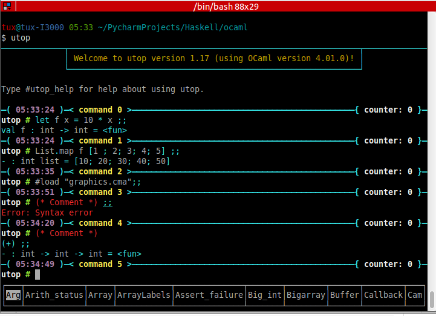
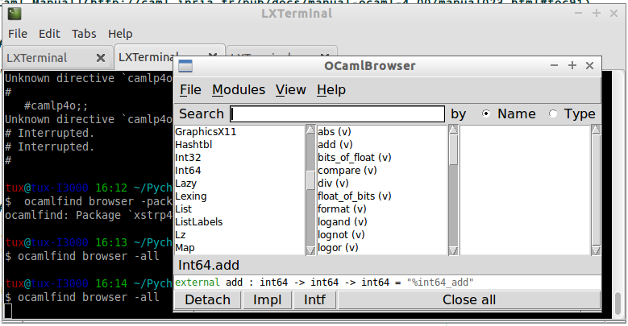
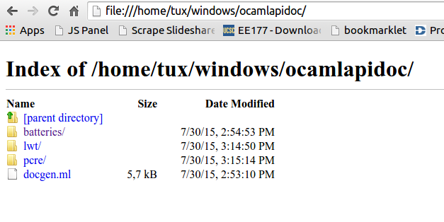
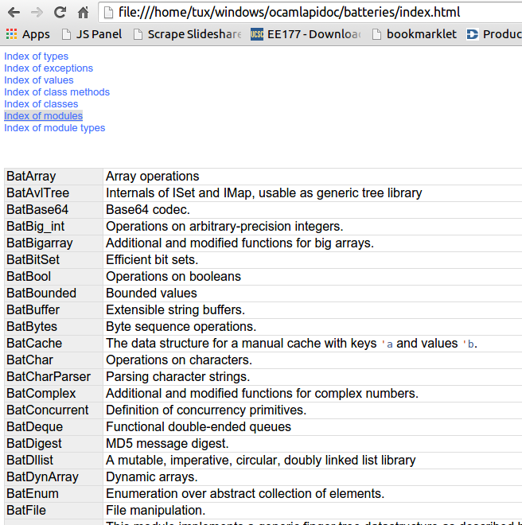
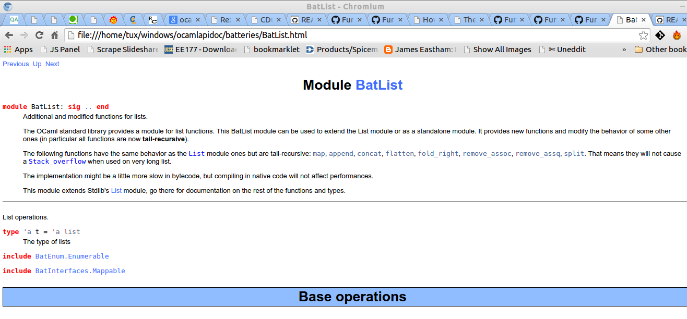
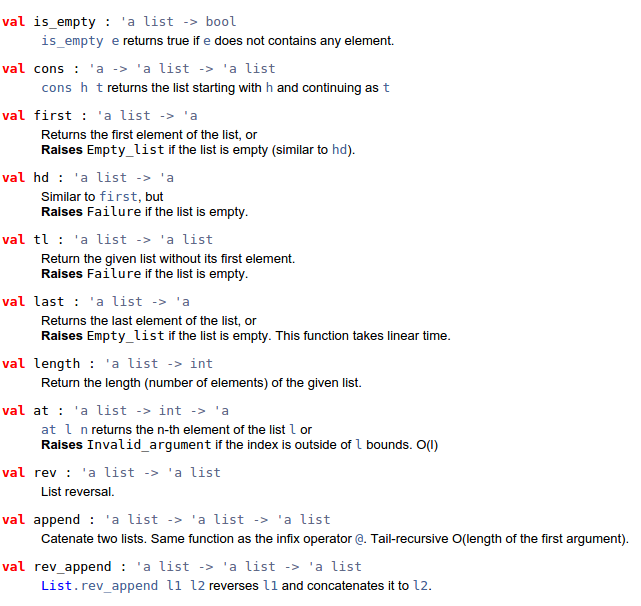
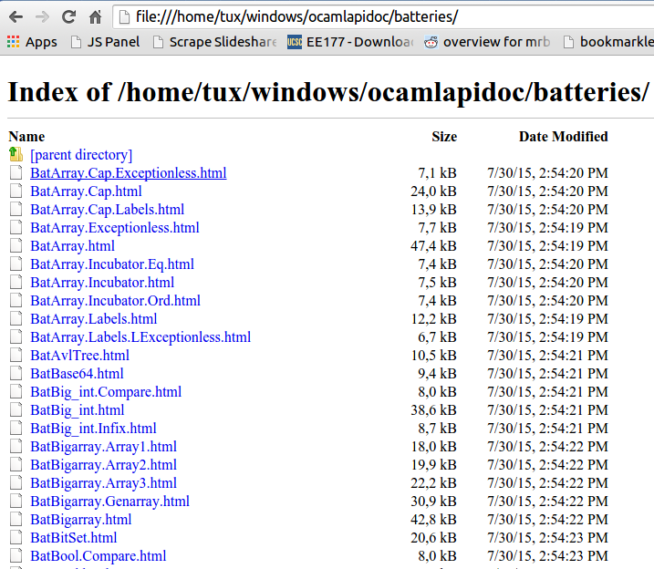

- [OCaml](#ocaml)
  - [Overview](#overview)
  - [Setup](#setup)
  - [Toolset](#toolset)
  - [Basic Syntax](#basic-syntax)
    - [Primitive Types](#primitive-types)
    - [Operators](#operators)
    - [Variable Declaration](#variable-declaration)
    - [Local Binding](#local-binding)
    - [Polymorphic Functions](#polymorphic-functions)
    - [Number Formats](#number-formats)
    - [Math / Float Functions](#math-/-float-functions)
    - [Function Declaration](#function-declaration)
    - [Function Composition](#function-composition)
    - [Lambda Functions/ Anonymous Functions](#lambda-functions/-anonymous-functions)
    - [Recursive Functions](#recursive-functions)
    - [Mutable References](#mutable-references)
    - [Control Structures](#control-structures)
  - [Standard (Native) Library Modules](#standard-(native)-library-modules)
    - [List](#list)
    - [Array](#array)
    - [String](#string)
    - [Sys](#sys)
    - [Filename](#filename)
    - [Unix](#unix)
    - [IO - Input / Output](#io---input-/-output)
    - [Type Casting](#type-casting)
  - [Algebraic Data Types and Pattern Matching](#algebraic-data-types-and-pattern-matching)
    - [Algebraic Data Types](#algebraic-data-types)
  - [Lazy Evaluation](#lazy-evaluation)
  - [Foreign Function Interface FFI](#foreign-function-interface-ffi)
    - [Calling C Standard Library and Unix System Calls](#calling-c-standard-library-and-unix-system-calls)
    - [Calling Shared Libraries](#calling-shared-libraries)
    - [Finding Shared Libraries](#finding-shared-libraries)
    - [References](#references)
  - [Module System](#module-system)
    - [Opening Modules](#opening-modules)
    - [Defining a module in the Toplevel](#defining-a-module-in-the-toplevel)
    - [Loading file as module in the toplevel](#loading-file-as-module-in-the-toplevel)
    - [Loading Libraries Modules](#loading-libraries-modules)
    - [Including Modules](#including-modules)
  - [Compiling](#compiling)
    - [Compiling a single file](#compiling-a-single-file)
    - [Compiling a single File and a single Module](#compiling-a-single-file-and-a-single-module)
    - [See also](#see-also)
  - [Creating Libraries, Modules and Compiling to Bytecode or Machine Code](#creating-libraries,-modules-and-compiling-to-bytecode-or-machine-code)
    - [Loading Files in Interactive Shell](#loading-files-in-interactive-shell)
    - [Compile Module to Bytecode](#compile-module-to-bytecode)
  - [Batteries Standard Library](#batteries-standard-library)
    - [Batteries Modules](#batteries-modules)
  - [Miscellaneous](#miscellaneous)
    - [Changing Toploop Prompt](#changing-toploop-prompt)
    - [Adding Directives to Toploop Shell](#adding-directives-to-toploop-shell)
    - [Shell Script in Ocaml](#shell-script-in-ocaml)
    - [Debugging](#debugging)
    - [Generating OCaml html API Doc](#generating-ocaml-html-api-doc)
  - [Resources](#resources)
    - [Articles](#articles)
    - [Links](#links)
    - [Books](#books)
    - [Community](#community)
    - [References By Subject](#references-by-subject)

# OCaml<a id="sec-1" name="sec-1"></a>

## Overview<a id="sec-1-1" name="sec-1-1"></a>


OCaml (Objective Categorical Abstract Machine Language) (formerly
known as Objective Caml) is the main implementation of the Caml
programming language, created by Xavier Leroy, Jérôme Vouillon, Damien
Doligez, Didier Rémy and others in 1996. OCaml is an open source
project managed and principally maintained by the French institute
INRIA. The Caml's toolset includes an interactive toplevel
interpreter, a bytecode compiler, and an optimizing native code
compiler.

**Features**

-   Strong Static Type  - Type Safety
-   Type Inference      - The compiler infers the types for you, you don't need to write all the types;
-   Curried Functions   - Allows to create and functions on the fly.
-   Strict Evaluation by default
-   Optional Lazy Evaluation
-   Multi Paradigm      - Functional, Imperative and Object Orientated
-   Compiled and Interpreted - It allows iteractive development and debugging.
    -   Compiles to natve code and bytecode
-   Algebraic Data Types
-   Pattern Matching

**History**

-   ML: Meta Language
    -   1973, University of Edinburg
    -   Used to program search tactics in LCF theorem prover

-   SML: Standard ML
    -   1990, Princeton University

-   OCaml
    -   1996, INRIA

**Ocaml Shell Online**

You Can try OCaml online in:

-   [OCsigen - JS of Ocaml Toploop](http://ocsigen.org/js_of_ocaml/dev/files/toplevel/index.html)

## Setup<a id="sec-1-2" name="sec-1-2"></a>

Ocaml installer, packages and releases:
-   <http://caml.inria.fr/ocaml/release.en.html>

-   [OCamlPro's version of OCaml on Windows](https://github.com/OCamlPro/ocpwin-distrib)

**Linux**

Ubuntu:

Show all OCaml packages available.

```bash
$ apt-cache search ocaml
```

```bash
sudo apt-get install curl build-essential
sudo apt-get install ocaml opam ocaml-native-compilers m4
```

Arch Linux:

```
$ yaourt -s ocaml
```

Gentoo:

```
$ emerge ocaml
```

Fedora

```
$ su - -c "yum install ocaml"
```

Install Utop, Core library and Batteries library

```
opam update
opam install utop core batteries
```

## Toolset<a id="sec-1-3" name="sec-1-3"></a>

See also: <https://github.com/OCamlPro/ocaml-cheat-sheets>

<table border="2" cellspacing="0" cellpadding="6" rules="groups" frame="hsides">


<colgroup>
<col  class="left" />

<col  class="left" />
</colgroup>
<thead>
<tr>
<th scope="col" class="left">Program</th>
<th scope="col" class="left">Description</th>
</tr>
</thead>

<tbody>
<tr>
<td class="left">ocaml</td>
<td class="left">toplevel loop  / Interactive Shell</td>
</tr>


<tr>
<td class="left">ocamlrun</td>
<td class="left">bytecode interpreter</td>
</tr>


<tr>
<td class="left">ocamlc</td>
<td class="left">bytecode batch compiler</td>
</tr>


<tr>
<td class="left">ocamlopt</td>
<td class="left">native code batch compiler</td>
</tr>


<tr>
<td class="left">ocamlc.opt</td>
<td class="left">optimized bytecode batch compiler</td>
</tr>


<tr>
<td class="left">ocamlopt.opt</td>
<td class="left">optimized native code batch compiler</td>
</tr>


<tr>
<td class="left">ocamlmktop</td>
<td class="left">new toplevel constructor</td>
</tr>


<tr>
<td class="left">ocamldoc</td>
<td class="left">Generate documentation for source files in HTML/ LaTex / man pages</td>
</tr>


<tr>
<td class="left">ocamlfind</td>
<td class="left">Find OCaml packages installed</td>
</tr>


<tr>
<td class="left">opam</td>
<td class="left">Package manager for OCaml</td>
</tr>


<tr>
<td class="left">utop[optional]</td>
<td class="left">Improved interactive shell</td>
</tr>
</tbody>
</table>

```
Purpose             C       Bytecode    Native code
Source code         *.c     *.ml        *.ml
Header files1       *.h     *.mli       *.mli
Object files        *.o     *.cmo       *.cmx2
Library files       *.a     *.cma       *.cmxa3
Binary programs     prog    prog        prog.opt4
```

Standard Libraries:

-   [Native Library](http://caml.inria.fr/pub/docs/manual-ocaml/libref/)

-   [Core](https://ocaml.janestreet.com/ocaml-core/111.17.00/doc/core/) - Jane Street Capital's Standard
-   <https://github.com/janestreet/core_kernel>

Library

-   [Batteries](http://batteries.forge.ocamlcore.org/) - Maintained by community

Linux:

```
$ apropos ocaml
Callback (3o)        - Registering OCaml values with the C runtime.
Lexing (3o)          - The run-time library for lexers generated by ocamllex.
ocaml (1)            - The OCaml interactive toplevel
ocaml.m4 (1)         - Autoconf macros for OCaml
ocamlbuild (1)       - The OCaml project compilation tool
ocamlbuild.byte (1)  - The OCaml project compilation tool
ocamlbuild.native (1) - The OCaml project compilation tool
ocamlc (1)           - The OCaml bytecode compiler
ocamlcp (1)          - The OCaml profiling compilers
ocamldebug (1)       - the OCaml source-level replay debugger.
ocamldep (1)         - Dependency generator for OCaml
ocamldoc (1)         - The OCaml documentation generator
ocamldot (1)         - generate dependency graphs of ocaml programs
ocamldumpobj (1)     - disassembler for OCaml executable and .cmo object files
ocamllex (1)         - The OCaml lexer generator
ocamlmklib (1)       - generate libraries with mixed C / Caml code.
ocamlmktop (1)       - Building custom toplevel systems
ocamlobjinfo (1)     - dump information about OCaml compiled objects
ocamlopt (1)         - The OCaml native-code compiler
ocamloptp (1)        - The OCaml profiling compilers
ocamlprof (1)        - The OCaml profiler
ocamlrun (1)         - The OCaml bytecode interpreter
ocamlyacc (1)        - The OCaml parser generator
opam (1)             - source-based OCaml package management
Parsing (3o)         - The run-time library for parsers generated by ocamlyacc.

$ whereis ocaml
ocaml: /usr/bin/ocaml /usr/lib/ocaml /usr/bin/X11/ocaml
/usr/local/lib/ocaml /usr/share/man/man1/ocaml.1.gz
```

Extension Files:

<table border="2" cellspacing="0" cellpadding="6" rules="groups" frame="hsides">


<colgroup>
<col  class="left" />

<col  class="left" />
</colgroup>
<thead>
<tr>
<th scope="col" class="left">Extension</th>
<th scope="col" class="left">Meaning</th>
</tr>
</thead>

<tbody>
<tr>
<td class="left">.ml</td>
<td class="left">source file</td>
</tr>


<tr>
<td class="left">.mli</td>
<td class="left">interface file</td>
</tr>


<tr>
<td class="left">.cmo</td>
<td class="left">object file (bytecode)</td>
</tr>


<tr>
<td class="left">.cma</td>
<td class="left">library object file (bytecode)</td>
</tr>


<tr>
<td class="left">.cmi</td>
<td class="left">compiled interface file</td>
</tr>


<tr>
<td class="left">.cmx</td>
<td class="left">object file (native)</td>
</tr>


<tr>
<td class="left">.cmxa</td>
<td class="left">library object file (native)</td>
</tr>


<tr>
<td class="left">.c</td>
<td class="left">C source file</td>
</tr>


<tr>
<td class="left">.o</td>
<td class="left">C object file (native)</td>
</tr>


<tr>
<td class="left">.a</td>
<td class="left">C library object file (native)</td>
</tr>
</tbody>
</table>

1.  OCAML Interactive Shell

    ```
    $ rlwrap -m -c -r -H ../history.ml -f ../completion.txt ocaml
    ```
    
    OCAML Directives
    
    Read, compile and execute source phrases from the given file. This is textual inclusion: phrases are processed just as if they were typed on standard input. The reading of the file stops at the first error encountered.
    
    ```
        #use "whatever.ml";;
    ```
    
    Load in memory a bytecode object file (.cmo file) or library file (.cma file) produced by the batch compiler ocamlc.
    
    ```
        #load "file-name";;
    ```
    
    Add the given directory to the list of directories searched for source and compiled files.
    
    ```
        #directory "dir-name";;
    ```
    
    Change the current working directory.
    
    ```
        #cd "dir-name";;
    ```
    
    Exit the toplevel loop and terminate the ocaml command.
    
    ```
        #quit;;
    ```
    
    Source:
    
    [OCaml Manual](http://caml.inria.fr/pub/docs/manual-ocaml-4.00/manual023.html#toc91)

2.  UTOP Interactive Shell

    Install Utop:
    
    ```
     # opam install utop
    ```
    
    
    
    **Show UTOP help**
    
    ```ocaml
        utop # #utop_help;;
        If you can't see the prompt properly try: #utop_prompt_simple                                                                                                                               utop defines the following directives:
    
        #utop_bindings   : list all the current key bindings
        #utop_macro      : display the currently recorded macro
        #topfind_log     : display messages recorded from findlib since the beginning of the session
        #topfind_verbose : enable/disable topfind verbosity
        For a complete description of utop, look at the utop(1) manual page.
    ```
    
    Note: Those commands below also works in the native ocaml interpreter (ocaml).
    
    **Load a library**
    
    ```ocaml
        utop # #use "topfind";;
        - : unit = ()                                                                                 Findlib has been successfully loaded. Additional directives:                                    #require "package";;      to load a package
          #list;;                   to list the available packages
          #camlp4o;;                to load camlp4 (standard syntax)
          #camlp4r;;                to load camlp4 (revised syntax)
          #predicates "p,q,...";;   to set these predicates
          Topfind.reset();;         to force that packages will be reloaded
          #thread;;                 to enable threads
    
        - : unit = ()
    ```
    
    **List Installed Packages**
    
    ```ocaml
        utop # #list ;;
        archimedes          (version: 0.4.17) archimedes.graphics (version: 0.4.17)                                  archimedes.internals (version: 0.4.17)
        archimedes.top      (version: 0.4.17)
        batteries           (version: 2.3)
        bigarray            (version: [distributed with Ocaml])
        bin_prot            (version: 111.03.00)
        ...
    ```
    
    **Load Installed OCaml Packages**
    
    ```
        utop # #require "batteries";;
        utop # #require "gnuplot";;
    ```
    
    **Show UTOP Key Bindings**
    
    ```ocaml
    utop # #utop_bindings;;
    enter       : accept                        -> accept the current input.                                  escape      : cancel-search                 -> cancel search mode.                                        tab         : complete                      -> complete current input.
    up          : history-prev                  -> go to the previous entry of the history.
    down        : history-next                  -> go to the next entry of the history.
    ...
    ```
    
    **Load ML file, source code**
    
    ```ocaml
        # #use "text.ml" ;;
        val split_lines : string -> string list = <fun>
        val split_space : string -> string list = <fun>
        val split_delim : string -> string -> string list = <fun>
        val add_prefix : string -> string -> string = <fun>
        val add_suffix : string -> string -> string = <fun>
        # 
        
        #  split_space "Hello world ocaml" ;; 
        - : string list = ["Hello"; "world"; "ocaml"]
        #
    ```
    
    **Load ML file as module**
    
    ```ocaml
      # #mod_use "text.ml" ;;
        module Text :
          sig
            val split_lines : string -> string list
            val split_space : string -> string list
            val split_delim : string -> string -> string list
            val add_prefix : string -> string -> string
            val add_suffix : string -> string -> string
          end
        # 
    
        #  Text.split_space "Hello world ocaml" ;;
        - : string list = ["Hello"; "world"; "ocaml"]
        #
    ```
    
    **Show a Module Sinature**
    
    (Ocaml version >= 4.2)
    
    ```ocaml
        # #show Filename ;;
        module Filename :
          sig
            val current_dir_name : string
            val parent_dir_name : string
            val dir_sep : string
            val concat : string -> string -> string
            val is_relative : string -> bool
            val is_implicit : string -> bool
            val check_suffix : string -> string -> bool
            val chop_suffix : string -> string -> string
            val chop_extension : string -> string
            val basename : string -> string
            val dirname : string -> string
            val temp_file : ?temp_dir:string -> string -> string -> string
            val open_temp_file :
              ?mode:open_flag list ->
              ?temp_dir:string -> string -> string -> string * out_channel
            val get_temp_dir_name : unit -> string
            val set_temp_dir_name : string -> unit
            val temp_dir_name : string
            val quote : string -> string
          end
        #
    ```

3.  OCaml Browser

    Browser OCaml Type Signatures.
    
    ```
    $ ocamlfind browser -all
    $ ocamlfind ocamlbrowser -package core
    $ ocamlfind browser -package batterie
    ```
    
    
    
    -   <http://caml.inria.fr/pub/docs/manual-ocaml/browser.html>

4.  Troubleshooting

    Finding the version of Ocaml and Opam
    
    ```bash
    $ ocaml -version
    The OCaml toplevel, version 4.01.0
    
    $ opam --version
    1.2.2
    
    $ ocamlc -v
    The OCaml compiler, version 4.01.0
    Standard library directory: /usr/lib/ocaml
    
    $ ocamlopt -v
    The OCaml native-code compiler, version 4.01.0
    Standard library directory: /usr/lib/ocaml
    
    $ utop -version
    The universal toplevel for OCaml, version 1.17, compiled for OCaml version 4.01.0
    ```
    
    Get information about compiled files:
    
    ```
    $ ocamlobjinfo seq.cmo
    File seq.cmo
    Unit name: Seq
    Interfaces imported:
        54ba2685e6ed154753718e9c8becb28b    String
        6e0efdddf4b33e30be4cc8ff056b56ff    Seq
        4836c254f0eacad92fbf67abc525fdda    Pervasives
    Uses unsafe features: no
    Force link: no
    
    
    $ ocamlobjinfo seq.cma
    File seq.cma
    Force custom: no
    Extra C object files:
    Extra C options:
    Extra dynamically-loaded libraries:
    Unit name: Seq
    Interfaces imported:
        54ba2685e6ed154753718e9c8becb28b    String
        4387952f7aad2695faf187cd3feeb5e5    Seq
        4836c254f0eacad92fbf67abc525fdda    Pervasives
    Uses unsafe features: no
    Force link: no
    
    
    $ ocamlobjinfo seq.cmi
    File seq.cmi
    Unit name: Seq
    Interfaces imported:
        4387952f7aad2695faf187cd3feeb5e5    Seq
        4836c254f0eacad92fbf67abc525fdda    Pervasives
    ```

5.  Opam Package Manager

    Opam Version
    
    ```
    $ opam --version
    1.2.2
    ```
    
    List Installed Versions of OCaml compilers:
    
    ```
    $ opam switch list
    --     -- 3.11.2             Official 3.11.2 release
    --     -- 3.12.1             Official 3.12.1 release
    --     -- 4.00.0             Official 4.00.0 release
    --     -- 4.00.1             Official 4.00.1 release
    4.01.0  C 4.01.0             Official 4.01.0 release
    --     -- 4.02.0             Official 4.02.0 release
    4.02.1  I 4.02.1             Official 4.02.1 release
    --     -- ocamljava-preview
    doc     I system             System compiler (4.00.1)
     # 111 more patched or experimental compilers, use '--all' to show
    ```
    
    Switch to a ocaml version 4.02.1:
    
    ```
    $ opam switch 4.02.1
     # To setup the new switch in the current shell, you need to run:
    eval `opam config env`
    ```
    
    Search Packages
    
    ```
    $ opam search core
     * Existing packages for 4.01.0:
    async               --  Monadic concurrency library
    async_core          --  Monadic concurrency library
    async_extended      --  Additional utilities for async
    ...
    ```
    
    Install Packages
    
    ```
    opam install lablgtk ocamlfind
    ```
    
    Upgrade Packages
    
    ```
    $ opam upgrade
    ```
    
    Show all Installed Packages
    
    ```
    $  ocamlfind list
    archimedes          (version: 0.4.17)
    archimedes.graphics (version: 0.4.17)
    archimedes.internals (version: 0.4.17)
    archimedes.top      (version: 0.4.17)
    batteries           (version: 2.3)
    bigarray            (version: [distributed with Ocaml])
    bin_prot            (version: 111.03.00)
    bin_prot.syntax     (version: 111.03.00)
    bytes               (version: [OCaml strictly before 4.02])
    camlp4              (version: [distributed with Ocaml])
    camlp4.exceptiontracer (version: [distributed with Ocaml])
    camlp4.extend       (version: [distributed with Ocaml])
    camlp4.foldgenerator (version: [distributed with Ocaml])
    ..
    ```
    
    Finding Opam Settings
    
    ```bash
    $ opam config list
     # Global OPAM configuration variables
    
    user                 tux
    group                tux
    make                 make
    os                   linux
    root                 /home/tux/.opam
    prefix               /home/tux/.opam/system
    lib                  /home/tux/.opam/system/lib
    bin                  /home/tux/.opam/system/bin
    sbin                 /home/tux/.opam/system/sbin
    doc                  /home/tux/.opam/system/doc
    stublibs             /home/tux/.opam/system/lib/stublibs
    toplevel             /home/tux/.opam/system/lib/toplevel
    man                  /home/tux/.opam/system/man
    share                /home/tux/.opam/system/share
    etc                  /home/tux/.opam/system/etc
    
     # Global variables from the environment
    
    ocaml-version        4.01.0     # The version of the currently used OCaml compiler
    opam-version         1.2.2      # The currently running OPAM version
    compiler             system     # The name of the current OCaml compiler (may be more specific than the version, eg: "4.01.0+fp", or "system")
    preinstalled         true       # Whether the compiler was preinstalled on the system, or installed by OPAM
    switch               system     # The local name (alias) of the current switch
    jobs                 1          # The number of parallel jobs set up in OPAM configuration
    ocaml-native         true       # Whether the OCaml native compilers are available
    ocaml-native-tools   false      # Whether the native ".opt" version of the OCaml toolchain is available
    ocaml-native-dynlink true       # Whether native dynlink is available on this installation
    arch                 i686       # The current arch, as returned by "uname -m"
    
     # Package variables ('opam config list PKG' to show)
    
    PKG:name         # Name of the package
    PKG:version      # Version of the package
    PKG:depends      # Resolved direct dependencies of the package
    PKG:installed    # Whether the package is installed
    PKG:enable       # Takes the value "enable" or "disable" depending on whether the package is installed
    PKG:pinned       # Whether the package is pinned
    PKG:bin          # Binary directory for this package
    PKG:sbin         # System binary directory for this package
    PKG:lib          # Library directory for this package
    PKG:man          # Man directory for this package
    PKG:doc          # Doc directory for this package
    PKG:share        # Share directory for this package
    PKG:etc          # Etc directory for this package
    PKG:build        # Directory where the package was built
    PKG:hash         # Hash of the package archive
    ```
    
    Filter Installed Packages
    
    ```
    $ ocamlfind list | grep -i core
    cohttp.lwt-core     (version: 0.17.1)
    core                (version: 111.28.01)
    core.syntax         (version: 109.32.00)
    core.top            (version: 111.28.01)
    core_kernel         (version: 111.28.00)
    core_kernel.check_caml_modify (version: 111.28.00)
    core_kernel.raise_without_backtrace (version: 111.28.00)
    netmulticore        (version: 4.0.2)
    num.core            (version: [internal])
    
    $ ocamlfind list | grep -i batteries
    batteries           (version: 2.3
    ```

6.  Misc

    Create .mli file from .ml files. The command bellow creates context.mli from context.ml
    
    ```
    $ ocamlc -i -c context.ml > context.mli
    ```
    
    Custom Top Level Interpreter with preload libraries:
    
    ```
    $ ocamlmktop -custom -o mytoplevel graphics.cma -cclib -lX11
    ./mytoplevel
    ```

## Basic Syntax<a id="sec-1-4" name="sec-1-4"></a>

This section describes the OCaml native library and [Pervasives module](http://caml.inria.fr/pub/docs/manual-ocaml/libref/Pervasives.html).

Escape Characters:

```
Sequence  ASCII     Name
\\        \         Backlash
\"        "         Double Quote
\'        '         Double Quote
\n        LF        Line Feed
\r        CR        Carriage Return
\t        TAB       Horizontal tabulation
\b        BS        Backspace
'\ '      SPC       Space
\nnnn     nnn       Decimal Code of Acii Character
\xhhh     xhh       Hexadecimal Code of Ascii Character
```

```ocaml
    # '\\' ;;
    - : char = '\\'
    # '\ ' ;;
    - : char = ' '
    # '\"' ;;
    - : char = '"'
    # '\r' ;;
    - : char = '\r'
    # '\n' ;;
    - : char = '\n'
    # '\t' ;;
    - : char = '\t'
    # '\ ' ;;
    - : char = ' '
    # '\098' ;;
    - : char = 'b'
    # '\x21' ;;
    - : char = '!'
```

### Primitive Types<a id="sec-1-4-1" name="sec-1-4-1"></a>

```ocaml
$ ocaml
        OCaml version 4.01.0

    (* Boolean          *)
    (*------------------*)

    # true ;;
    - : bool = true
    # false ;;
    - : bool = false
    #

    (* Int              *)
    (*--------------------
     *      32 bits  signed int in 32 bits machines
     *      64 bits  signed int in 64 bits machines
     *)
    # 1000 ;;
    - : int = 1000

    (* Binary  int *)
    # 0b1000111011 ;;
    - : int = 571

    (* Hexadecimal int *)
    # 0xf0057a3 ;;
    - : int = 251680675

    (* octal int *)
    # 0o73456 ;;
    - : int = 30510

    (* Floats                   *)
    (* ------------------------ *)
    # 3.23e3 ;;
    - : float = 3230.
    # 34.2E-5 ;;
    - : float = 0.000342
    # 232. ;;
    - : float = 232.
    #

    (* Char                     *)
    (* ------------------------ *)

    # 'a' ;;
    - : char = 'a'
    # '\n' ;;
    - : char = '\n'
    # '\232' ;;
    - : char = '\232'


    (* String                         *)
    (* ------------------------------- *)

    # "Hello world OCaml" ;;
    - : string = "Hello world OCaml"
    #

    (* Tuples                            *)
    (* ----------------------------------*)
    # "Hello world OCaml" ;;
    - : string = "Hello world OCaml"
    # (10, 203.2322) ;;
    - : int * float = (10, 203.2322)
    # ("hello", 'w', 10 ) ;;
    - : string * char * int = ("hello", 'w', 10)
    #

    (* Lists / Are immutable data structure   *)
    (*----------------------------------------*)

    # [10; 20; 30; 40; 1; 3] ;;
    - : int list = [10; 20; 30; 40; 1; 3]

    # ["hello" ; "world" ; "ocaml" ; "F#" ; "Haskell" ] ;;
    - : string list = ["hello"; "world"; "ocaml"; "F#"; "Haskell"]
    #

    # [10. ; 2.323 ; 29.232 ; 100.597 ; -23.3 ] ;;
    - : float list = [10.; 2.323; 29.232; 100.597; -23.3]
    #

    # [(1, 'a') ; (2, 'b') ; (3, 'c')] ;;
    - : (int * char) list = [(1, 'a'); (2, 'b'); (3, 'c')]
    #

    (* Arrays / Mutable data structures  *)
    (* --------------------------------- *)

    # [|23; 100; 50; 80; 30; 50 |] ;;
    - : int array = [|23; 100; 50; 80; 30; 50|]

     # [|123.23; 10.23; 50.53; -80.23; 30.9734; 50.25 |] ;;
    - : float array = [|123.23; 10.23; 50.53; -80.23; 30.9734; 50.25|]

     # [|'o'; 'c'; 'a' ; 'm' ; 'l' |] ;;
    - : char array = [|'o'; 'c'; 'a'; 'm'; 'l'|]

    (* Unit / Represents side effects (Similar to Haskell IO ()*)
    (*-------------------------------------------------------- *)

    # ();;
    - : unit = ()
    #

    # print_string ;;
    - : string -> unit = <fun>

    # read_line ;;
    - : unit -> string = <fun>

    # let read_two_lines () = read_line (); read_line (); print_string "two lines" ;;
    val read_two_lines : unit -> unit = <fun>

    # read_two_lines () ;;
    2323
    5353535
    two lines- : unit = ()


    (* Option Type / Equivalent to Haskell Maybe *)

    # None ;;
    - : 'a option = None
    # Some 10 ;;
    - : int option = Some 10
    # Some 'a' ;;
    - : char option = Some 'a'
    # Some "OCaml" ;;
    - : string option = Some "OCaml"
    #
```

### Operators<a id="sec-1-4-2" name="sec-1-4-2"></a>

Float Functions must use +. /. -. \*. operators since Ocaml doesn't support
operator overload.

Boolean Operators

```ocaml
    (* NOT                  *)
    (*----------------------*)

    # not ;;
    - : bool -> bool = <fun>
    #

    # not false ;;
    - : bool = true
    # not true ;;
    - : bool = false

    (* AND                  *)
    (*----------------------*)

    # (&&) ;;
    - : bool -> bool -> bool = <fun>

    # (&&) true false ;;
    - : bool = false
    #


    # true && true ;;
    - : bool = true
    # true && false ;;
    - : bool = false
    #

    (* OR                   *)
    (*----------------------*)

    # (||) ;;
    - : bool -> bool -> bool = <fun>

    # (||) false true ;;
    - : bool = true
    #

    # true || true ;;
    - : bool = true
    # true || false ;;
    - : bool = true
    # false || false ;;
    - : bool = false
    #
```

Comparison

```ocaml
    (* Equality *)
    # (=) ;;
    - : 'a -> 'a -> bool = <fun>
    # (==) ;;
    - : 'a -> 'a -> bool = <fun>

    (* Inequality *)
    # (<>) ;;
    - : 'a -> 'a -> bool = <fun>
    # (!=) ;;
    - : 'a -> 'a -> bool = <fun>
    #


    # (<) ;;
    - : 'a -> 'a -> bool = <fun>
    # (<=) ;;
    - : 'a -> 'a -> bool = <fun>
    # (>=) ;;
    - : 'a -> 'a -> bool = <fun>
    # (>) ;;
    - : 'a -> 'a -> bool = <fun>
    #

    # max ;;
    - : 'a -> 'a -> 'a = <fun>
    # min ;;
    - : 'a -> 'a -> 'a = <fun>


    # compare ;;
    - : 'a -> 'a -> int = <fun>
    #

    # 2 <> 4 ;;
    - : bool = true
    # 2 <> 2 ;;
    - : bool = false
    #
    # 3 != 4 ;;
    - : bool = true
    # 3 != 3 ;;
    - : bool = false
    #


    # max 3 100 ;;
    - : int = 100
    # min 2.323 100.33 ;;
    - : float = 2.323
    #
```

```ocaml
     # (+) ;;
    - : int -> int -> int = <fun>

     # (-) ;;
    - : int -> int -> int = <fun>

     # (+.) ;;
    - : float -> float -> float = <fun>

     (-.) ;;
    - : float -> float -> float = <fun>


    (* Interger Operators *)
    (*--------------------*)
    # 23 + 234 ;;
    - : int = 257
    # 1000 / 4 ;;
    - : int = 250
    #

    # 1005 mod 10 ;;
    - : int = 5
    #

    # abs (-10) ;;
    - : int = 10
    # abs 10 ;;
    - : int = 10
    #
    # pred 100 ;;
    - : int = 99
    # pred 99 ;;
    - : int = 98
    # succ 100 ;;
    - : int = 101
    # succ 101 ;;
    - : int = 102
    #

    (* Float Point *)
    (*-------------*)

    # 100. +. 23.23 ;;
    - : float = 123.23
    #
    # 0.545 *. 100. ;;
    - : float = 54.5000000000000071
    #
    # 1000. /. 4. ;;
    - : float = 250.
    #
    # 1000.0 -. 4.0 ;;
    - : float = 996.
    #

    (* Pow function 2^4 = 16 / only works for float points *)
    # 2.0 ** 4. ;;
    - : float = 16.
    #
    # ( **) ;;
    - : float -> float -> float = <fun>
    #
```

### Variable Declaration<a id="sec-1-4-3" name="sec-1-4-3"></a>

```ocaml
> let x = 2 ;;
val x : int = 2

(* Declaration with Type *)
> let a : float  = 2.323 ;;
val a : float = 2.323

(* Characters and String *)

> 'a' ;;
- : char = 'a'
> "hello world" ;;
- : string = "hello world"

(* Lists *)

> [1; 2; 3; 4 ; 5; 6] ;;
- : int list = [1; 2; 3; 4; 5; 6]


> [2.323; 534.23; 83.434; 54.3323 ] ;;
- : float list = [2.323; 534.23; 83.434; 54.3323]


> ["hello"; "world"; "ocaml"; "amazing" ] ;;
- : string list = ["hello"; "world"; "ocaml"; "amazing"]


(****** Tuples ***********)

>  (90, 100 ) ;;
- : int * int = (90, 100)

>  (232, 23.232, "hello ", 'c' ) ;;
- : int * float * string * char = (232, 23.232, "hello ", 'c')
>


>  ("hello", 23.23 ) ;;
- : string * float = ("hello", 23.23)
```

### Local Binding<a id="sec-1-4-4" name="sec-1-4-4"></a>

```ocaml
    # let  x = 10 in 
      let  y = 3  in
      let  z = 4  in 
      (x, y, z)
      ;;
    - : int * int * int = (10, 3, 4)

    # x ;;
    Error: Unbound value x
    # y ;;
    Error: Unbound value y
    # z ;;
    Error: Unbound value z
    # 

    (**********************)

    # let z = 
        let x = 10 in
        let y = 20 in
        x + 2*y
      ;;
    val z : int = 50
    # z ;;
    - : int = 50
    # x ;;
    Error: Unbound value x
    # y ;;
    Error: Unbound value y
    # 

    (**********************)
    
    # let a = 
        let f1 x = 10 *x in
        let fxy x y = 3*x + 4*y in 
        let z = 3 in
        f1 z + fxy 3 4 + f1 6 ;;
    val a : int = 115

    # a ;;
    - : int = 115
    # 

    # f1 ;;
    Error: Unbound value f1
    # fxy ;;
    Error: Unbound value fxy


    (**********************)
    
    # let a, b, c = 
         let f1 x  = 3 * x in 
         let f2 x y = 5 * x - 3 * y in
         let a = 3 in
         let b = 4 in 
         let c = a + b in 
         (f1 a, f2 a b, a + b + c)
      ;;
    val a : int = 9
    val b : int = 3
    val c : int = 14
    # 

    # f1 ;;
    Error: Unbound value f1
    # f2 ;;
    Error: Unbound value f2
    #
```

### Polymorphic Functions<a id="sec-1-4-5" name="sec-1-4-5"></a>

```ocaml
> let id = fun x -> x ;;
val id : 'a -> 'a = <fun>

>  id 10.23 ;;
- : float = 10.23
>  id 100  ;;
- : int = 100
>  id "Hello world" ;;
- : string = "Hello world"
>
```

### Number Formats<a id="sec-1-4-6" name="sec-1-4-6"></a>

-   Int   -  Default Interger format 31 bits signed int on 32 bits machine and 63 bits on a 64 bits machine
-   [Int32](http://caml.inria.fr/pub/docs/manual-ocaml/libref/Int32.html) - 32 bits signed int
-   [Int64](http://caml.inria.fr/pub/docs/manual-ocaml/libref/Int64.html) - 63 bits signed int

-   Float -  IEEE.754 - 64 bits double precision float point numbers.

-   [Num](http://caml.inria.fr/pub/docs/manual-ocaml/libref/Num.html) - Arbitrary Precision Integer
-   [Big<sub>Int</sub>](http://caml.inria.fr/pub/docs/manual-ocaml/libref/Big_int.html) - Arbitrary Precision Integer

```ocaml
(* 31 bits signed int, since this machine has 32 bits word lenght*)

    # Pervasives.min_int ;;
    - : int = -1073741824
    # Pervasives.max_int ;;
    - : int = 1073741823

(* 32 bits signed int *)

    # Int32.max_int ;;
    - : int32 = 2147483647l
    # Int32.min_int ;;
    - : int32 = -2147483648l

(* 64 bits signed int *)
    # Int64.min_int ;;
    - : int64 = -9223372036854775808L
    # Int64.max_int ;;
    - : int64 = 9223372036854775807L

(* IEEE.754 - 64 bits double precision - float point *)

    # Pervasives.min_float ;;
    - : float = 2.22507385850720138e-308
    # Pervasives.max_float ;;
    - : float = 1.79769313486231571e+308
```

Numeric Literals

```ocaml
(* Default - Pervasives 31 bit signed int (32 bits machine) *)

    # 23213 ;;
    - : int = 23213

    # 0xf43aaec ;;
    - : int = 256092908

    # 0b10001110011 ;;
    - : int = 1139

(* 32 bits signed int *)

    # 23213l ;;
    - : int32 = 23213l

    # 0xf4123l ;;
    - : int32 = 999715l

    # 0b1111100011110011l ;;
    - : int32 = 63731l

(* 64 bits signed int *)

    # 1000000L ;;
    - : int64 = 1000000L

     # 0xff2562abcL ;;
    - : int64 = 68490242748L

    # 0b11111000111100110011111101L ;;
    - : int64 = 65260797L
```

Number Conversion / Type Casting

```ocaml
    # Int32.of_int 10002373 ;;
    - : int32 = 10002373l
    # Int32.of_float 232322.323 ;;
    - : int32 = 232322l
    # Int32.of_string "98232376" ;;
    - : int32 = 98232376l

    # Int32.to_int 100033l ;;
    - : int = 100033


    # Int64.of_int 100 ;;
    - : int64 = 100L
    # Int64.of_float 1000239823.2323 ;;
    - : int64 = 1000239823L
    # Int64.of_string "34234912" ;;
    - : int64 = 34234912L

    # Int64.to_int 2323884L ;;
    - : int = 2323884


     # int_of_float (-1235.34083402321) ;;
    - : int = -1235
    # Pervasives.int_of_float (-1235.34083402321) ;;
    - : int = -1235
     # int_of_string "9123" ;;
    - : int = 9123

    # float_of_int 1000 ;;
    - : float = 1000.
```

Math Operations. In Ocaml the same operator cannot be used for more than one type, so to add ints (.), to add Int32, (Int32.add) and to add Int64, (Int64.add).

```ocaml
    # (+) ;;
    - : int -> int -> int = <fun>

    # (+.) ;;
    - : float -> float -> float = <fun>

    # Int32.add ;;
    - : int32 -> int32 -> int32 = <fun>

    # Int64.add ;;
    - : int64 -> int64 -> int64 = <fun>

    # Big_int.add_big_int ;;
    - : Big_int.big_int -> Big_int.big_int -> Big_int.big_int = <fun>

    # 23423 + 1212 ;;
    - : int = 24635

    # 32.34 +. 232.22 ;;
    - : float = 264.56

    # Int32.add 2323l 6023l ;;
    - : int32 = 8346l

    # Int64.add 232L 3434L ;;
    - : int64 = 3666L

    (* Simplifying Number Operators *)

    # let fun1 x y = 10 * x - 4 * y ;;
    val fun1 : int -> int -> int = <fun>

    # fun1 45 23 ;;
    - : int = 358

    # fun1 45L 23L ;;
    Error: This expression has type int64 but an expression was expected of type int

    (* Defining the function to 64 bits *)

     # let fun1L x y =
                 let (-) = Int64.sub in
                 let ( * ) = Int64.mul in
                 10L * x - 4L * y
        ;;val fun1L : int64 -> int64 -> int64 = <fun>

    # fun1L 45L 23L ;;
    - : int64 = 358L

    (* Trick Creating an Operator Module *)

    # module OP =
    struct
        module FL =
        struct
            let (+) = (+.)
            let (-) = (-.)
            let ( * ) = ( *. )
            let (/) = (/.)
        end

        module I32 =
        struct
            let (+) = Int32.add
            let (-) = Int32.sub
            let (/) = Int32.div
            let ( * ) = Int32.mul
        end

        module I64 =
        struct
            let (+) = Int64.add
            let (-) = Int64.sub
            let ( * ) = Int64.mul
            let (/) = Int64.div
        end

    end
      ;;
    module OP :
      sig
        module FL :
          sig
            val ( + ) : float -> float -> float
            val ( - ) : float -> float -> float
            val ( * ) : float -> float -> float
            val ( / ) : float -> float -> float
          end
        module I32 :
          sig
            val ( + ) : int32 -> int32 -> int32
            val ( - ) : int32 -> int32 -> int32
            val ( / ) : int32 -> int32 -> int32
            val ( * ) : int32 -> int32 -> int32
          end
        module I64 :
          sig
            val ( + ) : int64 -> int64 -> int64
            val ( - ) : int64 -> int64 -> int64
            val ( * ) : int64 -> int64 -> int64
            val ( / ) : int64 -> int64 -> int64
          end
      end
    #

(* Defined for int *)

    # let fun1 x y = 10 * x - 4 * y ;;
    val fun1 : int -> int -> int = <fun>

    # fun1 100 20 ;;
    - : int = 920

(* Defined for Int32 *)

    # let fun1_int32 x y  =
        let open OP.I32 in
        10l * x - 4l * y
    ;;
    val fun1_int32 : int32 -> int32 -> int32 = <fun>

    # fun1_int32 100l 20l ;;
    - : int32 = 920l

    (* OR for short *)

    # let fun1_int32_ x y  = OP.I32.(10l  * x - 4l * y) ;;
    val fun1_int32_ : int32 -> int32 -> int32 = <fun>

    # fun1_int32_ 100l 20l ;;
    - : int32 = 920l

(* Defined for Int64 *)

    # let fun1_int64 x y  =
            let open OP.I64 in
            10L * x - 4L * y
        ;;
    val fun1_int64 : int64 -> int64 -> int64 = <fun>

    # fun1_int64 100L 20L ;;
    - : int64 = 920L

    (* OR *)

    # let fun1_int64_ x y = OP.I64.(10L * x - 4L * y) ;;
    val fun1_int64_ : int64 -> int64 -> int64 = <fun>

(* Defined for Float *)

    # let fun1_float x y  =
                let open OP.FL in
                10. * x - 4. * y
            ;;
    val fun1_float : float -> float -> float = <fun>

    # fun1_float 100. 20. ;;
    - : float = 920.

    (* OR *)

    # let fun1_float_ x y  = OP.FL.(10.  * x - 4. * y) ;;
    val fun1_float_ : float -> float -> float = <fun>

    # fun1_float_ 100. 20. ;;
    - : float = 920.
```

### Math / Float Functions<a id="sec-1-4-7" name="sec-1-4-7"></a>

Documentation:

OCaml's floating-point complies with the [IEEE 754 standard](http://en.wikipedia.org/wiki/IEEE_floating_point),  double precision (64 bits) numbers.

-   <http://caml.inria.fr/pub/docs/manual-ocaml/libref/Pervasives.html>

```ocaml
(* Operators *)

    # (+.) ;;
    - : float -> float -> float = <fun>
    # (-.) ;;
    - : float -> float -> float = <fun>
    # (/.) ;;
    - : float -> float -> float = <fun>
    # ( *. ) ;;
    - : float -> float -> float = <fun>

     (* Power operator/ Exponentiation *)
     # ( ** ) ;;
    - : float -> float -> float = <fun>

    # List.map ( (+.) 2.323) [10.23; 3.4; 30. ; 12. ] ;;
    - : float list = [12.553; 5.723; 32.323; 14.323]

    # List.map ( ( *. ) 3.) [10.23; 3.4; 30. ; 12. ] ;;
    - : float list = [30.69; 10.2; 90.; 36.]

    # List.map (fun x -> 2. ** x ) [1. ; 2.; 3.; 4.; 5.; 6.; 7.; 8.] ;;
    - : float list = [2.; 4.; 8.; 16.; 32.; 64.; 128.; 256.]

(* Absolute Value *)

    # abs_float ;;
    - : float -> float = <fun>
    #

(* Square Root *)

    # sqrt ;;
    - : float -> float = <fun>

(* Trigonometric *)

    # sin ;;
    - : float -> float = <fun>
    # cos ;;
    - : float -> float = <fun>
    # tan ;;
    - : float -> float = <fun>
    # atan ;;
    - : float -> float = <fun>
    # atan2 ;;
    - : float -> float -> float = <fun>
    #
    # acos ;;
    - : float -> float = <fun>
    # asin ;;
    - : float -> float = <fun>
    #

(* Hyperbolic Functions *)
    # cosh ;;
    - : float -> float = <fun>
    # sinh ;;
    - : float -> float = <fun>
    # tanh ;;
    - : float -> float = <fun>
    #


(* Logarithm and exp *)
    # log ;;
    - : float -> float = <fun>
    # log10 ;;
    - : float -> float = <fun>
    # exp ;;
    - : float -> float = <fun>

    (* exp x -. 1.0, *)
    # expm1 ;;
    - : float -> float = <fun>

    (*  log(1.0 +. x)  *)
    # log1p ;;
- : float -> float = <fun>


(* Remove Decimal Part *)
    # floor ;;
    - : float -> float = <fun>
    # ceil ;;
    - : float -> float = <fun>
    # truncate ;;
    - : float -> int = <fun>
    #
    # int_of_float ;;
    - : float -> int = <fun>
    #


(* Float Constants *)

    # infinity ;;
    - : float = infinity
    #
    # neg_infinity ;;
    - : float = neg_infinity
    #

    # max_float ;;
    - : float = 1.79769313486231571e+308
    # min_float ;;
    - : float = 2.22507385850720138e-308


    # nan ;;
    - : float = nan
    #

    # 1. /. 0. ;;
    - : float = infinity
    #
    # -1. /. 0. ;;
    - : float = neg_infinity
    #
```

### Function Declaration<a id="sec-1-4-8" name="sec-1-4-8"></a>

```ocaml
> let x = 34 ;;
val x : int = 34

> x ;;
- : int = 34

> let x = 10 in
  let y = 20 in
  let z = x*y in
  z - x - y
;;
- : int = 170

> let x = 10.25 in
  let y = 30.   in
  x *. y
;;
- : float = 307.5

>  let f x = 10 * x + 4 ;;
val f : int -> int = <fun>

>  f 4 ;;
- : int = 44

>  f 5 ;;
- : int = 54
>

> let f (x, y) = x +  y ;;
val f : int * int -> int = <fun>

> f (2, 5) ;;
- : int = 7

> f (10, 5) ;;
- : int = 15


> let add_floats x y = x +. y ;;
val add_floats : float -> float -> float = <fun>

> add_floats 10. 50.343 ;;
- : float = 60.343


> let a_complex_function x y =
    let a = 10 * x in
    let b = 5 * y + x in
    a + b
;;
val a_complex_function : int -> int -> int = <fun>

(*
    a_complex_function 2 3
        a = 10 * x -->  a = 10*2 = 20
        b = 5 * 3  -->  b = 5*3 + 2 = 17
        a + b      -->  20 + 17 = 37
*)
> a_complex_function 2 3 ;;
- : int = 37


(* Function Inside functions *)

> let func1 x y =
    let ft1 x y = 10*x + y in
    let ft2 x y z = x + y - 4 * z in
    let ft3 x y = x - y in
    let z = 10 in
    (ft1 x y) + (ft2 x y z) - (ft3 x y)
;;

> func1 4 5 ;;
- : int = 15

> func1 14 5 ;;
- : int = 115

> func1 20 (-10) ;;
- : int = 130

(* Returning More than one value *)

> let g x y =  (10* x, x + y) ;;

> g 4 5 ;;
- : int * int = (40, 9)
```

Declaring Functions with type signature.

```ocaml
> let func1 (x:int) (y:float) : float = (float_of_int x) +. y ;;
val func1 : int -> float -> float = <fun>

> func1 10 2.334 ;;
- : float = 12.334


> let func2 (xy: (int * int)) : int  = (fst xy) + (snd xy) ;;
val func2 : int * int -> int = <fun

> func2 (5, 6) ;;
- : int = 11

> let show (x:float) = Printf.printf "%.3f" x ;;
val show : float -> unit = <fun>

> show 3.232 ;;
3.232- : unit = ()


> let showxy (x, y) : unit = Printf.printf "%.3f\n" (x +. y) ;;
val showxy : float * float -> unit = <fun

> showxy (32.323, 100.232) ;;
132.555
- : unit = ()


> let double_list (list_of_floats : float list) : float list =
    List.map (fun x -> 2.0 *. x) list_of_floats ;;
val double_list : float list -> float list = <fun>

> double_list [1. ; 2. ; 3. ; 4. ; 5. ] ;;
- : float list = [2.; 4.; 6.; 8.; 10.]
```

Declaring function type with anonymous functions.

```ocaml
> let func2' : (int * int) -> int = fun (a, b) -> a + b ;;
val func2' : int * int -> int = <fun>

> func2' (5, 6) ;;
- : int = 11

> let showxy' : float * float -> unit = fun (x, y) ->
   Printf.printf "%.3f\n" (x +. y) ;;

> showxy' (23.3, 5.342021321) ;;
28.642
- : unit = ()
```

Declaration functions that takes another function as argument

```ocaml
> let apply_to_fst f (x, y) = (f x, y) ;;
val apply_to_fst : ('a -> 'b) -> 'a * 'c -> 'b * 'c = <fun>

let apply_to_fst2 : ('a -> 'c) -> 'a * 'b  -> 'c * 'b =
    fun f (x, y) ->  (f x, y)

> let f x = x + 10 ;;
val f : int -> int = <fun>

> apply_to_fst f (10, "hello world") ;;
- : int * string = (20, "hello world")

> apply_to_fst2 f (10, "hello world") ;;
- : int * string = (20, "hello world")
```

Declaring functions with custom types

```ocaml
> type tuple_of_int = int * int ;;
type tuple_of_int = int * int

> type func_float_to_string = float -> string ;;
type func_float_to_string = float -> string


> type func_tuple_of_ints_to_float = int * int -> float ;;
type func_tuple_of_ints_to_float = int * int -> float

> let x: tuple_of_int = (10, 4) ;;
val x : tuple_of_int = (10, 4)

> let f : func_float_to_string = fun x -> "x = " ^ (string_of_float x) ;;
val f : func_float_to_string = <fun>

> f 2.23 ;;
- : string = "x = 2.23"

> let funct : tuple_of_int -> int = fun (x, y) -> x + y ;;
val funct : tuple_of_int -> int = <fun>

> funct (10, 100) ;;
- : int = 11

> let fxy : func_tuple_of_ints_to_float =
    fun (x, y) -> 10.4 *. (float_of_int x) -. 3.5 *. (float_of_int y) ;;
val fxy : func_tuple_of_ints_to_float = <fun>

> fxy ;;
- : func_tuple_of_ints_to_float = <fun>

> fxy (10, 5) ;;
- : float = 86.5


> type list_of_float = float list ;;
type list_of_float = float list

> let double (xs: list_of_float) : list_of_float = List.map (fun x -> 2.0 *. x) xs ;;
val double : list_of_float -> list_of_float = <fun>

> double [1. ; 2. ; 3. ; 4. ; 5. ] ;;
- : list_of_float = [2.; 4.; 6.; 8.; 10.]

> double ;;
- : list_of_float -> list_of_float = <fun>

> let double2 : list_of_float -> list_of_float =
  fun xs -> List.map (fun x -> 2.0 *. x) xs ;;
val double2 : list_of_float -> list_of_float = <fun>

> double2 ;;
- : list_of_float -> list_of_float = <fun>

> double2 [1. ; 2. ; 3. ; 4. ; 5. ] ;;
- : list_of_float = [2.; 4.; 6.; 8.; 10.]
```

Functions with Named Parameters

```ocaml
> let f1 ~x ~y = 10* x - y ;;
val f1 : x:int -> y:int -> int = <fun>

> f1 ;;
- : x:int -> y:int -> int = <fun>

> f1 4 5 ;;
- : int = 35

> f1 20 15 ;;
- : int = 185

(* Currying Funcctions with named parameters *)
> f1 20 ;;
Error: The function applied to this argument has type x:int -> y:int -> int                      This argument cannot be applied without label

> f1 ~x:20 ;;
- : y:int -> int = <fun>

> let f1_20 = f1 ~x:20 ;;
val f1_20 : y:int -> int = <fun>

> f1_20 10 ;;
- : int = 190

> f1_20 40 ;;
- : int = 160

> List.map f1_20 [1; 2; 10; 20; 30] ;;
Error: This expression has type y:int -> int but an expression was expected of type 'a -> 'b

> List.map (fun y -> f1_20 y) [1; 2; 10; 20; 30] ;;
- : int list = [199; 198; 190; 180; 170]

> let show_msg x ~msg () = Printf.printf "%s = %d" msg x ;;
val show_msg : int -> msg:string -> unit -> unit = <fun>

> show_msg 2 "Hello world" () ;;
Hello world = 2- : unit = ()

> show_msg 20  ;;
- : msg:string -> unit -> unit = <fun>

> let f = show_msg 20 ;;
val f : msg:string -> unit -> unit = <fun>

> f "x" ();;
x = 20- : unit = ()

> f "y" () ;;
y = 20- : unit = ()

> List.iter f ["x" ; "y" ; "z" ; "w"] ;;
Error: This expression has type msg:string -> unit -> unit
but an expression was expected of type 'a -> unit

> List.iter (fun msg -> f msg ()) ["x" ; "y" ; "z" ; "w"] ;;
x = 20y = 20z = 20w = 20- : unit = ()
```

Functions with Optional Parameters:

```ocaml
(*
    If the parameter x is not given, x will be set to 100
*)
> let f ?(x = 100)  y = 10*x - 5*y ;;
val add : ?x:int -> int -> int = <fun>

> f ;;
- : ?x:int -> int -> int = <fun>

(*
    f 20 ==> (10*x - 5*y) 100 20
             (10 * 10 - 5 * 20 )
             (1000 - 100)
             900
 *)
> f 20 ;;
- : int = 900


(*
    f 60 ==> (10*x - 5*y) 100 60
             (10*100 - 5*60)
             (1000 - 300)
             700
*)
> f 60 ;;
- : int = 700

> List.map f [10; 20; 30; 40; 50] ;;
- : int list = [950; 900; 850; 800; 750]


> f ~x:40 20 ;;
- : int = 300


> f ~x:50 20 ;;
- : int = 400

> f ~x:40 ;;
- : int -> int = <fun>

> let f_x40  = f ~x:40 ;;
val f_x40 : int -> int = <fun>

> List.map f_x40 [10; 20; 30; 40; 50] ;;
- : int list = [350; 300; 250; 200; 150]

> List.map (f ~x: 40) [10; 20; 30; 40; 50] ;;
- : int list = [350; 300; 250; 200; 150]


> let rectangle_area ?(width = 30) ~height = width*height ;;
val rectangle_area : ?width:int -> height:int -> int = <fun>

> rectangle_area 20 ;;
- : int = 600

> rectangle_area 30 ;;
- : int = 900

> List.map rectangle_area [10; 20; 30; 40; 50] ;;
Error: This expression has type ?width:int -> height:int -> int
but an expression was expected of type 'a -> 'b

> List.map (fun h -> rectangle_area h ) [10; 20; 30; 40; 50] ;;
- : int list = [300; 600; 900; 1200; 1500]

> rectangle_area ~width: 200 ;;
- : height:int -> int = <fun>

>: rectangle_area ~width: 200 ~height: 20 ;;
- : int = 4000

> List.map (fun h -> rectangle_area ~height:h ~width:30 )
[10; 20; 30; 40; 50] ;;
- : int list = [300; 600; 900; 1200; 1500]
```

### Function Composition<a id="sec-1-4-9" name="sec-1-4-9"></a>

Operators:

```ocaml
(* Composition Operator *)
let (<<) f g x = f (g x) ;;

(* F# Piping Composition Operator *)
let (>>) f g x = g( f x) ;;

(* F# Piping Operator *)
let (|>) x f  = f x ;;

let (<|) f x = f x ;;
```

Example: Composition Operator

```ocaml
>  let f1 x = 10 + x ;;
val f1 : int -> int = <fun>

>  let f2 x = 2 * x ;;
val f2 : int -> int = <fun>

>  let f3 x = x - 8 ;;
val f3 : int -> int = <fun>

>  f1( f2 (f3 10)) ;;
- : int = 14
>

>  (f1 << f2 << f3) 10 ;;
- : int = 14
>


>  let f = f1 << f2 << f3 ;;
val f : int -> int = <fun>
>  f 10 ;;
- : int = 14
>  f 20 ;;
- : int = 34
>
```

Example: Pipe Operators

```ocaml
>
  10 |> f3 |> f2 |> f1 ;;
- : int = 14

>
  10 |> f3 ;;
- : int = 2

>  2 |> f2 ;;
- : int = 4

>  4 |> f1 ;;
- : int = 14
>


> 10 |> (f3 >> f2 >> f1) ;;
- : int = 14

> f3 >> f2 >> f1  <| 10 ;;
- : int = 14


> let f = f3 >> f2 >> f1 ;;
val f : int -> int = <fun>

> f 10 ;;
- : int = 14
```

### Lambda Functions/ Anonymous Functions<a id="sec-1-4-10" name="sec-1-4-10"></a>

Anonymous functions, also known as lambda functions, are useful to pass already existing functions to another functions as arguments and create closures.  They are specially useful when used with map filter and another higher order functions. They can be seen as bolts that connect one part to another.

```ocaml
fun x -> x+1                       : int -> int
fun x -> x +. 1.0                  : float -> float
fun x -> x ^ x                     : string -> string
fun (x,y) -> x + y                 : (int * int) -> int
fun (x,y) -> (y,x)                 : ('a*'b) -> ('b*'a)
fun x y -> (x,y)                   : 'a -> 'b -> ('a*'b)
fun x y z -> (x,y,z)               : 'a -> 'b -> 'c -> ('a*'b*'c)
```

In the shell:

```ocaml
> fun x -> x+1  ;;
- : int -> int = <fun>

> (fun x -> x+1) 10 ;;
- : int = 11

> let f = fun x -> x+1 ;;
val f : int -> int = <fun>

> f 10 ;;
- : int = 11

> List.map (fun x -> x+1) [1; 2; 3; 4; 5 ] ;;
- : int list = [2; 3; 4; 5; 6]

> 


> (fun x y z ->  10 * x + 4 * z - 3 * x * y) 1 ;;
- : int -> int -> int = <fun>

(* x = 1 *) 
> (fun x y z ->  10 * x + 4 * z - 3 * x * y) 1 ;; 
- : int -> int -> int = <fun>

(* x = 1 y = 2 *) 
> (fun x y z ->  10 * x + 4 * z - 3 * x * y) 1 2 ;;  
- : int -> int = <fun>

(* x = 1 y = 2  z = 3 *) 
> (fun x y z ->  10 * x + 4 * z - 3 * x * y) 1 2 3 ;; 
- : int = 16 

(* Partial Evaluation *)
(*----------------------*)

> let f = fun x y z ->  10 * x + 4 * z - 3 * x * y ;;
val f : int -> int -> int -> int = <fun>

> (f 1) ;;
- : int -> int -> int = <fun>

> ((f 1) 2) ;;
- : int -> int = <fun>

> (((f 1) 2) 3) ;;
- : int = 16

> f 1 2 3 ;;
- : int = 16


(* x= ?, y=?, z=3 The variables x and y varies *)
> List.map (fun (x, y) -> f x y 3) [(1, 2); (3, 4); (5, 6)]  ;;
- : int list = [16; 6; -28]
 

(* x= ?, y=2, z=? The variables x and z varies *) 
> List.map (fun (x, z) -> f x 2 z) [(1, 2); (3, 4); (5, 6)]  ;;
- : int list = [12; 28; 44]

 
(* All variables varies *)
> List.map (fun (x, y, z) -> f x y z) [(1, 2, 3); (2, 3, 1); (3, 4, 5)] ;;
- : int list = [16; 6; 14]

(** Filtering                      *)
(**--------------------------------*)

> List.filter (fun x -> x > 5) [1; 2; 3; -3; 10; 4; 50] ;;
- : int list = [10; 50]

> List.filter (fun (x, y) -> x + y > 10) [(-10, 30); (5, 4); (12, -8); (9, 8)] ;;
- : (int * int) list = [(-10, 30); (9, 8)]


> [(-10, 30); (5, 4); (12, -8); (9, 8)]
|> List.filter (fun (x, y) -> x + y > 10)
;;
- : (int * int) list = [(-10, 30); (9, 8)]

(** Filters and maps be combined with the (|>) pipelining operator to process data *)

> [(-10, 30); (5, 4); (12, -8); (9, 8)]
|> List.filter (fun (x, y) -> x + y > 10)
|> List.map (fun (x, y) -> 4 * x + 3 * y) 
;;
- : int list = [50; 60]
```

### Recursive Functions<a id="sec-1-4-11" name="sec-1-4-11"></a>

```ocaml
    # let rec factorial1 n =
        match n with
        | 0 -> 1
        | 1 -> 0
        | k -> k * factorial1 (k - 1)
    ;;
    val factorial1 : int -> int = <fun>

    # let rec factorial2 = function
        | 0     -> 1
        | 1     -> 1
        | n     -> n * factorial2 (n - 1)
    ;;
    val factorial2 : int -> int = <fun>

    # factorial1 5 ;;
    - : int = 120

     # factorial2 5 ;;
    - : int = 120

    # let rec map f xs =   match xs with
        | []        ->  []
        | h::tl     ->  (f h)::(map f tl)
    ;;
    val map : ('a -> 'b) -> 'a list -> 'b list = <fun>

    # map ((+) 5) [10; 20; 25 ; 9] ;;
    - : int list = [15; 25; 30; 14]

    # let rec sumlist = function
        | []        -> 0
        | [a]       -> a
        | (hd::tl)  -> hd + sumlist tl
    ;;
    val sumlist : int list -> int = <fun>

    # sumlist [1; 2; 4; 5; 6; 7; 8; 9] ;;
    - : int = 42

    # let rec prodlist = function
        | []        -> 1
        | [a]       -> a
        | (hd::tl)  -> hd * prodlist tl
    ;;
    val prodlist : int list -> int = <fun>

    # prodlist [1 ; 2; 3; 4; 5; 6 ] ;;
    - : int = 720

    # let rec filter f xs = match xs with
        | []        -> []
        | h::tl     -> if f h
                       then h::(filter f tl)
                       else filter f tl

    ;;

     # filter (fun x -> x < 10) [1; 2; 10; 20; 4; 6; 15] ;;
    - : int list = [1; 2; 4; 6]


    # let rec take n xs =
        match (n, xs) with
        | (0, _    ) -> []
        | (_, []   ) -> []
        | (k, h::tl) -> k::(take (n-1) tl)
    ;;val take : int -> 'a list -> int list = <fun>

    # take 3 [1; 2; 10; 20; 4; 6; 15] ;;
    - : int list = [3; 2; 1]
    # take 20 [1; 2; 10; 20; 4; 6; 15] ;;
    - : int list = [20; 19; 18; 17; 16; 15; 14]


    # let rec drop n xs =
        if n < 0 then failwith "n negative"
        else
            match (n, xs) with
            | (0, _ )    ->  xs
            | (_, [])    ->  []
            | (k, h::tl) ->  drop (k-1) tl
    ;;val drop : int -> 'a list -> 'a list = <fun>

    # drop (-10)  [1; 2; 10; 20; 4; 6; 15] ;;
    Exception: Failure "n negative".

    # drop 10 [] ;;
    - : 'a list = []

    # drop 0 [1; 2; 10; 20; 4; 6; 15] ;;
    - : int list = [1; 2; 10; 20; 4; 6; 15]

    # drop 5 [1; 2; 10; 20; 4; 6; 15] ;;
    - : int list = [6; 15]

    # drop 25 [1; 2; 10; 20; 4; 6; 15] ;;
    - : int list = []

(*

    Haskell Function:
    foldl1 : ( a -> a -> a ) -> [a] -> [a]

    > foldl1 (\x y -> 10*x + y) [1, 2, 3, 4, 5]
    12345

    foldl1 f  [1, 2, 3, 4, 5]  =
    f 5 (f 4 (f 3 (f 1 2)))

    foldl f [x0, x1, x2, x3, x4, x5 ... ] =

    f xn (f xn-1 (f xn-2 ... (f x3 (f x2 (f x1 x0))))) ....

    From: http://en.wikipedia.org/wiki/Fold_%28higher-order_function%29
*)

    let rec foldl1 f xs =
        match xs with
        | []            -> failwith "Empty list"
        | [x]           -> x
        | (x::y::tl)    -> foldl1 f (f x y :: tl)
    ;;

    # foldl1 (fun x y -> 10*x + y) [1; 2; 3; 4; 5] ;;
    - : int = 12345


    # let rec foldr1 f xs =
        match xs with
        | []        -> failwith "Empty list"
        | [x]       -> x
        | x::tl     -> f x (foldr1 f tl)
    ;;
    val foldr1 : ('a -> 'a -> 'a) -> 'a list -> 'a = <fun>

    # foldr1 (fun x y -> x + 10*y) [1; 2; 3; 4; 5; 6] ;;
    - : int = 654321

    # let rec foldl f acc xs =
        match xs with
        | []     -> acc
        | x::tl  -> foldl f (f acc x) tl
    ;;

    # foldl (fun x y -> 10*x + y) 0  [1; 2; 3; 4; 5; 6] ;;
    - : int = 123456

    # let rec foldr f acc xs =
        match xs with
        | []    -> acc
        | x::tl -> f x (foldr f acc tl)
    ;;
    val foldr : ('a -> 'b -> 'b) -> 'b -> 'a list -> 'b = <fun>

    # foldr (fun x y -> x + 10*y) 0  [1; 2; 3; 4; 5; 6] ;;
    - : int = 654321


    # let rec range start stop step =
        if start > stop
        then []
        else start::(range  (start + step) stop step )
    ;;
    val range : int -> int -> int -> int list = <fun>

    # range 0 30 1 ;;
    - : int list =  [0; 1; 2; 3; 4; 5; 6; 7; 8; 9; 10; 11; 12; 13; 14;
    15; 16; 17; 18; 19; 20; 21; 22; 23; 24; 25;    26; 27; 28; 29; 30]

    # range 0 100 10 ;;
    - : int list = [0; 10; 20; 30; 40; 50; 60; 70; 80; 90; 100]

    # range (-100) 100 10 ;;
    - : int list = [-100; -90; -80; -70; -60; -50; -40; -30; -20;
    -10; 0; 10; 20; 30; 40; 50; 60; 70; 80; 90; 100]
```

### Mutable References<a id="sec-1-4-12" name="sec-1-4-12"></a>

```ocaml
(** Declare a reference *)

    #  let x = ref 0 ;;
    val x : int ref = {contents = 0}
    # 
    
(** Get the value of a reference *)
    
    # !x ;;
    - : int = 0
    # 

(** Set the value of a reference *)

    # (:=) ;;
    - : 'a ref -> 'a -> unit = <fun>
    # 
       
    # x := 100 ;;
    - : unit = ()
    # 

(** Update a reference *)

    #  x:= !x + 100 ;;
    - : unit = ()

    # x ;;
    - : int ref = {contents = 100}
    # 

(** A reference can be accessed inside a function *)


    # let x = ref 10 ;;
    val x : int ref = {contents = 10}
    # 

    let add_10_to_x () = 
              x := !x + 10 
            ;;
    val add_10_to_x : unit -> unit = <fun>
    # 

    #  add_10_to_x () ;;
    - : unit = ()
    # x ;;
    - : int ref = {contents = 20}

    # add_10_to_x () ;;
    - : unit = ()
    # x ;;
    - : int ref = {contents = 30}
    # 

(** Functions that operates references *)

    # let y = ref 10 ;;
    val y : int ref = {contents = 10}
    # 
    
    #  let get_ref x = !x ;;
    val get_ref : 'a ref -> 'a = <fun>
    
    #  get_ref y ;;
    - : int = 10
    #     
    
    # let set_ref r new_value = 
          r := new_value 
      ;;
    val set_ref : 'a ref -> 'a -> unit = <fun>
    # 
    
    #  set_ref y 100 ;;
    - : unit = ()
    # y ;;
    - : int ref = {contents = 100}
    # 

    #  let add_x_to_ref r x = 
         r := !r + x 
      ;;
    val add_x_to_ref : int ref -> int -> unit = <fun>
    # 


    #  add_x_to_ref y 200 ;;
    - : unit = ()

    # y ;;
    - : int ref = {contents = 300}
    # 

    (* 
        y <-- y + 1 + 2 + 3 + 4 + 5 + 6 
    *)
    # List.iter (add_x_to_ref y) [1; 2; 3; 4; 5; 6] ;;
    - : unit = ()
    # y ;;
    - : int ref = {contents = 321}
    # 


    (*******************)
    
    # let y = ref 10 ;;
    val y : int ref = {contents = 10}
    #     

    #  let add_10_to_ref r =
         r := !r + 10 
      ;;
    val add_10_to_ref : int ref -> unit = <fun>
    # 

    # add_10_to_ref y ;;
    - : unit = ()
    # y ;;
    - : int ref = {contents = 20}
    # 

    #  add_10_to_ref y ;;
    - : unit = ()
    # y ;;
    - : int ref = {contents = 30}
    # 

    (*********************************)
    
    #  let swap_ref a b = 
          let c = !a in
            a := !b ;
            b := c
      ;;
    val swap_ref : 'a ref -> 'a ref -> unit = <fun>
    # 
    
    #  let x = ref 10 ;;
    val x : int ref = {contents = 10}
    # let y = ref 20 ;;
    val y : int ref = {contents = 20}
    # 
      swap_ref x y ;;
    - : unit = ()
    # x ;;
    - : int ref = {contents = 20}
    # y ;;
    - : int ref = {contents = 10}
    # 

(** Capturing references with closures *)


    let make_counter () = 
              let i = ref 0 in
              fun () ->
                i:= !i + 1 ;
                !i
                ;;
    val make_counter : unit -> unit -> int = <fun>
    # 


    # let counter1 = make_counter () ;;
    val counter1 : unit -> int = <fun>
    # 
      counter1 () ;;
    - : int = 1
    # counter1 () ;;
    - : int = 2
    # counter1 () ;;
    - : int = 3
    # counter1 () ;;
    - : int = 4
    # 

    #  let counter2 = make_counter () ;;
    val counter2 : unit -> int = <fun>
    # counter2 () ;;
    - : int = 1
    # counter2 () ;;
    - : int = 2
    # counter1 () ;;
    - : int = 5
    #         
    
(** Miscellaneous *)


    # let lst = ref [1.0; 2.0; 3.0] ;;
    val lst : float list ref = {contents = [1.; 2.; 3.]}
    
    # !lst ;;
    - : float list = [1.; 2.; 3.]

    # List.nth (!lst) 0 ;;
    - : float = 1.
    # List.nth (!lst) 2 ;;
    - : float = 3.
    # 

    # List.map (fun x -> x *. 2.) !lst ;;
    - : float list = [2.; 4.; 6.]
    # 

    # lst := List.map (fun x -> x *. 2.) !lst ;;
    - : unit = ()
    # lst ;;
    - : float list ref = {contents = [2.; 4.; 6.]}
    # 
    
    #  lst := !lst @ [3.23; 832.23; 90.23] ;;
    - : unit = ()
    # lst ;;
    - : float list ref = {contents = [2.; 4.; 6.; 3.23; 832.23; 90.23]}
    #
```

### Control Structures<a id="sec-1-4-13" name="sec-1-4-13"></a>

Conditional Expressions

```ocaml
let test x =
if x > 0
then print_string "x is positive"
else print_string "x is negative"
;;


val test : int -> unit = <fun>

> test 10 ;;
x is positive- : unit = ()

> test (-10) ;;
x is negative- : unit = ()


> let sign x =
  if x = 0
    then 0
  else if x > 0
       then 1
       else (-1)
;;
val sign : int -> int = <fun>

> List.map sign [1; -1; 0; 2; 3] ;;
- : int list = [1; -1; 0; 1; 1]

>
```

For Loop:

```ocaml
> for i = 0 to 5 do Printf.printf "= %i\n" i  done ;;
= 0
= 1
= 2
= 3
= 4
= 5
- : unit = ()

> for i = 10 downto 1 do
  Printf.printf "%d .. " i
done;
  ;;
10 .. 9 .. 8 .. 7 .. 6 .. 5 .. 4 .. 3 .. 2 .. 1 .. - : unit = ()
```

While Loop:

```ocaml
> let j = ref 5 ;;
val j : int ref = {contents = 5}

> while !j > 0 do Printf.printf "x = %d\n" !j ; j := !j -1 done ;;
x = 5
x = 4
x = 3
x = 2
x = 1
- : unit = ()
```

Infinite While Loop

```
utop # while true do
    print_string "hello world / hit return to continue ";
    read_line ();
done;
;;

Characters 77-90:                                                                       Warning 10: this expression should have type unit.                                      Characters 77-90:
Warning 10: this expression should have type unit.
hello world / hit return to continue
hello world / hit return to continue
hello world / hit return to continue
hello world / hit return to continue ^CInterrupted.

utop # let mainloop () =
      while true do
          print_string "hello world / hit return to continue ";
          read_line ();
      done;

  ;;
Warning 10: this expression should have type unit.
val mainloop : unit -> unit = <fun>

utop # mainloop()   ;;
hello world / hit return to continue
hello world / hit return to continue
hello world / hit return to continue
hello world / hit return to continue
hello world / hit return to continue
```

## Standard (Native) Library Modules<a id="sec-1-5" name="sec-1-5"></a>

Then native library is small and lacks many things someone would like and most functions are [not tail recursive](https://blogs.janestreet.com/optimizing-list-map/), it means that it will overflow stack for a very big number of iterations. For a better standard library see: Batteries and Core.


-   [Documentation](http://caml.inria.fr/pub/docs/manual-ocaml/libref)

### List<a id="sec-1-5-1" name="sec-1-5-1"></a>

The module List has almost all functions to process lists which are immutable data structures.

-   <http://caml.inria.fr/pub/docs/manual-ocaml/libref/List.html>

Cons and Nil

```ocaml
[] : 'a list                    (*     Nil *)
:: : 'a -> 'a list -> 'a list   (* :: Cons *)
```

Example:

```ocaml
>   23::[] ;;
- : int list = [23]
>  12::23::[] ;;
- : int list = [12; 23]
>  34::12::23::[] ;;
- : int list = [34; 12; 23]

>  1::[2; 34; 55] ;;
- : int list = [1; 2; 34; 55]
>

>  []::[] ;;
- : 'a list list = [[]]
>  []::[]::[] ;;
- : 'a list list = [[]; []]
```

List Functions

```ocaml
(* Concatenate Lists *)
> (@) ;;
- : 'a list -> 'a list -> 'a list = <fun>
> [1; 2; 3; 4; 5] @ [5; 6; 8] ;;
- : int list = [1; 2; 3; 4; 5; 5; 6; 8]
>

(* First element of a list / head of the list *)
> List.hd [1 ; 2; 3; 4 ; 6 ; 9] ;;
- : int = 1

(* Remove first Element of a list/ tail of the list *)
  List.tl [1 ; 2; 3; 4; 5; 6; 9] ;;
- : int list = [2; 3; 4; 5; 6; 9]

>  sum [1 ; 2; 3; 4; 5; 6; 7] ;;
- : int = 28

(* Reverse List *)
>  List.rev [1; 2; 3; 4] ;;
- : int list = [4; 3; 2; 1]

(* Pick Element *)
> List.nth [0; 1; 2; 3; 4 ] 0 ;;
- : int = 0
> List.nth [0; 1; 2; 3; 4 ] 1 ;;
- : int = 1
> List.nth [0; 1; 2; 3; 4 ] 2 ;;
- : int = 2
> List.nth [0; 1; 2; 3; 4 ] 3 ;;
- : int = 3

(* List Lenght *)
> List.length [0; 1; 2; 3; 4 ] ;;
- : int = 5
> List.length [0; 1; 2] ;;
- : int = 3

(* Combine - Equivalent to Haskell zip *)
> List.combine ;;
- : 'a list -> 'b list -> ('a * 'b) list = <fun>

> List.combine [1; 2; 3] ['a'; 'b'; 'c' ] ;;
- : (int * char) list = [(1, 'a'); (2, 'b'); (3, 'c')]

> List.combine [1; 2; 3; 5 ] ['a'; 'b'; 'c' ] ;;
Exception: Invalid_argument "List.combine".
>

(* Split - Equivalent to Haskell unzip *)

> List.split  [(1, 'a'); (2, 'b'); (3, 'c')] ;;
- : int list * char list = ([1; 2; 3], ['a'; 'b'; 'c'])
>

>  List.split  [(1, 'a'); (2, 'b'); (3, 'c')] ;;
- : int list * char list = ([1; 2; 3], ['a'; 'b'; 'c'])
>


(* Equivalent to Haskell (++) *)

> List.append [0; 2; 3; 5; 6 ] [1; 2; 6] ;;
- : int list = [0; 2; 3; 5; 6; 1; 2; 6]

(* Find *)

> List.find  (fun x -> x < 10) [1; 2 ; 3; 45] ;;
- : int = 1

> List.find  (fun x -> x > 10) [1; 2 ; 3; 45] ;;
- : int = 45

>
> List.find  (fun x -> x > 10) [1; 2 ; 3] ;;
Exception: Not_found.
>

> List.find  (fun x -> x > 100) [1; 2 ; 3; 45] ;;
Exception: Not_found.
 

> List.find_all  (fun x -> x > 10) [-10; 20 ; 3; 12; 100; 4; 35] ;;
- : int list = [20; 12; 100; 35]

> List.exists ;;
- : ('a -> bool) -> 'a list -> bool = <fun>
> List.exists ((==) 10) [1; 2; 30; 50 ; 3];;
- : bool = false
> List.exists ((==) 10) [1; 2; 30; 10 ; 50 ; 3];;
- : bool = true

> List.for_all2 (>=) [1;2;3] [2;3;4];;
- : bool = false
> List.exists2 (<) [1;2;3] [1;2;3] ;;
- : bool = false
>  List.exists2 (<) [1;2;0] [1;2;3] ;;
- : bool = true
>  List.exists2 (<) [1;2;0] [1;2];;
Exception: Invalid_argument "List.exists2".
>

> List.assoc 3 [(0, "a"); (1, "b"); (2, "c"); (3, "d")] ;;
- : string = "d"
> List.assoc 0 [(0, "a"); (1, "b"); (2, "c"); (3, "d")] ;;
- : string = "a"
> List.assoc 5 [(0, "a"); (1, "b"); (2, "c"); (3, "d")] ;;
Exception: Not_found.
>

> List.mem_assoc 5 [(0, "a"); (1, "b"); (2, "c"); (3, "d")] ;;
- : bool = false
> List.mem_assoc 3 [(0, "a"); (1, "b"); (2, "c"); (3, "d")] ;;
- : bool = true
> List.mem_assoc 2 [(0, "a"); (1, "b"); (2, "c"); (3, "d")] ;;
- : bool = true
>

> List.remove_assoc 0 [0,"a"; 1,"b"; 2,"c"; 3,"d"];;
- : (int * string) list = [(1, "b"); (2, "c"); (3, "d")]


(* Partition *)

> List.partition ;;
- : ('a -> bool) -> 'a list -> 'a list * 'a list = <fun>
>
> List.partition   (fun x -> x > 10) [-10; 20 ; 3; 12; 100; 4; 35] ;;
- : int list * int list = ([20; 12; 100; 35], [-10; 3; 4])


(* Flatten  *)

> List.flatten ;;
- : 'a list list -> 'a list = <fun>
>

> List.flatten [[1]; [2; 4] ; [6; 90; 100] ; []] ;;
- : int list = [1; 2; 4; 6; 90; 100]
>


(*      MAP         *)
(*------------------*)

> List.map ;;
- : ('a -> 'b) -> 'a list -> 'b list = <fun>
>
> List.map (( *) 10 )  [-10 ; 20 ; 5 ; 50; 100; 3 ] ;;
- : int list = [-100; 200; 50; 500; 1000; 30]

> List.map ((+) 10) [-10 ; 20 ; 5 ; 50; 100; 3 ] ;;
- : int list = [0; 30; 15; 60; 110; 13]
>

> let f x = 10 * x - 5 ;;
val f : int -> int = <fun>
> List.map f  [-10 ; 20 ; 5 ; 50; 100; 3 ] ;;
- : int list = [-105; 195; 45; 495; 995; 25]
>

> List.map (fun x -> 10.5 *. x -. 4. ) [2. ; 3. ; 5. ; 10. ; 20. ];;
- : float list = [17.; 27.5; 48.5; 101.; 206.]
>

(*      MAPI        *)
(*------------------*)
> List.mapi ;;
- : (int -> 'a -> 'b) -> 'a list -> 'b list = <fun>

> List.mapi (fun  index element -> index, element) [17.; 27.5; 48.5; 101.; 206.] ;;
- : (int * float) list = [(0, 17.); (1, 27.5); (2, 48.5); (3, 101.); (4, 206.)]


(* MAP2 / Haskell zipWith *)

> List.map2 ;;
- : ('a -> 'b -> 'c) -> 'a list -> 'b list -> 'c list = <fun>
>

> List.map2 (+) [10; 20; 30; 100] [15; 35; 25; 80] ;;
- : int list = [25; 55; 55; 180]

> List.map2 ( *) [10; 20; 30; 100] [15; 35; 25; 80] ;;
Warning 2: this is not the end of a comment.
- : int list = [150; 700; 750; 8000]

> List.map2 (fun x y -> (x, y)) [10; 20; 30; 100] [15; 35; 25; 80] ;;
- : (int * int) list = [(10, 15); (20, 35); (30, 25); (100, 80)]

> List.map2 (fun x y -> (x, y)) [10; 20; 30; 100] [15; 35; 25] ;;
Exception: Invalid_argument "List.map2".
>


> let fxy x y = 10*x - 4*y ;;
val fxy : int -> int -> int = <fun>
>
> List.map2 fxy [10; 20; 30; 100] [15; 35; 25; 80] ;;
- : int list = [40; 60; 200; 680]
>


(*      FILTER      *)
(*------------------*)
> List.filter ;;
- : ('a -> bool) -> 'a list -> 'a list = <fun>
>
>  List.filter ((<) 10) [-10 ; 20 ; 5 ; 50; 100; 3 ] ;;
- : int list = [20; 50; 100]
>

(*  FOLFR and FOLDL - Equivalent to Haskell foldr and foldl
 *   The fold functions are known as reduce. (i.e Python reduce (left fold))
 *)

> List.fold_right ;;
- : ('a -> 'b -> 'b) -> 'a list -> 'b -> 'b = <fun>

    (*
        f x y = x + 10* y
        foldr  f [1; 2; 3; 5; 6] 0

    Evaluation:

    (f 1 (f 2 (f 3  (f 5 (f 6 0)))))    f 6   0  = 6 + 10*0    =     6
    (f 1 (f 2 (f 3  (f 5 6))))          f 5   6  = 5 + 10*6    =     65
    (f 1 (f 2 (f 3  65)))               f 3  65  = 3 + 10*65   =    653
    (f 1 (f 2 653))                     f 2 653  = 2 + 10*653  =    6532
    (f 1 6532)                          f 1 6532 = 1 + 10*6532 =   65321
    65321
    *)
> List.fold_right (fun x y -> x + 10*y) [1; 2; 3; 5; 6] 0 ;;
- : int = 65321
>

> List.fold_left ;;
- : ('a -> 'b -> 'a) -> 'a -> 'b list -> 'a = <fun>
>
    (*
        f x y = 10*x + y
        flodl f 0 [1; 2; 3; 5; 6]

    Evaluation:

    (f (f (f ( f (f 0 1) 2 ) 3) 5) 6)     f 0    1 = 10*0    + 1   =    1
    (f (f (f ( f 1 2 ) 3) 5) 6)           f 1    2 = 10*1    + 2   =   12
    (f (f (f 12 3) 5) 6)                  f 12   3 = 10*12   + 3   =   123
    (f (f 123 5) 6)                       f 123  5 = 10*123  + 5   =  1235
    (f 1235 6)                            f 1235 6 = 10*1235 + 5   = 12356
    12356
    *)

> List.fold_left (fun x y -> 10*x +  y) 0 [1; 2; 3; 5; 6]  ;;
- : int = 12356
>

> List.fold_left (+) 0 [ 1; 2; 3; 4; 5; 6 ] ;;
- : int = 21

> List.fold_left ( *) 1 [ 1; 2; 3; 4; 5 ] ;;
Warning 2: this is not the end of a comment.
- : int = 120


(*    ITER / MAP Non Pure Functions  *)
(*-----------------------------------*)

> List.iter ;;
- : ('a -> unit) -> 'a list -> unit = <fun>
>

> List.iter (Printf.printf "= %d \n") [-10; 3; 100; 50; 5; 20] ;;
= -10
= 3
= 100
= 50
= 5
= 20
- : unit = ()
>

(* ITERI    *)

> List.iteri ;;
- : (int -> 'a -> unit) -> 'a list -> unit = <fun>

> List.iteri (Printf.printf "idendx = %d element = %d\n") [-10; 3; 100; 50; 5; 20] ;;
idendx = 0 element = -10
idendx = 1 element = 3
idendx = 2 element = 100
idendx = 3 element = 50
idendx = 4 element = 5
idendx = 5 element = 20
- : unit = ()


(* ITER2    *)
> List.iter2 ;;
- : ('a -> 'b -> unit) -> 'a list -> 'b list -> unit = <fun>
>
> List.iter2 (Printf.printf "%s = %d\n") ["x"; "y"; "z"] [1; 2; 3 ] ;;
x = 1
y = 2
z = 3
- : unit = ()
>
```

### Array<a id="sec-1-5-2" name="sec-1-5-2"></a>

Arrays as oppose to lists are mmutable data structures.

-   <http://caml.inria.fr/pub/docs/manual-ocaml/libref/Array.html>

```ocaml
> [| 10; 2 ; 10; 25 ; 100; 0 ; 1 |]  ;;
- : int array = [|10; 2; 10; 25; 100; 0; 1|]

> let a = [| 10; 2 ; 10; 25 ; 100; 0 ; 1 |]  ;;
val a : int array = [|10; 2; 10; 25; 100; 0; 1|]

> a.(0) ;;
- : int = 10
> a.(1) ;;
- : int = 2
> a.(4) ;;
- : int = 100
> a.(10) ;;
Exception: Invalid_argument "index out of bounds".
>

> Array.length ;;
- : 'a array -> int = <fun>

> Array.length a ;;
- : int = 7

> Array.map ;;
- : ('a -> 'b) -> 'a array -> 'b array = <fun>

> Array.map (fun x -> x*2 + 1) a ;;
- : int array = [|21; 5; 21; 51; 201; 1; 3|]

> a.(0) <- 56 ;;
- : unit = ()
> a ;;
- : int array = [|56; 2; 10; 25; 100; 0; 1|]
> a.(5) <- 567 ;;
- : unit = ()
> a ;;
- : int array = [|56; 2; 10; 25; 100; 567; 1|]

(*  Maps a function that takes the index of element
    as first argument and then the element as second
    argument.

    f(index, element)
*)
> Array.mapi ;;
- : (int -> 'a -> 'b) -> 'a array -> 'b array = <fun>
 Array.mapi (fun idx e -> idx, e) [|56; 2; 10; 25; 100; 567; 1|]  ;;
- : (int * int) array = [|(0, 56); (1, 2); (2, 10); (3, 25); (4, 100); (5, 567); (6, 1)|]


 > Array.to_list ;;
- : 'a array -> 'a list = <fun>
> Array.to_list a ;;
- : int list = [56; 2; 10; 25; 100; 567; 1]


> Array.of_list ;;
- : 'a list -> 'a array = <fun>
> Array.of_list [56; 2; 10; 25; 100; 567; 1] ;;
- : int array = [|56; 2; 10; 25; 100; 567; 1|]

> Array.get ;;
- : 'a array -> int -> 'a = <fun>
 > Array.get a 0 ;;
- : int = 56
> Array.get a 20 ;;
Exception: Invalid_argument "index out of bounds".


> let a = [|56; 2; 10; 25; 100; 567; 1|]  ;;
val a : int array = [|56; 2; 10; 25; 100; 567; 1|]
> Array.set ;;
- : 'a array -> int -> 'a -> unit = <fun>

> Array.set a  0 15 ;;
- : unit = ()
> Array.set a  4 235 ;;
- : unit = ()
> a ;;
- : int array = [|15; 2; 10; 25; 235; 567; 1|]

> Array.fold_right ;;
- : ('b -> 'a -> 'a) -> 'b array -> 'a -> 'a = <fun>
> Array.fold_right (+) [|56; 2; 10; 25; 100; 567; 1|]  0 ;;
- : int = 761

> Array.fold_left ;;
- : ('a -> 'b -> 'a) -> 'a -> 'b array -> 'a = <fun>
> Array.fold_left (+) 0 [|56; 2; 10; 25; 100; 567; 1|]  ;;
- : int = 761

> Array.iter (Printf.printf "x = %d\n") [|56; 2; 10; 25; 100; 567; 1|]  ;;
x = 56
x = 2
x = 10
x = 25
x = 100
x = 567
x = 1
- : unit = ()
>

(*  Applies a function that takes the index of element
    as first argument and then the element as second
    argument.

    f(index, element)
*)
> Array.iteri ;;
- : (int -> 'a -> unit) -> 'a array -> unit = <fun>

> Array.iteri (Printf.printf "x[%d] = %d\n") [|56; 2; 10; 25; 100; 567; 1|]  ;;
x[0] = 56
x[1] = 2
x[2] = 10
x[3] = 25
x[4] = 100
x[5] = 567
x[6] = 1
- : unit = ()


> Array.init ;;
- : int -> (int -> 'a) -> 'a array = <fun>

> Array.init 10 (fun x -> 5. *. float_of_int x)  ;;
- : float array = [|0.; 5.; 10.; 15.; 20.; 25.; 30.; 35.; 40.; 45.|]
> Array.init 10 (fun x -> 5 * x + 10 )  ;;
- : int array = [|10; 15; 20; 25; 30; 35; 40; 45; 50; 55|]

> Array.make_matrix ;;
- : int -> int -> 'a -> 'a array array = <fun>
> Array.make_matrix 2 3 1 ;;
- : int array array = [|[|1; 1; 1|]; [|1; 1; 1|]|]
```

### String<a id="sec-1-5-3" name="sec-1-5-3"></a>

There are more useful string functions on the core library.

-   <http://caml.inria.fr/pub/docs/manual-ocaml/libref/String.html>
-   <http://caml.inria.fr/pub/docs/manual-ocaml/libref/Char.html>
-   <http://caml.inria.fr/pub/docs/manual-ocaml/libref/Str.html>

**Char Module**

```ocaml
(* Acii code to Char *)

    # Char.chr ;;
    - : int -> char = <fun>

    # Char.chr 99 ;;
    - : char = 'c'

(* Char to Ascii Code*)


    # Char.code 'a' ;;
    - : int = 97

    # Char.code ;;
    - : char -> int = <fun>

(* Upper Case / Lower Case *)

    # Char.uppercase 'c' ;;
    - : char = 'C'
    # Char.lowercase 'A' ;;
    - : char = 'a'
```

**String Module**

```ocaml
(* Length of String *)

    # String.length "Hello world" ;;
    - : int = 11

(* Concatenate Strings *)
    # String.concat "\n" ["Hello"; "World"; "Ocaml" ] ;;
    - : string = "Hello\nWorld\nOcaml"

    # "Hello " ^ " World " ^ " Ocaml" ;;
    - : string = "Hello  World  Ocaml"

(* Uppercase / Lowercase *)
    # String.capitalize "hello world" ;;
    - : string = "Hello world"

    # String.lowercase "HELLO WORLD" ;;
    - : string = "hello world"

(* Get Character at position *)

    # String.get ;;
    - : string -> int -> char = <fun>
    # String.get  "Hello world" 0 ;;
    - : char = 'H'
    # String.get  "Hello world" 1 ;;
    - : char = 'e'

    # List.map (String.get "Buffalo") [0; 1; 2; 3; 4; 5; 6] ;;
    - : char list = ['B'; 'u'; 'f'; 'f'; 'a'; 'l'; 'o']
    #

    # let str =  "My string" ;;
    val str : string = "My string"

    # str.[0] ;;
    - : char = 'M'
     # str.[5] ;;
    - : char = 'r'

(* Setting Characters *)

    # let str =  "My string" ;;
    val str : string = "My string"

    # s.[0] <- 'H' ;;
    - : unit = ()
     # s.[1] <- 'e' ;;
    - : unit = ()
     # s ;;
    - : string = "He to world"

(* Contains test if character is in the string *)

    # String.contains ;;
    - : string -> char -> bool = <fun>

    # String.contains "hello" 'c' ;;
    - : bool = false

    # String.contains "hello" 'h' ;;
    - : bool = true

(* Map Characters *)

    # String.map ;;
    - : (char -> char) -> string -> string = <fun>

    # let encode key chr = Char.chr ((Char.code chr) - key) ;;
    val encode : int -> char -> char = <fun>

    # let decode key chr = Char.chr (Char.code chr + key) ;;
    val decode : int -> char -> char = <fun>

    # let str = "Hello world" ;;
    val str : string = "Hello world"

    # String.map (encode 13) str ;;
- : string = ";X__b\019jbe_W"

    # String.map (decode 13) ";X__b\019jbe_W" ;;
    - : string = "Hello world"
```

**Str Module**

-   <http://caml.inria.fr/pub/docs/manual-ocaml/libref/Str.html>

```ocaml
(* When in the toploop interactive shell *)
    #load "str.cma"

(* Compile String to a regular expression*)
    # Str.regexp ;;
    - : string -> Str.regexp = <fun>

    # Str.regexp ",";;
    - : Str.regexp = <abstr>

(* Split String *)

    # Str.split ;;
    - : Str.regexp -> string -> string list = <fun>

    # Str.split (Str.regexp ",") "23.232,9823,\"Ocaml Haskell FP\"";;
    - : string list = ["23.232"; "9823"; "\"Ocaml Haskell FP\""]

    # Str.split (Str.regexp "[,|;]") "23.232,9823;\"Ocaml Haskell FP\";400";;
    - : string list = ["23.232"; "9823"; "\"Ocaml Haskell FP\""; "400"]

    # Str.split (Str.regexp "[ ]") "23.232 9823 Ocaml Haskell FP 400";;
    - : string list = ["23.232"; "9823"; "Ocaml"; "Haskell"; "FP"; "400"]

    # Str.string_before ;;
    - : string -> int -> string = <fun>
    # Str.string_before "Hello world ocaml" 3 ;;
    - : string = "Hel"
    # Str.string_before "Hello world ocaml" 11 ;;
    - : string = "Hello world"

    # Str.string_after "Hello world ocaml" 11 ;;
    - : string = " ocaml"


    #  Str.split (Str.regexp "[ ]") "23.232 9823 Ocaml Haskell FP 400";;
    - : string list = ["23.232"; "9823"; "Ocaml"; "Haskell"; "FP"; "400"]
```

**Buffer Module**

-   <http://caml.inria.fr/pub/docs/manual-ocaml/libref/Str.html>

It provides accumulative concatenation of strings in quasi-linear time (instead of quadratic time when strings are concatenated pairwise).

```ocaml
> Buffer.create ;;
- : int -> Buffer.t = <fun>

(* Converts Buffer to String *)
Buffer.contents ;;
- : Buffer.t -> bytes = <fun>
>

(* Add Char to Buffer *)
> Buffer.add_char ;;
- : Buffer.t -> char -> unit = <fun>

Buffer.add_bytes ;;
- : Buffer.t -> bytes -> unit = <fun>
>

(* Add String to Buffer *)
> Buffer.add_string ;;
- : Buffer.t -> bytes -> unit = <fun>
>

(* Reset Buffer -> buffer = "" *)
> Buffer.reset ;;
- : Buffer.t -> unit = <fun>
>

> let b = Buffer.create  0 ;;
val b : Buffer.t = <abstr>

> Buffer.contents b ;;
- : bytes = ""


> Buffer.add_string  b "ocaml fp rocks ! ocaml is amazing" ;;
- : unit = ()

> Buffer.contents b ;;
- : bytes = "ocaml fp rocks ! ocaml is amazing"

> Buffer.add_string b " - Ocaml is strict FP" ;;
- : unit = ()

Buffer.length b ;;
- : int = 33

> Buffer.contents b ;;
- : bytes = "ocaml fp rocks ! ocaml is amazing - Ocaml is strict FP"
>


Buffer.reset b ;;
- : unit = ()

> Buffer.contents b ;;
- : bytes = ""


let c = Buffer.create 0 ;;
val c : Buffer.t = <abstr>
> Buffer.add_char c 'o' ;;
- : unit = ()
> Buffer.add_char c 'c' ;;
- : unit = ()
> Buffer.add_char c 'a' ;;
- : unit = ()
> Buffer.add_char c 'm' ;;
- : unit = ()
> Buffer.add_char c 'l' ;;
- : unit = ()

> Buffer.contents c ;;
- : bytes = "ocaml"

print_string (Buffer.contents c) ;;
ocaml- : unit = ()


> Buffer.nth c 0 ;;
- : char = 'o'
> Buffer.nth c 1 ;;
- : char = 'c'
> Buffer.nth c 2 ;;
- : char = 'a
> Buffer.nth c 3 ;;
- : char = 'm'
> Buffer.nth c 4 ;;
- : char = 'l'

List.map (Buffer.nth c) [0; 1; 2; 3; 4] ;;
- : char list = ['o'; 'c'; 'a'; 'm'; 'l']

> let s = "hindler milner type system" ;;
val s : bytes = "hindler milner type system"

> let b = Buffer.create 0 ;;
val b : Buffer.t = <abstr>

> Buffer.add_substring ;;
- : Buffer.t -> bytes -> int -> int -> unit = <fun>

Buffer.add_substring b s 0 4 ;;
- : unit = ()

> Buffer.contents b ;;
- : bytes = "hind"

Buffer.add_substring b s 4 5 ;;
- : unit = ()

> Buffer.contents b ;;
- : bytes = "hindler m"

> Buffer.add_substring b s 6 10 ;;
- : unit = ()

> Buffer.contents b ;;
- : bytes = "hindler mr milner t"


> Buffer.sub ;;
- : Buffer.t -> int -> int -> bytes = <fun>


let c = Buffer.create 0 ;;
val c : Buffer.t = <abstr>
> Buffer.add_string c "Ocaml is almost fast as C" ;;
- : unit = ()
> Buffer.sub c 0 1 ;;
- : bytes = "O"
> Buffer.sub c 0 5 ;;
- : bytes = "Ocaml"
> Buffer.sub c 0 10 ;;
- : bytes = "Ocaml is a"
> Buffer.sub c 5 15 ;;
- : bytes = " is almost fast"
>
```

**String Processing**

Splitting a string into characters.

```ocaml
> let s = "p2p peer to peer connection" ;;
val s : bytes = "p2p peer to peer connection"

(* Imperative Approach *)


> let arr = Array.make ;;
val arr : int -> 'a -> 'a array = <fun>

let arr = Array.make (String.length s) '\000' ;;
val arr : char array =
[|'\000'; '\000'; '\000'; '\000'; '\000'; '\000'; '\000'; '\000'; '\000';
'\000'; '\000'; '\000'; '\000'; '\000'; '\000'; '\000'; '\000'; '\000';
'\000'; '\000'; '\000'; '\000'; '\000'; '\000'; '\000'; '\000'; '\000'|]

> for i = 0 to (String.length s - 1) do
      arr.(i) <- s.[i]
  done ;;
- : unit = ()


> arr ;;
- : char array =
[|'p'; '2'; 'p'; ' '; 'p'; 'e'; 'e'; 'r'; ' '; 't'; 'o'; ' '; 'p'; 'e'; 'e';
'r'; ' '; 'c'; 'o'; 'n'; 'n'; 'e'; 'c'; 't'; 'i'; 'o'; 'n'|]

let str2chars s =
    let arr = Array.make (String.length s) '\000' in
    for i = 0 to (String.length s - 1) do
        arr.(i) <- s.[i]
    done ;
    arr
;;
val str2chars : bytes -> char array = <fun>
>

str2chars "fox" ;;
- : char array = [|'f'; 'o'; 'x'|]


> str2chars "fox" |> Array.map Char.code ;;
- : int array = [|102; 111; 120|]

> let str2chars_ s =
    let arr = Array.make (String.length s) '\000' in
    for i = 0 to (String.length s - 1) do
        arr.(i) <- s.[i]
    done ;
    Array.to_list arr
;;
val str2chars_ : bytes -> char list = <fun>
>

> str2chars_ "UNIX" ;;
- : char list = ['U'; 'N'; 'I'; 'X']

> str2chars_ "UNIX" |> List.map Char.code ;;
- : int list = [85; 78; 73; 88]

(* Functional Approach *)

> let str2chars s =
    let n = String.length s in
    let rec aux i alist =
        if i =0
        then []
        else s.[n-i]::(aux (i-1) alist)
    in aux n []
;;
val str2chars : bytes -> char list = <fun>

> str2chars "UNIX" ;;
- : char list = ['U'; 'N'; 'I'; 'X']

str2chars "UNIX" |> List.map Char.code ;;
- : int list = [85; 78; 73; 88]


(* Extract Digits *)

let digit_of_char c =
    match c with
    | '0' -> 0
    | '1' -> 1
    | '2' -> 2
    | '3' -> 3
    | '4' -> 4
    | '5' -> 5
    | '6' -> 6
    | '7' -> 7
    | '8' -> 8
    | '9' -> 9
    | _   -> failwith "Not a digit"
;;
;;val digit_of_char : char -> int = <fun>

> str2chars "12334" |> List.map digit_of_char ;;
- : int list = [1; 2; 3; 3; 4]

> str2chars "12334x" |> List.map digit_of_char ;;
Exception: Failure "Not a digit".

> let str2digits s =  str2chars s |> List.map digit_of_char ;;
val str2digits : bytes -> int list = <fun>

> str2digits "1234" ;;
- : int list = [1; 2; 3; 4]
```

Join Chars

```ocaml
> let cs = ['o' ; 'c'; 'a'; 'm'; 'l' ] ;;
val cs : char list = ['o'; 'c'; 'a'; 'm'; 'l']

> Buffer.add_char ;;
- : Buffer.t -> char -> unit = <fun>

> List.iter ;;
- : ('a -> unit) -> 'a list -> unit = <fun>

List.iter (Buffer.add_char b) cs ;;
- : unit = ()

> Buffer.contents b ;;
- : bytes = "ocaml"

let chars2str cs =
    let b = Buffer.create 0 in
    List.iter (Buffer.add_char b) cs ;
    Buffer.contents b
;;
val chars2str : char list -> bytes = <fun>
>

> chars2str ['o' ; 'c'; 'a'; 'm'; 'l' ] ;;
- : bytes = "ocaml"
```

Strip Left Chars

```ocaml
> let trim chars s =
    let n = String.length s in
    let b = Buffer.create 0 in

    for i = 0 to n - 1 do
        if List.mem s.[i] chars
            then ()
            else Buffer.add_char b s.[i]
    done ;
    Buffer.contents b
;;


> trim ['-'; '.']  "-.--.--.....-trim chars---...----.-.-" ;;
- : bytes = "trim chars"
```

### Sys<a id="sec-1-5-4" name="sec-1-5-4"></a>

<http://caml.inria.fr/pub/docs/manual-ocaml/libref/Sys.html>

```ocaml
(* Command Line Arguments *)

    > Sys.argv ;;
    - : string array = [|"/home/tux/bin/ocaml"|]
    >

(* Current Directory *)

    > Sys.getcwd ;;
    - : unit -> string = <fun>

    > Sys.getcwd() ;;
    - : string = "/home/tux/PycharmProjects/ocaml/prelude"

(* Change Current Directory *)

    > Sys.chdir ;;
    - : string -> unit = <fun>

    > Sys.chdir "/" ;;
    - : unit = ()
    > Sys.getcwd () ;;
    - : string = "/"
    >

(* List directory *)

    > Sys.readdir ;;
    - : string -> string array = <fun>
    >

    > Sys.readdir("/") ;;
    - : string array =
    [|"tftpboot"; "var"; "cdrom"; "home"; "lost+found"; "netinterface.log";
      "opt"; "root.tar"; "tmp"; "sys"; "etc"; "root"; "srv"; "bin";
      "vmlinuz.old"; "sbin"; "backup.log"; "initrd.img.old"; "run"; "initrd.img";
      "lib"; "usr"; "vmlinuz"; "mnt"; "dev"; "media"; "boot"; "proc"|]
    >

(* Test if is directory *)

    > Sys.is_directory "/etc" ;;
    - : bool = true
    > Sys.is_directory "/etca" ;;
    Exception: Sys_error "/etca: No such file or directory".
    > Sys.is_directory "/etc/fstab" ;;
    - : bool = false
    >


(* Test if File exists *)

    > Sys.file_exists ;;
    - : string -> bool = <fun>

    > Sys.file_exists "/etc" ;;
    - : bool = true
    >
      Sys.file_exists "/etca" ;;
    - : bool = false
    >

    (* Execute shell command and return exit code
     *   0    For success
     *  not 0 For failure
     *)

    > Sys.command ;;
    - : string -> int = <fun>

    > Sys.command "uname -a" ;;
    Linux tux-I3000 3.13.0-36-generic >63-Ubuntu SMP Wed Sep 3 21:30:45 UTC 2014 i686 i686 i686 GNU/Linux
    - : int = 0
    >

    > Sys.command "nam" ;;
    sh: 1: nam: not found
    - : int = 127
    >


(* Constants and Flags *)

    (* Machine Word Size in bits *)
    >  Sys.word_size ;;
    - : int = 32
    >

    (* Machine Endianess *)
    > Sys.big_endian ;;
    - : bool = false
    >

    (*
     *  For Linux/BSD or OSX  --> "Unix"
     *  Windows               --> "Win32"
    *)
    > Sys.os_type ;;
    - : string = "Unix"
    >

    (*  Maximum length of strings and byte sequences. =
     *   =~  16 MB
     *)
    > Sys.max_string_length ;;
    - : int = 16777211
    >
```

Extra Example:

```ocaml
    # let (|> x f = f x ;;

    # let (<|) f x = f x ;;
    val ( <| ) : ('a -> 'b) -> 'a -> 'b = <fun>

    # Sys.chdir "/boot" ;;
    - : unit = ()

    # Sys.readdir "." ;;
    - : string array =
    [|"abi-3.13.0-35-generic"; "System.map-3.13.0-35-generic";
      "vmlinuz-3.13.0-35-generic"; "abi-3.13.0-36-generic";
      "config-3.13.0-35-generic"; "memtest86+_multiboot.bin";
      "initrd.img-3.13.0-35-generic"; "memtest86+.elf"; "memtest86+.bin";
      "System.map-3.13.0-36-generic"; "initrd.img-3.13.0-36-generic";
      "xen-4.4-amd64.gz"; "extlinux"; "config-3.13.0-36-generic";
      "vmlinuz-3.13.0-36-generic"; "grub"|]
    #


    (* List only directories *)
    # "." |> Sys.readdir |> Array.to_list  |> List.filter Sys.is_directory ;;
    - : string list = ["extlinux"; "grub"]

    (* List only files *)

    # "." |> Sys.readdir |> Array.to_list  |> List.filter (fun d -> not <| Sys.is_directory d );;
    - : string list =
    ["abi-3.13.0-35-generic"; "System.map-3.13.0-35-generic";
     "vmlinuz-3.13.0-35-generic"; "abi-3.13.0-36-generic";
     "config-3.13.0-35-generic"; "memtest86+_multiboot.bin";
     "initrd.img-3.13.0-35-generic"; "memtest86+.elf"; "memtest86+.bin";
     "System.map-3.13.0-36-generic"; "initrd.img-3.13.0-36-generic";
     "xen-4.4-amd64.gz"; "config-3.13.0-36-generic"; "vmlinuz-3.13.0-36-generic"]
    #
```

### Filename<a id="sec-1-5-5" name="sec-1-5-5"></a>

It provides file name combinators.

```ocaml
    # #show Filename ;;
    module Filename :
      sig
        val current_dir_name : string
        val parent_dir_name : string
        val dir_sep : string
        val concat : string -> string -> string
        val is_relative : string -> bool
        val is_implicit : string -> bool
        val check_suffix : string -> string -> bool
        val chop_suffix : string -> string -> string
        val chop_extension : string -> string
        val basename : string -> string
        val dirname : string -> string
        val temp_file : ?temp_dir:string -> string -> string -> string
        val open_temp_file :
          ?mode:open_flag list ->
          ?temp_dir:string -> string -> string -> string * out_channel
        val get_temp_dir_name : unit -> string
        val set_temp_dir_name : string -> unit
        val temp_dir_name : string
        val quote : string -> string
      end
    # 

    (** Note:  Directory Separtor, on Windows it is (\), but is written 
    in Ocaml as (\\) , but you can also use Unix path conventions, "/" 
    the root is translater as C:\\ and "/" as \\ and "." as the current
    directory.   
    *)
    # Filename.dir_sep ;;
    - : string = "/"
    # 
    
    (** Concat Concat File Paths *)
    
    # Filename.concat "/home/dummy/Documents/" "blueprints.doc" ;;
    - : string = "/home/dummy/Documents/blueprints.doc"
    # 
    
    # Filename.concat "/home/dummy/Documents" "blueprints.doc" ;;
    - : string = "/home/dummy/Documents/blueprints.doc"        

    # List.map (Filename.concat "/opt")  ["dir1"; "dir2"; "dir3"] ;;
    - : string list = ["/opt/dir1"; "/opt/dir2"; "/opt/dir3"]
    # 
    
    # let concat_paths pathlist = List.fold_right  Filename.concat  pathlist "" ;;
    val concat_paths : string list -> string = <fun>
    # 
    # concat_paths ["/" ; "etc" ; "fstab" ] ;;
    - : string = "/etc/fstab/"


    (** Get the file name without path to file *)
     Filename.basename "/etc/fstab" ;;
    - : string = "fstab"
    # 
    
    (** Get the path where is the file or directory*)
    
    # Filename.dirname "/home/tux/windows/ocamlapidoc/index.html" ;;
    - : string = "/home/tux/windows/ocamlapidoc"
    # 
    
    # Filename.dirname "/home/tux/windows/ocamlapidoc" ;;
    - : string = "/home/tux/windows"
    # 

    (** Test if file ends with extension *)
    
    # Filename.check_suffix  "test.ml" "ml" ;;
    - : bool = true
    # 
    
    # Filename.check_suffix  "test.ml" "sh" ;;
    - : bool = false
    #     
    # "/etc" 
     |> Sys.readdir 
     |> Array.to_list 
     |> List.filter (fun x -> Filename.check_suffix  x "conf") ;;
    - : string list =
    ["nsswitch.conf"; "ntp.conf"; "mke2fs.conf"; "mtools.conf"; ...]
    
    (* You can can create combinators to enhance the composability, 
       reusability and modularity   
    *)
    
    #  let listdir path = Sys.readdir path |> Array.to_list ;;
    val litsdir : string -> string list = <fun>
    # 

    # let is_file_type ext fname = Filename.check_suffix  fname ext ;;
    val is_file_type : string -> string -> bool = <fun>

    # listdir "/etc" |> List.filter (is_file_type ".conf") ;;
    - : string list =
    ["nsswitch.conf"; "ntp.conf"; "mke2fs.conf"; "mtools.conf"; 
    "gai.conf"; "pnm2ppa.conf"; "inetd.conf"; "deluser.conf"; 
    "resolv.conf"; "rsyslog.conf" ...]

    
    # List.map Filename.chop_extension ["file1.ml"; "filex.hs"; "file3.py"] ;;
    - : string list = ["file1"; "filex"; "file3"]
    # 
    
    # Filename.chop_suffix "archive.tar.gz" ".tar.gz" ;;
    - : string = "archive"
    # 

    # Filename.chop_suffix "archive.tar.gz" ".tar.bz2" ;;
    - : string = "archiv"
    # 


    # Filename.quote "separated file name is not good.txt" ;;
    - : string = "'separated file name is not good.txt'"
    # 
    
    # Filename.quote "separated file name is not good.txt" 
    |> print_endline ;;
    'separated file name is not good.txt'
    - : unit = ()
    #
```

### Unix<a id="sec-1-5-6" name="sec-1-5-6"></a>

[Documention](http://caml.inria.fr/pub/docs/manual-ocaml/libref/Unix.html)

Despite the name Unix, this is a multi platform module and also works in Windows OS.

Compile Standalone programs with Unix Library.

```
$ ocamlfind ocamlc -package more,unix program.ml -linkpkg -o program
$ ocamlfind ocamlopt -package more,unix program.ml -linkpkg -o progra
```

**System**

```ocaml
    (* It is only needed on the toploop shell *)
    > #load "unix.cma" ;;

    (* Get the current working directory *)
    Unix.getcwd () ;;
    - : bytes = "/home/tux/PycharmProjects/ocaml/prelude"

    (* Change the current working directory *)
    > Unix.chdir "/" ;;
    - : unit = ()

    Unix.getcwd () ;;
    - : bytes = "/"


    (* Get an environment variable *)
    > Unix.getenv "PATH" ;;
    - : string =
    "/home/tux/.opam/4.02.1/bin:/home/tux/bin:/usr/local/sbin:/usr/local/bin:
    /usr/sbin:/usr/bin:/sbin:/bin:/usr/games:/usr/local/games:/home/tux/bin:
    /home/tux/usr/bin:/home/tux/.apps ...
    
    
    (* Set an environment variable *)
    >
    Unix.putenv "DUMMYVAR" "Test value"  ;;
    - : unit = ()

    > Unix.getenv "DUMMYVAR" ;;
    - : bytes = "Test value"
    >    
    
    (* Get all Environment Variables *)
    > Unix.environment () ;;
    - : bytes array =
    [|"XDG_VTNR=7"; "LC_PAPER=pt_BR.UTF-8";
    "CAML_LD_LIBRARY_PATH=/home/tux/.opam/4.02.1/lib/stublibs";
    "MANPATH=:/home/tux/.opam/4.02.1/man"; "HTTP_HOME=www.google.co.uk";
      "SSH_AGENT_PID=1055"; "LC_ADDRESS=pt_BR.UTF-8"; "XDG_SESSION_ID=c1";
      "XDG_GREETER_DATA_DIR=/var/lib/lightdm-data/tux"; "LC_MONETARY=pt_BR.UTF-8";
      "SAL_USE_VCLPLUGIN=gtk"; "CLUTTER_IM_MODULE=xim"; "COMP_WORDBREAKS= \t\n\"'><;|&(:";
      "TERM=xterm"; "XDG_MENU_PREFIX=lxde-"; "SHELL=/bin/bash"; "MAKEFLAGS=";
      "PERL5LIB=/home/tux/.opam/4.02.1/lib/perl5:"; "LC_NUMERIC=pt_BR.UTF-8";
      "OCAML_TOPLEVEL_PATH=/home/tux/.opam/4.02.1/lib/toplevel"; "USER=tux";
      "LC_TELEPHONE=pt_BR.UTF-8";  
      ...
    
    >  Unix.gethostname () ;;
    - : string = "tux-I3000"
    >

    (** Get the current process ID, PID *)
    Unix.getpid () ;;
    - : int = 31582

    (** Pid of the parent process *)
    >    Unix.getppid () ;;
    - : int = 26778

    > 
    
    (* Reading Input Channel *)
    
    let read_channel ch =
       let b = Buffer.create 0 in
    
       let reader chn =
        try Some (input_line chn)
        with End_of_file -> None
    
       in let rec aux () =
         match reader ch with
          | None -> ()
          | Some line -> Buffer.add_string b (line ^ "\n") ; aux ()
       in aux () ;
       Buffer.contents b 
    ;;
    val read_channel : in_channel -> bytes = <fun>

    > 
    
    > open_in ;;
    - : string -> in_channel = <fun>
       
  
    > let fd = open_in "/tmp/data.txt" ;;
    val fd : in_channel = <abstr>
    
    > read_channel fd |> print_string ;;
    character \n as a line break, instead of recognizing all line break characters from the Unicode standard. Whether they match or don't match (at) line breaks depends on (?s) and (?m).
    (?b) makes Tcl interpret the regex as a POSIX BRE.
    (?e) makes Tcl interpret the regex as a POSIX ERE.
    - : unit = ()
     

    > Unix.open_process_in ;;
    - : string -> in_channel = <fun>
    
     
    > Unix.open_process_in ;;
    - : string -> in_channel = <fun>
    # 
      let fd = Unix.open_process_in "ls" ;;
    val fd : in_channel = <abstr>
    # read_channel fd |> print_string ;;
    _build
    codetools.ml
    _local.ml
    Makefile
    META
    opam
    others
    prelude.docdir
    prelude.ml
    prelude.mllib
    prelude.odocl
    seq.ml
    ...
    
    > let popen_in cmd =
          let fd = Unix.open_process_in cmd in
          read_channel fd 
      ;;          
    val popen_in : string -> string = <fun>    

    > popen_in "uname -r" ;;
    - : string = "3.19.0-21-generic\n"
    >
```

**Date and Time**

```ocaml
    # #load "unix.cma" ;;
  
    (*  Return the current time since 00:00:00 GMT, Jan. 1, 1970, in seconds
     *
     *)
    # Unix.time ;;
    - : unit -> float = <fun>
    # Unix.time () ;;
    - : float = 1433237870.
    #

    (* Convert a time in seconds, as returned by Unix.time, into a date
     * and a time. Assumes UTC (Coordinated Universal Time), also known as GMT.
     *)

    # Unix.gmtime ;;
    - : float -> Unix.tm = <fun>
    #

    # Unix.gmtime @@ Unix.time () ;;
    - : Unix.tm =
    {Unix.tm_sec = 36; tm_min = 39; tm_hour = 9; tm_mday = 2; tm_mon = 5;
     tm_year = 115; tm_wday = 2; tm_yday = 152; tm_isdst = false}
    #
    
    # Unix.time () |> Unix.gmtime ;;
    - : Unix.tm =
    {Unix.tm_sec = 20; tm_min = 9; tm_hour = 22; tm_mday = 25; tm_mon = 6;
     tm_year = 115; tm_wday = 6; tm_yday = 205; tm_isdst = false}
    # 
    

   # let print_dtime tm = 
      let open Unix in
      Printf.printf "Year %d\n" (tm.tm_year + 1900) ;
      Printf.printf "Month %d\n" (tm.tm_mon + 1) ;
      Printf.printf "Day   %d\n" tm.tm_mday; 
      Printf.printf "Hour  %d\n" tm.tm_hour;
      Printf.printf "Min   %d\n" tm.tm_min;
      Printf.printf "Sec   %d\n" tm.tm_sec
   ;;


    #  Unix.time () |> Unix.gmtime |> print_dtime ;;
    Year 2015
    Month 7
    Day   25
    Hour  22
    Min   16
    Sec   58
    - : unit = ()
    # 

    (** Zero date 
      *
      *)
    # 0.0  |> Unix.gmtime |>  print_dtime ;;
    Year 1970
    Month 1
    Day   1
    Hour  0
    Min   0
    Sec   0
    - : unit = ()
    # 
        
    
    # let today_date () = 
          let open Unix in 
          let tm = time () |> gmtime in
          (tm.tm_year + 1900, tm.tm_mon + 1, tm.tm_mday)
      ;;
    val today_date : unit -> int * int * int = <fun>
    # 
    
    #   today_date () ;;
    - : int * int * int = (2015, 7, 25)
    # 
    
    # let  make_date (y, m, d) =
      let open Unix in 
      { 
       tm_sec = 0 ;
       tm_min = 0 ;
       tm_hour = 0 ;
       tm_mday = d ;
       tm_mon  = m - 1;
       tm_year = y - 1900 ;
       tm_yday = 0;
       tm_wday = 0 ;
       tm_isdst = false ;
      }
  ;;
  

    # make_date (2013, 10, 15) ;;
    - : Unix.tm =
    {Unix.tm_sec = 0; tm_min = 0; tm_hour = 0; tm_mday = 15; tm_mon = 9;
     tm_year = 113; tm_wday = 0; tm_yday = 0; tm_isdst = false}
    # 


    #  make_date (2013, 10, 15) |> print_dtime ;;
    Year 2013
    Month 10
    Day   15
    Hour  0
    Min   0
    Sec   0
    - : unit = ()
    # 


    (** Get the timezone
        The time zone is the difference between the current UTC time 
        and the localtime hour
        
        UTC_Time = Local_Time + TimeZone
        
        For example if your local time is 10h and your time zone is +3h,
        then the UTC time will be 10h + 3h => 13h or 1h PM
        
        1 h ==> 60 min/h * 60 sec/min = 3600 sec/h
           
     *)
     
    # let tzone () =
          let open Unix in
          let epc1 = time () in
          let epc2, _ = epc1 |> gmtime |> mktime in
          int_of_float @@ (epc2 -. epc1) /. 3600.
    ;;
            
    (** Recife/ Brazil Timezone *)  
    tzone () ;;
      - : int = 3
    #       
    
    # let test_time_zone epoch =
      let tm1 =
        epoch +. (float_of_int (tzone ())) *. 3600.0
        |> Unix.localtime in
      
      let tm2 = Unix.gmtime epoch in
      tm1 = tm2
    ;;          

    # let t1 = Unix.time () ;;
    val t1 : float = 1437879090.
    # let t2 = Unix.time () ;;
    val t2 : float = 1437879096.
    # let t3 = Unix.time () ;;
    val t3 : float = 1437879195.
    # 
    List.map test_time_zone [t1; t2; t3] ;;
      - : bool list = [true; true; true]
    #   
    
    (** Convert time records to Epoch Time 
      *
      * The function Unix.mktime converts a time record to epoch time
      *
      *)
       
    (* Current time in Epoch time format *)      
    # let ec = Unix.time () ;;
    val ec : float = 1437864615.
    # 

    (* Current time as time record in Local Time record *)
    #  let tm = ec |> Unix.localtime ;;
    val tm : Unix.tm =
      {Unix.tm_sec = 15; tm_min = 50; tm_hour = 19; tm_mday = 25; tm_mon = 6;
       tm_year = 115; tm_wday = 6; tm_yday = 205; tm_isdst = false}
    # 


    #  tm |> print_dtime ;;
    Year 2015
    Month 7
    Day   25
    Hour  19
    Min   50
    Sec   15
    - : unit = ()
    # 

    #  Unix.mktime ;;
    - : Unix.tm -> float * Unix.tm = <fun>
    # 

    #  let (epoch, tm2) = Unix.mktime tm;;
    val epoch : float = 1437864615.
    val tm2 : Unix.tm =
      {Unix.tm_sec = 15; tm_min = 50; tm_hour = 19; tm_mday = 25; tm_mon = 6;
       tm_year = 115; tm_wday = 6; tm_yday = 205; tm_isdst = false}
    
    # epoch = ec ;;
    - : bool = true
    
    # tm2 = tm ;;
    - : bool = true
    # 


    (** Count the number of days between two dates 
        
        1 day = 24 h * 60 h/min * 60 min/sec =
              = 86400 seconds  
              
        The two date times dt1 and dt2 are assumed to be in UTC (GM time)
    *)
    
    # let dtime_to_epoch tm = 
          let (ep, _) = Unix.mktime tm in
          ep   
          ;;
    val dtime_to_epoch : Unix.tm -> float = <fun>
    # 

    
    # let day_count dtm1 dtm2 =        
         let seconds = (dtime_to_epoch dtm2) -. (dtime_to_epoch dtm1) in
         (int_of_float (seconds /. 86400. )) + 1
    ;;     
    val day_count : Unix.tm -> Unix.tm -> int = <fun>
    
    
    # day_count (make_date (2003, 5, 12)) (make_date (2008, 9, 10)) ;;
    - : int = 1949
    #
```

### IO - Input / Output<a id="sec-1-5-7" name="sec-1-5-7"></a>

Standard Print Functions

```ocaml
> print_string "Hello world!\n";;
Hello world!
- : unit = ()
>

> print_int 100 ;;
100- : unit = ()

> print_float 23.23 ;;
23.23- : unit = ()

> print_char 'c' ;;
c- : unit = ()
>

> let s = Printf.sprintf "x =  %s  y = %f z = %d" "hello" 2.2232 40  ;;
val s : string = "x =  hello  y = 2.223200 z = 40"

> print_string s ;;
x =  hello  y = 2.223200 z = 40- : unit = ()
```

Printf Module

```ocaml
> Printf.printf "%d" 100 ;;
100- : unit = ()

> Printf.printf "%d %f" 100 2.232 ;;
100 2.232000- : unit = ()

> Printf.printf "%s %d %f" "This is" 100 2.232 ;;
This is 100 2.232000- : unit = ()

> Printf.sprintf "x =  %s  y = %f z = %d" "hello" 2.2232 40 ;;
- : string = "x =  hello  y = 2.223200 z = 40"
```

**Files**

Writing a Text File:

```ocaml
utop # let file = open_out "/tmp/file.txt" ;;
val file : out_channel = <abstr>

utop # output_string file "hello\n" ;;
- : unit = ()

utop # output_string file "world\n" ;;
- : unit = ()

utop # close_out file ;;
- : unit = ()
```

Reading a Text File:

```
utop # let filein = open_in "/tmp/file.txt" ;;
val filein : in_channel = <abstr>

utop # input_line filein ;;
- : string = "hello"

utop # input_line filein ;;
- : string = "world"

utop # input_line filein ;;
Exception: End_of_file.


utop # let filein = open_in "/tmp/file.txt" ;;
val filein : in_channel = <abstr>

utop # input_char ;;
- : in_channel -> char = <fun>


utop # input_char filein ;;
- : char = 'h'
utop # input_char filein ;;
- : char = 'e'
utop # input_char filein ;;
- : char = 'l'
utop # input_char filein ;;
- : char = 'l'
utop #
```

### Type Casting<a id="sec-1-5-8" name="sec-1-5-8"></a>

```ocaml
utop # float_of_int 2323 ;;
- : float = 2323.

utop # float_of_string "100.04523" ;;
- : float = 100.04523

utop # int_of_float 100.04523 ;;
- : int = 100

utop # int_of_string "90000" ;;
- : int = 90000

utop # let x = [20; 230; 10 ; 40; 50 ] ;;
val x : int list = [20; 230; 10; 40; 50]

utop # List.map float_of_int x ;;
- : float list = [20.; 230.; 10.; 40.; 50.]

utop # Array.of_list [20.; 230.; 10.; 40.; 50.]  ;;
- : float array = [|20.; 230.; 10.; 40.; 50.|]

utop # Array.to_list [|20.; 230.; 10.; 40.; 50.|]  ;;
- : float list = [20.; 230.; 10.; 40.; 50.]

utop # string_of_bool true ;;
- : string = "true"

utop # string_of_int 11000 ;;
- : string = "11000"

utop # string_of_float 23.2323 ;;
- : string = "23.2323"
```

## Algebraic Data Types and Pattern Matching<a id="sec-1-6" name="sec-1-6"></a>

-   Product Types: Corresponds to cartesian product. Examples: Tupĺes, Records, Constructs.
-   Sum Types: Disjoin Unions of types. Used to express possibilities.

### Algebraic Data Types<a id="sec-1-6-1" name="sec-1-6-1"></a>

1.  Record Types

    ```ocaml
    > type country = {
         name : string ;
         domain : string ;
         language : string ;
         id : int ;
      }
      ;;
    
    
    > let brazil = {name = "Brazil" ; domain = ".br" ; language = "Portuguese" ; id = 100 } ;;
    val brazil : country =
      {name = "Brazil"; domain = ".br"; language = "Portuguese"; id = 100}
    
    >  brazil.name ;;
    - : string = "Brazil"
    
    > brazil.domain ;;
    - : string = ".br"
    
    > brazil.language ;;
    - : string = "Portuguese"
    
    > brazil.id ;;
    - : int = 100
    
    
    > let countries = [
        {name = "Brazil" ; domain = ".br" ; language = "Portuguese" ; id = 100 } ;
        {name = "United Kingdom" ; domain = ".co.uk" ; language = "English" ; id = 10 } ;
        {name = "South Africa" ; domain = ".co.za" ; language = "English" ; id = 40 } ;
        {name = "France" ; domain = ".fr" ; language = "French" ; id = 20 } ;
        {name = "Taiwan ROC" ; domain = ".tw" ; language = "Chinese" ; id = 54 } ;
        {name = "Australia" ; domain = ".au" ; language = "English" ; id = 354 } ;
          ]
      ;;
    val countries : country list =
      [{name = "Brazil"; domain = ".br"; language = "Portuguese"; id = 100};
       {name = "United Kingdom"; domain = ".co.uk"; language = "English";
        id = 10};
       {name = "South Africa"; domain = ".co.za"; language = "English"; id = 40};
       {name = "France"; domain = ".fr"; language = "French"; id = 20};
       {name = "Taiwan ROC"; domain = ".tw"; language = "Chinese"; id = 54};
       {name = "Australia"; domain = ".au"; language = "English"; id = 354}]
    
    
    > List.map (fun c -> c.name ) countries ;;
    - : string list =
    ["Brazil"; "United Kingdom"; "South Africa"; "France"; "Taiwan ROC";
     "Australia"]
    
    
    > List.map (fun c -> c.domain ) countries ;;
    - : string list = [".br"; ".co.uk"; ".co.za"; ".fr"; ".tw"; ".au"]
    
    > List.filter (fun c -> c.name = "France") countries ;;
    - : country list =
    [{name = "France"; domain = ".fr"; language = "French"; id = 20}]
    
    > List.filter (fun c -> c.language = "English") countries ;;
    - : country list =
    [{name = "United Kingdom"; domain = ".co.uk"; language = "English"; id = 10};
     {name = "South Africa"; domain = ".co.za"; language = "English"; id = 40};
     {name = "Australia"; domain = ".au"; language = "English"; id = 354}]
    
    > countries 
      |> List.filter (fun c -> c.language = "English") 
      |> List.map (fun c -> c.name)
      ;;
    - : string list = ["United Kingdom"; "South Africa"; "Australia"]
     
    > let english_speaking_countries = 
      countries 
      |> List.filter (fun c -> c.language = "English") 
      |> List.map (fun c -> c.name)
      ;;
    val english_speaking_countries : string list =
      ["United Kingdom"; "South Africa"; "Australia"]
    
    
    > english_speaking_countries ;;
    - : string list = ["United Kingdom"; "South Africa"; "Australia"] 
    
    > countries 
      |> List.filter (fun c -> c.language = "English")
      |> List.map (fun c -> c.name, c.domain)
      ;;
    - : (string * string) list =
    [("United Kingdom", ".co.uk"); ("South Africa", ".co.za");
     ("Australia", ".au")]
    
    
    > List.find (fun x -> x.id = 100) countries ;;
    - : country =
    {name = "Brazil"; domain = ".br"; language = "Portuguese"; id = 100}
    
    > List.find (fun x -> x.id = 354) countries ;;
    - : country =
    {name = "Australia"; domain = ".au"; language = "English"; id = 354}
     
    >  List.find (fun x -> x.id = 1354) countries ;;
    Exception: Not_found.
    
    > countries 
      |> List.find (fun x -> x.id = 100)
      |> fun x -> x.name
      ;;
    - : string = "Brazil"
    ```

2.  Disjoint Union

    ```ocaml
    type literal =
        | Integer   of int
        | Float     of float
        | String    of string
    
    type operator =
        | Add
        | Div
        | Mul
        | Sub
    ```

3.  Agreggated Data types

    ```ocaml
    > type agg = Agg of int * string
    
    >  let a = Agg (1, "hi") ;;
    val a : agg = Agg (1, "hi")
    
    >  a ;;
    - : agg = Agg (1, "hi")
    >
    ```
    
    ```ocaml
    type shape =
          Rect    of float * float          (*width * lenght *)
        | Circle  of float                  (* radius *)
        | Triang  of float * float * float  (* a * b *  c *)
    
    let pictures = [Rect (3.0, 4.0) ; Circle 5.0 ; Triang (5.0, 5.0, 5.0)]
    
    let perimiter s =
        match s with
             Rect    (a, b)      ->  2.0 *. (a +. b)
           | Circle   r          ->  2.0 *. 3.1415 *. r
           | Triang  (a, b, c)   ->  a +. b +. c
    
    
    >  perimiter (Rect (3.0, 4.0)) ;;
    - : float = 14.
    
    >  perimiter (Circle 3.0 ) ;;
    - : float = 18.849
    
    
    >  perimiter (Triang (2.0, 3.0, 4.0)) ;;
    - : float = 9.
    >
    
    > List.map perimiter pictures ;;
    - : float list = [14.; 31.4150000000000027; 15.]
    ```

4.  Pattern Matching

    1.  Basic Pattern Matching
    
        ```ocaml
        > match 4 with x -> x;;                        (* ⇒ 4 *)
        - : int = 4
        
        > match 4 with xyz -> xyz;;                    (* ⇒ 4 *)
        - : int = 4
        
        > match [3;4;5] with [a;b;c] -> b;;            (* ⇒ 4 *)
        - : int = 4
        
        > match (3, 7, 4) with ( a, b, c ) -> c;;      (* ⇒ 4 *)
        - : int = 4
        
        >  match (3, 4, (8,9)) with (a, b, c ) -> c;;   (* ⇒ (8, 9) *)
        - : int * int = (8, 9)
        >
        
        
        > let sign x = match x with
            x when x < 0 -> -1
            | 0           -> 0
            | x           -> 1
        
        ;;
        val sign : int -> int = <fun>
        
        
        >  sign 10 ;;
        - : int = 1
        >  sign 0 ;;
        - : int = 0
        >  sign 100 ;;
        - : int = 1
        >  sign (-1) ;;
        - : int = -1
        >  sign (-100) ;;
        - : int = -1
        >
        
        let getPassword passw = match passw with
            "hello"   -> "OK. Safe Opened."
            | _       -> "Wrong Password Pal."
          ;;
        
        val getPassword : string -> string = <fun>
        >
          getPassword "hellow" ;;
        - : string = "Wrong Password Pal."
        >  getPassword "Pass" ;;
        - : string = "Wrong Password Pal."
        >  getPassword "hello" ;;
        - : string = "OK. Safe Opened."
        >
        ```
    
    2.  Tuple Pattern Matching
    
        Extracting elements of a tuple
        
        ```
        > let fst (a, _) = a ;;
        val fst : 'a * 'b -> 'a = <fun>
        > let snd (_, b) = b ;;
        val snd : 'a * 'b -> 'b = <fun>
        
        > fst (2, 3) ;;
        - : int = 2
        
        > fst ("a", 23) ;;
        - : string = "a"
        
        > snd (2, 3) ;;
        - : int = 3
        
        > snd (2, "a") ;;
        - : string = "a"
        
        > List.map fst [("a", 12); ("b", 23) ; ("c", 23) ; ("d", 67)] ;;
        - : string list = ["a"; "b"; "c"; "d"]
        
        > List.map snd [("a", 12); ("b", 23) ; ("c", 23) ; ("d", 67)] ;;
        - : int list = [12; 23; 23; 67]
        
        
        >
        let tpl3_1 (a, _, _) = a
        let tpl3_2 (_, a, _) = a
        let tpl3_3 (_, _, a) = a;;
        
        > tpl3_1 (2, "ocaml", 2.323) ;;
        - : int = 2
        > tpl3_2 (2, "ocaml", 2.323) ;;
        - : string = "ocaml"
        > tpl3_3 (2, "ocaml", 2.323) ;;
        - : float = 2.323
        ```
        
        Returning Multiple Values
        
        ```ocaml
        >  let divmod a b = a/b, a mod b ;;
        val divmod : int -> int -> int * int = <fun>
        
          divmod 10 3 ;;
        - : int * int = (3, 1)
        
        
        
        > let swap (x, y) = (y, x) ;;
        val swap : 'a * 'b -> 'b * 'a = <fun>
        
          swap (2, 3) ;;
        - : int * int = (3, 2)
        
        > List.map swap [("a", 12); ("b", 23) ; ("c", 23) ; ("d", 67)] ;;
        - : (int * string) list = [(12, "a"); (23, "b"); (23, "c"); (67, "d")]
        ```
        
        Source:
        
        -   <http://xahlee.info/ocaml/pattern_matching.html>

5.  Recursive Data Structures

    1.  Alternative List Implementation
    
        List of Intergers
        
        ```ocaml
        type intlist = Nil | Cons of (int * intlist)
        
        let rec length (alist : intlist) : int =
            match alist with
            | Nil           -> 0
            | Cons(h, t)    -> 1 + (length t)
        
        
        let is_empty (alist: intlist) : bool =
            match alist with
            | Nil           -> true
            | Cons(_, _)   ->  false
        
        let rec sum (alist : intlist) : int =
            match alist with
            | Nil               -> failwith "Error empty list"
            | Cons (a, Nil)     -> a
            | Cons (h, remain)  -> h + sum remain
        
        let rec product (alist : intlist) : int =
            match alist with
            | Nil               -> failwith "Error empty list"
            | Cons (a, Nil)     -> a
            | Cons (h, remain)  -> h * product remain
        
        let head (alist: intlist) : int =
            match alist with
            | Nil           -> failwith "Error empty list"
            | Cons (a, _)   -> a
        
        let rec last (alist : intlist) : int =
            match alist with
            | Nil               -> failwith "Error empty list"
            | Cons (a, Nil)     -> a
            | Cons (h, remain)  -> last remain
        
        
        let rec map f alist =
            match alist with
            | Nil               -> Nil
            | Cons (e, remain)  -> Cons(f e, map f remain)
        
        let rec iter (f : int -> unit) (alist : intlist) : unit =
            match alist with
            | Nil           -> failwith "Error empty list"
            | Cons(a,  Nil) -> f a
            | Cons(hd, tl)  -> f hd ; iter f tl
        
        
        let rec filter f alist =
            match alist with
            | Nil               -> Nil
            | Cons (e, remain)  ->
                        if (f e)
                            then Cons(e, filter f remain)
                            else filter f remain
        
        let rec foldl1 func alist  =  match alist with
            | Nil                -> failwith "Error empty list"
            | Cons (a, Nil)      -> a
            | Cons (hd, tl)      -> func hd (foldl func tl)
        
        
        let rec foldl func acc alist =
            match alist with
            | Nil               -> acc
            | Cons (hd, tl)     -> func hd (foldl func acc tl)
        
        
        let rec nth alist n =
            match (alist, n) with
            | (Nil,     _       )   -> failwith  "Empty list"
            | (Cons(h, _  ),   1)   -> h
            | (Cons(hd, tl),   k)   -> nth tl  (k-1)
        
        let rec take n alist =
            match (n, alist) with
            | (_, Nil)           -> Nil
            | (0, _  )           -> Nil
            | (k, Cons(hd, tl))  -> Cons(hd, take (k-1) tl)
        
        
        let rec append ((list1:intlist), (list2:intlist)) : intlist =
            match list1 with
            | Nil               -> list2
            | Cons(hd, tl)      -> Cons(hd, append( (tl, list2)))
        
        let rec reverse(list:intlist):intlist =
            match list with
              Nil -> Nil
            | Cons(hd,tl) -> append(reverse(tl), Cons(hd,Nil))
        ```
        
        ```ocaml
        let l1 = Nil
        let l2 = Cons(1, Nil)  (* [1] *)
        let l3 = Cons(2, l2)   (* [2; 1] *)
        let l4 = Cons(3, l3)   (* [3; 2; 1] *)
        let l5 = Cons(1, Cons(2, Cons(3, Cons(4, Cons(5, Nil)))))
        
        > List.map length [l1 ; l2 ; l4 ; l5 ] ;;
        - : int list = [0; 1; 3; 5]
        
        > List.map is_empty [l1 ; l2 ; l4 ; l5 ] ;;
        - : bool list = [true; false; false; false]
        
        >  sum l1 ;;
        Exception: Failure "Error empty list".
        >  sum l2 ;;
        - : int = 1
        >  sum l3 ;;
        - : int = 3
        >  sum l4 ;;
        - : int = 6
        >  sum l5 ;;
        - : int = 15
        >
        
        
        >  product l1 ;;
        Exception: Failure "Error empty list".
        >  product l2 ;;
        - : int = 1
        >  product l3 ;;
        - : int = 2
        >  product l4 ;;
        - : int = 6
        >  product l5 ;;
        - : int = 120
        >
        
        
        > List.map head [l2 ; l3 ; l4 ; l5 ] ;;
        - : int list = [1; 2; 3; 1]
        
        
        >  last l1 ;;
        Exception: Failure "Error empty list".
        >  last l2 ;;
        - : int = 1
        >  last l3 ;;
        - : int = 1
        >  last l4 ;;
        - : int = 1
        >  last l5 ;;
        - : int = 5
        
        
        > map ((+) 1) Nil ;;
        - : intlist = Nil
        > map ((+) 1) (Cons(1, Nil))  ;;
        - : intlist = Cons (2, Nil)
        > map ((+) 1) (Cons(1, Cons(3, Cons(4, Cons(5, Nil)))))  ;;
        - : intlist = Cons (2, Cons (4, Cons (5, Cons (6, Nil))))
        
        
        >  append(l4, l5) ;;
        - : intlist = Cons  (3, Cons (2, Cons (1, Cons (1, Cons (2, Cons (3, Cons (4, Cons (5, Nil))))))))
        
        > reverse l5 ;;
        - : intlist = Cons (5, Cons (4, Cons (3, Cons (2, Cons (1, Nil)))))
        
        >   let even x = x mod 2 == 0 ;;
        >   filter even l5 ;;
        - : intlist = Cons (2, Cons (4, Nil)
        
        > l5 ;;
        - : intlist = Cons (1, Cons (2, Cons (3, Cons (4, Cons (5, Nil)))))
        
        >  nth l5 2 ;;
        - : int = 2
        >  nth l5 1 ;;
        - : int = 1
        >  nth l5 3 ;;
        - : int = 3
        >  nth l5 4 ;;
        - : int = 4
        >  nth l5 5 ;;
        - : int = 5
        
        > foldl1 (+) l5 ;;
        - : int = 15
        
        > foldl1 (fun x y -> x * y) l5 ;;
        - : int = 120
        
        > foldl1 (fun x y -> x + 10*y) l5 ;;
        - : int = 54321
        
        
        > foldl (+) 0 l5 ;;
        - : int = 15
        
        > foldl (fun x y -> x * y) 2 l5 ;;
        - : int = 240
        
        
        >
          take 0 l5 ;;
        - : intlist = Nil
        >  take 1 l5 ;;
        - : intlist = Cons (1, Nil)
        >  take 3 l5 ;;
        - : intlist = Cons (1, Cons (2, Cons (3, Nil)))
        >  take 4 l5 ;;
        - : intlist = Cons (1, Cons (2, Cons (3, Cons (4, Nil))))
        >  take 10 l5 ;;
        - : intlist = Cons (1, Cons (2, Cons (3, Cons (4, Cons (5, Nil)))))
        
        
        > iter (Printf.printf "= %d\n") l5 ;;
        = 1
        = 2
        = 3
        = 4
        = 5
        - : unit = ()
        ```
    
    2.  File Tree Recursive Directory Walk
    
        ```ocaml
        > type fileTree =
          | File of string
          | Folder of string * fileTree list
        
        let neg f x = not (f x) ;;
        type fileTree = File of string | Folder of string * fileTree list
        val neg : ('a -> bool) -> 'a -> bool = <fun>
        
        let relpath p str = p ^ "/" ^ str
        
        let scand_dir path =
            Sys.readdir path
            |> Array.to_list
        
        let is_dir_relpath path rel =
            Sys.is_directory (relpath path rel)
        
        let rec walkdir path =
        
            let files = path
            |> scand_dir
            |> List.filter @@ neg  (is_dir_relpath path)
            |> List.map (fun x -> File x) in
        
            let dirs = path
            |> scand_dir
            |> List.filter (is_dir_relpath path)
            |> List.map (fun x -> Folder (x, walkdir (relpath path x ))) in
        
              dirs @ files
          ;;
        val relpath : string -> string -> string = <fun>
        val scand_dir : string -> string list = <fun>
        val is_dir_relpath : string -> string -> bool = <fun>
        val walkdir : string -> fileTree list = <fun>
        >
        
        > Folder ("Documents", [File "file1.txt"; File "filte2.txt" ;
        Folder("Pictures", []) ; Folder("bin",[File "cmd.dat" ; File "thumbs.db" ])
        ])
        ;;
        - : fileTree =
        Folder ("Documents",
         [File "file1.txt"; File "filte2.txt"; Folder ("Pictures", []);
          Folder ("bin", [File "cmd.dat"; File "thumbs.db"])])
        
        
        > walkdir "/boot" ;;
        - : fileTree list =
        [Folder ("grub",
          [Folder ("i386-pc",
            [File "cpio_be.mod"; File "reiserfs.mod"; File "disk.mod";
             File "dm_nv.mod"; File "xfs.mod"; File "zfscrypt.mod";
             File "setjmp.mod"; File "boot.img"; File "uhci.mod"; File "hwmatch.mod";
             File "ohci.mod"; File "xzio.mod"; File "btrfs.mod"; File "echo.mod";
             File "efiemu.mod"; File "ufs1_be.mod"; File "romfs.mod";
             File "minix2_be.mod"; File "fs.lst"; File "gdb.mod"; File "search.mod";
             File "part_gpt.mod"; File "halt.mod"; File "setjmp_test.mod";
            ...
        
        >  walkdir "/home/tux/PycharmProjects/Haskell/haskell" ;;
        - : fileTree list =
        [Folder ("src",
          [File "stack.hs"; File "a.out"; File "OldState.hs";
           File "bisection_state.hs"; File "FPUtils.hs"; File "randomst.hs"]);
         Folder ("images",
          [File "haskellLogo.png"; File "number-system-in-haskell-9-638.jpg";
           File "euler_newton_cooling.png"; File "monadTable.png";
           File "coinflip.gid"; File "coinflip.gif"; File "chartF2table.png";
           File "chartF1table.png"; File "classes.gif"; File "qrcode_url.png"]);
         File "Functions.md"; File "List_Comprehension.md"; File "Haskell.md";
         File "Useful_Custom_Functions__Iterators_and_Operators.md";
         File "Miscellaneous.md"; File "Pattern_Matching.md"; File "Basic_Syntax.md";
         File "Functors__Monads__Applicatives_and_Monoids.md";
         File "Algebraic_Data_Types.md"; File "Libraries.md";
         File "Documentation_and_Learning_Materials.md"; File "Applications.md";
         File "Functional_Programming_Concepts.md"]
        ```
        
        Sources:
        
        -   <http://www.cs.cornell.edu/courses/cs3110/2008fa/lectures/lec04.html>

## Lazy Evaluation<a id="sec-1-7" name="sec-1-7"></a>

OCaml, which is a ML derived language, uses strict evaluation by default as oppose to Haskell that uses lazy evaluation by default. However lazy evaluation (aka delayed evaluation) is optional in Ocaml. Lazy evaluation delays the computation until the result is needed. In this evaluation approach results that are not needed are never computed. It allows infinite lists.

In a strict language the arguments are always evaluated first.

OCaml / Strict Evaluation / Call by Value

```ocaml
> let give_me_a_three _ = 3
val give_me_a_three : 'a -> int = <fun>

> give_me_a_three (1/0);;
Exception: Division_by_zero.

>  List.length [21 ; 23 ; 123 ; 22/0 ] ;;
Exception: Division_by_zero.
```

In a lazy language the arguments are only used if the function needs them.

Haskell / Lazy Evaluation / Call be Need

```haskell
> let give_me_a_three _ = 3
> give_me_a_three (1/0)
3
>

> length [21, 23, 123, 22/0 ]
4
>
```

Ocaml allows **lazy** evaluation with the lazy module and explicit lay constructs.
'a Lazy.t is the polymorphic type of promises to return a value of type 'a.

```ocaml
> let lazy_expr = lazy (1/0) ;;
val lazy_expr : int lazy_t = <lazy>

> Lazy.force lazy_expr ;;
Exception: Division_by_zero.


let x = lazy (print_endline "hello" ) ;;
val x : unit lazy_t = <lazy>
> Lazy.force x ;;
hello
- : unit = ()

> let expr = lazy (List.length [21, 23, 123, 22/0 ]) ;;
val expr : int lazy_t = <lazy>

> Lazy.force expr
  ;;
Exception: Division_by_zero.
```

1.  Infinite Lazy Lists

    It is possible to define an infinite list, which is pair of head and value and a promise to the rest of the list.
    
    ```ocaml
     type 'a inf_list = Cons of 'a * 'a inf_list Lazy.t
    ```
    
    ```ocaml
    type 'a t = Cons of 'a * ('a t lazy_t)
    
    (* n, n+1, n+2, ... *)
    let rec from n = Cons (n, lazy (from (n+1)))
    
    let repeat x = Cons (x, lazy (repeat (x)))
    
    let head (Cons (x, _)) = x
    let tail (Cons (_, xs)) = Lazy.force xs
    
    let take n s =
    let rec take' m (Cons (x, xs)) l =
     if m = 0 then List.rev l
     else take' (m-1) (Lazy.force xs) (x :: l)
    in
     take' n s []
    
    let rec nth n (Cons (x, xs)) =
        if n = 1 then x
        else nth (n-1) (Lazy.force xs)
    
    
    
    let rec map f (Cons (x, xs)) =
        Cons (f x, lazy (map f (Lazy.force xs)))
    
    
    let rec filter f (Cons (x, xs)) =
        Cons (f x, lazy (filter f (Lazy.force xs)))
    ```
    
    Example:
    
    ```ocaml
    > take 6 (from 5) ;;
    - : int list = [5; 6; 7; 8; 9; 10]
    
    > from 5 |> take 6 ;;
    - : int list = [5; 6; 7; 8; 9; 10]
    
    
    > from 5  |> head ;;
    - : int = 5
    ```
    
    From:
    -   <http://d.hatena.ne.jp/blanketsky/20070221/1172002969>
    
    Sources:
    
    -   <https://ocaml.org/learn/tutorials/functional_programming.html>
    -   <http://ocaml.jp/Lazy%20Pattern>
    -   <http://c2.com/cgi/wiki?ExplicitLazyProgramming>
    
    Documentation of Lazy Module:
    
    -   <http://caml.inria.fr/pub/docs/manual-ocaml/libref/Lazy.html>

## Foreign Function Interface FFI<a id="sec-1-8" name="sec-1-8"></a>

The OCaml library C Types allows easy and fast access to C libraries, Operating System services, shared libraries and to call functions and libraries written in another languages.

**Installation**

```
$ opam install ctypes ctypes-foreign
```

### Calling C Standard Library and Unix System Calls<a id="sec-1-8-1" name="sec-1-8-1"></a>

**Examples**

```ocaml
> #require "ctypes" ;;
> #require "ctypes.foreign" ;;
> open Foreign ;;
> open PosixTypes ;;
> open Ctypes ;;
```

**Puts**

C prototype

```C
int puts(const char *s);
```

Ocaml

```ocaml
> let puts = foreign "puts" (string @-> returning int);;
val puts : bytes -> int = <fun>

> puts "hello world" ;;
hello world
- : int = 12
>
```

**Chdir**

C prototype

```C
int chdir  (const char *path);

// Changes  the current working directory of the calling
// process to the directory specified  in path.
```

OCaml

```ocaml
> let chdir_ = foreign "chdir" (string @-> returning int) ;;
val chdir_ : bytes -> int = <fun>

chdir_ "/" ;;
- : int = 0

chdir_ "/wrong directory" ;;
- : int = -1

> let chdir path  =
      let _  = chdir_  path in ()
;;
val chdir : bytes -> unit = <fun>

> chdir "/" ;;
- : unit = ()

> chdir "/wrong directory" ;;
- : unit = ()
```

**Getcwd**

C prototype

```C
char *getcwd(char *buf, size_t size);
//  getcwd  get current working directory
```

Ocaml

```ocaml
> let getcwd =  foreign "getcwd" (void @-> returning string);;
val getcwd : unit -> bytes = <fun>

> getcwd () ;;
- : bytes = "/home"
>
```

**System**

C prototype

```C
int system(const char *command);
// system - execute a shell command
```

Ocaml

```ocaml
> let system = foreign "system" (string @-> returning int) ;;
val system : bytes -> int = <fun>


> system "uname -a" ;;
Linux tuxhorse 3.19.0-18-generic #18-Ubuntu SMP Tue May 19 18:30:59 UTC 2015 i686 i686 i686 GNU/Linux
- : int = 0

> system "pwd" ;;
/home/tux/PycharmProjects/Haskell/ocaml
- : int = 0
>

> system "wrong command" ;;
sh: 1: wrong: not found
- : int = 32512
>
```

**Sleep**

C prototype

```C
unsigned int sleep(unsigned int seconds);
// sleep - sleep for the specified number of seconds
```

Ocaml

```ocaml
> let sleep1 = foreign "sleep" (int @-> returning int) ;;
val sleep : int -> int = <fun>

> sleep1 3 ;;
- : int = 0

> let sleep2 = foreign "sleep" (int @-> returning void) ;;
val sleep2 : int -> unit = <fun>
> sleep2 4 ;;
- : unit = ()
```

**Get host name**

C prototype

```C
int gethostname(char *name, size_t len);

 //  returns the null-terminated hostname in the character array name,
 //   which has a length of len bytes.

 //  On success, zero is returned.  On error, -1 is returned, and errno
 //  is set appropriately
 // On  Linux,  HOST_NAME_MAX is defined with the value 64 (bytes - chars)
```

Ocaml

```ocaml
> let get_host = foreign "gethostname" (ptr char @-> int @-> returning int) ;;
val get_host : char Ctypes_static.ptr -> int -> int = <fun>

> let host_name_max = 64 ;;
val host_name_max : int = 64

> let s = allocate_n char ~count:host_name_max ;;
val s : char Ctypes.ptr = Ctypes_static.CPointer <abstr>

> get_host s host_name_max ;;
- : int = 0

> string_from_ptr s ~length:host_name_max ;;
- : string =
"tuxhorse\000\000\000\000\.....\000\000\000\000"

> coerce (ptr char) string s ;;
- : string = "tuxhorse"

   (* Everything together      *)
   (* ---------------------------------*)

> let get_host = foreign "gethostname" (ptr char @-> int @-> returning int) ;;
val get_host : char Ctypes_static.ptr -> int -> int = <fun>

> let gethostname () =
       let host_name_max = 64 in
       let s = allocate_n char ~count:host_name_max in
       let _ = get_host s host_name_max in
       coerce (ptr char) string s
    ;;
val gethostname : unit -> string = <fun>

> gethostname () ;;
- : string = "tuxhorse"
```

**Cube Root Function**

C prototype

```C
 #include <math.h>

 // The  cbrt()  function  returns the (real) cube root of x.
 double cbrt(double x);
```

Ocaml

```ocaml
> let cbrt = foreign "cbrt" (double @-> returning double) ;;
val cbrt : float -> float = <fun>

> List.map cbrt [1.; 8.; 64.; 125.; 216.; 1000.] ;;
- : float list = [1.; 2.; 4.; 5.; 6.; 10.]
```

**Popen**

Get command output to string.

C prototype

```C
 #include <stdio.h>

 FILE *popen(const char *command, const char *type);

 // popen, pclose - pipe stream to or from a process
 // The  popen()  function  opens  a  process  by creating a pipe, forking,
 // and invoking the shell.  Since a pipe is by definition unidirectional,
 // the type argument may specify only reading  or  writing,  not  both;
 // the  resulting stream is correspondingly read-only or write-only
```

Ocaml

```ocaml
 #require "ctypes" ;;
 #require "ctypes.foreign" ;;
open PosixTypes ;;
open Ctypes ;;
open Foreign ;;

let is_null_ptr pointer_type pointer =
 ptr_compare pointer (from_voidp pointer_type null) = 0 ;;

let string_of_ptrchar ptrch =  coerce (ptr char)  string ptrch ;;

let fgets =
 foreign "fgets" (ptr char @-> int @-> ptr int @-> returning (ptr char)) ;;

let popen_ =
 foreign "popen" (string @-> string @-> returning (ptr int)) ;;

let make_null_ptr ptrtype = from_voidp  ptrtype null ;;

exception Exit_loop ;;


let read_fd file_descriptor =
    let buffsize = 4000 in (* Buffer of 4000 bytes *)
    let v = Pervasives.ref (from_voidp  char null) in
    let b = Buffer.create buffsize in
    let s = allocate_n char ~count:buffsize in

    let closure () =
        try while true do
          v :=  fgets s (buffsize - 1) file_descriptor ;
          if is_null_ptr char !v then raise Exit_loop ;
          Buffer.add_string b  (string_of_ptrchar s) ;
        done
        with Exit_loop -> () ;

    in closure () ; Buffer.contents b
;;


let popen command = read_fd (popen_ command "r");;

> popen "ls" ;;
- : bytes = "images\nocamldep-sorter\nREADME.hml\nREADME.html\nREADME.md\nsrc\nTest.html\n" >


> popen "ls" |> print_string ;;
images
ocamldep-sorter
README.hml
README.html
README.md
src
Test.html
- : unit = ()
>

> popen "pwd" |> print_string ;;
/home/tux/PycharmProjects/Haskell/ocaml
- : unit = ()
>
```

### Calling Shared Libraries<a id="sec-1-8-2" name="sec-1-8-2"></a>

1.  Calling GNU Scientific Library

    -   Calling GSL - GNU Scientific Library
    
    -   [GSL Manual](https://www.gnu.org/software/gsl/manual/html_node)
    
    ```ocaml
    > #require "ctypes" ;;
    > #require "ctypes" ;;
    > #require "ctypes.foreign" ;;
    > open Foreign ;;
    > open PosixTypes ;;
    > open Ctypes ;;
    
    > let gsl_lib = Dl.dlopen ~filename:"libgsl.so" ~flags:[Dl.RTLD_LAZY; Dl.RTLD_GLOBAL];;
    val gsl_lib : Dl.library = <abstr>
    >
    
    
    (*
     *   double gsl_sf_bessel_J0 (double x)
     *
     *  gsl_sf_bessel_J0(5) = -1.775967713143382920e-01
     *
     *------------------------------------------------------------------
     *)
    
    > let gsl_sf_bessel_J0 = foreign ~from:gsl_lib "gsl_sf_bessel_J0" (double @-> returning double ) ;;
    val gsl_sf_bessel_J0 : float -> float = <fun>
    
    > gsl_sf_bessel_J0 5.0 ;;
    - : float = -0.177596771314338292
    
    > List.map gsl_sf_bessel_J0 [1.0; 10.0; 100.0; 1000.0 ] ;;
    - : float list =
    [0.765197686557966494; -0.245935764451348265; 0.0199858503042231184;
     0.024786686152420169]
    
    (*
     *   Polynomial Evaluation
     *
     *  double gsl_poly_eval (const double c[], const int len, const double x)
     *
     *   The functions described here evaluate the polynomial
     *   P(x) = c[0] + c[1] x + c[2] x^2 + ... + c[len-1] x^{len-1}
     *
     *   using Horner’s method for stability. Inline versions of these
     *   functions are used when HAVE_INLINE is defined.
     *
     *   This function evaluates a polynomial with real coefficients for
     *   the real variable x.
     *
     * ------------------------------------------------------------------
     *)
    
        (*
         *  Let's evaluate  3 * x^2 + 2 * x + 1
         *
         *  so it becomes:  [1. ; 2. ; 3. ]
         *
         *
         *  (3 * x^2 + 2 * x + 1) 5 = 86
         *  (3 * x^2 + 2 * x + 1) 7 = 162
         *  (3 * x^2 + 2 * x + 1) 9 = 262
         *)
    
    > let gsl_poly_eval_ = foreign ~from:gsl_lib "gsl_poly_eval"
    (ptr double @-> int @-> double @-> returning double);;
    val gsl_poly_eval_ : float Ctypes_static.ptr -> int -> float -> float = <fun>
    
    > let poly =  CArray.of_list double  [1. ; 2. ; 3. ] ;;
    val poly : float Ctypes.CArray.t =
      {Ctypes_static.astart = Ctypes_static.CPointer <abstr>; alength = 3}
    
    > CArray.start poly ;;
    - : float Ctypes.ptr = Ctypes_static.CPointer <abstr>
    
    > gsl_poly_eval_ (CArray.start poly)  3 5.0 ;;
    - : float = 86.
    > gsl_poly_eval_ (CArray.start poly)  3 7.0 ;;
    - : float = 162.
    > gsl_poly_eval_ (CArray.start poly)  3 9.0 ;;
    - : float = 262.
    
    
        (* Assemblying all pieces of code *)
    
    > let gsl_poly_eval_ = foreign ~from:gsl_lib "gsl_poly_eval"
      (ptr double @-> int @-> double @-> returning double);;
    val gsl_poly_eval_ : float Ctypes_static.ptr -> int -> float -> float = <fun>
    
    > let gsl_poly_val poly x =
           let p = CArray.of_list double poly in
           gsl_poly_eval_ (CArray.start p) (List.length poly) x
      ;;
    val gsl_poly_val : float list -> float -> float = <fun>
    
    
    >  List.map (gsl_poly_val [1. ; 2. ; 3. ] ) [5.0 ; 7.0 ; 9.0] ;;
    - : float list = [86.; 162.; 262.]
    
    > let mypoly = gsl_poly_val [1. ; 2. ; 3. ]  ;;
    val mypoly : float -> float = <fun>
    
    > List.map mypoly [5.0 ; 7.0 ; 9.0] ;;
    - : float list = [86.; 162.; 262.]
    >
    ```

2.  Calling Python

    -   [Embedding Python in Another Application](https://docs.python.org/2/extending/embedding.html)
    
    -   [Initializing and finalizing the interpreter - Python/C API Reference Manual](https://docs.python.org/2/c-api/init.html)
    
    -   [The Very High Level Layer - Python/C API Reference Manual](https://docs.python.org/2/c-api/veryhigh.html)
    
    ```ocaml
    >
      open Foreign ;;
    >  open PosixTypes ;;
    > open Ctypes ;;
    >
    
    >  let pylib = Dl.dlopen ~filename:"libpython2.7.so" ~flags:[Dl.RTLD_LAZY; Dl.RTLD_GLOBAL];;
    val pylib : Dl.library = <abstr>
    > let py_init = foreign "Py_Initialize" ~from:pylib (void @-> returning void) ;;
    val py_init : unit -> unit = <fun>
    > py_init () ;;
    - : unit = ()
    
    > let py_getPath = foreign "Py_GetPath" ~from:pylib (void @-> returning string) ;;
    val py_getPath : unit -> string = <fun>
    > py_getPath () ;;
    - : string =
    "/home/tux/lib:/usr/lib/python2.7/:/usr/lib/python2.7/plat-i386-linux-gnu:/usr/lib/python2.7/lib-tk:/usr/lib/python2.7/lib-old:/usr/lib/python2.7/lib-dynload"
    >
    
    > let py_getVersion = foreign "Py_GetVersion" ~from:pylib (void @-> returning string) ;;
    val py_getVersion : unit -> string = <fun>
    >
    > py_getVersion() ;;
    - : string = "2.7.9 (default, Apr  2 2015, 15:39:13) \n[GCC 4.9.2]"
    >
    
      let py_GetPlatform = foreign "Py_GetPlatform" ~from:pylib (void @-> returning string) ;;
    val py_GetPlatform : unit -> string = <fun>
    > py_GetPlatform () ;;
    - : string = "linux2"
    >
    
    > let pyRunSimpleString = foreign "PyRun_SimpleString" ~from:pylib (string @-> returning int) ;;
    val pyRunSimpleString : string -> int = <fun>
    >
      pyRunSimpleString "print 'hello world'" ;;
    hello world
    - : int = 0
    
    > pyRunSimpleString "f = lambda x: 10.5 * x - 4" ;;
    - : int = 0
    > pyRunSimpleString "print (map(f, [1, 2, 3, 4, 5, 6, 7])" ;;
      File "<string>", line 1
        print (map(f, [1, 2, 3, 4, 5, 6, 7])
                                           ^
    SyntaxError: unexpected EOF while parsing
    - : int = -1
    
    > pyRunSimpleString "print (map(f, [1, 2, 3, 4, 5, 6, 7]))" ;;
    [6.5, 17.0, 27.5, 38.0, 48.5, 59.0, 69.5]
    - : int = 0
    
    > pyRunSimpleString "import sys ; print sys.executable" ;;
    /usr/bin/python
    - : int = 0
    >
    
    > let py_finalize = foreign "Py_Finalize" ~from:pylib (void @-> returning void)
      ;;
    val py_finalize : unit -> unit = <fun>
    > py_finalize () ;;
    - : unit = ()
    >
    ```

### Finding Shared Libraries<a id="sec-1-8-3" name="sec-1-8-3"></a>

Unix Standard system calls on Linux.  You can see the Linux lib-C functions documentation by using the commands:

```bash
$ man puts
$ man getcwd
```

It is possible to find shared libraries used by executables by using the ldd command.

```bash
$ which rlwrap
/usr/bin/rlwrap

$ ldd $(which rlwrap)
    linux-gate.so.1 =>  (0xb77bf000)
    libutil.so.1 => /lib/i386-linux-gnu/libutil.so.1 (0xb779f000)
    libreadline.so.6 => /lib/i386-linux-gnu/libreadline.so.6 (0xb775a000)
    libtinfo.so.5 => /lib/i386-linux-gnu/libtinfo.so.5 (0xb7736000)
    libc.so.6 => /lib/i386-linux-gnu/libc.so.6 (0xb757b000)
    /lib/ld-linux.so.2 (0xb77c0000)

$ ldd $(which ssh)
    linux-gate.so.1 =>  (0xb774a000)
    libselinux.so.1 => /lib/i386-linux-gnu/libselinux.so.1 (0xb763f000)
    libresolv.so.2 => /lib/i386-linux-gnu/libresolv.so.2 (0xb7626000)
    libcrypto.so.1.0.0 => /lib/i386-linux-gnu/libcrypto.so.1.0.0 (0xb7452000)
    libdl.so.2 => /lib/i386-linux-gnu/libdl.so.2 (0xb744d000)
    libz.so.1 => /lib/i386-linux-gnu/libz.so.1 (0xb7432000)
    libgssapi_krb5.so.2 => /usr/lib/i386-linux-gnu/libgssapi_krb5.so.2 (0xb73e2000)
    libc.so.6 => /lib/i386-linux-gnu/libc.so.6 (0xb7227000)
    libpcre.so.3 => /lib/i386-linux-gnu/libpcre.so.3 (0xb71b4000)
    /lib/ld-linux.so.2 (0xb774b000)
    libkrb5.so.3 => /usr/lib/i386-linux-gnu/libkrb5.so.3 (0xb70e1000)
    libk5crypto.so.3 => /usr/lib/i386-linux-gnu/libk5crypto.so.3 (0xb70af000)
    libcom_err.so.2 => /lib/i386-linux-gnu/libcom_err.so.2 (0xb70aa000)
    libkrb5support.so.0 => /usr/lib/i386-linux-gnu/libkrb5support.so.0 (0xb709d000)
    libpthread.so.0 => /lib/i386-linux-gnu/libpthread.so.0 (0xb707f000)
    libkeyutils.so.1 => /lib/i386-linux-gnu/libkeyutils.so.1 (0xb707a000)

$ # Trace System Calls

$ strace -c ls
build.sh  codes    haskell  Make      ocaml   README.back.md  README.md  Test.html
clean.sh  dict.sh  LICENSE  Makefile  papers  README.html     tags   tmp
% time     seconds  usecs/call     calls    errors syscall
------ ----------- ----------- --------- --------- ----------------
  0.00    0.000000           0         9           read
  0.00    0.000000           0         2           write
  0.00    0.000000           0        11           open
  0.00    0.000000           0        14           close
  0.00    0.000000           0         1           execve
  0.00    0.000000           0         9         9 access
  0.00    0.000000           0         3           brk
  0.00    0.000000           0         2           ioctl
  0.00    0.000000           0         3           munmap
  ... ....

$ ######### For Ubuntu / Debian Only Only ###########################
$ #
$ apt-cache search gsl | grep -i dev | grep -i lib
libgsl0-dev - GNU Scientific Library (GSL) -- development package
libghc-hmatrix-dev - Linear algebra and numerical computation in Haskell
libocamlgsl-ocaml-dev - GNU scientific library for OCaml


$ apt-cache search gsl | grep -i dev | grep -i lib
libgsl0-dev - GNU Scientific Library (GSL) -- development package
libghc-hmatrix-dev - Linear algebra and numerical computation in Haskell


$ apt-cache search python lib dev | grep -i dev | grep -i libpython
libpython-all-dev - package depending on all supported Python development packages
libpython-dev - header files and a static library for Python (default)
libpython2.7-dev - Header files and a static library for Python (v2.7)
```

### References<a id="sec-1-8-4" name="sec-1-8-4"></a>

**OCAML Ctypes**


-   [Book - Real World OCAML - Chapter 19. Foreign Function Interface](https://realworldocaml.org/v1/en/html/foreign-function-interface.html)

-   [OCAML Ctypes Documentation](http://ocamllabs.github.io/ocaml-ctypes)
-   [Ctypes FAQ - OCAML Labs](https://github.com/ocamllabs/ocaml-ctypes/wiki/FAQ)
-   [Ctypes tutorial - OCAML Labs](https://github.com/ocamllabs/ocaml-ctypes/wiki/ctypes-tutorial)
-   [Github - OCAML Labs - Ctypes](https://github.com/ocamllabs/ocaml-ctypes)
-   [Mail List: ocaml-ctypes, a library for calling C functions directly from OCaml](https://sympa.inria.fr/sympa/arc/caml-list/2013-06/msg00046.html)
-   [Repository Examples - OCAML Labs](https://github.com/ocamllabs/ocaml-ctypes/tree/master/examples)

**C Libraries Used in this section**

-   [ Linux kernel and C library interfaces - Kernel.Org](https://www.kernel.org/doc/man-pages/)
-   [Wikipedia - System call](http://en.wikipedia.org/wiki/System_call)
-   [Linux System Call Table](http://docs.cs.up.ac.za/programming/asm/derick_tut/syscalls.html)
-   [Linux Programmer's Manual SYSCALLS(2)](http://man7.org/linux/man-pages/man2/syscalls.2.html)
-   [Linux System Calls Quick Reference](http://libflow.com/d/fz1qu63i/LINUX_System_Call_Quick_Reference)

-   [GSL - GNU Scientific Library](https://www.gnu.org/software/gsl/)

## Module System<a id="sec-1-9" name="sec-1-9"></a>

The Ocaml module system helps to organize the code, avoid names
collision, provides local namespacing and hide implementation details.

### Opening Modules<a id="sec-1-9-1" name="sec-1-9-1"></a>

```ocaml
    (** Show Module Contents *)
    
    # #show Filename ;;
    module Filename :
      sig
        val current_dir_name : string
        val parent_dir_name : string
        val dir_sep : string
        val concat : string -> string -> string
        val is_relative : string -> bool
        val is_implicit : string -> bool
        val check_suffix : string -> string -> bool
        val chop_suffix : string -> string -> string
        val chop_extension : string -> string
        val basename : string -> string
        val dirname : string -> string
        val temp_file : ?temp_dir:string -> string -> string -> string
        val open_temp_file :
          ?mode:open_flag list ->
          ?temp_dir:string -> string -> string -> string * out_channel
        val get_temp_dir_name : unit -> string
        val set_temp_dir_name : string -> unit
        val temp_dir_name : string
        val quote : string -> string
      end
    # 


    (** Open a module Locally *)

    #  let open List in map ;;
    - : ('a -> 'b) -> 'a list -> 'b list = <fun>
    # 

    #  let open List in map (fun x -> x +1) [1; 2; 3; 4; 5] ;;
    - : int list = [2; 3; 4; 5; 6]
    # 
    
    # map (fun x -> x +1) [1; 2; 3; 4; 5] ;;
    Error: Unbound value map
    Hint: Did you mean max?
    # 

    # let open Array in  map ;;
    - : ('a -> 'b) -> 'a array -> 'b array = <fun>
    # 

    #  let open Array in map (fun x -> x +1) [| 1; 2; 3; 4; 5 |] ;;
    - : int array = [|2; 3; 4; 5; 6|]
    #     

    (** Open a module inside parenthesis *)

    # List.(map) ;;
    - : ('a -> 'b) -> 'a list -> 'b list = <fun>

    # Array.(map) ;;
    - : ('a -> 'b) -> 'a array -> 'b array = <fun>
    # 

    # List.(map (fun x -> x +1) [1; 2; 3; 4; 5]) ;;
    - : int list = [2; 3; 4; 5; 6]
    # 

    # Array.(map (fun x -> x +1) [| 1; 2; 3; 4; 5 |]) ;;
    - : int array = [|2; 3; 4; 5; 6|]

    (** Module Alias *)
    
    # module L = List ;;
    module L = List

    # #show L ;;
    module L = List
    # 
        
    # L.map ;;
    - : ('a -> 'b) -> 'a list -> 'b list = <fun>
    # 
      L.map ((+) 1)  [1 ; 2; 3; 4; 5; 6] ;;
    - : int list = [2; 3; 4; 5; 6; 7]
    # 

    # let open L in map ;;
    - : ('a -> 'b) -> 'a list -> 'b list = <fun>
    # 

    #  let open L in map (fun x -> x +1) [1; 2; 3; 4; 5] ;;
    - : int list = [2; 3; 4; 5; 6]
    # 
    
    (** Open a module inside a function *)
    

    # let dummy_function xs ys = 
          let open List in 
          map (fun (x, y) -> 3 * x + 5 * y) (combine xs ys)
      ;;
    val dummy_function : int list -> int list -> int list = <fun>
    # 
    
    # dummy_function [2; 3; 4; 5] [1; 2; 3; 4] ;;
    - : int list = [11; 19; 27; 35]
    # 

    (** Open a module inside a function *)
    
    # let dummy_function xs ys = 
          let module L = List in 
          L.map (fun (x, y) -> 3 * x + 5 * y) (L.combine xs ys)
      ;;
    val dummy_function : int list -> int list -> int list = <fun>
    # 
    
    (** Open a module globally in the toplevel or inside another module
        if the module is opened in a file.
     *)

    # open List ;;
    # 

    #  map ;;
    - : ('a -> 'b) -> 'a list -> 'b list = <fun>
    # find ;;
    - : ('a -> bool) -> 'a list -> 'a = <fun>
    # filter ;;
    - : ('a -> bool) -> 'a list -> 'a list = <fun>
    # 

    # map (fun x -> x +1) [1; 2; 3; 4; 5] ;;
    - : int list = [2; 3; 4; 5; 6]
    # 

    # map ((+) 1)  [1; 2; 3; 4; 5] ;;
    - : int list = [2; 3; 4; 5; 6]

    # map ((+) 1)  [1; 2; 3; 4; 5] |> find (fun x -> x > 2) ;;
    - : int = 3
```

### Defining a module in the Toplevel<a id="sec-1-9-2" name="sec-1-9-2"></a>

```ocaml
    # module MyModule = 
             struct 
          
             let f1 x = 10 * x 
             let f x y = 4 * x + y 
          
             let const1 = 100.232
             let msg1  = "hello world"
             
             let (+) x y  = 10 * x + 3 * y
             
             end 
            ;;
    module MyModule :
      sig
        val f1 : int -> int
        val f : int -> int -> int
        val const1 : float
        val msg1 : string
        val ( + ) : int -> int -> int
      end


    (** Using the module functions *)

    # MyModule.f1 ;;
    - : int -> int = <fun>
    
    # MyModule.f ;;
    - : int -> int -> int = <fun>
    
    # MyModule.(+) ;;
    - : int -> int -> int = <fun>
    # 
    
    
    # MyModule.const1 ;;
    - : float = 100.232
    # 

    # MyModule.f 90 10 ;;
    - : int = 370
    # 
      List.map (MyModule.f 90) [10; 20; 30; 40; 50] ;;
    - : int list = [370; 380; 390; 400; 410]
    # 


    (** Using a operator defined inside the module 
                
        16  = 10 * 1 + 3 * 2
    *)
    
    # MyModule.( 1 + 2) ;;
    - : int = 16

    
    (** Open a module locally *)
    
    # let open MyModule in f1 20 ;;
    - : int = 200

    # f1 20 ;;
    Error: Unbound value f1
    # 
     
    # let open MyModule in List.map f1 [10; 20; 30; 40; 50] ;;
    - : int list = [100; 200; 300; 400; 500]
    # 
    
    # let open MyModule in let open List in map f1 [10; 20; 30; 40; 50] ;;
    - : int list = [100; 200; 300; 400; 500]    
    
    # List.map f1 [10; 20; 30; 40; 50] ;;
    Error: Unbound value f1

    (** Show module signature *)
    
    # #show MyModule ;;
    module MyModule :
      sig
        val f1 : int -> int
        val f : int -> int -> int
        val const1 : float
        val msg1 : string
        val ( + ) : int -> int -> int
      end
    #    

    (** Module Alias, give a short name to a module *)
    
    # module M = MyModule ;;
    module M = MyModule
    # 

    # M.f 20 30 ;;
    - : int = 110
    # 

    # M.f1 50 ;;
    - : int = 500
    # 

    # M.(1 + 2);;
    - : int = 16
    # 
    
    #  let x = let open M in 1 + 2 ;;
    val x : int = 16

    # 1 + 2 ;;
    - : int = 3
    #    

    # let open M in List.map f1 [10; 20; 30; 40; 50] ;;
    - : int list = [100; 200; 300; 400; 500]

    #  let xs = let open M in List.map f1 [10; 20; 30; 40; 50] ;;
    val xs : int list = [100; 200; 300; 400; 500]
    # xs ;;
    - : int list = [100; 200; 300; 400; 500]


    (** Open a module inside a function *)
    
    #  let fun1 x = 
          let open MyModule in
          f 3 (f1 4 + f1 x)
      ;;

    #  fun1 4 ;;
    - : int = 532

    # fun1 8 ;;
    - : int = 652
    # 
    
    
    (** Module Alias inside a Function *)
    
    # let fun1 x = 
          let module A = MyModule in
          A.(f 3 ((f1 4) + (f1 x)))
      ;;
    val fun1 : int -> int = <fun>
    # 
    
    # fun1 3 ;;
    - : int = 502
    # fun1 8 ;;
    - : int = 652
    # 


    (** Open a Module Globally *)
    
    # open MyModule ;;    
    
    # f1 3 ;;
    - : int = 30
    # f1 10 ;;
    - : int = 100
    # List.map f1 [10; 20; 30; 40; 50] ;;
    - : int list = [100; 200; 300; 400; 500]
    # 
    
    # 1 + 2 ;;
    - : int = 16
    #
```

### Loading file as module in the toplevel<a id="sec-1-9-3" name="sec-1-9-3"></a>

Let the file myModule.ml have the content:

```ocaml
let f1 x = 10 * x 
let f x y = 4 * x + y 

let const1 = 100.232
let msg1  = "hello world"

let () = Printf.printf "Hello Ocaml FP"
```

Load file 

```
    $ rlwrap ocaml
    
    # #use "myModule.ml" ;;
    val f1 : int -> int = <fun>
    val f : int -> int -> int = <fun>
    val const1 : float = 100.232
    val msg1 : string = "hello world"
    Hello Ocaml FP# 

    # f1 4 ;;
    - : int = 40
    # f1 3 ;;
    - : int = 30
    # 
          
    # List.map (f 3) [4; 5; 6; 7; 8 ] ;;
    - : int list = [16; 17; 18; 19; 20]
    #
```

Load file as module

```
    $ rlwrap ocaml

    # #mod_use "myModule.ml" ;;
    Hello Ocaml FPmodule MyModule :
      sig
        val f1 : int -> int
        val f : int -> int -> int
        val const1 : float
        val msg1 : string
      end
    # 

    # MyModule.f1 ;;
    - : int -> int = <fun>
    
    # 
      MyModule.f ;;
    - : int -> int -> int = <fun>
    
    # MyModule.f 3 4 ;;
    - : int = 16
    
    #  List.map (MyModule.f 3) [4; 5; 6; 7; 8 ] ;;
    - : int list = [16; 17; 18; 19; 20]
    # 
    
    # open MyModule ;;

    # List.map (f 3) [4; 5; 6; 7; 8 ] ;;
    - : int list = [16; 17; 18; 19; 20]
    #
```

### Loading Libraries Modules<a id="sec-1-9-4" name="sec-1-9-4"></a>

It will load the library pcre, that can be installed with $ opam install pcre

```ocaml
    # #use "topfind" ;;

    # #require "pcre" ;;
    /home/tux/.opam/4.02.1/lib/bytes: added to search path
    /home/tux/.opam/4.02.1/lib/pcre: added to search path
    /home/tux/.opam/4.02.1/lib/pcre/pcre.cma: loaded
    # 
    
    # #show Pcre ;;
    module Pcre :
      sig
        type error =
            Partial
          | BadPartial
          | BadPattern of string * int
          | BadUTF8
          | BadUTF8Offset
          | MatchLimit
          | RecursionLimit
          | InternalError of string
        exception Error of error
        exception Backtrack
        exception Regexp_or of string * error
        type icflag
    
    #  Pcre.pmatch ~pat:"\\d+,\\d+" "1000,2323" ;;
    - : bool = true
    # 
    # Pcre.pmatch ~pat:"\\d+,\\d+" "sadasdas" ;;
    - : bool = false
    # 

    # let open Pcre in  pmatch ~pat:"\\d+,\\d+" "1000,2323" ;;
    - : bool = true
    #
    
    # let open Pcre in extract_all ~pat:"(\\d+),(\\d+)" "10023,2323" ;;
    - : string array array = [|[|"10023,2323"; "10023"; "2323"|]|]

    # let open Pcre in
    "23213,132345"
    |>  extract_all ~pat:"(\\d+),(\\d+)"
    |>  fun c ->  c.(0)
    ;;
    - : string array = [|"23213,132345"; "23213"; "132345"|]

    # let open Pcre in
    "23213,132345"
    |>  extract_all ~pat:"(\\d+),(\\d+)"
    |>  fun c ->  c.(0)
    |>  fun c ->  int_of_string c.(1), int_of_string c.(2)
    ;;
    - : int * int = (23213, 132345)
```

### Including Modules<a id="sec-1-9-5" name="sec-1-9-5"></a>

All functions of the native library module List will be included in the new module List that
defines the functions take, drop and range.

```ocaml
    module List =
        struct 
        
        include List
      
        let rec take n xs =
                match (n, xs) with
                | (0, _    ) -> []
                | (_, []   ) -> []
                | (k, h::tl) -> k::(take (n-1) tl)
      
        let rec drop n xs =
                if n < 0 then failwith "n negative"
                else
                    match (n, xs) with
                    | (0, _ )    ->  xs
                    | (_, [])    ->  []
                    | (k, h::tl) ->  drop (k-1) tl
                    
        let rec range start stop step =
                if start > stop
                then []
                else start::(range  (start + step) stop step )                
            
        end 
          ;;        
    module List :
      sig
        val length : 'a list -> int
        val hd : 'a list -> 'a
        val tl : 'a list -> 'a list
        val nth : 'a list -> int -> 'a
        val rev : 'a list -> 'a list
        val append : 'a list -> 'a list -> 'a list
        val rev_append : 'a list -> 'a list -> 'a list
        val concat : 'a list list -> 'a list
        val flatten : 'a list list -> 'a list
        val iter : ('a -> unit) -> 'a list -> unit
        val iteri : (int -> 'a -> unit) -> 'a list -> unit
        val map : ('a -> 'b) -> 'a list -> 'b list
        val mapi : (int -> 'a -> 'b) -> 'a list -> 'b list
        val rev_map : ('a -> 'b) -> 'a list -> 'b list
        val fold_left : ('a -> 'b -> 'a) -> 'a -> 'b list -> 'a
        val fold_right : ('a -> 'b -> 'b) -> 'a list -> 'b -> 'b
        val iter2 : ('a -> 'b -> unit) -> 'a list -> 'b list -> unit
        val map2 : ('a -> 'b -> 'c) -> 'a list -> 'b list -> 'c list
        val rev_map2 : ('a -> 'b -> 'c) -> 'a list -> 'b list -> 'c list
        val fold_left2 : ('a -> 'b -> 'c -> 'a) -> 'a -> 'b list -> 'c list -> 'a
        val fold_right2 :
          ('a -> 'b -> 'c -> 'c) -> 'a list -> 'b list -> 'c -> 'c
        val for_all : ('a -> bool) -> 'a list -> bool
        val exists : ('a -> bool) -> 'a list -> bool
        val for_all2 : ('a -> 'b -> bool) -> 'a list -> 'b list -> bool
        val exists2 : ('a -> 'b -> bool) -> 'a list -> 'b list -> bool
        val mem : 'a -> 'a list -> bool
        val memq : 'a -> 'a list -> bool
        val find : ('a -> bool) -> 'a list -> 'a
        val filter : ('a -> bool) -> 'a list -> 'a list
        val find_all : ('a -> bool) -> 'a list -> 'a list
        val partition : ('a -> bool) -> 'a list -> 'a list * 'a list
        val assoc : 'a -> ('a * 'b) list -> 'b
        val assq : 'a -> ('a * 'b) list -> 'b
        val mem_assoc : 'a -> ('a * 'b) list -> bool
        val mem_assq : 'a -> ('a * 'b) list -> bool
        val remove_assoc : 'a -> ('a * 'b) list -> ('a * 'b) list
        val remove_assq : 'a -> ('a * 'b) list -> ('a * 'b) list
        val split : ('a * 'b) list -> 'a list * 'b list
        val combine : 'a list -> 'b list -> ('a * 'b) list
        val sort : ('a -> 'a -> int) -> 'a list -> 'a list
        val stable_sort : ('a -> 'a -> int) -> 'a list -> 'a list
        val fast_sort : ('a -> 'a -> int) -> 'a list -> 'a list
        val sort_uniq : ('a -> 'a -> int) -> 'a list -> 'a list
        val merge : ('a -> 'a -> int) -> 'a list -> 'a list -> 'a list
        val take : int -> 'a list -> int list
        val drop : int -> 'a list -> 'a list
        val range : int -> int -> int -> int list
      end
    # 
    
    # List.range 100 500 10 ;;
    - : int list =
    [100; 110; 120; 130; 140; 150; 160; 170; 
    180; 190; 200; 210; 220; 230; 240;
     250; 260; 270; 280; 290; 300; 310; 
     320; 330; 340; 350; 360; 370; 380; 390;
     400; 410; 420; 430; 440; 450; 460; 470; 
     480; 490; 500]
    # 
    

    
    # List.range 100 500 10 |> List.take 10 ;;
    - : int list = [10; 9; 8; 7; 6; 5; 4; 3; 2; 1]
    # 
    
    # List.range 100 500 10 
    |> List.filter (fun x -> x mod 5 = 0  && x mod 3 =  0) ;;
    - : int list =
    [120; 150; 180; 210; 240; 270; 300; 330; 360; 390; 420; 450; 480]
    #
```

## Compiling<a id="sec-1-10" name="sec-1-10"></a>

[Under Construction]

See also:

-   [Compiling OCaml projects](https://ocaml.org/learn/tutorials/compiling_ocaml_projects.html)
-   [OCaml for the Skeptical](http://www2.lib.uchicago.edu/keith/ocaml-class/compiling.html)
-   [The ocamlbuild users manua](https://nicolaspouillard.fr/ocamlbuild/ocamlbuild-user-guide.html)
-   [OCaml Pro - OCaml Standard Tools Cheat Sheet](http://www.ocamlpro.com/files/ocaml-tools.pdf)

### Compiling a single file<a id="sec-1-10-1" name="sec-1-10-1"></a>

It requires the packages lwt and cohttp that can be installed with

```
$ opam instal lwt cohttp 
[NOTE] Package lwt is already installed (current version is 2.4.8).
[NOTE] Package cohttp is already installed (current version is 0.18.1).
```

Let the file curl.ml have the content 

```ocaml
#use "topfind" ;;
#require "uri" ;;
#require "cohttp.lwt" ;;

let fetch uri =
    let open Lwt in
    Cohttp_lwt_unix.Client.get uri >>= fun (resp, body) ->
        Cohttp_lwt_body.to_string body >>= fun b ->
            Lwt_io.printl b

let fetch_string uri =
    let open Lwt in
    Cohttp_lwt_unix.Client.get uri >>= fun (resp, body) ->
        Cohttp_lwt_body.to_string body 
    
  
let url_content url = 
    let uri = Uri.of_string url 
    in Lwt_main.run (fetch_string uri)
    
let main () = 
    url_content Sys.argv.(1)
    |> print_endline

let () = 
    if !Sys.interactive 
    then ()
    else main ()
```

Running as script

```ocaml
$ ocaml curl.ml http://httpbin.org/xml
<?xml version='1.0' encoding='us-ascii'?>


<slideshow 
    title="Sample Slide Show"
    date="Date of publication"
    author="Yours Truly"
    >

    
    <slide type="all">
      <title>Wake up to WonderWidgets!</title>
    </slide>

    
    <slide type="all">
        <title>Overview</title>
        <item>Why <em>WonderWidgets</em> are great</item>
        <item/>
        <item>Who <em>buys</em> WonderWidgets</item>
    </slide>

</slideshow>
```

**Compiling to bytecode**

To compile the file the toplevel directives #use, #mod<sub>use</sub>, #load must be removed

```
$ ocamlfind ocamlc -o curl.byte curl.ml -package lwt,cohttp -linkpkg 
File "curl.ml", line 1:
Error: I/O error: curl.ml: No such file or directory
```

It is possible to remove the directives without change the file by using the -pp option to invoke the preprocessor. To see the byte compiler messages use the option "-verbose".

```
$ ocamlfind ocamlc -o curl.byte curl.ml -package uri,lwt,lwt.unix,cohttp.lwt -linkpkg -pp 'sed "s/^#.*;;//"'

$ file curl.byte 
curl.byte: a /home/tux/.opam/4.02.1/bin/ocamlrun script executable (binary data)

$ ./curl.byte http://httpbin.org/status/418

    -=[ teapot ]=-

       _...._
     .'  _ _ `.
    | ."` ^ `". _,
    \_;`"---"`|//
      |       ;/
      \_     _/
        `"""`
```

**Compiling to Native Code**

```ocaml
$ ocamlfind ocamlopt -o curl.bin curl.ml -package uri,lwt,lwt.unix,cohttp.lwt -linkpkg -pp 'sed "s/^#.*;;//"'

$ file curl.bin
curl.bin: ELF 32-bit LSB executable, Intel 80386, version 1 (SYSV), dynamically linked (uses shared libs), for GNU/Linux 2.6.32, BuildID[sha1]=6ee2b5087bb4f7e83a87216bd5078eea91c98661, not stripped

$ ./curl.bin http://httpbin.org/status/418

    -=[ teapot ]=-

       _...._
     .'  _ _ `.
    | ."` ^ `". _,
    \_;`"---"`|//
      |       ;/
      \_     _/
        `"""`
```

**Simple Makefile**

File: Makefile

```Makefile
all: curl.byte curl.bin

curl.byte:
    ocamlfind ocamlc -o curl.byte curl.ml -package uri,lwt,lwt.unix,cohttp.lwt -linkpkg -pp 'sed "s/^#.*;;//"'

curl.bin:
    ocamlfind ocamlopt -o curl.bin curl.ml -package uri,lwt,lwt.unix,cohttp.lwt -linkpkg -pp 'sed "s/^#.*;;//"'

test: test.byte test.bin

test.byte:
    @echo "Testing curl.byte"
    ./curl.byte http://httpbin.org/status/418

test.bin:
    @echo "Testing curl.bin"
    ./curl.byte http://httpbin.org/status/418

clean: 
    rm -rf *.cmo *.cmi *.o *.cmx *.bin *.byte
```

Building and Testing 

```
$ make
ocamlfind ocamlc -o curl.byte curl.ml -package uri,lwt,lwt.unix,cohttp.lwt -linkpkg -pp 'sed "s/^#.*;;//"'
ocamlfind ocamlopt -o curl.bin curl.ml -package uri,lwt,lwt.unix,cohttp.lwt -linkpkg -pp 'sed "s/^#.*;;//"'

$ make test.byte
Testing curl.byte
./curl.byte http://httpbin.org/status/418

    -=[ teapot ]=-

       _...._
     .'  _ _ `.
    | ."` ^ `". _,
    \_;`"---"`|//
      |       ;/
      \_     _/
        `"""`
$ make test.bin
Testing curl.bin
./curl.byte http://httpbin.org/status/418

    -=[ teapot ]=-

       _...._
     .'  _ _ `.
    | ."` ^ `". _,
    \_;`"---"`|//
      |       ;/
      \_     _/
        `"""`

$ make test
Testing curl.byte
./curl.byte http://httpbin.org/status/418

    -=[ teapot ]=-

       _...._
     .'  _ _ `.
    | ."` ^ `". _,
    \_;`"---"`|//
      |       ;/
      \_     _/
        `"""`

Testing curl.bin
./curl.byte http://httpbin.org/status/418

    -=[ teapot ]=-

       _...._
     .'  _ _ `.
    | ."` ^ `". _,
    \_;`"---"`|//
      |       ;/
      \_     _/
        `"

$ make clean 
rm -rf *.cmo *.cmi *.o *.cmx *.bin *.byte
```

### Compiling a single File and a single Module<a id="sec-1-10-2" name="sec-1-10-2"></a>

Let the file tools.ml have the content:

file: tools.ml

```ocaml
(** 
    To a file be compiled all preprocessor directives like that below
    must be removed or commented like in this file.
    
    #require "unix" ;;
*)
    

let read_channel ch =
       let b = Buffer.create 0 in

       let reader chn =
        try Some (input_line chn)
        with End_of_file -> None

       in let rec aux () =
         match reader ch with
          | None -> ()
          | Some line -> Buffer.add_string b (line ^ "\n") ; aux ()
       in aux () ;
       Buffer.contents b 
       
       
let popen_in cmd =
          let fd = Unix.open_process_in cmd in
          read_channel fd 

(** Execute a command in a directory and return the command output and 
    finally go back to the start directory
*)
let execute_in_dir dir command = 
    let this = Sys.getcwd () in
    Unix.chdir dir ;
    let out = popen_in command in
    Unix.chdir this ;
    out
```

Let the file main.ml be

file: main.ml

```ocaml
(*
 #use "topfind" ;;
 #require "unix" ;;
 #load "tools.ml" ;;
*)
let main () =
    Tools.execute_in_dir Sys.argv.(1) "ls"
    |> print_endline

let () = main ()
```

Loading in the Toplevel

```
$ rlwrap ocaml -noinit
```

```ocaml
    # #use "tools.ml" ;;
    val read_channel : in_channel -> string = <fun>
    File "tools.ml", line 1:
    Error: Reference to undefined global `Unix'
    # 

    # #use "topfind" ;;
    - : unit = ()
    Findlib has been successfully loaded. Additional directives:
      #require "package";;      to load a package
      #list;;                   to list the available packages
      #camlp4o;;                to load camlp4 (standard syntax)
      #camlp4r;;                to load camlp4 (revised syntax)
      #predicates "p,q,...";;   to set these predicates
      Topfind.reset();;         to force that packages will be reloaded
      #thread;;                 to enable threads

    - : unit = ()
    # #require "unix" ;;
    /home/tux/.opam/4.02.1/lib/ocaml/unix.cma: loaded
    # 
    
    # #use "tools.ml" ;;
    val read_channel : in_channel -> string = <fun>
    val popen_in : string -> string = <fun>
    val execute_in_dir : string -> string -> string = <fun>
    # 
    
    # popen_in "uname -a" ;;
    - : string =
    "Linux tuxhorse 3.19.0-21-generic #21-Ubuntu SMP Sun Jun 14 18:34:06 UTC 2015 i686 i686 i686 GNU/Linux\n"
    # 

    # #mod_use "tools.ml" ;;
    module Tools :
      sig
        val read_channel : in_channel -> string
        val popen_in : string -> string
        val execute_in_dir : string -> string -> string
      end
    #
```

Compiling to bytecode 

```
$ ocamlfind ocamlc -c tools.ml -package unix -linkpkg

$ file tools.cmi
tools.cmi: OCaml interface file (.cmi) (Version 017)

$ file tools.cmo
tools.cmo: OCaml object file (.cmo) (Version 010)
```

Loading in the Toplevel

```ocaml
$ rlwrap ocaml -noinit 

            OCaml version 4.02.1

    # #load "tools.cmo" ;;
    Error: Reference to undefined global `Unix'
    # 
      #use "topfind" ;;
    - : unit = ()
    Findlib has been successfully loaded. Additional directives:
      #require "package";;      to load a package
      #list;;                   to list the available packages
      #camlp4o;;                to load camlp4 (standard syntax)
      #camlp4r;;                to load camlp4 (revised syntax)
      #predicates "p,q,...";;   to set these predicates
      Topfind.reset();;         to force that packages will be reloaded
      #thread;;                 to enable threads

    - : unit = ()
    
    
    (** All modules dependencies must be loaded 
        before it is loaded in the REPL 
        
        Instead of #load "unix.cma" it could be #require "unix" ;;
    *)
    # #load "unix.cma" ;;
    # 
    
    # #load "tools.cmo" ;;
    # 
      #show Tools ;;
    module Tools :
      sig
        val read_channel : in_channel -> string
        val popen_in : string -> string
        val execute_in_dir : string -> string -> string
      end
    
    # 
      Tools.execute_in_dir ;;
    - : string -> string -> string = <fun>
    
    # 
      Sys.getcwd () ;;
    - : string = "/home/tux/PycharmProjects/Haskell/ocaml/src"
     
    # Tools.execute_in_dir "/etc/boot" "ls" ;;
    Exception: Unix.Unix_error (Unix.ENOENT, "chdir", "/etc/boot").
    # 
      Tools.execute_in_dir "/boot" "ls" ;;
    - : string =
    "abi-3.19.0-15-generic\nabi-3.19.0-18-generic\n..."
    
    # Sys.getcwd () ;;
    - : string = "/home/tux/PycharmProjects/Haskell/ocaml/src"
    #
```

Compiling main.ml to bytecode executable and linking it to unix.cma and tools module

```
  # It will yield main.cmi and main.cmo

$ ocamlfind ocamlc -o main.byte tools.ml main.ml  -package unix -linkpkg -verbose
Effective set of compiler predicates: pkg_unix,autolink,byte
+ ocamlc.opt -o main.byte -verbose /home/tux/.opam/4.02.1/lib/ocaml/unix.cma tools.ml main.ml

$ file main.byte
main.byte: a /home/tux/.opam/4.02.1/bin/ocamlrun script executable (binary data)

$ ./main.byte /boot
abi-3.19.0-15-generic
abi-3.19.0-18-generic
abi-3.19.0-20-generic
abi-3.19.0-21-generic
config-3.19.0-15-generic
config-3.19.0-18-generic
config-3.19.0-20-generic
config-3.19.0-21-generic
grub
...
```

Compiling main.ml to main.bin, elf executable (Unix executable)

```
$ ocamlfind ocamlopt -o main.bin tools.ml main.ml  -package unix -linkpkg -verbose
Effective set of compiler predicates: pkg_unix,autolink,native
+ ocamlopt.opt -o main.bin -verbose /home/tux/.opam/4.02.1/lib/ocaml/unix.cmxa tools.ml main.ml
+ as -o 'tools.o' '/tmp/camlasm78e933.s'
+ as -o 'main.o' '/tmp/camlasmb3767b.s'
+ as -o '/tmp/camlstartup24f721.o' '/tmp/camlstartup77e48a.s'
+ gcc -o 'main.bin'   '-L/home/tux/.opam/4.02.1/lib/ocaml'  '/tmp/camlstartup24f721.o' '/home/tux/.opam/4.02.1/lib/ocaml/std_exit.o' 'main.o' 'tools.o' '/home/tux/.opam/4.02.1/lib/ocaml/unix.a' '/home/tux/.opam/4.02.1/lib/ocaml/stdlib.a' '-lunix' '/home/tux/.opam/4.02.1/lib/ocaml/libasmrun.a' -lm  -ldl

$ du -h main.bin
600K    main.bin
600K    tota

$ file main.bin 
main.bin: ELF 32-bit LSB executable, Intel 80386, version 1 (SYSV), dynamically linked (uses shared libs), for GNU/Linux 2.6.32, BuildID[sha1]=ab01870292ad80ccb6ec8b74dca2cd2f342bd96d, not stripped

$ ./main.bin /boot
abi-3.19.0-15-generic
abi-3.19.0-18-generic
abi-3.19.0-20-generic
abi-3.19.0-21-generic
config-3.19.0-15-generic
config-3.19.0-18-generic
config-3.19.0-20-generic
config-3.19.0-21-generic
grub
initr
```

Simple Makefile

Makefile

```Makefile
main.byte:
    ocamlfind ocamlc -o main.byte tools.ml main.ml  -package unix -linkpkg -verbose

main.bin:
    ocamlfind ocamlopt -o main.bin tools.ml main.ml  -package unix -linkpkg -verbose
    
clean:
    rm -rf *.cmo *.cmi *.o *.cmx *.bin *.byte
```

### See also<a id="sec-1-10-3" name="sec-1-10-3"></a>

-   [OCaml User Manual - Chapter 4  The module language](http://caml.inria.fr/pub/docs/u3-ocaml/ocaml-modules.html)
-   [Unreliable Guide to OCaml Modules](http://lambdafoo.com/blog/2015/05/15/unreliable-guide-to-ocaml-modules/)
-   [Real World OCaml - Chapter 4. Files, Modules, and Programs](https://realworldocaml.org/v1/en/html/files-modules-and-programs.html)
-   [Haifeng's Random Walk - OCaml: Modules](https://haifengl.wordpress.com/2014/07/15/ocaml-modules/)
-   [First-class modules: hidden power and tantalizing promises](http://okmij.org/ftp/ML/first-class-modules/)
-   [The OCaml Module System - Faculty of Engineering Pontificia Universidad Javeriana](http://cic.puj.edu.co/wiki/lib/exe/fetch.php?id=materias%3Aleng2&cache=cache&media=materias:leng2:resources:lecture10-ocaml-adv.pdf)
-   [OCaml Pro - Packing and Functors](http://www.ocamlpro.com/blog/2011/08/10/ocaml-pack-functors.html)
-   [Caml for the Skeptical](http://www2.lib.uchicago.edu/keith/ocaml-class/modules.html)
-   [Lecture 9: Functors — Parameterized Modules](http://www.cs.cornell.edu/courses/cs3110/2011sp/lectures/lec09-functors/functors.htm)
-   [How to use modules with ocaml](http://cseweb.ucsd.edu/classes/sp00/cse231/tutorialeng/node3.html)

## Creating Libraries, Modules and Compiling to Bytecode or Machine Code<a id="sec-1-11" name="sec-1-11"></a>

### Loading Files in Interactive Shell<a id="sec-1-11-1" name="sec-1-11-1"></a>

File: example.ml

```ocaml
let pi = 3.141515
let byte_size = 8
let kbyte_size = 8192


let avg x y = (x +. y) /. 2.0

let print_avg x y = print_float (avg x y)

let say_hello = print_string "Hello world OCaml"

let inc_int (x: int) : int = x+ 1 ;;

let is_zero x =
    match x with
    | 0 -> true
    | _ -> false


let is_one = function
    | 1 -> true
    | _ -> false

(* Recursive Function *)
let rec factorial n =
    if n = 0
        then 1
        else n*factorial (n-1)

module Week = struct

    type weekday = Mon | Tues | Wed | Thurs | Fri | Sun  ;;

    let from_weekday_to_string week =
        match week with
              Mon   -> "Monday"
            | Tues  -> "Tuesday"
            | Wed   -> "Wednesday"
            | Thurs -> "Thursday"
            | Fri   -> "Friday"
            | Sun   -> "Sunday"
end

module PhysicalConstants = struct
    let g = 9.81
    let gravity = 6.67384e-11
end
```

Loading File From interpreter/ toplevel.

```
    $ ocaml # or $utop

    # #use "example.ml" ;;
    val pi : float = 3.141515
    val byte_size : int = 8
    val kbyte_size : int = 8192
    val avg : float -> float -> float = <fun>
    val print_avg : float -> float -> unit = <fun>
    Hello world OCamlval say_hello : unit = ()
    val inc_int : int -> int = <fun>
    val is_zero : int -> bool = <fun>
    val is_one : int -> bool = <fun>
    val factorial : int -> int = <fun>
    module Week :
      sig
        type weekday = Mon | Tues | Wed | Thurs | Fri | Sun
        val from_weekday_to_string : weekday -> string
      end
    module PhysicalConstants : sig val g : float val gravity : float end
    #

    # pi ;;
    - : float = 3.141515
    # is_zero 10 ;;
    - : bool = false
    # is_zero 0 ;;
    - : bool = true
    # factorial 5 ;;
    - : int = 120
    #


    # PhysicalConstants.gravity ;;
    - : float = 6.67384e-11
    # PhysicalConstants.g ;;
    - : float = 9.81
    #


    # Week.Mon ;;
    - : Week.weekday = Week.Mon
    # Week.Tues ;;
    - : Week.weekday = Week.Tues

    # Week.from_weekday_to_string ;;
    - : Week.weekday -> string = <fun>

    # Week.from_weekday_to_string Week.Tues ;;
    - : string = "Tuesday"
    # Week.from_weekday_to_string Week.Mon ;;
    - : string = "Monday"
    #

    # open Week ;;
    # Mon ;;
    - : Week.weekday = Mon

    # Tues ;;
    - : Week.weekday = Tues
    #

    # List.map from_weekday_to_string [Mon ; Sun; Tues ] ;;
    - : string list = ["Monday"; "Sunday"; "Tuesday"]
    #

    # open PhysicalConstants ;;
    #
    # g ;;
    - : float = 9.81
    # gravity ;;
    - : float = 6.67384e-11
    #
```

### Compile Module to Bytecode<a id="sec-1-11-2" name="sec-1-11-2"></a>

After the compiling example.ml files: example.cmi and example.cmo will be created. The module "Example" can be loaded without the source code after compiled into the toplevel shell.

```bash
$ ocamlc -c  example.ml

$ # Test file types

$ file example.cmi
example.cmi: OCaml interface file (.cmi) (Version 015)

$ file example.cmo
example.cmo: OCaml object file (.cmo) (Version 007)

$ # Check Module Type signature
$ ocamlc -i -c example.ml
val pi : float
val byte_size : int
val kbyte_size : int
val avg : float -> float -> float
val print_avg : float -> float -> unit
val say_hello : unit
val inc_int : int -> int
val is_zero : int -> bool
val is_one : int -> bool
val factorial : int -> int
module Week :
  sig
    type weekday = Mon | Tues | Wed | Thurs | Fri | Sun
    val from_weekday_to_string : weekday -> string
  end
module PhysicalConstants : sig val g : float val gravity : float end

$ Export Module signature
$ ocamlc -i -c example.ml > example.mli
```

Loading compiled bytecode into toplevel: $ ocaml

```
$ mv example.ml example2.ml
$ utop
utop # #load "example.cmo";;

utop # Example.avg 23.2 232.32
;;
- : float = 127.759999999999991

utop # Example.Week.from_weekday_to_string Example.Week.Sun ;;
- : string = "Sunday"

utop # Sun ;;
- : weekday = Sun

utop # Mon ;;
- : weekday = Mon

utop # List.map from_weekday_to_string [Mon ; Sun; Tues ] ;;
- : string list = ["Monday"; "Sunday"; "Tuesday"]

utop # Example.PhysicalConstants.g;;
- : float = 9.81

utop # Example.PhysicalConstants.gravity ;;
- : float = 6.67384e-11

utop # Example.factorial 5 ;;
- : int = 120

utop # Example.factorial 10 ;;
- : int = 3628800

utop # open Example ;;

utop # PhysicalConstants.g ;;
- : float = 9.81

utop # PhysicalConstants.gravity ;;
- : float = 6.67384e-11
```

Compile to Library

```
$ ocamlc -c example.ml
$ ocamlc -a example.cmo -o example.cma

$ file example.cma
example.cma: OCaml library file (.cma) (Version 008)
```

Loading example.cma

```
$ utop
utop # #load "example.cma" ;;
utop # Example.PhysicalConstants.g ;;
- : float = 9.81


$ file example.cmx
example.cmx: OCaml native object file (.cmx) (Version 011)
```

## Batteries Standard Library<a id="sec-1-12" name="sec-1-12"></a>

[Batteries Documentation Reference](http://ocaml-batteries-team.github.io/batteries-included/hdoc2/)

See also: 

-   [Introduction to batEnum](https://github.com/ocaml-batteries-team/batteries-included/wiki/Introduction-to-batEnum)

Install

```
$ opam install batteries

$ utop
> #require "batteries";;
> open Batteries ;;
>
```

### Batteries Modules<a id="sec-1-12-1" name="sec-1-12-1"></a>

1.  Batteries List

    [Documentation](http://ocaml-batteries-team.github.io/batteries-included/hdoc2/BatList.html)
    
    ```ocaml
      # #require "batteries" ;;
      
      #  open Batteries ;;
    
      # #show List ;;
      module List = BatList
    
      (** Function Signatures *)
      #show BatList ;;
        module BatList :
          sig
            type 'a t = 'a list
            type 'a enumerable = 'a t
            type 'a mappable = 'a t
            val is_empty : 'a list -> bool
            val cons : 'a -> 'a list -> 'a list
            val first : 'a list -> 'a
            val hd : 'a list -> 'a
            val tl : 'a list -> 'a list
            val last : 'a list -> 'a
            val length : 'a list -> int
            val at : 'a list -> int -> 'a
            val rev : 'a list -> 'a list
            val append : 'a list -> 'a list -> 'a list
            val rev_append : 'a list -> 'a list -> 'a list
            val concat : 'a list list -> 'a list
            val flatten : 'a list list -> 'a list
            val singleton : 'a -> 'a list
            val make : int -> 'a -> 'a list
            val range : int -> [< `Downto | `To ] -> int -> int list
            val init : int -> (int -> 'a) -> 'a list
            val unfold : 'b -> ('b -> ('a * 'b) option) -> 'a list
            val unfold_exc : (unit -> 'a) -> 'a list * exn
            val iter : ('a -> unit) -> 'a list -> unit
            val iteri : (int -> 'a -> unit) -> 'a list -> unit
            val map : ('a -> 'b) -> 'a list -> 'b list
            val rev_map : ('a -> 'b) -> 'a list -> 'b list
            val mapi : (int -> 'a -> 'b) -> 'a list -> 'b list
            val fold_left : ('a -> 'b -> 'a) -> 'a -> 'b list -> 'a
            val fold_lefti : ('a -> int -> 'b -> 'a) -> 'a -> 'b list -> 'a
            val fold_right : ('a -> 'b -> 'b) -> 'a list -> 'b -> 'b
            val fold_righti : (int -> 'b -> 'a -> 'a) -> 'b list -> 'a -> 'a
            val reduce : ('a -> 'a -> 'a) -> 'a list -> 'a
            val max : 'a list -> 'a
            val min : 'a list -> 'a
            val sum : int list -> int
            val fsum : float list -> float
            val kahan_sum : float list -> float
            val min_max : ?cmp:('a -> 'a -> int) -> 'a list -> 'a * 'a
            val iter2 : ('a -> 'b -> unit) -> 'a list -> 'b list -> unit
            val map2 : ('a -> 'b -> 'c) -> 'a list -> 'b list -> 'c list
            val rev_map2 : ('a -> 'b -> 'c) -> 'a list -> 'b list -> 'c list
            val fold_left2 : ('a -> 'b -> 'c -> 'a) -> 'a -> 'b list -> 'c list -> 'a
            val fold_right2 :
              ('a -> 'b -> 'c -> 'c) -> 'a list -> 'b list -> 'c -> 'c
            val mem : 'a -> 'a list -> bool
            val mem_cmp : ('a -> 'a -> int) -> 'a -> 'a list -> bool
            val memq : 'a -> 'a list -> bool
            val for_all : ('a -> bool) -> 'a list -> bool
            val exists : ('a -> bool) -> 'a list -> bool
            val for_all2 : ('a -> 'b -> bool) -> 'a list -> 'b list -> bool
            val exists2 : ('a -> 'b -> bool) -> 'a list -> 'b list -> bool
            val subset : ('a -> 'b -> int) -> 'a list -> 'b list -> bool
            val find : ('a -> bool) -> 'a list -> 'a
            val find_exn : ('a -> bool) -> exn -> 'a list -> 'a
            val findi : (int -> 'a -> bool) -> 'a list -> int * 'a
            val find_map : ('a -> 'b option) -> 'a list -> 'b
            val rfind : ('a -> bool) -> 'a list -> 'a
            val filter : ('a -> bool) -> 'a list -> 'a list
            val filteri : (int -> 'a -> bool) -> 'a list -> 'a list
            val filter_map : ('a -> 'b option) -> 'a list -> 'b list
            val filteri_map : (int -> 'a -> 'b option) -> 'a list -> 'b list
            val find_all : ('a -> bool) -> 'a list -> 'a list
            val partition : ('a -> bool) -> 'a list -> 'a list * 'a list
            val index_of : 'a -> 'a list -> int option
            val index_ofq : 'a -> 'a list -> int option
            val rindex_of : 'a -> 'a list -> int option
            val rindex_ofq : 'a -> 'a list -> int option
            val unique : ?eq:('a -> 'a -> bool) -> 'a list -> 'a list
            val unique_cmp : ?cmp:('a -> 'a -> int) -> 'a list -> 'a list
            val unique_hash :
              ?hash:('a -> int) -> ?eq:('a -> 'a -> bool) -> 'a list -> 'a list
            val assoc : 'a -> ('a * 'b) list -> 'b
            val assoc_inv : 'b -> ('a * 'b) list -> 'a
            val remove_assoc : 'a -> ('a * 'b) list -> ('a * 'b) list
            val mem_assoc : 'a -> ('a * 'b) list -> bool
            val assq : 'a -> ('a * 'b) list -> 'b
            val assq_inv : 'b -> ('a * 'b) list -> 'a
            val remove_assq : 'a -> ('a * 'b) list -> ('a * 'b) list
            val mem_assq : 'a -> ('a * 'b) list -> bool
            val modify : 'a -> ('b -> 'b) -> ('a * 'b) list -> ('a * 'b) list
            val modify_def :
              'b -> 'a -> ('b -> 'b) -> ('a * 'b) list -> ('a * 'b) list
            val modify_opt :
              'a -> ('b option -> 'b option) -> ('a * 'b) list -> ('a * 'b) list
            val modify_at : int -> ('a -> 'a) -> 'a list -> 'a list
            val modify_opt_at : int -> ('a -> 'a option) -> 'a list -> 'a list
            val split_at : int -> 'a list -> 'a list * 'a list
            val split_nth : int -> 'a list -> 'a list * 'a list
            val remove : 'a list -> 'a -> 'a list
            val remove_if : ('a -> bool) -> 'a list -> 'a list
            val remove_at : int -> 'a list -> 'a list
            val remove_all : 'a list -> 'a -> 'a list
            val take : int -> 'a list -> 'a list
            val ntake : int -> 'a list -> 'a list list
            val drop : int -> 'a list -> 'a list
            val takedrop : int -> 'a list -> 'a list * 'a list
            val take_while : ('a -> bool) -> 'a list -> 'a list
            val drop_while : ('a -> bool) -> 'a list -> 'a list
            val span : ('a -> bool) -> 'a list -> 'a list * 'a list
            val nsplit : ('a -> bool) -> 'a list -> 'a list list
            val group_consecutive : ('a -> 'a -> bool) -> 'a list -> 'a list list
            val interleave : ?first:'a -> ?last:'a -> 'a -> 'a list -> 'a list
            val enum : 'a list -> 'a BatEnum.t
            val of_enum : 'a BatEnum.t -> 'a list
            val backwards : 'a list -> 'a BatEnum.t
            val of_backwards : 'a BatEnum.t -> 'a list
            val split : ('a * 'b) list -> 'a list * 'b list
            val combine : 'a list -> 'b list -> ('a * 'b) list
            val sort : ('a -> 'a -> int) -> 'a list -> 'a list
            val stable_sort : ('a -> 'a -> int) -> 'a list -> 'a list
            val fast_sort : ('a -> 'a -> int) -> 'a list -> 'a list
            val merge : ('a -> 'a -> int) -> 'a list -> 'a list -> 'a list
            val sort_uniq : ('a -> 'a -> int) -> 'a list -> 'a list
            val sort_unique : ('a -> 'a -> int) -> 'a list -> 'a list
            val group : ('a -> 'a -> int) -> 'a list -> 'a list list
            val cartesian_product : 'a list -> 'b list -> ('a * 'b) list
            val n_cartesian_product : 'a list list -> 'a list list
            val transpose : 'a list list -> 'a list list
            val print :
              ?first:string ->
              ?last:string ->
              ?sep:string ->
              ('a BatInnerIO.output -> 'b -> unit) ->
              'a BatInnerIO.output -> 'b list -> unit
            val eq : 'a BatOrd.eq -> 'a list BatOrd.eq
            val ord : 'a BatOrd.ord -> 'a list BatOrd.ord
            val compare : 'a BatOrd.comp -> 'a list BatOrd.comp
            module Eq : functor (T : BatOrd.Eq) -> sig  end
            module Ord : functor (T : BatOrd.Ord) -> sig  end
            module Comp : functor (T : BatOrd.Comp) -> sig  end
            val nth : 'a list -> int -> 'a
            val takewhile : ('a -> bool) -> 'a list -> 'a list
            val dropwhile : ('a -> bool) -> 'a list -> 'a list
            module Exceptionless : sig  end
            module Infix : sig  end
            module Labels : sig  end
            val ( @ ) : 'a list -> 'a list -> 'a list
          end
        # 
    
    
        (* Head, Tail and Last *)
        
        # List.hd [1; 2; 3; 4; 5; 6; 7; 8; 9; 10] ;;
        - : int = 1
        # List.tl [1; 2; 3; 4; 5; 6; 7; 8; 9; 10] ;;
        - : int list = [2; 3; 4; 5; 6; 7; 8; 9; 10]
        # 
    
        # List.first [1; 2; 3; 4; 5; 6; 7; 8; 9; 10] ;;
        - : int = 1
        # List.last [1; 2; 3; 4; 5; 6; 7; 8; 9; 10] ;;
        - : int = 10
        # 
    
        (* Nth Element *)
        
        # List.at [1; 2; 3; 4; 5; 6; 7; 8; 9; 10] 0;;
        - : int = 1
        # List.at [1; 2; 3; 4; 5; 6; 7; 8; 9; 10] 1;;
        - : int = 2
        # List.map (List.at [1; 2; 3; 4; 5; 6; 7; 8; 9; 10]) [0; 5; 2] ;;
        - : int list = [1; 6; 3]
        # 
        
        (* Min and Max *)
        # List.max  [1; 2; 3; 4; 5 ;6] ;;
        - : int = 6
        # List.min  [1; 2; 3; 4; 5 ;6] ;;
        - : int = 1
        # 
    
        (* Remove an element *)
        
        #  List.remove  ['x'; 'd'; 'a'; 'i'; 'o'; 'a'] 'a' ;;
        - : char list = ['x'; 'd'; 'i'; 'o'; 'a']
        # 
        
        #  List.remove_all  ['x'; 'd'; 'a'; 'i'; 'o'; 'a'] 'a' ;;
        - : char list = ['x'; 'd'; 'i'; 'o']
        # 
        
        #  List.remove_at  0 ['x'; 'd'; 'a'; 'i'; 'o'; 'a']  ;;
        - : char list = ['d'; 'a'; 'i'; 'o'; 'a']
        # List.remove_at  2 ['x'; 'd'; 'a'; 'i'; 'o'; 'a']  ;;
        - : char list = ['x'; 'd'; 'i'; 'o'; 'a']
    
           (* Removes the first element that satisfies the predicate *)
        #  List.remove_if (fun x -> x mod 2 = 0) [1; 2; 4; 5; 10; 11] ;;
        - : int list = [1; 4; 5; 10; 11]
        # 
    
    
        (* Sum *)
        
        # List.sum ;;
        - : int list -> int = <fun>
        # 
    
        # List.sum  [1; 2; 3; 4; 5 ;6] ;;
        - : int = 21
        # 
        
        (* Sum of floats *)
        
        # List.fsum ;;
        - : float list -> float = <fun>
        # 
        
        # List.fsum [1. ; 2.3323; 3.1415; 10.] ;;
        - : float = 16.4738
        # 
            
    
        (* Map / Iter *)
        #  List.map ;;
        - : ('a -> 'b) -> 'a list -> 'b list = <fun>
        
    
        #  List.map (fun x -> 10 * x + 3) [1; 2; 3; 4; 5] ;;
        - : int list = [13; 23; 33; 43; 53]
        #    
    
        #  List.iter ;;
        - : ('a -> unit) -> 'a list -> unit = <fun>
        # 
    
        #  List.iter (Printf.printf "= %d\n") [1; 2; 3; 4] ;;
        = 1
        = 2
        = 3
        = 4
        - : unit = ()
        # 
    
        
        (* Take and Drop *)
        
        # List.take 3 [1; 3; 4; 5; 6; 7] ;;
        - : int list = [1; 3; 4]
        # List.take 13 [1; 3; 4; 5; 6; 7] ;;
        - : int list = [1; 3; 4; 5; 6; 7]
        # 
            
        # List.drop 4 [1; 3; 4; 5; 6; 7] ;;
        - : int list = [6; 7]
        # List.drop 14 [1; 3; 4; 5; 6; 7] ;;
        - : int list = []
        # 
                
    
        (* Take While *)
        
        #  List.takewhile (fun x -> x < 5) [1; 2; 3; 4; 5; 6; 7; 8; 9; 10] ;;
        - : int list = [1; 2; 3; 4]
        # 
    
        (** Drop While *)
        
        # List.dropwhile (fun x -> x < 5) [1; 2; 3; 4; 5; 6; 7; 8; 9; 10] ;;
        - : int list = [5; 6; 7; 8; 9; 10]
        # 
    
        (* Partition *)
        
        #  List.partition (fun x -> x < 5) [1; 2; 3; 4; 5; 6; 7; 8; 9; 10] ;;
        - : int list * int list = ([1; 2; 3; 4], [5; 6; 7; 8; 9; 10])
        # 
    
        #  List.split_nth 3 [0; 1; 2; 3; 4; 5; 6] ;;
        - : int list * int list = ([0; 1; 2], [3; 4; 5; 6])
        # List.split_nth 4 [0; 1; 2; 3; 4; 5; 6] ;;
        - : int list * int list = ([0; 1; 2; 3], [4; 5; 6])
    
        (* Combine/ Split Lists *)
        
        #  List.combine [1; 2; 3] ['a'; 'b'; 'c'] ;;
        - : (int * char) list = [(1, 'a'); (2, 'b'); (3, 'c')]
        # 
          List.combine [1; 2; 3] ['a'; 'b'; 'c'; 'd'] ;;
        Exception: Invalid_argument "combine: Different_list_size".
        # 
    
    
        #  List.split [(1, 'a'); (2, 'b'); (3, 'c')] ;;
        - : int list * char list = ([1; 2; 3], ['a'; 'b'; 'c'])
        # 
    
    
        (* Range *)
    
        #  List.range ;;
        - : int -> [< `Downto | `To ] -> int -> int list = <fun>
        # 
    
        #  List.range 1 `To 10 ;;
        - : int list = [1; 2; 3; 4; 5; 6; 7; 8; 9; 10]
        # 
    
        #  List.range 100 `Downto 90 ;;
        - : int list = [100; 99; 98; 97; 96; 95; 94; 93; 92; 91; 90]
        # 
    
    
        (* Reverse a List *)
        #  List.rev [1; 2; 3; 4; 5; 6; 7; 8; 9; 10] ;;
        - : int list = [10; 9; 8; 7; 6; 5; 4; 3; 2; 1]
        # 
    
        (* Lenght *)
        # List.length [1; 2; 3; 4; 5; 6; 7; 8; 9; 10] ;;
        - : int = 10
        # 
    
        (** Wrap a Value to a list *)
        # List.singleton 10 ;;
        - : int list = [10]
        # 
        
        (* Append Two Lists *)
        # List.append [1; 2; 3; 4; 5 ;6] [100; 32] ;;
        - : int list = [1; 2; 3; 4; 5; 6; 100; 32]
        # 
    
        (* Concat Lists *)
        
        # List.concat [[1]; [2; 3; 4; 5]; [13]; []] ;;
        - : int list = [1; 2; 3; 4; 5; 13]
        # 
    
        # List.flatten [[1]; [2; 3; 4; 5]; [13]; []] ;;
        - : int list = [1; 2; 3; 4; 5; 13]
        # 
    
    
        (* Index of ELement *)
        
        # List.index_of ;;
        - : 'a -> 'a list -> int option = <fun>
        # 
    
        #  List.index_of "a" ["i"; "o"; "b"; "a"; "d" ] ;;
        - : int option = Some 3
        # List.index_of "x" ["i"; "o"; "b"; "a"; "d" ] ;;
        - : int option = None
        # 
    
        (* Cartesian Product *)
        
        #  List.cartesian_product [10; 20; 30] ['a'; 'b'; 'c'; 'd'] ;;
        - : (int * char) list =
        [(10, 'a'); (10, 'b'); (10, 'c'); (10, 'd'); (20, 'a'); (20, 'b'); (20, 'c');
         (20, 'd'); (30, 'a'); (30, 'b'); (30, 'c'); (30, 'd')]
        # 
    
        (** Transpose, similar to transpose a matrix *)
        #  List.transpose [[1; 2; 3; 4]; [10; 20; 30; 100]];;
        - : int list list = [[1; 10]; [2; 20]; [3; 30]; [4; 100]]
        # 
        
        #  List.group_consecutive ;;
        - : ('a -> 'a -> bool) -> 'a list -> 'a list list = <fun>
        #
    ```

2.  Lazy List

    [Documentation](http://ocaml-batteries-team.github.io/batteries-included/hdoc2/BatLazyList.html)
    
    Lazy lists are similar to Haskell Lists that uses lazy evaluation.
    
    ```ocaml
        #require "batteries" ;;
    
        # module Lz = BatLazyList ;;
        module Lz = BatLazyList
        # 
    
        (** List to Lazy List*)
        
        #  Lz.of_list ;;
        - : 'a list -> 'a Lz.t = <fun>
        # 
        #  Lz.of_list [1; 2; 3; 4; 5] ;;
        - : int Lz.t = <lazy>
        # 
    
        # let s = Lz.of_list [1; 2; 3; 4; 5] ;;
        val s : int Lz.t = <lazy>
        # 
        
        
        (** Lazy list to List *)
            
        # Lz.to_list s ;;
        - : int list = [1; 2; 3; 4; 5]
        # 
    
    
        (* Range  *)
        
        # let st = Lz.range 2 15 ;;
        val st : int Lz.t = <lazy>
        # 
        
        # Lz.to_list st ;;
        - : int list = [2; 3; 4; 5; 6; 7; 8; 9; 10; 11; 12; 13; 14; 15]
        # 
        
    (* Lazy Operations *)
    
        (* Take *)
        # Lz.range 2 15000 |> Lz.take 5 ;;
        - : int Lz.t = lazy <cycle>
        #   
        
        # Lz.range 2 15000 |> Lz.take 5 |> Lz.to_list ;;
        - : int list = [2; 3; 4; 5; 6]
    
    
    
        (** Hd - Head, Tl tail and last *)
        
        # Lz.range 2 15000 |> Lz.hd ;;
        - : int = 2
        # 
    
        # Lz.range 2 15000 |> Lz.tl ;;
        - : int Lz.t = <lazy>
        # 
    
        # Lz.range 2 15000 |> Lz.tl |> Lz.take 4 |> Lz.to_list ;;
        - : int list = [3; 4; 5; 6]
        #     
        
        #  Lz.range 2 15000 |> Lz.tl |> Lz.take 4 |> Lz.last ;;
        - : int = 6
        # 
        
    
        (* Take While *)
    
        # Lz.take_while ;;
        - : ('a -> bool) -> 'a Lz.t -> 'a Lz.t = <fun>
        # 
        
        # Lz.range 2 15000 |> Lz.take_while (fun x -> x < 10) ;;
        - : int Lz.t = lazy <cycle>
        # 
          Lz.range 2 15000 |> Lz.take_while (fun x -> x < 10) |> Lz.to_list ;;
        - : int list = [2; 3; 4; 5; 6; 7; 8; 9]
        # 
    
    
        (** Drop While *)
        
        Lz.of_list [2 ; 5; 9; 8; 10; 230; 100] 
        |> Lz.drop_while (fun x -> x < 10) 
        |> Lz.to_list ;;
        - : int list = [10; 230; 100]
        #     
        
        # [2 ; 5; 9; 8; 10; 230; 100] 
          |> Lz.of_list
          |> Lz.drop_while (fun x -> x < 10)
          |> Lz.to_list ;;
        - : int list = [10; 230; 100]
        # 
        
    
        (* Map *)
        
        # Lz.range 2 15000 |> Lz.map (fun x -> 3 * x - 5) |> Lz.take 10 |> Lz.to_list ;;
        - : int list = [1; 4; 7; 10; 13; 16; 19; 22; 25; 28]
        # 
        
        (* Iter *)
        
        #  let z = Lz.range 2 15000 |> Lz.map (fun x -> 3 * x - 5) |> Lz.take 10 ;;
        val z : int Lz.t = lazy <cycle>
        # 
          Lz.iter (fun x -> Printf.printf "x = %d\n" x) z ;;
        x = 1
        x = 4
        x = 7
        x = 10
        x = 13
        x = 16
        x = 19
        x = 22
        x = 25
        x = 28
        - : unit = ()
        # 
        
        (* Filter *)
        
        #  Lz.range 2 15000 |> Lz.filter (fun x -> x < 15) |> Lz.to_list ;;
        - : int list = [2; 3; 4; 5; 6; 7; 8; 9; 10; 11; 12; 13; 14]
        # 
        
        #  Lz.range 2 15000 
          |> Lz.filter (fun x -> x mod 2 = 0 ) 
          |> Lz.take 10 
          |> Lz.to_list ;;
        - : int list = [2; 4; 6; 8; 10; 12; 14; 16; 18; 20]
        #     
        
        (** checks if at least one element of the list satisfies the predicate p.  *)
        # Lz.range 2 15000 |> Lz.exists (fun x -> x = 10) ;;
        - : bool = true
        # 
        
        (** for_all p [^ a0; a1; ... ^] checks if all elements of the 
            list satisfy the predicate p. 
            That is, it returns (p a0) && (p a1) && ... .
        *)
    
        #  Lz.range 2 15000 
          |> Lz.take 10 
          |> Lz.for_all (fun x -> x mod 2  = 0) ;;
        - : bool = false
        
        # let xs = Lz.range 2 15000 |> Lz.take 10 |> Lz.filter (fun x -> x mod 2 = 0) ;;
        val xs : int Lz.t = <lazy>
       
        # Lz.to_list xs ;;
        - : int list = [2; 4; 6; 8; 10]
        # 
    
          xs |> Lz.for_all (fun x -> x mod 2  = 0) ;;
        - : bool = true
        # 
    
    
        (** Filter Map 
        
        Lazily eliminate some elements and transform others.
        filter_map f [^ a0; a1; ... ^] applies lazily f to each a0, a1... 
        If f ai evaluates to None, the element is not included in the result. 
        Otherwise, if f ai evaluates to Some x, element x is included 
        in the result.
        
        **)
        
        # let f x = 
            if x > 10 then None else Some x 
          ;;
        val f : int -> int option = <fun>
        #   
        
        #  Lz.filter_map f (Lz.of_list [-20; -10; 0; 2; 10; 20; 30; 60; 3]) ;;
        - : int Lz.t = <lazy>
        
        # Lz.filter_map f (Lz.of_list [-20; -10; 0; 2; 10; 20; 30; 60; 3]) 
        |> Lz.to_list ;;
        - : int list = [-20; -10; 0; 2; 10; 3]
        # 
        
        (* Combine/ Zip *)
        
        #  Lz.combine (Lz.of_list [1; 2; 3]) (Lz.of_list ['a'; 'b'; 'c']) |> Lz.to_list;;
        - : (int * char) list = [(1, 'a'); (2, 'b'); (3, 'c')]
        # 
    
        # Lz.of_list [(1, 'a'); (2, 'b'); (3, 'c')] |> Lz.uncombine ;;
        - : int Lz.t * char Lz.t = (<lazy>, <lazy>)
        # 
    
        # Lz.of_list [(1, 'a'); (2, 'b'); (3, 'c')] |> Lz.uncombine 
          |> fun (a, b) -> (Lz.to_list a, Lz.to_list b) ;;
        - : int list * char list = ([1; 2; 3], ['a'; 'b'; 'c'])
        # 
        
        
    (** Cons and Nils / Creating Lazy Lists *)
    
        #  let empty_lazy_list = let open Lz in Lazy.from_val Nil ;;
        val empty_lazy_list : 'a Lz.node_t Lazy.t = lazy Lz.Nil
        # 
    
        # Lz.to_list empty_lazy_list ;;
        - : 'a list = []
        # 
        
        # let open Lz in  lazy (Cons (2, lazy Nil)) ;;
        - : int Lz.node_t lazy_t = <lazy>
        # 
        
        
        #  let open Lz in  lazy (Cons (2, lazy Nil)) |> to_list ;;
        - : int list = [2]
        # 
    
    
        # Lz.to_list xs ;;
        - : int list = [2]
        # 
    
        #  let xs2 = let open Lz in Lazy.from_val 
            (Cons (2, Lazy.from_val (Cons (3, Lazy.from_val (Cons (5, Lazy.from_val Nil))))))  ;;
        val xs2 : int Lz.node_t Lazy.t = lazy <cycle>
        # 
    
        #  Lz.to_list xs2 ;;
        - : int list = [2; 3; 5]
        #
    
    
        (** Generating Infinite Lists *)
        
        #  let rec ones () =
              let open Lz in 
              lazy (Cons (1,  ones ()))
          ;;
        val ones : unit -> int Lz.t = <fun>
        # 
    
        #  ones () ;;
        - : int Lz.t = <lazy>
        #     
    
        #  ones () |> Lz.take 5 |> Lz.to_list ;;
        - : int list = [1; 1; 1; 1; 1]
    
        # ones () |> Lz.take 10 |> Lz.to_list ;;
        - : int list = [1; 1; 1; 1; 1; 1; 1; 1; 1; 1]
        # 
    
    
        #  let rec naturals n () =
              let open Lz in 
              lazy (Cons (n, (naturals  (n+1) ()) ))
          ;;    
        
        #  naturals 0 () |> Lz.take 10 |> Lz.to_list ;;
        - : int list = [0; 1; 2; 3; 4; 5; 6; 7; 8; 9]
        
        #  naturals 0 () |> Lz.take 6 |> Lz.to_list ;;
        - : int list = [0; 1; 2; 3; 4; 5]
        #
    ```

3.  Bat Enum

    [Documentation](http://ocaml-batteries-team.github.io/batteries-included/hdoc2/BatEnum.html)
    
    Enumeration over abstract collection of elements. Enumerations are a representation of finite or infinite sequences of elements. In Batteries Included, enumerations are used pervasively, both as a uniform manner of reading and manipulating the contents of a data structure, or as a simple manner of reading or writing sequences of characters, numbers, strings, etc. from/to files, network connections or other inputs/outputs.
    
    Note Enumerations are not thread-safe. You should not attempt to access one enumeration from different threads.
    Author(s): Nicolas Cannasse, David Rajchenbach-Teller
    
    ```ocaml
        #require "batteries" ;;
        module Enum = BatEnum ;;
        # 
    
        (** List to Enum *)
        
        # List.enum [1; 2; 30; 40; 50; 60] ;;
        - : int BatEnum.t = <abstr>
         
        #  let en = List.enum [1; 2; 30; 40; 50; 60] ;;
        val en : int BatEnum.t = <abstr>
        # 
    
        (** Enum to List *)
        
        #  List.of_enum en ;;
        - : int list = [1; 2; 30; 40; 50; 60]
        # 
    
    
        (** 
            init n f creates a new enumeration over elements 
            f 0, f 1, ..., f (n-1)
        *)
          Enum.init 10 (fun x -> 5 * x - 4 );;
        - : int Enum.t = <abstr>
    
        # Enum.init 10 (fun x -> 5 * x - 4 ) |> List.of_enum ;;
        - : int list = [-4; 1; 6; 11; 16; 21; 26; 31; 36; 41]
        # 
          
        (** repeat ~times:n x 
            creates a enum sequence filled with n times 
            of x. It return infinite enum when ~times is absent. 
            It returns empty enum when times <= 0
        *)
    
        #  Enum.repeat ;;
        - : ?times:int -> 'a -> 'a Enum.t = <fun>
        # 
    
        #  Enum.repeat 10 |> Enum.take 10 ;;
        - : int Enum.t = <abstr>
        # 
        
        # Enum.repeat 10 |> Enum.take 10 |> List.of_enum ;;
        - : int list = [10; 10; 10; 10; 10; 10; 10; 10; 10; 10]
        # 
        
        (** Count the number of elements in the enum *)
    
        #  Enum.repeat 10 |> Enum.take 10 |> Enum.count ;;
        - : int = 10
        # 
    
    
        (** val seq : 'a -> ('a -> 'a) -> ('a -> bool) -> 'a t
            seq init step cond 
            
            creates a sequence of data, which starts 
            from init, extends by step, until the condition cond fails. 
            E.g. seq 1 ((+) 1) ((>) 100) returns 1, 2, ... 99. 
            If cond init is false, the result is empty.
        *)
        
        # Enum.seq ;;
        - : 'a -> ('a -> 'a) -> ('a -> bool) -> 'a Enum.t = <fun>
        # 
        
        #  let en = Enum.seq 2.3 (fun x -> 10.0 *. x ) (fun x -> x < 100.) ;;
        val en : float Enum.t = <abstr>
        
        #  List.of_enum en ;;
        - : float list = [2.3; 23.]
        
        # let en = Enum.seq 2.3 (fun x -> 10.0 *. x ) (fun x -> true) 
        |> Enum.take 10 
        |> List.of_enum ;;
        val en : float list =
          [2.3; 23.; 230.; 2300.; 23000.; 230000.; 2300000.; 
          23000000.; 230000000.; 2300000000.]
    
        
        (* Cycle *)
        
        #  Enum.cycle (List.enum ['a'; 'b'; 'c']) |> Enum.take 3 |>  List.of_enum ;;
        - : char list = ['a'; 'b'; 'c']
        # Enum.cycle (List.enum ['a'; 'b'; 'c']) |> Enum.take 5 |>  List.of_enum ;;
        - : char list = ['a'; 'b'; 'c'; 'a'; 'b']
        # Enum.cycle (List.enum ['a'; 'b'; 'c']) |> Enum.take 7 |>  List.of_enum ;;
        - : char list = ['a'; 'b'; 'c'; 'a'; 'b'; 'c'; 'a']
        # 
    
        (* Combine *)
        
        #  Enum.combine ;;
        - : 'a Enum.t * 'b Enum.t -> ('a * 'b) Enum.t = <fun>
        # 
            
        #  Enum.combine ((List.enum ['a'; 'b'; 'c']), (List.enum [10; 20; 30; 40; 50])) 
        |> List.of_enum ;;
        - : (char * int) list = [('a', 10); ('b', 20); ('c', 30)]
        # 
            
        #  Enum.uncombine ;;
        - : ('a * 'b) Enum.t -> 'a Enum.t * 'b Enum.t = <fun>
        # 
    
        # List.enum [('a', 10); ('b', 20); ('c', 30)] 
        |> Enum.uncombine ;;
        - : char Enum.t * int Enum.t = (<abstr>, <abstr>)
        # 
    
    
        # List.enum [('a', 10); ('b', 20); ('c', 30)] |> Enum.uncombine 
          |> fun (a, b) -> (List.of_enum a, List.of_enum b) ;;
        - : char list * int list = (['a'; 'b'; 'c'], [10; 20; 30])
        # 
            
        
        (** From While 
        
            val from_while : (unit -> 'a option) -> 'a t
            
            from_while next creates an enumeration from the next function. 
            next shall return Some x where x is the next element of the 
            enumeration or None when no more elements can be enumerated. 
            Since the enumeration definition is incomplete, a call to clone 
            or count will result in a call to force that will enumerate all 
            elements in order to return a correct value.        
        **)
    
        #  Enum.from_while ;;
        - : (unit -> 'a option) -> 'a Enum.t = <fun>
        # 
    
        let generator start step stop =
          let x = ref start in
          fun () ->
            x := !x + step ;
            if !x < stop
            then  Some (!x)
            else  None
          ;;        
        val generator : int -> int -> int -> unit -> int option = <fun>
        #       
        
        # let g = generator 2 3 20  ;;
        val g : unit -> int option = <fun>
        # 
          g () ;;
        - : int option = Some 5
        # g () ;;
        - : int option = Some 8
        # g () ;;
        - : int option = Some 11
        # g () ;;
        - : int option = Some 14
        # g () ;;
        - : int option = Some 17
        # g () ;;
        - : int option = None
        # g () ;;
        - : int option = None
        # 
    
        # Enum.from_while (generator 2 3 20) |> List.of_enum ;;
        - : int list = [5; 8; 11; 14; 17]
        # 
    
        # let read_line_gen chin () = 
              try Some ( input_line chin)
                  with End_of_file -> None ;;
        val read_line_gen : in_channel -> unit -> string option = <fun>
        # 
        
        #  let g = read_line_gen (open_in "/etc/fstab") ;;
        val g : unit -> string option = <fun>
        # 
        
        # let g = read_line_gen (open_in "/tmp/data.txt") ;;
        val g : unit -> string option = <fun>
        # 
        
        # Enum.from_while g |> List.of_enum  ;;
        - : string list =
        ["character \\n as a line break, instead of recognizing 
        all line break characters from the Unicode standard. Whether they 
        match or don't match (at) line breaks depends on (?s) and (?m).";
         "(?b) makes Tcl interpret the regex as a POSIX BRE.";
         "(?e) makes Tcl interpret the regex as a POSIX ERE."]
        # 
        
        (** 
        val unfold : 'b -> ('b -> ('a * 'b) option) -> 'a t
        
        unfold : state -> (state -> (output, state) option) -> output enum 
                   |       ------------------------         |
                   |                |                       |
                   |                |--- State Function     Output 
                   |                                        of every state
                   |
                   |----> Start state
        
        
        As from_loop, except uses option type to signal the end of 
        the enumeration. The enumeration ends whenever the function 
        returns None
    
        State Function:          
              state -> (output, state) option
        
            > (output, new_sate) option = state_function current_state
        
        ---------------------------------------------------------------
        *)
        
        
        #  let state_iterator a = Some (2 * a, a + 1) ;;
        val state_iterator : int -> (int * int) option = <fun>
        
        (*
            state_iterator a = Some (2 * a, a + 1)
            state_iterator 3 = (Some (2 * a, a + 1)) 3 = Some (6, 4)
                                                                  |
                                                               Next State
                                                               
            state_iterator 4 = (Some (2 * a, a + 1)) 4 = Some (8, 5)
            
            state_iterator 5 = (Some (2 * a, a + 1)) 5 = Some (10, 6)
            
            state_iterator 5 = (Some (2 * a, a + 1)) 5 = Some (14, 7)
            
            output:  [6; 8; 10; 14; ...]
        *)
        # Enum.unfold 3 state_iterator |> Enum.take 10 |> List.of_enum ;;
        - : int list = [6; 8; 10; 12; 14; 16; 18; 20; 22; 24]
        # 
        
        #  let state_iter x = 
              if x < 30 then Some (x * 3, x + 3) else None ;;
        val state_iter : int -> (int * int) option = <fun>
        #     
        
        # Enum.unfold 3 state_iter |> List.of_enum ;;
        - : int list = [9; 18; 27; 36; 45; 54; 63; 72; 81]
        # 
    
        #  Enum.while_do;;
        - : ('a -> bool) -> ('a Enum.t -> 'a Enum.t) -> 'a Enum.t -> 'a Enum.t = <fun>
        # 
    
      # Enum.while_do 
        (fun x -> x < 10) 
        (Enum.map (fun x -> 3 * x + 2)) 
        (List.enum [1; 2; 4; 7; 9; 10; 20; 30]) 
        |> List.of_enum;;
        - : int list = [5; 8; 14; 23; 29; 10; 20; 30]
        
        # 
          Enum.while_do (fun x -> x < 20) 
          (Enum.map (fun x -> 3 * x + 2)) 
          (List.enum [1; 2; 4; 7; 9; 10; 20; 30]) 
          |> List.of_enum;;
        - : int list = [5; 8; 14; 23; 29; 32; 20; 30]
        # 
        
        
    (** Infix Operators *)
    
          #show Enum.Infix ;;
        module Infix :
          sig
            val ( -- ) : int -> int -> int Enum.t
            val ( --^ ) : int -> int -> int Enum.t
            val ( --. ) : float * float -> float -> float Enum.t
            val ( --- ) : int -> int -> int Enum.t
            val ( --~ ) : char -> char -> char Enum.t
            val ( // ) : 'a Enum.t -> ('a -> bool) -> 'a Enum.t
            val ( /@ ) : 'a Enum.t -> ('a -> 'b) -> 'b Enum.t
            val ( @/ ) : ('a -> 'b) -> 'a Enum.t -> 'b Enum.t
            val ( //@ ) : 'a Enum.t -> ('a -> 'b option) -> 'b Enum.t
            val ( @// ) : ('a -> 'b option) -> 'a Enum.t -> 'b Enum.t
          end
        # 
    
        (** Range Operator *)
        #  4 -- 10 ;;
        - : int Enum.t = <abstr>
        # 
        #  4 -- 10 |> List.of_enum ;;
        - : int list = [4; 5; 6; 7; 8; 9; 10]
        # 
        
        (** Range Operator without the end *)
        #  4 --^ 10  ;;
        - : int Enum.t = <abstr>
        # 
    
        #  4 --^ 10 |> List.of_enum ;;
        - : int list = [4; 5; 6; 7; 8; 9]
        #
    ```

4.  String

    [Documentation](http://ocaml-batteries-team.github.io/batteries-included/hdoc2/BatString.html)
    
    ```ocaml
        # #require "batteries" ;;
        
        
        #  module String = BatString ;;
        module String = BatString
        # 
      
      
            #show BatString ;;
        module BatString :
          sig
            val init : int -> (int -> char) -> string
            val is_empty : string -> bool
            external length : string -> int = "%string_length"
            external get : string -> int -> char = "%string_safe_get"
            external set : string -> int -> char -> unit = "%string_safe_set"
            external create : int -> string = "caml_create_string"
            val make : int -> char -> string
            val copy : string -> string
            val sub : string -> int -> int -> string
            val fill : string -> int -> int -> char -> unit
            val blit : string -> int -> string -> int -> int -> unit
            val concat : string -> string list -> string
            val iter : (char -> unit) -> string -> unit
            val mapi : (int -> char -> char) -> string -> string
            val escaped : string -> string
            val index : string -> char -> int
            val rindex : string -> char -> int
            val index_from : string -> int -> char -> int
            val rindex_from : string -> int -> char -> int
            val contains : string -> char -> bool
            val contains_from : string -> int -> char -> bool
            val rcontains_from : string -> int -> char -> bool
            val uppercase : string -> string
            val lowercase : string -> string
            val capitalize : string -> string
            val uncapitalize : string -> string
            type t = string
            val enum : string -> char BatEnum.t
            val of_enum : char BatEnum.t -> string
            val backwards : string -> char BatEnum.t
            val of_backwards : char BatEnum.t -> string
            val of_list : char list -> string
            val to_list : string -> char list
            val of_int : int -> string
            val of_float : float -> string
            val of_char : char -> string
            val to_int : string -> int
            val to_float : string -> float
            val map : (char -> char) -> string -> string
            val fold_left : ('a -> char -> 'a) -> 'a -> string -> 'a
            val fold_lefti : ('a -> int -> char -> 'a) -> 'a -> string -> 'a
            val fold_right : (char -> 'a -> 'a) -> string -> 'a -> 'a
            val fold_righti : (int -> char -> 'a -> 'a) -> string -> 'a -> 'a
            val filter : (char -> bool) -> string -> string
            val filter_map : (char -> char option) -> string -> string
            val iteri : (int -> char -> unit) -> string -> unit
            val find : string -> string -> int
            val find_from : string -> int -> string -> int
            val rfind : string -> string -> int
            val rfind_from : string -> int -> string -> int
            val find_all : string -> string -> int BatEnum.t
            val ends_with : string -> string -> bool
            val starts_with : string -> string -> bool
            val exists : string -> string -> bool
            val lchop : ?n:int -> string -> string
            val rchop : ?n:int -> string -> string
            val trim : string -> string
            val quote : string -> string
            val left : string -> int -> string
            val right : string -> int -> string
            val head : string -> int -> string
            val tail : string -> int -> string
            val strip : ?chars:string -> string -> string
            val replace_chars : (char -> string) -> string -> string
            val replace : str:string -> sub:string -> by:string -> bool * string
            val nreplace : str:string -> sub:string -> by:string -> string
            val repeat : string -> int -> string
            val rev : string -> string
            val rev_in_place : string -> unit
            val in_place_mirror : string -> unit
            val split : string -> by:string -> string * string
            val rsplit : string -> by:string -> string * string
            val nsplit : string -> by:string -> string list
            val join : string -> string list -> string
            val slice : ?first:int -> ?last:int -> string -> string
            val splice : string -> int -> int -> string -> string
            val explode : string -> char list
            val implode : char list -> string
            val equal : t -> t -> bool
            val ord : t -> t -> BatOrd.order
            val compare : t -> t -> int
            val icompare : t -> t -> int
            module IString : sig  end
            val numeric_compare : t -> t -> int
            module NumString : sig  end
            val edit_distance : t -> t -> int
            val print : 'a BatInnerIO.output -> string -> unit
            val println : 'a BatInnerIO.output -> string -> unit
            val print_quoted : 'a BatInnerIO.output -> string -> unit
            module Exceptionless : sig  end
            module Cap : sig  end
            external unsafe_get : string -> int -> char = "%string_unsafe_get"
            external unsafe_set : string -> int -> char -> unit
              = "%string_unsafe_set"
            external unsafe_blit : string -> int -> string -> int -> int -> unit
              = "caml_blit_string" "noalloc"
            external unsafe_fill : string -> int -> int -> char -> unit
              = "caml_fill_string" "noalloc"
          end
        # 
    
        (** Strip and Chop *)
        
        #  String.rchop ~n:3 "hello world ocaml ml F#" ;;
        - : string = "hello world ocaml ml"
        #
        # String.rchop ~n:13 "hello world ocaml ml F#" ;;
        - : string = "hello worl"
        #
        
        # String.lchop ~n:3 "hello world ocaml ml F#" ;;
        - : string = "lo world ocaml ml F#"
        # 
        # String.lchop ~n:13 "hello world ocaml ml F#" ;;
        - : string = "caml ml F#"    
        
       
        # String.right "hello world ocaml ml F#" 0 ;;
        - : string = ""
        # String.right "hello world ocaml ml F#" 1 ;;
        - : string = "#"
        # String.right "hello world ocaml ml F#" 5 ;;
        - : string = "ml F#"
        # String.right "hello world ocaml ml F#" 10 ;;
        - : string = "caml ml F#"
        #       
           
        # String.left "hello world ocaml ml F#" 0 ;;
        - : string = ""
        # String.left "hello world ocaml ml F#" 1 ;;
        - : string = "h"
        # String.left "hello world ocaml ml F#" 10 ;;
        - : string = "hello worl"
        #       
       
        #  String.trim "    helllo world     " ;;
        - : string = "helllo world"
        # 
    
        # String.strip ~chars:".-?; "  " .-....helllo world   ...;;;???  " ;;
        - : string = "helllo world"
        # 
          
          
        (** Join, Concat, Repeat *)
        (******************************)          
          
        #  String.join ", " ["Mexico" ; "Honduras"; "Guatemala"; "Colombia"] ;;
        - : string = "Mexico, Honduras, Guatemala, Colombia"
        # 
    
        #  String.concat ", " ["Mexico" ; "Honduras"; "Guatemala"; "Colombia"] ;;
        - : string = "Mexico, Honduras, Guatemala, Colombia"
        # 
    
        # String.repeat "foobar" 4 ;;
        - : string = "foobarfoobarfoobarfoobar"
        # 
    
        # String.repeat "foobar" 4 |> String.rev ;;
        - : string = "raboofraboofraboofraboof"
        # 
    
    
        #  String.split  "hello????world???ocaml" ~by:"?" ;;
        - : string * string = ("hello", "???world???ocaml")
    
        #  String.nsplit  "hello????world???ocaml" ~by:"?" ;;
        - : string list = ["hello"; ""; ""; ""; "world"; ""; ""; "ocaml"]
    
        # 
        
        (** String X Characters         *)
        (******************************)    
    
        # String.explode "foobar" ;;
        - : char list = ['f'; 'o'; 'o'; 'b'; 'a'; 'r']
        # 
          String.implode ['P'; 'o'; 'r'; 't'; 'u'; 'g'; 'a'; 'l' ] ;;
        - : string = "Portugal"
        #     
    
    
        (** Lowercase / Uppercase  conversion *)
        (************************************)        
        
        # String.uppercase "mexico" ;;
        - : string = "MEXICO"
        # 
    
        # String.lowercase "MEXICO" ;;
        - : string = "mexico"
        # 
    
        #  String.capitalize "mexico" ;;
        - : string = "Mexico"
        # String.capitalize "MEXICO" ;;
        - : string = "MEXICO"
        # 
    
        # String.uncapitalize "MEXICO" ;;
        - : string = "mEXICO"
        # 
          String.uncapitalize "Mexico" ;;
        - : string = "mexico"
        # 
    
        (** Replace string              *)
        (******************************)   
        
        # String.nreplace ~str:"On the long highway to Mexico" ~sub:"Mexico" ~by:"Guatemala" ;; 
        - : string = "On the long highway to Guatemala"
        # 
        
        
        (** Predicates                  *)
        (******************************)
        
        
        #  String.starts_with  "prefix something else" "prefix" ;;
        - : bool = true
        # 
          String.starts_with "prefix" "prefix something else" ;;
        - : bool = false
    
    
        #  String.ends_with  "something else suffix" "suffix" ;;
        - : bool = true
        # 
    
        # String.ends_with  "something else suff" "suffix" ;;
        - : bool = false
        #   
        
        (** Type Casting *)
        (******************************)
            
        #  String.of_char 'x' ;;
        - : string = "x"
        #     
        # String.of_int 10023 ;;
        - : string = "10023"
        # 
          String.of_float 203.23 ;;
        - : string = "203.23"
        # 
    
        #  String.of_list ['T'; 'e'; 'x'; 'a'; 's'] ;;
        - : string = "Texas"
    ```

5.  BatOption

    ```ocaml
    > #require "batteries";;
    > module Option = BatOption ;;
    module Option = BatOption                                                         > 
    Option.some 100 ;;
    - : int option = Some 100                                                         > 
    
    > Option.map ;;
    - : ('a -> 'b) -> 'a option -> 'b option = <fun>                                  > 
    
    > Option.map (fun x -> 2 * x) (Some 20) ;;
    - : int option = Some 40                                                          > 
    
    > Option.map (fun x -> 2 * x) None ;;
    - : int option = None                                                             > 
    
    (** Similar to Maybe from Haskell Maybe monad *)
    
    > Option.bind ;;
    - : 'a option -> ('a -> 'b option) -> 'b option = <fun>  
    
    > List.find (fun x -> x > 10) [1; 2; 3; 4] ;;
    Exception: Not_found.                                                             > 
    
    > List.find (fun x -> x > 3) [1; 2; 3; 4] ;;
    - : int = 4                                                                       >                         
    
    > let safe_find p xs  = 
        try Some (List.find p xs)
        with Not_found -> None
    ;;
    val safe_find : ('a -> bool) -> 'a list -> 'a option = <fun> 
    
    
    > safe_find (fun x -> x > 3) [1; 2; 3; 4] ;;
    - : int option = Some 4                                                           > 
    
    > safe_find (fun x -> x > 30) [1; 2; 3; 4] ;;
    - : int option = None                                                             >
    ```

6.  BatRef

    It provide combinators to manipulate mutable references.
    
    ```ocaml
        # #require "batteries" ;;
        # open Batteries ;;
        
        # #show BatRef ;;
        module BatRef :
          sig
            type 'a t = 'a ref
            external ref : 'a -> 'a ref = "%makemutable"
            external ( ! ) : 'a ref -> 'a = "%field0"
            external ( := ) : 'a ref -> 'a -> unit = "%setfield0"
            external set : 'a ref -> 'a -> unit = "%setfield0"
            external get : 'a ref -> 'a = "%field0"
            val copy : 'a ref -> 'a ref
            val pre : 'a ref -> ('a -> 'a) -> 'a
            val post : 'a ref -> ('a -> 'a) -> 'a
            val swap : 'a ref -> 'a ref -> unit
            val post_incr : int ref -> int
            val post_decr : int ref -> int
            val pre_incr : int ref -> int
            val pre_decr : int ref -> int
            val protect : 'a ref -> 'a -> (unit -> 'b) -> 'b
            val toggle : bool ref -> unit
            val oset : 'a option ref -> 'a -> unit
            val oget_exn : 'a option ref -> 'a
            val print :
              ('b BatInnerIO.output -> 'a -> unit) ->
              'b BatInnerIO.output -> 'a t -> unit
            val compare : 'a BatOrd.comp -> 'a ref BatOrd.comp
            val ord : 'a BatOrd.ord -> 'a ref BatOrd.ord
            val eq : 'a BatOrd.eq -> 'a ref BatOrd.eq
          end
        # 
    
        #  let x = ref 10.223 ;;
        val x : float Batteries.ref = {contents = 10.223}
        # 
    
        #  Ref.set x 100.23 ;;
        - : unit = ()
    
        # x ;;
        - : float Batteries.ref = {contents = 100.23}
        # 
    
        # Ref.get x ;;
        - : float = 100.23
        # 
    
        (**************************************)
        
        # let a = ref 1000 ;;
        val a : int Batteries.ref = {contents = 1000}
        # let b = ref 200 ;;
        val b : int Batteries.ref = {contents = 200}
        # 
          Ref.swap a b ;;
        - : unit = ()
        # a ;;
        - : int Batteries.ref = {contents = 200}
        # b ;;
        - : int Batteries.ref = {contents = 1000}
        # 
    
       (**************************************)    
        
        # let myflag = ref false ;;
        val myflag : bool Batteries.ref = {contents = false}
        # 
          Ref.toggle myflag ;;
        - : unit = ()
    
        # myflag ;;
        - : bool Batteries.ref = {contents = true}
        # 
        
        # Ref.toggle myflag ;;
        - : unit = ()
        # myflag ;;
        - : bool Batteries.ref = {contents = false}
        # 
        
        
        (***************************************)
        
        # let x = ref  100 ;;
        val x : int Batteries.ref = {contents = 100}
        # 
        
        # Ref.pre ;;
        - : 'a ref -> ('a -> 'a) -> 'a = <fun>
        # 
    
        #  Ref.pre x (fun x -> x + 30)  ;;
        - : int = 130
    
        # x ;;
        - : int Batteries.ref = {contents = 130}
        # 
        
    
        (***************************************)
    
        #  let x = ref 100 ;;
        val x : int Batteries.ref = {contents = 100}
        # 
          Ref.post x (fun x -> x + 30) ;;
        - : int = 100
        # x ;;
        - : int Batteries.ref = {contents = 130}
        # 
    
        (***************************************)
        
        # let idx = ref 0 ;;
        val idx : int Batteries.ref = {contents = 0}
        # 
        
        #  Ref.post_incr idx ;;
        - : int = 0
        
        # idx ;;
        - : int Batteries.ref = {contents = 1}
        # 
    
        (***************************************)
        
        # let idx = ref 0 ;;
        val idx : int Batteries.ref = {contents = 0}
        # 
            
        #  Ref.pre_incr idx ;;
        - : int = 1
        # !idx ;;
        - : int = 1
        # Ref.pre_incr idx ;;
        - : int = 2
        # !idx ;;
        - : int = 2
        # Ref.pre_incr idx ;;
        - : int = 3
        # !idx ;;
        - : int = 3
        #
    ```

7.  BatFiles

    The module BatFile defines combinators for file manipulation.
    
    ```ocaml
        (** Documentation: line_of name reads the contents of file name as 
        an enumeration of lines. The file is automatically closed once the 
        last line has been reached or the enumeration is garbage-collected.
        *)
        #  BatFile.lines_of ;;
        - : string -> string BatEnum.t = <fun>
        # 
        
        # BatFile.lines_of "/etc/protocols" ;;
        - : string BatEnum.t = <abstr>
        # 
        
        #  let lines_enum = BatFile.lines_of "/etc/protocols" ;;
        val lines_enum : string BatEnum.t = <abstr>
        # 
        
    
        # lines_enum |> BatEnum.take 5 
          |> BatList.of_enum 
          ;;
        - : string list =
        ["# Internet (IP) protocols"; "#";
         "# Updated from http://www.iana.org/assignments/protocol-numbers and other";
         "# sources.";
         "# New protocols will be added on request if they have been officially"]
        # 
    
        # lines_enum |> BatEnum.take 5 |> BatList.of_enum ;;
        - : string list =
        ["icmp\t1\tICMP\t\t# internet control message protocol";
         "igmp\t2\tIGMP\t\t# Internet Group Management";
         "ggp\t3\tGGP\t\t# gateway-gateway protocol";
         "ipencap\t4\tIP-ENCAP\t# IP encapsulated in IP (officially ``IP'')";
         "st\t5\tST\t\t# ST datagram mode"]
        # 
    
        # lines_enum |> BatEnum.take 4 |> BatEnum.iter print_endline ;;
        tcp 6   TCP     # transmission control protocol
        egp 8   EGP     # exterior gateway protocol
        igp 9   IGP     # any private interior gateway (Cisco)
        pup 12  PUP     # PARC universal packet protocol
        - : unit = ()
        # 
    
    
        (** size_of name returns the size of file name in bytes. *)
        #  BatFile.size_of "/etc/magic" ;;
        - : int = 111
    ```

## Miscellaneous<a id="sec-1-13" name="sec-1-13"></a>

### Changing Toploop Prompt<a id="sec-1-13-1" name="sec-1-13-1"></a>

It is possible to change the Toploop default prompt # to > for example:

From: [Setting the prompt in an OCaml custom toplevel](http://stackoverflow.com/questions/6158596/setting-the-prompt-in-an-ocaml-custom-toplevel)

```
    # Toploop.read_interactive_input := 
            let old = !Toploop.read_interactive_input 
              in fun prompt buffer len -> old "> " buffer len ;;
    - : unit = ()
    > 
    > 
    > 
    > let f x = 10.23 *. x ;;
    val f : float -> float = <fun>
    >
```

### Adding Directives to Toploop Shell<a id="sec-1-13-2" name="sec-1-13-2"></a>

The toploop, interpreter directives can be defined by the user to create customized commands. The code below can be put in thhe Ocaml startup file: ~/.ocamlinit.

```ocaml
    (** [use_file mlfile]
    
        Equivalent to the directive:  
    
        # #use "myfile.ml"  ;;
        
        or
        
        # use_file "myfile.ml" ;;
        
        It can programatically load a file.
        
    *)
    #let use_file mlfile =
        Topdirs.dir_use Format.std_formatter  mlfile
    ;;
    val use_file : string -> unit = <fun>


    (** [use_module mlfile]
    
        Equivalent to directive 
                
        # #mod_use "afile.ml" ;;
        
        # use_module "afile.ml" ;; 
        
        Load the file as module, it will load the file as a module named,
        Afile
     *)                  
    # let use_module mlfile =
            Toploop.mod_use_file Format.std_formatter mlfile ;;
    val use_module : string -> bool = <fun>    

    (**  Example, let the file dummy.ml have the content:
    
    
        let f x = 10 * x 

        let add_functions f1 f2 x =
            (f1 x) + (f2 x) 
            
            
        let listdir path = 
            path
            |> Sys.readdir
            |> Array.to_list        
    *)

    # use_file "dummy.ml" ;;
    val f : int -> int = <fun>
    val add_functions : ('a -> int) -> ('a -> int) -> 'a -> int = <fun>
    val listdir : string -> string list = <fun>
    - : unit = ()

    # f 3 ;;
    - : int = 30

    # let g = add_functions (fun x -> x * 3) (fun x -> x + 5) ;;
    val g : int -> int = <fun>

    # List.map g [1; 3; 5 ] ;;
    - : int list = [9; 17; 25]
    # 
    

    #  use_module "dummy.ml" ;;
    module Dummy :
      sig
        val f : int -> int
        val add_functions : ('a -> int) -> ('a -> int) -> 'a -> int
        val listdir : string -> string list
      end
    - : bool = true
    #     

    # Dummy.f 3 ;;
    - : int = 30
    
    # let f = Dummy.add_functions (fun x -> x * 3) (fun x -> x + 5) ;;
    val f : int -> int = <fun>
    
    # List.map f [1; 3; 5 ] ;;
    - : int list = [9; 17; 25]
    # 


    (*******************************************************)

    (** Execute System Commands  *)
    # let run_cmd cmd =
        let _ = Sys.command cmd in ()
      ;;
    val run_cmd : string -> unit = <fun>
    #

    #  run_cmd "uname -r" ;;
    3.19.0-21-generic
    - : unit = ()
    # 

    (** Add directive that doesn't require argument, like
        #pwd ;;
        #version ;;
    *)   
    # let add_directive_none command_name func =
      Hashtbl.add
        Toploop.directive_table
        command_name
          (Toploop.Directive_none func)  ;;
    val add_directive_none : string -> (unit -> unit) -> unit = <fun>
    
    
    
    (** Add directive that requires a string argument, like
      
      #cat "string_utils.ml" ;;
      #use "something.ml" ;;
      
    *) 
    # let add_directive_str command_name func = 
          Hashtbl.add
            Toploop.directive_table
            command_name
              (Toploop.Directive_string  func) ;;  
    val add_directive_str : string -> (string -> unit) -> unit = <fun>
    

    (** Show Current Directories *) 
    add_directive_none "pwd"
          (fun () -> print_endline  (Sys.getcwd ()) );;
    - : unit = ()
     
    # #pwd ;;
    /home/tux
    # 
    
    
    (** List all files in current directory *)
    # add_directive_none "ls"
          (fun () -> Sys.readdir "." |> Array.iter print_endline );;
    - : unit = ()
    # 
    
    # #ls ;;
    connect.sh~
    .utop-history
    .davfs2
    .emacs.d
    hsk.hs~
    .atftp_history
    ...

    (** Execute Shell Command *)

    # add_directive_str  "sh"
       (fun command -> run_cmd command  ) ;;
    - : unit = ()
    
    #sh "pwd" ;;
    /home/tux

    # #sh "cat /etc/protocols" ;;
    # Internet (IP) protocols
    #
    # Updated from http://www.iana.org/assignments/protocol-numbers and other
    # sources.
    # New protocols will be added on request if they have been officially
    # assigned by IANA and are not historical.    
    ...
    
    (** Open Current Directory in File Manager
    
        It uses the pcmanfm file manager in Linux, but it can be customized
        to run any file manager.
    *)
    add_directive_none "open_dir"
         (fun () -> run_cmd "pcmanfm") ;;
    - : unit = ()
    
    # #open_dir ;;
    
    
    (** 
       >> Summary run the code in the clipboard.
    
       Write the content of clipboard to the file /tmp/tmp.ml and execute
       it. It uses the Linux app xclip to get content of clipboard.
       
       The advantage of this directive is that the user doesn't need to
       paste the code manually clicking.
       
       It only needs a simple paste: #paste ;; to run the code 
       from clipboard.    
    
    *)

    # add_directive_none "paste"
        (fun () ->
          run_cmd "xclip -o -clipboard > /tmp/tmp.ml" ;
          use_file "/tmp/tmp.ml"         
          ) ;;
- : unit = ()

    # #paste ;;
    val f : int -> int = <fun>
    val add_functions : ('a -> int) -> ('a -> int) -> 'a -> int = <fun>
    val listdir : string -> string list = <fun>
    # 


    (** Load the file _local.ml in current directory 
        that can install pretty printers, load projects files ...
        
        It can be executed with the command: #local ;;
    *)

    # add_directive_none "local"
      (fun () -> use_file "_local.ml" );;
    - : unit = ()
```

### Shell Script in Ocaml<a id="sec-1-13-3" name="sec-1-13-3"></a>

Ocaml can be a great script language with a high level composability, modularity and composability thanks to first class functions, currying (partial application of a function), higher order functions and the module system. Ocaml scripts can be executed in batch mode, be compiled to bytecode or machine code and also cross compiled.   

Script Template:

File: script.ml

```ocaml
 #!/usr/bin/env ocaml 
(**
    
    Note that: there is no main function, entry point in Ocaml lang, 
    a function can run at any point of a program.
*)

 #load "unix.cma" ;;
 #load "str.cma" ;;

let main () =        
    if (Array.length Sys.argv) = 1 
    then print_endline "No arguments given"
    else (
        print_endline ("The argument is : " ^ Sys.argv.(1)) ;
        print_endline ("All parameter : " ^ String.concat " " (Array.to_list Sys.argv))
    )
        

let () =
    if not !Sys.interactive 
    then main ()   (** If it is being run in batch mode, run main *)
    else ()        (** If ocaml is being run in interactive mode, It doesn't run main *)
```

Running the script:

```bash
$ ocaml script.ml 
No arguments given

$ ocaml script.ml run
The argument is : run
All parameter : script.ml run

$ ocaml script.ml run make install
The argument is : run
All parameter : script.ml run make install

 ## Or

$ chmod +x script.ml 

$ ./script.ml run
The argument is : run
All parameter : ./script.ml run

$ ./script.ml make
The argument is : make
All parameter : ./script.ml make
```

Loading the Script in the Toplevel for debugging, testing and interactively development:

```
    $ rlwrap ocaml
            OCaml version 4.02.1

    # #use "script.ml" ;;
    val main : unit -> unit = <fun>

    # main () ;;
    No arguments given
    - : unit = ()
    # 

    #  Sys.argv ;;
    - : string array = [|"/home/tux/.opam/4.02.1/bin/ocaml"|]
    #
```

See also:

-   [OCaml as a scripting language - by Yaron Minsky](https://blogs.janestreet.com/ocaml-as-a-scripting-language/)

-   [Command-line utilities for Real World OCaml](https://github.com/realworldocaml/scripts)

-   [Ocaml the scripting language - blog Enfranchised Mind](http://blog.enfranchisedmind.com/2006/05/ocaml-the-scripting-language/)

-   [Video  - OCAML Tutorial 32/33: OCAML Scripting (OCAML Shell Scripts) by Dr Noureddin Sadawi](https://www.youtube.com/watch?v=hXiz2_VlwMU)

### Debugging<a id="sec-1-13-4" name="sec-1-13-4"></a>

Ocaml has many features that makes debugging easier like:

-   Toplevel debugging: Just type the functions in the toplevel and see what they return.
-   Print inside functions
-   Trace function calls

**Print Inside Function**

```ocaml
> let rec fibonacci = 
      function
      | 0 -> 1
      | 1 -> 1
      | n -> fibonacci (n-1) + fibonacci (n-2)
    ;;
val fibonacci : int -> int = <fun>

> fibonacci 0 ;;
- : int = 1
> 
  fibonacci 3 ;;
- : int = 3
> fibonacci 13 ;;
- : int = 377
> 

> let rec fibonacci = 
      function
      | 0 -> 1
      | 1 -> 1
      | n -> let fibn1 = fibonacci (n-1) in
             let fibn2  = fibonacci (n-2) in
             let fibn = fibn1 + fibn2 in
             let () = Printf.printf "n = %d ; fib(n - 1) = %d ; fib (n - 2) = %d ; fib n = %d \n" n fibn1 fibn2 fibn in
             fibn
             
  ;;
val fibonacci : int -> int = <fun>


> fibonacci 0 ;;
- : int = 1
> 
  fibonacci 1 ;;
- : int = 1


> fibonacci 3 ;;
n = 2 ; fib(n - 1) = 1 ; fib (n - 2) = 1 ; fib n = 2 
n = 3 ; fib(n - 1) = 2 ; fib (n - 2) = 1 ; fib n = 3 
- : int = 3
>    
  
> fibonacci 5 ;;
n = 2 ; fib(n - 1) = 1 ; fib (n - 2) = 1 ; fib n = 2 
n = 3 ; fib(n - 1) = 2 ; fib (n - 2) = 1 ; fib n = 3 
n = 2 ; fib(n - 1) = 1 ; fib (n - 2) = 1 ; fib n = 2 
n = 4 ; fib(n - 1) = 3 ; fib (n - 2) = 2 ; fib n = 5 
n = 2 ; fib(n - 1) = 1 ; fib (n - 2) = 1 ; fib n = 2 
n = 3 ; fib(n - 1) = 2 ; fib (n - 2) = 1 ; fib n = 3 
n = 5 ; fib(n - 1) = 5 ; fib (n - 2) = 3 ; fib n = 8 
- : int = 8
>
```

**Tracing function calls**

```ocaml
(* Generates the nth term of fibonnaci sequence *)
> let rec fibonacci = 
      function
      | 0 -> 1
      | 1 -> 1
      | n -> fibonacci (n-1) + fibonacci (n-2)
    ;;
val fibonacci : int -> int = <fun>

> #trace fibonacci ;;
fibonacci is now traced.
> 

> fibonacci 0 ;;
fibonacci <-- 0
fibonacci --> 1
- : int = 1

> fibonacci 2 ;;
fibonacci <-- 2
fibonacci <-- 0
fibonacci --> 1
fibonacci <-- 1
fibonacci --> 1
fibonacci --> 2
- : int = 2

> fibonacci 3 ;;
fibonacci <-- 3
fibonacci <-- 1
fibonacci --> 1
fibonacci <-- 2
fibonacci <-- 0
fibonacci --> 1
fibonacci <-- 1
fibonacci --> 1
fibonacci --> 2
fibonacci --> 3
- : int = 3
> 

> #untrace fibonacci ;;
fibonacci is no longer traced.
> 

> fibonacci 3 ;;
- : int = 3
> fibonacci 13 ;;
- : int = 377
>
```

### Generating OCaml html API Doc<a id="sec-1-13-5" name="sec-1-13-5"></a>

It is very handy to have the documentation of installed packages locally available. The script provided here, that is written in Ocaml has only one dependency the PCRE library. It is a wrapper to ocamldoc that builds the html documentation of almost any package installed.

<[[src/docgen.ml][docgen.ml>]]

List Installed Packages

```bash
 # List installed packages
 #  
$ opam list
 # Installed packages for 4.02.1:
async                  112.24.00  Monadic concurrency library
async_extra            112.24.00  Monadic concurrency library
async_kernel           112.24.00  Monadic concurrency library
async_unix             112.24.00  Monadic concurrency library
atd                        1.1.2  Parser for the ATD data format description langu
atdgen                     1.6.1  Generates efficient JSON serializers, deserializ
base-bigarray               base  Bigarray library distributed with the OCaml comp
base-bytes                  base  Bytes library distributed with the OCaml compile
base-threads                base  Threads library distributed with the OCaml compi
base-unix                   base  Unix library distributed with the OCaml compiler
base64                     2.0.0  Base64 encoding and decoding library
...


 ## Or

$ ocamlfind list
async               (version: 112.24.00)
async_extra         (version: 112.24.00)
async_kernel        (version: 112.24.00)
async_unix          (version: 112.24.00)
atd                 (version: 1.1.2)
atdgen              (version: 1.6.1)
base64              (version: 2.0.0)
batteries           (version: 2.3)
...
```

Installation and Usage:

```
$ opam install pcre # or install pcre manually 

 # Put the script at any directory you want
$ mkdir ocamlapidoc
$ cd ocamlapidoc

 # Download the script
$ https://raw.githubusercontent.com/caiorss/Functional-Programming/master/ocaml/src/docgen.ml
$ chmod +x docgen.ml


$ ./docgen.ml 

Ocaml docgen wrapper to ocamlfind 
                  
        Usage:                                   
                                                 
        List all packages               
        $ ./docgen.ml -list                      
                                                 
        Generate package documentation           
        $ ./docgen.ml -doc <name of package>    

        Generate the documentation of all packages
        $ ./docgen.ml -doc all

        Get Package Directory
        $ ./docgen.ml -dir <name of package> 

        Generate package documentation and open index.html in the browser.
        $ ./docgen.ml -browser <name of package>
```

Generating html documentation of Batteries package:

```
 ## Get the directory of the package batteries

$ ./docgen.ml -dir batteries
/home/tux/.opam/4.02.1/lib/batteries

 ## Generate the docs

$ pwd
/home/tux/windows/ocamlapidoc
 
$ ./docgen.ml -doc batteries

 # It will put the documentation inside the directory
 # ./batteries  

$ ls
batteries/  docgen.ml*

$ ls batteries/

BatInterfaces.Monad.html
BatInterfaces.OrderedType.html
BatInt.html
BatInt.Infix.html
BatInt.Safe_int.Compare.html
BatInt.Safe_int.html
BatInt.Safe_int.Infix.ht
...

 ## Open the documentation in the browser

$ chromium-browser batteries/index.html 

 ### Or use
 #
 #  Docgen uses chromium-browser hardcoded, but you can 
 #  change to whatever browser you wish
 $ ./docgen.ml -browser batteries
```

**Generated Documentation Screenshots**

Documentation Directory



Batteries modules:



Batteries BattList module:



Batteries BattList Functions Signatures and Descriptions:



Generated Files



## Resources<a id="sec-1-14" name="sec-1-14"></a>

### Articles<a id="sec-1-14-1" name="sec-1-14-1"></a>

-   [Ocaml for the masses - by Yaron Minks, Jane Stree Capital](http://cacm.acm.org/magazines/2011/11/138203-ocaml-for-the-masses/fulltext)

-   [ocamlscript: natively-compiled OCaml scripts]

### Links<a id="sec-1-14-2" name="sec-1-14-2"></a>

-   [OCaml Best Practices for Developers / Xen](http://wiki.xen.org/wiki/OCaml_Best_Practices_for_Developers#OCaml_Best_Practices_Guide)

-   <http://pleac.sourceforge.net/pleac_ocaml/packagesetc.html>

-   <http://projects.camlcity.org/projects/dl/findlib-1.2.6/doc/guide-html/quickstart.html>

-   <http://caml.inria.fr/pub/docs/manual-ocaml/extn.html>

-   <http://www.loria.fr/~shornus/ocaml/slides-ocaml-3.pdf>

-   <http://blog.enfranchisedmind.com/2007/01/ocaml-lazy-lists-an-introduction/>

### Books<a id="sec-1-14-3" name="sec-1-14-3"></a>

1.  Online Books

    **Real World OCaml: Functional Programming for the Masses**
    -   [Link](https://realworldocaml.org/v1/en/html/index.html)
        -   Authors: Jason Hickey, Anil Madhavapeddy and Yaron Minsky
        -   Publisher: O'Reilly
    
    **Developing Applications With Objective OCaml**
    -   [Link](http://caml.inria.fr/pub/docs/oreilly-book/)
        -   Authors: Emmanuel Chailloux, Pascal Manoury and Bruno Pagano
        -   Publisher: O'Reilly France.
        -   <http://caml.inria.fr/pub/docs/oreilly-book/html/index.html>
    
    **Introduction to Objective Caml**
    -   [Link](http://files.metaprl.org/doc/ocaml-book.pdf)
        -   Authors: Jason Hickey
        -   Url2: [Introduction to the Objective Caml Programming Language](http://main.metaprl.org/jyh/classes/cs134/cs134b/2007/public_html/assets/hickey.pdf)
    
    **Unix system programming in OCaml**
    -   [Link](http://ocaml.github.io/ocamlunix/)
        -   Authors: Xavier Leroy and Didier Rémy
    
    **Using, Understanding, and Unraveling - The OCaml Language From Practice to Theory and vice versa**
    -   [Link](http://caml.inria.fr/pub/docs/u3-ocaml/index.html), Didier Rémy
    
    **Think Ocaml - How to Think Like a (Functional) Programmer**
    -   [Link](http://www.greenteapress.com/thinkocaml/index.html)
        -   Authors: Allen Downey, Nicholas Monje
        -   Pùblisher: Green Tea Press
    
    **OCaml Inria Manual v4.02**
    -   [Link](http://caml.inria.fr/pub/docs/manual-ocaml-4.02-1/)

### Community<a id="sec-1-14-4" name="sec-1-14-4"></a>

1.  Online Resources

    -   Reddit:           <http://reddit.com/r/ocaml>
    -   Usenet:           comp.lang.ocaml
    -   StackOverflow
        -   <http://stackoverflow.com/tags/ocaml/info>
        -   <http://stackoverflow.com/questions/tagged/ocaml>
    -   Email List (lists.ocaml.org): <http://lists.ocaml.org/listinfo>
    
    -   <https://ocaml.org/learn/>
    
    -   [Resources for Caml users - Inria](http://caml.inria.fr/resources/index.en.html)
    
    -   [Lang Ref / Ocaml](http://langref.org/ocaml)
    
    -   [Rosetta Wiki Code Ocaml](http://rosettacode.org/wiki/Category:OCaml)
    
    -   [PLEAC-Objective CAML](http://pleac.sourceforge.net/pleac_ocaml/)
    
    -   **[[<http://www.cs.cornell.edu/Courses/cs3110/2011sp/lecturenotes.asp][Cornell> University - CS3110 Spring 11:** Data Structures and Functional Programming]]
    
    -   [Universytet Wroclawiski | Lukaz Stafiniak / Functional Lectures] (<http://www.ii.uni.wroc.pl/~lukstafi/pmwiki/index.php?n=Functional.Functional>)
    
    -   [University of Southampton | Tutorial: OCaml for scientific computation - Dr. Thomas Fischbacher, Hans Fangohr](http://www.southampton.ac.uk/~fangohr/software/ocamltutorial/)
    
    -   [String Pattern Matching Examples](https://github.com/jimenezrick/ocaml-backpack/blob/master/src/backpackString.ml)
    
    -   [OCAML exceptions, a small tutorial](http://www.martani.net/2009/04/ocaml-exceptions-small-tutorial.html)
    
    -   [First Thoughts on OCaml](http://www.crmarsh.com/intro_to_ocaml/)
    
    -   [OCaml for the Skeptical - Compiling and Running Programs](http://www2.lib.uchicago.edu/keith/ocaml-class/compiling.html)

2.  Blogs

    -   [Jane Street Capital - Blog](https://blogs.janestreet.com)
    
    -   [Ocamlpro Blog](http://www.ocamlpro.com/blog)
    
    -   The MirageOS Blog on building functional operating systems
    
    -   [OCaml at LexiFi | LexiFi](https://www.lexifi.com/blogs/ocaml)
    
    -   [Rosciuds Blog](http://roscidus.com/blog/)
    
    -   Alaska Ataca a Kamtchatka
    
    -   [Oleg Kiselyov](http://okmij.org/ftp/ML/)
    
    -   [Ambassador to the Computers Mostly OCaml.](http://ambassadortothecomputers.blogspot.com/2009/05/lwt-and-concurrent-ml.html)
    
    -   [Functional Orbitz](http://functional-orbitz.blogspot.com)
    
    -   [An Overview of Ocaml - Simon Grondin - An Adventure in Software Industry](http://simongrondin.name/?p=330#more-330)
    
    -   [Mega Nerd blog / Ocaml](http://www.mega-nerd.com/erikd/Blog/CodeHacking/Ocaml/index.html)
    
    -   [Matt Mcdonnel - Ocaml](http://www.matt-mcdonnell.com/blog/blog_ocaml/blog_ocaml.html)
    
    -   <http://aubedesheros.blogspot.com/search/label/ocaml>  (In French)
    
    -   [Ruby,Lisp,Emacs,Clojure.OCaml,Haskell,Raspberry Piのメモ](http://takeisamemo.blogspot.com.br/search/label/OCaml) (In Japanese)

3.  Hacker News Threads

    -   [OCaml for the Masses (2011)](https://news.ycombinator.com/item?id=8002188)
    
    -   [Python to OCaml: Retrospective (roscidus.com)](https://news.ycombinator.com/item?id=7858276)
    
    -   [Why OCaml, Why Now? (spyder.wordpress.com)](https://news.ycombinator.com/item?id=7416203)
    
    -   [Ask Hackers: Opinions on OCaml?](https://news.ycombinator.com/item?id=112129)
    
    -   [OCaml 4.03 will, “if all goes well”, support multicore (inria.fr)](https://news.ycombinator.com/item?id=9582980)
    
    -   [Code iOS Apps in OCaml](https://news.ycombinator.com/item?id=3740173)
    
    -   [OCaml Briefly (mads379.github.io)](https://news.ycombinator.com/item?id=8653207)
    
    -   [The fundamental problem of programming language package management](https://news.ycombinator.com/item?id=8226139)
    
    -   [Four MLs (and a Python) (thebreakfastpost.com)](https://news.ycombinator.com/item?id=9463254)
    
    -   [Jane Street releases open source alternative to OCaml's stdlib](https://news.ycombinator.com/item?id=3438084)
    
    -   [Why did Microsoft invest so much in F#?](https://news.ycombinator.com/item?id=1883679)

4.  Slides and Presentations

    -   [An Introduction to Objective Caml - Stephen A. Edwards - Columbia University](http://www.cs.columbia.edu/~sedwards/classes/2012/w4115-spring/ocaml.pdf)
    
    -   [Slideshare - Introduction to functional programming using Ocaml](http://www.slideshare.net/pramode_ce/fp-29715231?next_slideshow=1)
    
    -   [Camomile : A Unicode library for OCaml](http://www.slideshare.net/yoriyuki/camomile-a-unicode-library-for-ocaml?related=4)
    
    -   [OCaml Labs introduction at OCaml Consortium 2012](http://www.slideshare.net/AnilMadhavapeddy/ocaml-labs-introduction-at-ocaml-consortium-2012?related=1)
    
    -   [Abstractions and Types for Concurrent Programming - Yaron Minsky
    
    Jane Street](<http://www.cs.princeton.edu/~dpw/courses/cos326-12/lec/asynch-and-rpc.pdf>)
    
    -   [Ocaml - Objective Caml](http://www.slideshare.net/cyber_jso/ocaml-13036522?related=3)
    
    -   [Succeeding with Functional-first Programming in Enterprise - by Dr. Don Syme - Microsoft Research](http://www.slideshare.net/dsyme/fp-successv4redist?related=5s)
    
    -   [LibreS3: design, challenges, and steps toward reusable libraries](https://ocaml.org/meetings/ocaml/2014/ocaml2014_13.pdf)
    
    -   [NYC OCaml Meetup: Js<sub>of</sub><sub>ocaml</sub>](http://files.meetup.com/1887771/2013-07-11%20Js_of_ocaml%20The%20OCaml%20to%20Javascript%20Compiler.pdf)
    
    -   [Managing and Analyzing Big-Data in Genomics](http://ashishagarwal.org/wp-content/uploads/2012/06/IBM_PL_Day_2012.pdf)
    
    -   [Programmation fonctionnelle avec OCaml](http://www.loria.fr/~shornus/ocaml/slides-ocaml-3.pdf)

5.  Stack Overflow Highlighted Questions

    **Syntax / Implementation**
    
    -   [What does “let () = ” mean in Ocaml?](http://stackoverflow.com/questions/7524487/what-does-let-mean-in-ocaml)
    
    -   [What is the different between \`fun\` and \`function\` keywords?](http://stackoverflow.com/questions/1604270/what-is-the-different-between-fun-and-function-keywords)
    
    -   [Why is OCaml's (+) not polymorphic?](http://stackoverflow.com/questions/8017172/why-is-ocamls-not-polymorphic)
    
    -   [What are “\`” in OCaml?](http://stackoverflow.com/questions/19498928/what-are-in-ocaml)
    
    -   [Explaining pattern matching vs switch](http://stackoverflow.com/questions/199918/explaining-pattern-matching-vs-switch)
    
    -   [Ocaml Variant Types](http://stackoverflow.com/questions/4777744/ocaml-variant-types)
    
    -   [Why is an int in OCaml only 31 bits?](http://stackoverflow.com/questions/3773985/why-is-an-int-in-ocaml-only-31-bits)
    
    -   [OCaml insert an element in list](http://stackoverflow.com/questions/9498746/ocaml-insert-an-element-in-list)
    
    -   [Ocaml - Accessing components in an array of records](http://stackoverflow.com/questions/14001569/ocaml-accessing-components-in-an-array-of-records)
    
    -   [What's the difference between “equal (`)” and “identical (=`)” in ocaml?](http://stackoverflow.com/questions/13590307/whats-the-difference-between-equal-and-identical-in-ocaml/13590433#13590433)
    
    -   [Why is “1.0 == 1.0” false in Ocaml?](http://stackoverflow.com/questions/25878382/why-is-1-0-1-0-false-in-ocaml)
    
    -   [How to curry a function w.r.t. its optional arguments in OCaml](http://stackoverflow.com/questions/9647307/how-to-curry-a-function-w-r-t-its-optional-arguments-in-ocaml)
    
    -   [What's the difference between “let ()=” and “let \_=” ;](http://stackoverflow.com/questions/11515240/whats-the-difference-between-let-and-let)
    
    -   [In OCaml, what type definition is this: 'a. unit -> 'a](http://stackoverflow.com/questions/23323032/in-ocaml-what-type-definition-is-this-a-unit-a?rq=1)
    
    -   [Hashtables in ocaml - Is it possible to store different types in the same hashtable (Hashtbl) in Ocaml? Are hashtables really restricted to just one type?](http://stackoverflow.com/questions/8962895/hashtables-in-ocaml/8963057#8963057)
    
    -   [How do you append a char to a string in OCaml?](http://stackoverflow.com/questions/8326926/how-do-you-append-a-char-to-a-string-in-ocaml/8329852#8329852)
    
    -   [Ocaml int to binary string conversion](http://stackoverflow.com/questions/9776245/ocaml-int-to-binary-string-conversion)
    
    -   [OCaml regex: specify a number of occurrences](http://stackoverflow.com/questions/14425762/ocaml-regex-specify-a-number-of-occurrences)
    
    -   [Side-effects and top-level expressions in OCaml](http://stackoverflow.com/questions/10459363/side-effects-and-top-level-expressions-in-ocaml)
    
    -   [OCaml passing labeled function as parameter / labeled function type equivalence](http://stackoverflow.com/questions/20931144/ocaml-passing-labeled-function-as-parameter-labeled-function-type-equivalence)
    
    -   [ocaml bitstring within a script](http://stackoverflow.com/questions/21225701/ocaml-bitstring-within-a-script)
    
    -   [What's the most-used data structure in OCaml to represent a Graph?](http://stackoverflow.com/questions/22067339/whats-the-most-used-data-structure-in-ocaml-to-represent-a-graph)
    
    **Functional Programming**
    
    -   [State monad in OCaml](http://stackoverflow.com/questions/5843773/state-monad-in-ocaml)
    
    -   [The reverse state monad in OCaml](http://stackoverflow.com/questions/24943140/the-reverse-state-monad-in-ocaml)
    
    -   [What is the use of monads in OCaml?](http://stackoverflow.com/questions/29851449/what-is-the-use-of-monads-in-ocaml)
    
    -   [Monadic buffers in OCaml](http://stackoverflow.com/questions/25790177/monadic-buffers-in-ocaml)
    
    -   [Does OCaml have fusion laws](http://stackoverflow.com/questions/21031920/does-ocaml-have-fusion-laws)
    
    -   [Composite functions in ocaml](http://stackoverflow.com/questions/4997661/composite-functions-in-ocaml)
    
    -   [OCaml |> operator](http://stackoverflow.com/questions/30493644/ocaml-operator)
    
    -   [Is it possible to use pipes in OCaml?](http://stackoverflow.com/questions/8986010/is-it-possible-to-use-pipes-in-ocaml)
    
    -   [Is there an infix function composition operator in OCaml?](http://stackoverflow.com/questions/16637015/is-there-an-infix-function-composition-operator-in-ocaml/16637073#16637073)
    
    -   [List of Functional code snippets for Procedural Programmers?](http://stackoverflow.com/questions/832569/list-of-functional-code-snippets-for-procedural-programmers)
    
    -   [Application of Tail-Recursion in OCaml](http://stackoverflow.com/questions/19771283/application-of-tail-recursion-in-ocaml)
    
    -   [In Functional Programming, what is a functor?](http://stackoverflow.com/questions/2030863/in-functional-programming-what-is-a-functor)
    
    -   [In pure functional languages, is there an algorithm to get the inverse function?](http://stackoverflow.com/questions/13404208/in-pure-functional-languages-is-there-an-algorithm-to-get-the-inverse-function)
    
    -   [What is the benefit of purely functional data structure?](http://stackoverflow.com/questions/4399837/what-is-the-benefit-of-purely-functional-data-structure)
    
    -   [What's the closest thing to Haskell's typeclasses in OCaml?](http://stackoverflow.com/questions/14934242/whats-the-closest-thing-to-haskells-typeclasses-in-ocaml)
    
    -   [Defining functions pointfree-style in functional programming. What are the cons/pros?](http://stackoverflow.com/questions/7367655/defining-functions-pointfree-style-in-functional-programming-what-are-the-cons)
    
    -   [ What is **lenses** in OCaml's world ](http://stackoverflow.com/questions/28177263/what-is-lenses-in-ocamls-world)
    
    -   [Linked List Ocaml](http://stackoverflow.com/questions/1738758/linked-list-ocaml)
    
    -   [Functional programming languages introspection](http://stackoverflow.com/questions/3660957/functional-programming-languages-introspection)
    
    -   [When should objects be used in OCaml?](http://stackoverflow.com/questions/10779283/when-should-objects-be-used-in-ocaml)
    
    -   [Open and closed union types in Ocaml](http://stackoverflow.com/questions/5131954/open-and-closed-union-types-in-ocaml)
    
    -   [Choosing between continuation passing style and memoization](http://stackoverflow.com/questions/14781875/choosing-between-continuation-passing-style-and-memoization)
    
    -   [An concrete simple example to demonstrate GADT in OCaml?](http://stackoverflow.com/questions/27864200/an-concrete-simple-example-to-demonstrate-gadt-in-ocaml)
    
    -   [Generating primes without blowing the stack](http://stackoverflow.com/questions/18213973/generating-primes-without-blowing-the-stack)
    
    -   [Executing a list of functions](http://stackoverflow.com/questions/9054613/executing-a-list-of-functions)
    
    -   [Best way to represent a file/folder structure](http://stackoverflow.com/questions/30241118/best-way-to-represent-a-file-folder-structure)
    
    -   [How would you implement a Grid in a functional language?](http://stackoverflow.com/questions/27285170/how-would-you-implement-a-grid-in-a-functional-language)
    
    -   [OCaml recursive function to apply a function n times](http://stackoverflow.com/questions/15285386/ocaml-recursive-function-to-apply-a-function-n-times)
    
    -   [OCaml - Read csv file into array](http://stackoverflow.com/questions/28732351/ocaml-read-csv-file-into-array)
    
    **Lazy Evaluation/ Delayed Evaluation/ Generators / Yield**
    
    -   [Are streams in ocaml really used?](http://stackoverflow.com/questions/30197961/are-streams-in-ocaml-really-used)
    
    -   [Ocaml: Lazy Lists - How can I make a lazy list representing a sequence of doubling numbers?](http://stackoverflow.com/questions/1631968/ocaml-lazy-lists)
    
    -   [Ocaml - Lazy.force](http://stackoverflow.com/questions/18401178/ocaml-lazy-force)
    
    -   [Simple Generators](http://stackoverflow.com/questions/13146128/simple-generators)
    
    -   [[<http://stackoverflow.com/questions/16150173/what-does-mean-in-ocaml][What> does \`[< >]\` mean in OCaml?]]
    
    -   [What is the purpose of OCaml's Lazy.lazy<sub>from</sub><sub>val</sub>?](http://stackoverflow.com/questions/9760580/what-is-the-purpose-of-ocamls-lazy-lazy-from-val)
    
    -   [converting ocaml function to stream](http://stackoverflow.com/questions/16027627/converting-ocaml-function-to-stream)
    
    -   [Lazy “n choose k” in OCaml](http://stackoverflow.com/questions/3969321/lazy-n-choose-k-in-ocaml)
    
    -   [Thread safe lazy in OCaml](http://stackoverflow.com/questions/24123294/thread-safe-lazy-in-ocaml)
    
    **SML Dialects**
    
    -   [What are the differences between SML and Ocaml?](http://stackoverflow.com/questions/699689/what-are-the-differences-between-sml-and-ocaml)
    
    -   [F# changes to OCaml](http://stackoverflow.com/questions/179492/f-changes-to-ocaml)
    
    -   [Converting F# seq expressions to OCaml](http://stackoverflow.com/questions/14428420/converting-f-seq-expressions-to-ocaml)
    
    -   [IEnumerable<T> in OCaml](http://stackoverflow.com/questions/6589959/ienumerablet-in-ocaml)
    
    -   [code compatibility between OCaml and F#](http://stackoverflow.com/questions/4239121/code-compatibility-between-ocaml-and-f)
    
    -   [If SML.NET had functors why can't F#?](http://stackoverflow.com/questions/14777522/if-sml-net-had-functors-why-cant-f)
    
    -   [Streams (aka “lazy lists”) and tail recursion](http://stackoverflow.com/questions/27045225/streams-aka-lazy-lists-and-tail-recursion)
    
    **Standard Library**
    
    -   [How stable and widespread is “OCaml Batteries Included” and is it recommended?](http://stackoverflow.com/questions/3307936/how-stable-and-widespread-is-ocaml-batteries-included-and-is-it-recommended)
    
    -   [Cygwin & OCaml: OPAM + Batteries](http://stackoverflow.com/questions/15751851/cygwin-ocaml-opam-batteries)
    
    -   [using OCaml Batteries Included as a vanilla cma](http://stackoverflow.com/questions/10667329/using-ocaml-batteries-included-as-a-vanilla-cma?rq=1)
    
    -   [What are the pros and cons of Batteries and Core?](http://stackoverflow.com/questions/3889117/what-are-the-pros-and-cons-of-batteries-and-core?rq=1)
    
    **Build / Compile**
    
    -   [Building library with ocamlbuild, installing it with ocamlfind - what's the best practice?](http://stackoverflow.com/questions/27771452/building-library-with-ocamlbuild-installing-it-with-ocamlfind-whats-the-best)
    
    -   [What is the preferred way to structure and build OCaml projects?](http://stackoverflow.com/questions/5956317/what-is-the-preferred-way-to-structure-and-build-ocaml-projects?rq=1)
    
    -   [How to make OCaml bytecode that works on Windows and Linux](http://stackoverflow.com/questions/17315402/how-to-make-ocaml-bytecode-that-works-on-windows-and-linux)
    
    **Tool Chain**
    
    -   [IDE for OCaml language](http://stackoverflow.com/questions/14747939/ide-for-ocaml-language)
    
    -   [Saving my running toplevel for later](http://stackoverflow.com/questions/3966925/saving-my-running-toplevel-for-later)
    
    -   [Is there an enhanced interpreter toploop for OCaml?](http://stackoverflow.com/questions/1849245/is-there-an-enhanced-interpreter-toploop-for-ocaml)
    
    -   [Is it possible to use arrow keys in OCaml interpreter?](http://stackoverflow.com/questions/13225070/is-it-possible-to-use-arrow-keys-in-ocaml-interpreter/13225113#13225113)
    
    -   [Is it possible to make an opam “sandbox”?](http://stackoverflow.com/questions/27640897/is-it-possible-to-make-an-opam-sandbox)
    
    -   [For OCaml, is there a tool to quickly access function or library documentation from the command line?](http://stackoverflow.com/questions/24824849/for-ocaml-is-there-a-tool-to-quickly-access-function-or-library-documentation-f)
    
    -   [Annotations in OCaml](http://stackoverflow.com/questions/4063039/annotations-in-ocaml)
    
    -   [About the “topfind”?](http://stackoverflow.com/questions/8059657/about-the-topfind)
    
    -   [Get ocamlmerlin autocomplete in vim](http://stackoverflow.com/questions/21132371/get-ocamlmerlin-autocomplete-in-vim)
    
    -   [Is there a reason to retain .cmo or only .cma?](http://stackoverflow.com/questions/8630599/is-there-a-reason-to-retain-cmo-or-only-cma)
    
    -   [Ocaml utop library paths, Core module](http://stackoverflow.com/questions/20927592/ocaml-utop-library-paths-core-module?rq=1)
    
    -   [How to trace a program for debugging in OCaml ?](http://stackoverflow.com/questions/9426560/how-to-trace-a-program-for-debugging-in-ocaml)
    
    -   [Which is the current setup to use OCaml in Vim?](http://stackoverflow.com/questions/15514908/which-is-the-current-setup-to-use-ocaml-in-vim)
    
    -   [How can I use ocamlbrowser with opam packages?](http://stackoverflow.com/questions/26032055/how-can-i-use-ocamlbrowser-with-opam-packages)
    
    **Misc**
    
    -   [How do I inteface OCaml with iPhone API?](http://stackoverflow.com/questions/1094866/how-do-i-inteface-ocaml-with-iphone-api)
    
    -   [Accessing libraries written in OCaml and C++ from Ruby code](http://stackoverflow.com/questions/13535149/accessing-libraries-written-in-ocaml-and-c-from-ruby-code)
    
    -   [Code generation for mathematical
    
    problems](<http://stackoverflow.com/questions/13203089/code-generation-for-mathematical-problems>)
    
    -   [Ocaml for ARM cortex M4?](http://stackoverflow.com/questions/27061506/ocaml-for-arm-cortex-m4)
    
    -   [Cross-compiling ocaml apps for ARM](http://stackoverflow.com/questions/9472371/cross-compiling-ocaml-apps-for-arm)
    
    -   [How to represent a simple finite state machine in Ocaml?](http://stackoverflow.com/questions/9434050/how-to-represent-a-simple-finite-state-machine-in-ocaml)
    
    -   [How to convert numbers among hex, oct, decimal and binary in OCaml?](http://stackoverflow.com/questions/15524450/how-to-convert-numbers-among-hex-oct-decimal-and-binary-in-ocaml)

6.  See Also

    -   [Haskell for OCaml programmers](http://science.raphael.poss.name/haskell-for-ocaml-programmers.html)
    -   [OCaml for Haskellers](http://blog.ezyang.com/2010/10/ocaml-for-haskellers/)
    -   [ML Dialects and Haskell: SML, OCaml, F#, Haskell](http://hyperpolyglot.org/ml)
    -   [A Concise Introduction to Objective Caml](http://www.csc.villanova.edu/~dmatusze/resources/ocaml/ocaml.html)
    -   [Namespacing Variants in ML](http://keleshev.com/namespacing-variants-in-ml)
    
    -   [Haifeng's Random Walk - OCaml: Algebraic Data Types](https://haifengl.wordpress.com/2014/07/07/ocaml-algebraic-data-types/)
    
    -   [Appendix B  Variant types and labeled arguments](http://caml.inria.fr/pub/docs/u3-ocaml/ocaml051.html)
    
    -   [Thomas Leonard's blog - OCaml Tips](http://roscidus.com/blog/blog/2013/10/13/ocaml-tips/)
    -   [Thomas Leonard's blog - Experiences With OCaml Objects](http://roscidus.com/blog/blog/2013/09/28/ocaml-objects/)
    
    -   [Unreliable Guide to OCaml Modules](http://lambdafoo.com/blog/2015/05/15/unreliable-guide-to-ocaml-modules/)
    
    -   [A draft of library to handle physical units in OCaml](http://blog.bentobako.org/index.php?post/2011/12/02/A-draft-of-library-to-handle-physical-units-in-OCaml)
    
    -   [Detecting and removing computer virus with OCaml](http://javiermunhoz.com/blog/2014/04/19/detecting-and-removing-computer-virus-with-ocaml.html)

7.  Quick Reference Sheets

    -   <https://github.com/OCamlPro/ocaml-cheat-sheets>
    
    -   [OCaml Cheat Sheets](http://www.ocamlpro.com/blog/2011/06/03/cheatsheets.html)
    
    -   <https://www.lri.fr/~conchon/IPF/fiches/ocaml-lang.pdf>
    
    -   <http://cl-informatik.uibk.ac.at/teaching/ss06/ocaml/content/w1-2x2.pdf>
    
    -   <https://www.lri.fr/~conchon/IPF/fiches/tuareg-mode.pdf>
    
    -   [The OCaml Build Process by Example](http://blog.eatonphil.com/2015/03/28/the-ocaml-build-process/)

### References By Subject<a id="sec-1-14-5" name="sec-1-14-5"></a>

**Lazy Evaluation**

-   <http://cl-informatik.uibk.ac.at/teaching/ws09/fp/ohp/week12-1x2.pdf>
-   <http://typeocaml.com/2014/11/13/magic-of-thunk-lazy/>
-   <http://www.ii.uni.wroc.pl/~lukstafi/pmwiki/uploads/Functional/functional-lecture07.pdf>

-   [Lazy Evaluation and Stream Processing](http://www.ii.uni.wroc.pl/~lukstafi/pmwiki/uploads/Functional/functional-lecture07.pdf)
    -   <http://www.ii.uni.wroc.pl/~lukstafi/pmwiki/index.php?n=Functional.Functional>

-   Lazy Expression Evaluation with Demand Paging / In Virtual Memory
    Managementhttp://www.ijeat.org/attachments/File/v2i1/A0690092112.pdf
